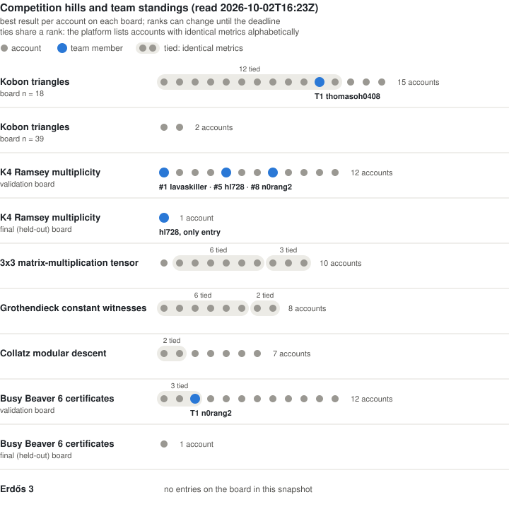
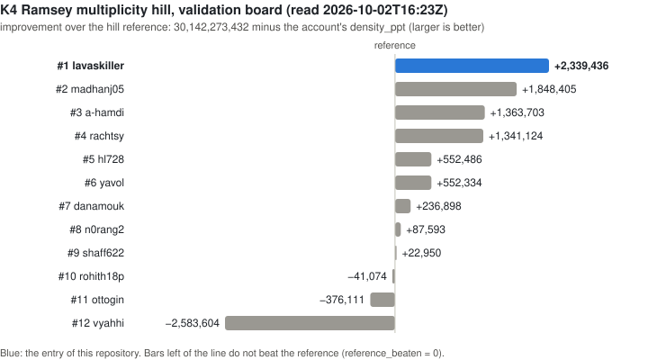
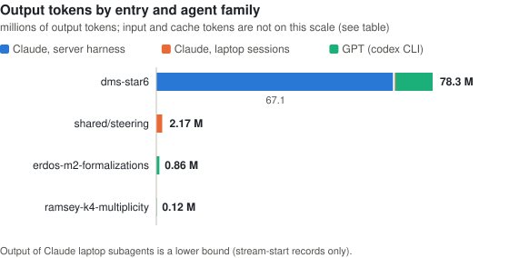
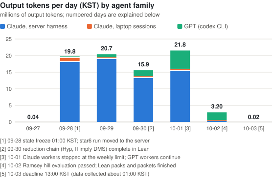
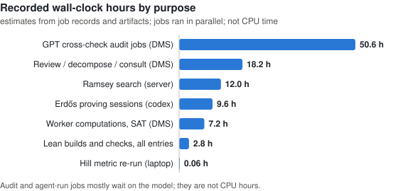
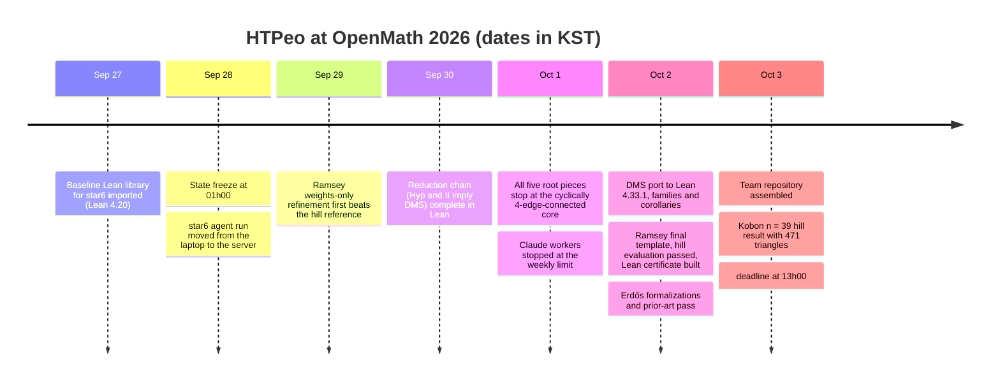

<div align="center">
<h1>HTPeo — OpenMath 2026</h1>
<p>Lean 4-checked results on open problems: a new upper bound for the K4 Ramsey multiplicity constant,<br/>
partial results on the Dvořák–Mohar–Šámal star-edge-colouring conjecture,<br/>
and formalizations of known results on Erdős problems — with an archive of what we did and what it cost.</p>
</div>

<p align="center">
<a href="entries/ramsey-k4-multiplicity/artifact/lean/lean-toolchain"></a>
<a href="entries/ramsey-k4-multiplicity/artifact/lean/lake-manifest.json"></a>
<a href="#verification-scope"></a>
<a href="entries/"></a>
</p>

<p align="center">
<a href="#the-competition">Competition</a> ·
<a href="#results-at-a-glance">Results</a> ·
<a href="#competition-hills-and-team-standings">Hills</a> ·
<a href="#verification-scope">Verification scope</a> ·
<a href="#how-to-verify">How to verify</a> ·
<a href="#resources-used">Resources</a> ·
<a href="#team">Team</a> ·
<a href="CONTRIBUTING.md">Contributing</a> ·
<a href="archive/">Archive</a> ·
<a href="README.ko.md">한국어</a>
</p>

## The competition

| | |
|---|---|
| Event | "OpenMath 2026" in our packets; the official handbook is titled *Open Problems Hack at MIT* ([handbook](https://rsihouse.ai/openmath/handbook.pdf), [event page](https://luma.com/yzp9abvr)). Only formalized results count. |
| Window | Hybrid opening at MIT CSAIL and status freeze at noon Eastern on Sunday 27 September 2026; everything had to be submitted before 00:00 EDT on Saturday, 3 October. |
| Platform | [AutoLab](https://app.autolab.ai): a *Hill* is a versioned task with an evaluator. In the handbook's words, a passing Hill "is not itself a mathematical proof"; formal checking, statement fidelity, literature status, attribution and review are separate gates. |
| Our modes | Ramsey and DMS are proposed under M3A (original open problems outside the curated focus set, admission decided by the organisers); the formalizations are M2 (known mathematics, a separate leaderboard counting accepted families). |

## Results at a glance

Everything the team has, in one place: the Lean-checked entries first, then the results team members hold on the competition hills. Hill standings are from the AutoLab leaderboards as read at 2026-10-02T18:04Z (2026-10-03 03:04 KST); they are a snapshot and can change until the deadline. A rank is always given with the size of its board, and accounts with identical metrics share a rank.

<!-- RESULTS:START -->
**Lean-checked entries**

| Entry | Problem | Kind | Result | Standing | Verification | Links |
|---|---|---|---|---|---|---|
| [`ramsey-k4-multiplicity`](entries/ramsey-k4-multiplicity/) | K4 Ramsey multiplicity constant c_4 (upper bound) | new result | c_4 ≤ 0.030139933996 (hill metric `density_ppt` 30,139,933,996). Previous best: 10486266368/768^4 ≈ 0.030142273432 (30,142,273,432), McKay, the hill reference. | 1st of 12, alone, on the validation board | Lean 4.33.1, standard axioms, per-module build; hill experiment passed | [packet](entries/ramsey-k4-multiplicity/PACKET.md) · [theorem](entries/ramsey-k4-multiplicity/artifact/lean/RamseyCert/Final.lean#L39) · [axioms](entries/ramsey-k4-multiplicity/artifact/lean/logs/RamseyCert.Final.log) · [hill report](entries/ramsey-k4-multiplicity/artifact/runs/report_1ab2354d.json) |
| [`dms-star6`](entries/dms-star6/) | Dvořák–Mohar–Šámal conjecture: star chromatic index ≤ 6 for subcubic graphs (open; best published bound 7) | partial results | Conjecture not proved. Proved: 5 colours for flower and Goldberg snarks, GP(n,k) with k ≤ 15, Möbius ladders; 6 colours for all bridgeless cubic multigraphs on ≤ 14 vertices; the equivalence `dms_iff_cubic16`; a reduction to named open hypotheses. | — | Lean 4.33.1, standard axioms; `lake build` (pack3), per-module (pack4, pack5) | [packet](entries/dms-star6/PACKET.md) · [families](entries/dms-star6/artifact/lean/pack4/src/Families.lean#L68) · [≤ 14 vertices](entries/dms-star6/artifact/lean/pack5/src/Star6Corollaries.lean#L48) · [equivalence](entries/dms-star6/artifact/lean/pack5/src/Star6Equiv.lean#L174) · [axioms](entries/dms-star6/artifact/lean/pack3/build/axioms.log) |
| [`erdos-m2-formalizations`](entries/erdos-m2-formalizations/) | Known results attached to 12 Erdős problems (formal-conjectures statements) and perfect matchings in bridgeless cubic graphs | formalization of known results | 13 families, 19 theorems, including Schönberger's and Petersen's theorems (connected case). No prior formal proof found by the searches described in the packet. | — | Lean 4.33.1, standard axioms, one file at a time; statements identical to the pinned formal-conjectures commit | [packet](entries/erdos-m2-formalizations/PACKET.md) · [files](entries/erdos-m2-formalizations/artifact/bundle/) · [Petersen](entries/erdos-m2-formalizations/artifact/bundle/Star6Simple.lean#L155) · [expected axioms](entries/erdos-m2-formalizations/artifact/VERIFY.md) |
| `erdos-1038` | Erdős problem #1038 | reported by its owner | Complete Lean solution reported by a team member; not yet in this repository. | — | Lean 4.34.1 (as reported; not re-checked here) | to be added by its owner |

**Hill results by team members** (best result per account on the AutoLab boards; ranks computed with ties sharing a rank)

| Hill (board) | Member | Kind | Result | Standing | Verification | Files |
|---|---|---|---|---|---|---|
| Kobon triangles (n = 39) | @lavaskiller | hill result | 471 triangles with 39 lines; leads the n = 39 board; above the classical 468 construction; possibly a new best known value — literature check not human-verified; Lean certificate of the 471 triangles (existence statement) | 1st of 3 | hill evaluator (Python); Lean 4.33.1 + Mathlib certificate of the arrangement, standard axioms only | [`hills/kobon-n39-lavaskiller`](entries/hills/kobon-n39-lavaskiller/) — solution, signed report, notes, code, Lean certificate |
| Kobon triangles (n = 18) | @thomasoh0408 | hill result | triangles 93; reproduces the board's best value; not claimed as new mathematics | tied for 1st, 12 of 15 accounts | hill evaluator (Python), no Lean artifact | [`hills/kobon-triangles-thomasoh0408`](entries/hills/kobon-triangles-thomasoh0408/) — files to be added by its owner |
| Grothendieck constant witnesses | @lavaskiller | hill result | gap_ppm 1,414,213, matrix_area 4, certificate_bits 80; known construction (CHSH-type 2x2 witness), not claimed as new mathematics | tied for 1st, 7 of 9 accounts | hill evaluator (Python); Lean 4.33.1 + Mathlib certificate of the witness and of the bound for this matrix, standard axioms only | [`hills/grothendieck-lavaskiller`](entries/hills/grothendieck-lavaskiller/) — solution, signed report, notes, code, Lean certificate |
| Busy Beaver 6 certificates | @n0rang2 | hill result | steps 249,881, ones 554, tape_span 735; reproduces the board's best value; not claimed as new mathematics; the halting time, state coverage, span and ones count are proved in Lean; maximality under the hidden budget is not proved | tied for 1st, 3 of 12 accounts | hill evaluator (Python); Lean 4.33.1 certificate without Mathlib, axioms propext and Quot.sound | [`hills/busy-beaver-6-n0rang2`](entries/hills/busy-beaver-6-n0rang2/) — solution, signed report, method, code, resource disclosure, replay evidence, Lean certificate |
| K4 Ramsey multiplicity | @hl728 | hill result | reference_beaten 1, density_ppt 30,141,921,123 (final board); reference_beaten 1, density_ppt 30,141,720,946 (validation board) | only entry on the final (held-out) board (1 account); 5th of 12 on the validation board | hill evaluator (Python), no Lean artifact | [`hills/ramsey-hl728`](entries/hills/ramsey-hl728/) — files to be added by its owner |
| K4 Ramsey multiplicity | @n0rang2 | hill result | reference_beaten 1, density_ppt 30,142,185,839 | 8th of 12 | hill evaluator (Python), no Lean artifact | [`hills/ramsey-n0rang2`](entries/hills/ramsey-n0rang2/) — leaderboard record only; the team's result on this hill is the entry ramsey-k4-multiplicity |
<!-- RESULTS:END -->

Both tables are generated by [`tools/make_results_table.py`](tools/make_results_table.py) from `entries/*/ENTRY.yaml` and the leaderboard snapshot. "Kind" uses a fixed vocabulary: *new result*, *partial results*, *formalization of known results*, *hill result*. A hill result is a score given by the hill's evaluator; it comes with no Lean artifact, and results tied for 1st reproduce the best value on their board and are not claimed as new mathematics. The Kobon n = 39 result leads its board; whether it is a new best known value has been checked only by an AI literature search.

### Competition hills and team standings

One row per board of the seven hills on the organisers' list, accounts in rank order. The platform lists accounts with identical metrics alphabetically and numbers them consecutively; here they are drawn as one tied group that shares the rank. A final (held-out) board is a separate row under its validation board; a board with a single account shows "only entry" instead of a rank.

<picture>
  <source media="(prefers-color-scheme: dark)" srcset="assets/hills_overview_dark.svg">
  <source media="(prefers-color-scheme: light)" srcset="assets/hills_overview_light.svg">
  
</picture>

On the K4 Ramsey hill there are no ties: the entry of this repository leads the validation board by 491,031 ppt over the second account.

<picture>
  <source media="(prefers-color-scheme: dark)" srcset="assets/ramsey_leaderboard_dark.svg">
  <source media="(prefers-color-scheme: light)" srcset="assets/ramsey_leaderboard_light.svg">
  
</picture>

<details>
<summary>All boards as a table</summary>

<!-- HILLS:START -->
| Hill (board) | Accounts | Leader's result | Team standing | Tied with the leader? | Files |
|---|---:|---|---|---|---|
| Kobon triangles (n = 18) | 15 | triangles 93 (12 accounts tied) | tied for 1st, 12 of 15 accounts — @thomasoh0408 | yes: @thomasoh0408 | [`hills/kobon-triangles-thomasoh0408`](entries/hills/kobon-triangles-thomasoh0408/) |
| Kobon triangles (n = 39) | 3 | triangles 471 | 1st of 3 — @lavaskiller | sole leader: @lavaskiller | [`hills/kobon-n39-lavaskiller`](entries/hills/kobon-n39-lavaskiller/) |
| K4 Ramsey multiplicity | 12 | reference_beaten 1, density_ppt 30,139,933,996 | 1st of 12 — @lavaskiller<br/>5th of 12 — @hl728<br/>8th of 12 — @n0rang2<br/>only entry on the final (held-out) board (1 account) — @hl728 | sole leader: @lavaskiller | [`ramsey-k4-multiplicity`](entries/ramsey-k4-multiplicity/) · [`hills/ramsey-hl728`](entries/hills/ramsey-hl728/) · [`hills/ramsey-n0rang2`](entries/hills/ramsey-n0rang2/) |
| 3x3 matrix-multiplication tensor | 10 | rank 23, support 138 | — | — | — |
| Grothendieck constant witnesses | 9 | gap_ppm 1,414,213, matrix_area 4, certificate_bits 80 (7 accounts tied) | tied for 1st, 7 of 9 accounts — @lavaskiller | yes: @lavaskiller | [`hills/grothendieck-lavaskiller`](entries/hills/grothendieck-lavaskiller/) |
| Collatz modular descent | 7 | coverage_ppm 1,000,000, min_descent_ppm 525,390, rule_count 3 (2 accounts tied) | — | — | — |
| Busy Beaver 6 certificates | 12 | steps 249,881, ones 554, tape_span 735 (3 accounts tied) | tied for 1st, 3 of 12 accounts — @n0rang2 | yes: @n0rang2 | [`hills/busy-beaver-6-n0rang2`](entries/hills/busy-beaver-6-n0rang2/) |
| Erdős 3 | 0 | no entries on the board | — | — | — |
<!-- HILLS:END -->

</details>

Raw leaderboard responses: [`archive/leaderboards/`](archive/leaderboards/); figures and ranks: [`tools/make_leaderboard_charts.py`](tools/make_leaderboard_charts.py) ([computed ranks](assets/leaderboard_data.json)). Owners of hill results add their solution and signed report in their folder under [`entries/hills/`](entries/hills/); each folder has a checklist.

## Verification scope

> **What is machine-checked.** Every theorem named in the table and cards is a Lean 4 declaration compiled with exit code 0, and its `#print axioms` output lists only `propext`, `Classical.choice`, `Quot.sound` (logs: [Ramsey](entries/ramsey-k4-multiplicity/artifact/lean/logs/RamseyCert.Final.log), [DMS chain](entries/dms-star6/artifact/lean/pack3/build/axioms.log), [DMS families](entries/dms-star6/artifact/lean/pack4/axioms.log), [DMS corollaries](entries/dms-star6/artifact/lean/pack5/logs/), [Erdős](entries/erdos-m2-formalizations/artifact/VERIFY.md)).
>
> **Build route.** Only DMS pack3 was built with `lake build`. The Ramsey certificate (2112 modules), DMS pack4 and pack5 were built module by module with scripts; the Erdős files are compiled one at a time inside `formal-conjectures` at a pinned commit, with the Mathlib pinned there. All builds ran on one machine.
>
> **Exceptions.** One baseline theorem, `MGraph.k4subdiv_star6`, uses `native_decide`; no claimed theorem depends on it ([audit table](entries/dms-star6/artifact/lean/pack3/build/audit_all.tsv)). The Ramsey file `Native.lean` also uses `native_decide` and is imported by nothing. The Ramsey certificate relies on `decide +kernel` over large numerals.
>
> **Not machine-checked.** (1) The graph families of DMS pack4 are explicit edge lists; their agreement with the textbook definitions is checked by a [Python script](entries/dms-star6/artifact/lean/pack4/sanity_check.py), not proved as an isomorphism. (2) The Ramsey data is transcribed from `solution.json` to Lean by a [script](entries/ramsey-k4-multiplicity/artifact/lean/tools/gen.py) and re-checked by [another](entries/ramsey-k4-multiplicity/artifact/lean/tools/check_data.py); the transcription itself is not proved. (3) That each formal statement says what the informal problem says: see the correspondence notes in each packet.
>
> **Human review.** The team reports that the claimed statements and the statement-correspondence notes were reviewed by a human team member; reviewer names, scope and dates are still to be filled in in [TEAM.md](TEAM.md).

## Entries

### 1 · K4 Ramsey multiplicity — `ramsey-k4-multiplicity`

A 1024-block weighted two-colouring template whose monochromatic-K4 density is below the reference value of the AutoLab hill `alejandrozu/clique-cluster-ramsey-multiplicity`. The hill experiment `1ab2354d` passed with `reference_beaten = 1`.

```lean
theorem ramseyMultK4_limit_lt_ref :
    ∃ L : ℝ, Filter.Tendsto (fun m : ℕ => (minMonoK4 m : ℝ) / (m.choose 4 : ℝ)) Filter.atTop (nhds L) ∧
      L < 10486266368 / 768 ^ 4 :=
```

- Files: [`Final.lean`](entries/ramsey-k4-multiplicity/artifact/lean/RamseyCert/Final.lean) (headline theorems), [`Main.lean`](entries/ramsey-k4-multiplicity/artifact/lean/RamseyCert/Main.lean) (`sol_density`, `sol_ppt`), [`solution.json`](entries/ramsey-k4-multiplicity/artifact/solution.json), [hill report](entries/ramsey-k4-multiplicity/artifact/runs/report_1ab2354d.json), [packet](entries/ramsey-k4-multiplicity/PACKET.md), [notes](entries/ramsey-k4-multiplicity/NOTES.md).
- Standing: the signed official hill report for experiment `1ab2354d` (2026-10-02T11:38:08Z) has `passed: true`, `official: true`, `density_ppt` 30,139,933,996, `reference_beaten = 1`; on the validation board it is 1st of 12 in the snapshot ([above](#competition-hills-and-team-standings)). It has no final-mode (held-out) evaluation: its report is `final: false`, and one attempt to evaluate the same solution in final mode (experiment `217d0ba2`) failed because the hill did not accept "final" as a parameter from the command line.
- Limitation: an upper bound only, c_4 is not determined; the search is randomised, so the template itself is the certificate.

### 2 · Dvořák–Mohar–Šámal conjecture — `dms-star6`

**The conjecture is not proved.** Proved in Lean: star 5-edge-colourings for infinite families (flower snarks, Goldberg snarks, generalized Petersen graphs GP(n,k) with k ≤ 15, Möbius ladders, Petersen-type inflations), star 6-edge-colourability of every bridgeless cubic loopless multigraph on at most 14 vertices, an equivalent form of the conjecture, and a chain "named open hypotheses ⇒ conjecture".

```lean
theorem dms_iff_cubic16 :
    DMS ↔ ∀ (X : MGraph) (P : Fin X.m → Prop), InG X P → 16 ≤ vcount P →
      Colourable P 6 ∧ ∀ g, P g → Colourable (leafSet P g) 6 := by
```

- Files: [`Star6Equiv.lean`](entries/dms-star6/artifact/lean/pack5/src/Star6Equiv.lean), [`Star6Corollaries.lean`](entries/dms-star6/artifact/lean/pack5/src/Star6Corollaries.lean), [`Families.lean`](entries/dms-star6/artifact/lean/pack4/src/Families.lean), [`GPAll.lean`](entries/dms-star6/artifact/lean/pack4/src/GPAll.lean), [chain (pack3)](entries/dms-star6/artifact/lean/pack3/), [packet](entries/dms-star6/PACKET.md), [notes](entries/dms-star6/NOTES.md).
- Limitation: every hypothesis of the reduction chain is open; the informal studies in [`informal/`](entries/dms-star6/artifact/informal/) are not Lean-checked and no credit is requested for them.

<details><summary>More statements</summary>

```lean
theorem flower_family (n : Nat) (hodd : n % 2 = 1) (hn : 5 ≤ n) : StarFamily (flowerSnark n) 5 :=
theorem gp_family (k n : Nat) (hk : 1 ≤ k) (hK : k ≤ 15) (hn : 2 * k + 1 ≤ n) (hex : ¬ (n = 3 ∧ k = 1)) :
    StarFam (gp n k) 5 := by
theorem star6_cubic_bridgeless_le14 (X : MGraph) (P : Fin X.m → Prop) (hL : Loopless X) (hB : BridgelessOn P)
    (hK : CubicOn P) (h14 : vcount P ≤ 14) : Colourable P 6 :=
```

Why the remaining hypotheses are hard: [archive/findings/dms-c4c-core.md](archive/findings/dms-c4c-core.md).
</details>

### 3 · Formalizations of known results — `erdos-m2-formalizations`

Thirteen families (19 theorems): variants attached to Erdős problems 942, 44, 123, 918, 292, 395, 698, 939 and four minor ones (295, 703, 748, 1136), stated exactly as in `google-deepmind/formal-conjectures`, plus Schönberger's and Petersen's theorems for Mathlib's `SimpleGraph` (connected case).

```lean
theorem simple_petersen_connected (hconn : G.Connected) (hreg : G.IsRegularOfDegree 3) (hbr : Bridgeless G) :
    ∃ M : G.Subgraph, M.IsPerfectMatching := by
```

- Files: [`bundle/`](entries/erdos-m2-formalizations/artifact/bundle/) (13 Lean files), [`Star6Simple.lean`](entries/erdos-m2-formalizations/artifact/bundle/Star6Simple.lean), [`VERIFY.md`](entries/erdos-m2-formalizations/artifact/VERIFY.md), [prior-art table](entries/erdos-m2-formalizations/artifact/PRIOR_ART_FINAL.tsv), [packet](entries/erdos-m2-formalizations/PACKET.md), [notes](entries/erdos-m2-formalizations/NOTES.md).
- Limitation: "new" means only that the searches described in the packet found no earlier formal proof; the main (often open) statement of each Erdős problem is not claimed; `Star6Simple.lean` needs the star6 library of entry 2.

### 4 · Erdős problem #1038 — `erdos-1038`

A complete Lean solution (Lean 4.34.1) reported by a team member. Its folder, statement and verification notes will be added by its owner; nothing about it has been re-checked in this repository.

## How to verify

There is no Lean project at the repository root; each entry has its own. Exact commands, expected output, time and memory are in each artifact's README. Build products are not stored; `sha256sum -c SHA256SUMS` in each `artifact/` checks the files.

```bash
# 1. Ramsey: hill metric in pure Python (2-3 min), then the Lean certificate (about 50 min on 6 cores, 3.3 GB per process)
cd entries/ramsey-k4-multiplicity/artifact/lean
lake exe cache get
python3 tools/check_data.py solution.json RamseyCert/Data/Base.lean
bash tools/build.sh . RamseyCert 6
grep "depends on axioms" logs/RamseyCert.Main.log logs/RamseyCert.Final.log

# 2. DMS chain (about 20 min, 3.2 GB), then corollaries and families on top of the per-module build
cd entries/dms-star6/artifact/lean/pack3
lake update && lake exe cache get && lake build
bash setup.sh && bash run433.sh
(cd ../pack5 && python3 gen5.py && bash build5.sh)
(cd ../pack4 && bash build_all.sh && python3 sanity_check.py)

# 3. Erdős files: inside formal-conjectures at commit df3f12d7bd06feb3f71ae37abae0ca7cb798d9b1
lake exe cache get && lake build FormalConjecturesUtil FormalConjecturesForMathlib
for f in /path/to/bundle/Erdos*.lean; do lake env lean "$f" || echo FAIL $f; done
```

Details: [Ramsey README](entries/ramsey-k4-multiplicity/artifact/README.md) · [DMS README](entries/dms-star6/artifact/README.md) · [Erdős VERIFY.md](entries/erdos-m2-formalizations/artifact/VERIFY.md).

## Repository layout

```
README.md                  <- this page (English is the standard; *.ko.md files are Korean companions)
TEAM.md                    <- roster, human-review record, release sign-off
CONTRIBUTING.md            <- contribution guidelines
CITATION.cff
entries/
  <entry>/ENTRY.yaml       <- machine-readable summary: claims, toolchain, axioms, limitations
  <entry>/PACKET.md        <- the competition packet
  <entry>/artifact/        <- Lean sources, solution data, logs, scripts, SHA256SUMS
  <entry>/STATS.yaml       <- resources used by this entry
  <entry>/NOTES.md         <- what worked and what did not
  PENDING.yaml             <- entries announced but not yet added
  hills/<hill>-<id>/       <- hill results of team members (files added by each owner)
archive/
  REPORT.md                <- team report: results and findings
  timeline.md              <- dated log with sources
  findings/                <- topic notes, including failed approaches
  stats/                   <- raw usage numbers and SUMMARY.md
  leaderboards/            <- raw leaderboard snapshot, one file per hill
assets/                    <- figures of this page (generated)
tools/                     <- checksum, usage-summing, table, chart and leaderboard scripts (Python standard library)
```

## Resources used

Between 2026-09-27 and 2026-10-03 (KST) the recorded AI usage was about **81.5 million output tokens** in 2,145 sessions: 67.1 M by Claude models in the server agent harness, 2.4 M by Claude Code on the laptop, 12.0 M by GPT models through the codex CLI. Uncached input was 84.1 M tokens and cache traffic 10.9 billion tokens.

| | Output tokens | Share |
|---|---:|---:|
| Claude, server agent harness | 67.1 M | 82% |
| GPT, codex CLI | 12.0 M | 15% |
| Claude Code, laptop sessions | 2.4 M | 3% |

### Where the tokens went

Almost all usage belongs to the DMS entry: the week-long agent harness produced the informal fact graph and the Lean chain. The Erdős formalizations took 0.86 M output tokens and the Ramsey certificate 0.12 M.

<picture>
  <source media="(prefers-color-scheme: dark)" srcset="assets/tokens_by_entry_dark.svg">
  <source media="(prefers-color-scheme: light)" srcset="assets/tokens_by_entry_light.svg">
  
</picture>

### When they were used

The harness ran at full size from 28 September to 1 October, when the Claude workers reached the weekly limit; GPT workers carried the last two days.

<picture>
  <source media="(prefers-color-scheme: dark)" srcset="assets/tokens_per_day_dark.svg">
  <source media="(prefers-color-scheme: light)" srcset="assets/tokens_per_day_light.svg">
  
</picture>

### Compute

Recorded wall-clock hours of server jobs by purpose. Audit and agent-run jobs mostly wait on a model, so these are not CPU hours; the Ramsey certificate itself took 4.7 CPU-hours.

<picture>
  <source media="(prefers-color-scheme: dark)" srcset="assets/compute_by_purpose_dark.svg">
  <source media="(prefers-color-scheme: light)" srcset="assets/compute_by_purpose_light.svg">
  
</picture>

### Numbers and caveats

<details>
<summary>Per-entry table (tokens, sessions, hours, Lean lines, theorems)</summary>

<!-- RESOURCES:START -->
| Entry | Output tokens | Uncached input | Cache tokens | Sessions | Recorded wall hours | Lean lines | Claimed theorems |
|---|---:|---:|---:|---:|---:|---:|---:|
| `dms-star6` | 78,313,222 | 79,895,063 | 9,635,136,505 | 2,094 | 77.8 + | 81,622 | 45 |
| `erdos-m2-formalizations` | 860,456 | 3,716,184 | 244,039,536 | 26 | 9.6 | 2,791 | 19 |
| `ramsey-k4-multiplicity` | 115,493 | 459,889 | 91,122,328 | 6 | 13.1 + | 104,665 | 8 |
| shared/steering | 2,165,675 | 5,130 | 923,843,294 | 19 |  |  |  |
| **Total** | **81,454,846** | **84,076,266** | **10,894,141,663** | **2,145** | | **189,078** | **72** |
<!-- RESOURCES:END -->

"Cache tokens" is cache read plus cache write. "Recorded wall hours" sums the compute rows that have a number; "+" marks rows without one, and jobs overlapped in time, so this is neither elapsed time nor CPU time. Most of the Ramsey Lean lines are generated numerals. Raw numbers and their sources: [SUMMARY.md](archive/stats/SUMMARY.md), [server-harness.yaml](archive/stats/server-harness.yaml), [server-codex.yaml](archive/stats/server-codex.yaml), [claude-laptop.yaml](archive/stats/claude-laptop.yaml), [chart data](assets/chart_data.json). Charts are drawn by [`tools/make_charts.py`](tools/make_charts.py).

</details>

Caveats: the laptop subagent output is a lower bound; the first hours of the harness run on the laptop (WSL) and the `erdos-1038` work are not included; all usage was under subscription plans, and the only cost figure is the tool's API-list-price equivalent for the harness, at least 3,718 USD (lower bound, nothing billed per token). Compute ran on one 16-core, 14 GB server and a laptop; CPU time was mostly not recorded and human time is not recorded.

## Timeline



Dated entries with sources, including incidents and discrepancies between sources: [archive/timeline.md](archive/timeline.md).

## Team

Team **HTPeo** (team entrant).

<table>
  <tr>
    <td align="center" width="170"><a href="https://github.com/lavaskiller"><br/><sub><b>@lavaskiller</b></sub></a><br/><sub>HTPeo, KyungHee Univ. CS&amp;E</sub><br/><sub>agent harness (DMS), Ramsey search and Lean certificate, Erdős formalizations, packets</sub></td>
    <td align="center" width="170"><a href="https://github.com/hl728"><br/><sub><b>@hl728</b></sub></a><br/><sub>K4 Ramsey hill (validation and final-board evaluation)</sub></td>
    <td align="center" width="170"><a href="https://github.com/n0rang2"><br/><sub><b>@n0rang2</b></sub></a><br/><sub>Busy Beaver 6 and K4 Ramsey hills</sub></td>
    <td align="center" width="170"><a href="https://github.com/thomasoh0408"><br/><sub><b>@thomasoh0408</b></sub></a><br/><sub>Kobon triangles hill</sub></td>
  </tr>
</table>

Roles of @hl728, @n0rang2 and @thomasoh0408 are taken from the hill leaderboards and will be completed by each member in [TEAM.md](TEAM.md), which also records names, affiliations, contributions and reviews.

Hill standings of the members are in [Results at a glance](#results-at-a-glance).

**AI use.** Most proofs, search code and packet text were produced by AI systems steered by the team: Claude models (Anthropic; `claude-opus-5-5`, `claude-sonnet-5`, `claude-fable-5-1`) as harness workers, verifiers and Claude Code sessions, and GPT models (OpenAI; `gpt-6-sol`, `gpt-5.6-sol`) through the codex CLI for proofs against statements fixed beforehand and for cross-check audits. Roles per entry are in each `ENTRY.yaml` under `ai_and_tools`; usage is in [Resources used](#resources-used).

## Archive

- [archive/REPORT.md](archive/REPORT.md) — the team report: results, findings, resources ([한국어](archive/REPORT.ko.md)).
- [archive/timeline.md](archive/timeline.md) — dated log with the source of every row ([한국어](archive/timeline.ko.md)).
- [archive/findings/ramsey-search.md](archive/findings/ramsey-search.md) — which search moves helped and which did not.
- [archive/findings/dms-c4c-core.md](archive/findings/dms-c4c-core.md) — where every route to the conjecture stops, with refuted approaches.
- [archive/findings/formalization-workflow.md](archive/findings/formalization-workflow.md) — how proofs were produced and checked, and the duplicates found.
- [archive/stats/](archive/stats/) — raw usage numbers; [archive/STATS_REQUEST.md](archive/STATS_REQUEST.md) says how members extract theirs.

## Acknowledgements

This work builds on [Lean 4](https://lean-lang.org/) and [Mathlib](https://github.com/leanprover-community/mathlib4). The Erdős statements and their definitions are those of [google-deepmind/formal-conjectures](https://github.com/google-deepmind/formal-conjectures) at the pinned commit; they are not our work. The Ramsey entry starts from the construction and value reported in arXiv:2206.04036 and was evaluated on an AutoLab hill with its evaluator and seed. We thank the OpenMath 2026 organisers and AutoLab for the competition and the evaluation infrastructure.

## Citation

Metadata is in [CITATION.cff](CITATION.cff).

```bibtex
@misc{htpeo2026openmath,
  author = {Kang, Woohyuk and {HTPeo team}},
  title  = {HTPeo entries to OpenMath 2026: Lean-checked results on the K4 Ramsey multiplicity constant,
            the Dvořák–Mohar–Šámal conjecture and Erdős problems},
  year   = {2026},
  url    = {https://github.com/lavaskiller/openmath-2026-htpeo}
}
```

Problem sources: `[PPSS]` arXiv:2206.04036 (Parczyk, Pokutta, Spiegel, Szabó) · `[DMS]` arXiv:1011.3376 (Dvořák, Mohar, Šámal).

## License

License: to be decided by the team. The repository is private to the team until the competition deadline.
