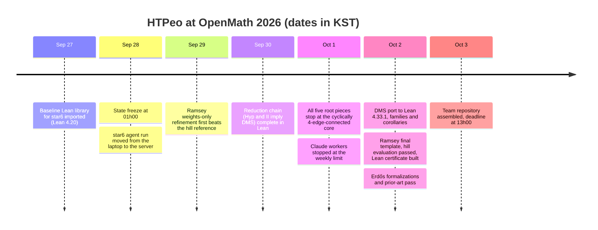

<div align="center">
<h1>HTPeo — OpenMath 2026</h1>
<p>Lean 4-checked results on open problems: a new upper bound for the K4 Ramsey multiplicity constant,<br/>
partial results on the Dvořák–Mohar–Šámal star-edge-colouring conjecture,<br/>
and formalizations of known results on Erdős problems — with an archive of what we did and what it cost.</p>
</div>

<p align="center">
<a href="entries/ramsey-k4-multiplicity/artifact/lean/lean-toolchain"></a>
<a href="entries/ramsey-k4-multiplicity/artifact/lean/lake-manifest.json"></a>
<a href="#verification-scope"></a>
<a href="entries/"></a>
</p>

<p align="center">
<a href="#the-competition">Competition</a> ·
<a href="#results-at-a-glance">Results</a> ·
<a href="#verification-scope">Verification scope</a> ·
<a href="#how-to-verify">How to verify</a> ·
<a href="#resources-used">Resources</a> ·
<a href="#team">Team</a> ·
<a href="archive/">Archive</a> ·
<a href="README.ko.md">한국어</a>
</p>

## The competition

| | |
|---|---|
| Event | "OpenMath 2026" in our packets; the official handbook is titled *Open Problems Hack at MIT* ([handbook](https://rsihouse.ai/openmath/handbook.pdf), [event page](https://luma.com/yzp9abvr)). Only formalized results count. |
| Window | Hybrid opening at MIT CSAIL and status freeze at noon Eastern on Sunday 27 September 2026; everything had to be submitted before 00:00 EDT on Saturday, 3 October. |
| Platform | [AutoLab](https://app.autolab.ai): a *Hill* is a versioned task with an evaluator. In the handbook's words, a passing Hill "is not itself a mathematical proof"; formal checking, statement fidelity, literature status, attribution and review are separate gates. |
| Our modes | Ramsey and DMS are proposed under M3A (original open problems outside the curated focus set, admission decided by the organisers); the formalizations are M2 (known mathematics, a separate leaderboard counting accepted families). |

## Results at a glance

<!-- RESULTS:START -->
| Entry | Problem | Kind | Result | Verification | Links |
|---|---|---|---|---|---|
| [`ramsey-k4-multiplicity`](entries/ramsey-k4-multiplicity/) | K4 Ramsey multiplicity constant c_4 (upper bound) | new result | c_4 ≤ 0.030139933996 (hill metric `density_ppt` 30,139,933,996). Previous best: 10486266368/768^4 ≈ 0.030142273432 (30,142,273,432), McKay, the hill reference. | Lean 4.33.1, standard axioms, per-module build; hill experiment passed | [packet](entries/ramsey-k4-multiplicity/PACKET.md) · [theorem](entries/ramsey-k4-multiplicity/artifact/lean/RamseyCert/Final.lean#L39) · [axioms](entries/ramsey-k4-multiplicity/artifact/lean/logs/RamseyCert.Final.log) · [hill report](entries/ramsey-k4-multiplicity/artifact/runs/report_1ab2354d.json) |
| [`dms-star6`](entries/dms-star6/) | Dvořák–Mohar–Šámal conjecture: star chromatic index ≤ 6 for subcubic graphs (open; best published bound 7) | partial results | Conjecture not proved. Proved: 5 colours for flower and Goldberg snarks, GP(n,k) with k ≤ 15, Möbius ladders; 6 colours for all bridgeless cubic multigraphs on ≤ 14 vertices; the equivalence `dms_iff_cubic16`; a reduction to named open hypotheses. | Lean 4.33.1, standard axioms; `lake build` (pack3), per-module (pack4, pack5) | [packet](entries/dms-star6/PACKET.md) · [families](entries/dms-star6/artifact/lean/pack4/src/Families.lean#L68) · [≤ 14 vertices](entries/dms-star6/artifact/lean/pack5/src/Star6Corollaries.lean#L48) · [equivalence](entries/dms-star6/artifact/lean/pack5/src/Star6Equiv.lean#L174) · [axioms](entries/dms-star6/artifact/lean/pack3/build/axioms.log) |
| [`erdos-m2-formalizations`](entries/erdos-m2-formalizations/) | Known results attached to 12 Erdős problems (formal-conjectures statements) and perfect matchings in bridgeless cubic graphs | formalization of known results | 13 families, 19 theorems, including Schönberger's and Petersen's theorems (connected case). No prior formal proof found by the searches described in the packet. | Lean 4.33.1, standard axioms, one file at a time; statements identical to the pinned formal-conjectures commit | [packet](entries/erdos-m2-formalizations/PACKET.md) · [files](entries/erdos-m2-formalizations/artifact/bundle/) · [Petersen](entries/erdos-m2-formalizations/artifact/bundle/Star6Simple.lean#L155) · [expected axioms](entries/erdos-m2-formalizations/artifact/VERIFY.md) |
| `erdos-1038` | Erdős problem #1038 | reported by its owner | Complete Lean solution reported by a team member; not yet in this repository. | Lean 4.34.1 (as reported; not re-checked here) | to be added by its owner |
<!-- RESULTS:END -->

The table is generated from `entries/*/ENTRY.yaml` by [`tools/make_results_table.py`](tools/make_results_table.py). "Kind" uses a fixed vocabulary: *new result*, *partial results*, *formalization of known results*.

## Verification scope

> **What is machine-checked.** Every theorem named in the table and cards is a Lean 4 declaration compiled with exit code 0, and its `#print axioms` output lists only `propext`, `Classical.choice`, `Quot.sound` (logs: [Ramsey](entries/ramsey-k4-multiplicity/artifact/lean/logs/RamseyCert.Final.log), [DMS chain](entries/dms-star6/artifact/lean/pack3/build/axioms.log), [DMS families](entries/dms-star6/artifact/lean/pack4/axioms.log), [DMS corollaries](entries/dms-star6/artifact/lean/pack5/logs/), [Erdős](entries/erdos-m2-formalizations/artifact/VERIFY.md)).
>
> **Build route.** Only DMS pack3 was built with `lake build`. The Ramsey certificate (2112 modules), DMS pack4 and pack5 were built module by module with scripts; the Erdős files are compiled one at a time inside `formal-conjectures` at a pinned commit, with the Mathlib pinned there. All builds ran on one machine.
>
> **Exceptions.** One baseline theorem, `MGraph.k4subdiv_star6`, uses `native_decide`; no claimed theorem depends on it ([audit table](entries/dms-star6/artifact/lean/pack3/build/audit_all.tsv)). The Ramsey file `Native.lean` also uses `native_decide` and is imported by nothing. The Ramsey certificate relies on `decide +kernel` over large numerals.
>
> **Not machine-checked.** (1) The graph families of DMS pack4 are explicit edge lists; their agreement with the textbook definitions is checked by a [Python script](entries/dms-star6/artifact/lean/pack4/sanity_check.py), not proved as an isomorphism. (2) The Ramsey data is transcribed from `solution.json` to Lean by a [script](entries/ramsey-k4-multiplicity/artifact/lean/tools/gen.py) and re-checked by [another](entries/ramsey-k4-multiplicity/artifact/lean/tools/check_data.py); the transcription itself is not proved. (3) That each formal statement says what the informal problem says: see the correspondence notes in each packet.
>
> **Human review.** The team reports that the claimed statements and the statement-correspondence notes were reviewed by a human team member; reviewer names, scope and dates are still to be filled in in [TEAM.md](TEAM.md).

## Entries

### 1 · K4 Ramsey multiplicity — `ramsey-k4-multiplicity`

A 1024-block weighted two-colouring template whose monochromatic-K4 density is below the reference value of the AutoLab hill `alejandrozu/clique-cluster-ramsey-multiplicity`. The hill experiment `1ab2354d` passed with `reference_beaten = 1`.

```lean
theorem ramseyMultK4_limit_lt_ref :
    ∃ L : ℝ, Filter.Tendsto (fun m : ℕ => (minMonoK4 m : ℝ) / (m.choose 4 : ℝ)) Filter.atTop (nhds L) ∧
      L < 10486266368 / 768 ^ 4 :=
```

- Files: [`Final.lean`](entries/ramsey-k4-multiplicity/artifact/lean/RamseyCert/Final.lean) (headline theorems), [`Main.lean`](entries/ramsey-k4-multiplicity/artifact/lean/RamseyCert/Main.lean) (`sol_density`, `sol_ppt`), [`solution.json`](entries/ramsey-k4-multiplicity/artifact/solution.json), [hill report](entries/ramsey-k4-multiplicity/artifact/runs/report_1ab2354d.json), [packet](entries/ramsey-k4-multiplicity/PACKET.md), [notes](entries/ramsey-k4-multiplicity/NOTES.md).
- Standing: the signed official hill report for experiment `1ab2354d` (2026-10-02T11:38:08Z) has `passed: true`, `official: true`, `density_ppt` 30,139,933,996, `reference_beaten = 1`. Hill leaderboard (validation mode, best per user) as read from the AutoLab API at 2026-10-02T16:18:50Z (2026-10-03 01:18 KST): **rank 1 of 12**; rank 2 is 30,140,425,027 (491,031 ppt behind), rank 3 is 30,140,909,729. Raw snapshot: [`leaderboard_2026-10-02T161850Z.json`](entries/ramsey-k4-multiplicity/leaderboard/leaderboard_2026-10-02T161850Z.json). The hill also has a final-mode ("held-out test set") board; this entry has no final-mode evaluation yet (its report is `final: false`). The ranking may change before the deadline.
- Limitation: an upper bound only, c_4 is not determined; the search is randomised, so the template itself is the certificate.

### 2 · Dvořák–Mohar–Šámal conjecture — `dms-star6`

**The conjecture is not proved.** Proved in Lean: star 5-edge-colourings for infinite families (flower snarks, Goldberg snarks, generalized Petersen graphs GP(n,k) with k ≤ 15, Möbius ladders, Petersen-type inflations), star 6-edge-colourability of every bridgeless cubic loopless multigraph on at most 14 vertices, an equivalent form of the conjecture, and a chain "named open hypotheses ⇒ conjecture".

```lean
theorem dms_iff_cubic16 :
    DMS ↔ ∀ (X : MGraph) (P : Fin X.m → Prop), InG X P → 16 ≤ vcount P →
      Colourable P 6 ∧ ∀ g, P g → Colourable (leafSet P g) 6 := by
```

- Files: [`Star6Equiv.lean`](entries/dms-star6/artifact/lean/pack5/src/Star6Equiv.lean), [`Star6Corollaries.lean`](entries/dms-star6/artifact/lean/pack5/src/Star6Corollaries.lean), [`Families.lean`](entries/dms-star6/artifact/lean/pack4/src/Families.lean), [`GPAll.lean`](entries/dms-star6/artifact/lean/pack4/src/GPAll.lean), [chain (pack3)](entries/dms-star6/artifact/lean/pack3/), [packet](entries/dms-star6/PACKET.md), [notes](entries/dms-star6/NOTES.md).
- Limitation: every hypothesis of the reduction chain is open; the informal studies in [`informal/`](entries/dms-star6/artifact/informal/) are not Lean-checked and no credit is requested for them.

<details><summary>More statements</summary>

```lean
theorem flower_family (n : Nat) (hodd : n % 2 = 1) (hn : 5 ≤ n) : StarFamily (flowerSnark n) 5 :=
theorem gp_family (k n : Nat) (hk : 1 ≤ k) (hK : k ≤ 15) (hn : 2 * k + 1 ≤ n) (hex : ¬ (n = 3 ∧ k = 1)) :
    StarFam (gp n k) 5 := by
theorem star6_cubic_bridgeless_le14 (X : MGraph) (P : Fin X.m → Prop) (hL : Loopless X) (hB : BridgelessOn P)
    (hK : CubicOn P) (h14 : vcount P ≤ 14) : Colourable P 6 :=
```

Why the remaining hypotheses are hard: [archive/findings/dms-c4c-core.md](archive/findings/dms-c4c-core.md).
</details>

### 3 · Formalizations of known results — `erdos-m2-formalizations`

Thirteen families (19 theorems): variants attached to Erdős problems 942, 44, 123, 918, 292, 395, 698, 939 and four minor ones (295, 703, 748, 1136), stated exactly as in `google-deepmind/formal-conjectures`, plus Schönberger's and Petersen's theorems for Mathlib's `SimpleGraph` (connected case).

```lean
theorem simple_petersen_connected (hconn : G.Connected) (hreg : G.IsRegularOfDegree 3) (hbr : Bridgeless G) :
    ∃ M : G.Subgraph, M.IsPerfectMatching := by
```

- Files: [`bundle/`](entries/erdos-m2-formalizations/artifact/bundle/) (13 Lean files), [`Star6Simple.lean`](entries/erdos-m2-formalizations/artifact/bundle/Star6Simple.lean), [`VERIFY.md`](entries/erdos-m2-formalizations/artifact/VERIFY.md), [prior-art table](entries/erdos-m2-formalizations/artifact/PRIOR_ART_FINAL.tsv), [packet](entries/erdos-m2-formalizations/PACKET.md), [notes](entries/erdos-m2-formalizations/NOTES.md).
- Limitation: "new" means only that the searches described in the packet found no earlier formal proof; the main (often open) statement of each Erdős problem is not claimed; `Star6Simple.lean` needs the star6 library of entry 2.

### 4 · Erdős problem #1038 — `erdos-1038`

A complete Lean solution (Lean 4.34.1) reported by a team member. Its folder, statement and verification notes will be added by its owner; nothing about it has been re-checked in this repository.

## How to verify

There is no Lean project at the repository root; each entry has its own. Exact commands, expected output, time and memory are in each artifact's README. Build products are not stored; `sha256sum -c SHA256SUMS` in each `artifact/` checks the files.

```bash
# 1. Ramsey: hill metric in pure Python (2-3 min), then the Lean certificate (about 50 min on 6 cores, 3.3 GB per process)
cd entries/ramsey-k4-multiplicity/artifact/lean
lake exe cache get
python3 tools/check_data.py solution.json RamseyCert/Data/Base.lean
bash tools/build.sh . RamseyCert 6
grep "depends on axioms" logs/RamseyCert.Main.log logs/RamseyCert.Final.log

# 2. DMS chain (about 20 min, 3.2 GB), then corollaries and families on top of the per-module build
cd entries/dms-star6/artifact/lean/pack3
lake update && lake exe cache get && lake build
bash setup.sh && bash run433.sh
(cd ../pack5 && python3 gen5.py && bash build5.sh)
(cd ../pack4 && bash build_all.sh && python3 sanity_check.py)

# 3. Erdős files: inside formal-conjectures at commit df3f12d7bd06feb3f71ae37abae0ca7cb798d9b1
lake exe cache get && lake build FormalConjecturesUtil FormalConjecturesForMathlib
for f in /path/to/bundle/Erdos*.lean; do lake env lean "$f" || echo FAIL $f; done
```

Details: [Ramsey README](entries/ramsey-k4-multiplicity/artifact/README.md) · [DMS README](entries/dms-star6/artifact/README.md) · [Erdős VERIFY.md](entries/erdos-m2-formalizations/artifact/VERIFY.md).

## Repository layout

```
README.md / README.ko.md   <- this page, English and Korean
TEAM.md                    <- roster, human-review record, release sign-off
CONTRIBUTING.md            <- how to add an entry (Korean)
CITATION.cff
entries/
  <entry>/ENTRY.yaml       <- machine-readable summary: claims, toolchain, axioms, limitations
  <entry>/PACKET.md        <- the competition packet
  <entry>/artifact/        <- Lean sources, solution data, logs, scripts, SHA256SUMS
  <entry>/STATS.yaml       <- resources used by this entry
  <entry>/NOTES.md         <- what worked and what did not
  PENDING.yaml             <- entries announced but not yet added
archive/
  REPORT.md                <- team report: results and findings (Korean)
  timeline.md              <- dated log with sources
  findings/                <- topic notes, including failed approaches
  stats/                   <- raw usage numbers and SUMMARY.md
assets/                    <- charts of this page (generated)
tools/                     <- checksum, usage-summing, table and chart scripts (Python standard library)
```

## Resources used

Between 2026-09-27 and 2026-10-03 (KST) the recorded AI usage was about **81.5 million output tokens** in 2,145 sessions: 67.1 M by Claude models in the server agent harness, 2.4 M by Claude Code on the laptop, 12.0 M by GPT models through the codex CLI. Uncached input was 84.1 M tokens and cache traffic 10.9 billion tokens. Caveats: the laptop subagent output is a lower bound; the first hours of the harness run on the laptop (WSL) and the `erdos-1038` work are not included; all usage was under subscription plans, and the only cost figure is the tool's API-list-price equivalent for the harness, at least 3,718 USD (lower bound, nothing billed per token). Compute ran on one 16-core, 14 GB server and a laptop; CPU time was mostly not recorded and human time is not recorded.

<p>
<picture>
  <source media="(prefers-color-scheme: dark)" srcset="assets/tokens_by_entry_dark.svg">
  <source media="(prefers-color-scheme: light)" srcset="assets/tokens_by_entry_light.svg">
  
</picture>
<picture>
  <source media="(prefers-color-scheme: dark)" srcset="assets/tokens_per_day_dark.svg">
  <source media="(prefers-color-scheme: light)" srcset="assets/tokens_per_day_light.svg">
  
</picture>
</p>
<p>
<picture>
  <source media="(prefers-color-scheme: dark)" srcset="assets/compute_by_purpose_dark.svg">
  <source media="(prefers-color-scheme: light)" srcset="assets/compute_by_purpose_light.svg">
  
</picture>
</p>

<!-- RESOURCES:START -->
| Entry | Output tokens | Uncached input | Cache tokens | Sessions | Recorded wall hours | Lean lines | Claimed theorems |
|---|---:|---:|---:|---:|---:|---:|---:|
| `dms-star6` | 78,313,222 | 79,895,063 | 9,635,136,505 | 2,094 | 77.8 + | 81,622 | 45 |
| `erdos-m2-formalizations` | 860,456 | 3,716,184 | 244,039,536 | 26 | 9.6 | 2,791 | 19 |
| `ramsey-k4-multiplicity` | 115,493 | 459,889 | 91,122,328 | 6 | 13.1 + | 104,665 | 8 |
| shared/steering | 2,165,675 | 5,130 | 923,843,294 | 19 |  |  |  |
| **Total** | **81,454,846** | **84,076,266** | **10,894,141,663** | **2,145** | | **189,078** | **72** |
<!-- RESOURCES:END -->

"Cache tokens" is cache read plus cache write. "Recorded wall hours" sums the compute rows that have a number; "+" marks rows without one, and jobs overlapped in time, so this is neither elapsed time nor CPU time. Most of the Ramsey Lean lines are generated numerals. Raw numbers and their sources: [SUMMARY.md](archive/stats/SUMMARY.md), [server-harness.yaml](archive/stats/server-harness.yaml), [server-codex.yaml](archive/stats/server-codex.yaml), [claude-laptop.yaml](archive/stats/claude-laptop.yaml), [chart data](assets/chart_data.json). Charts are drawn by [`tools/make_charts.py`](tools/make_charts.py).

## Timeline



Dated entries with sources, including incidents and discrepancies between sources: [archive/timeline.md](archive/timeline.md).

## Team

<table>
  <tr>
    <td align="center" width="150"><a href="https://github.com/lavaskiller"><br/><sub><b>@lavaskiller</b></sub></a><br/><sub>—</sub></td>
    <td align="center" width="150"><a href="https://github.com/hl728"><br/><sub><b>@hl728</b></sub></a><br/><sub>—</sub></td>
    <td align="center" width="150"><a href="https://github.com/n0rang2"><br/><sub><b>@n0rang2</b></sub></a><br/><sub>—</sub></td>
  </tr>
</table>

Team HTPeo (team entrant). Names, affiliations, contributions and the full roster are recorded in [TEAM.md](TEAM.md).

**AI use.** Most proofs, search code and packet text were produced by AI systems steered by the team: Claude models (Anthropic; `claude-opus-5-5`, `claude-sonnet-5`, `claude-fable-5-1`) as harness workers, verifiers and Claude Code sessions, and GPT models (OpenAI; `gpt-6-sol`, `gpt-5.6-sol`) through the codex CLI for proofs against statements fixed beforehand and for cross-check audits. Roles per entry are in each `ENTRY.yaml` under `ai_and_tools`; usage is in [Resources used](#resources-used).

## Archive

- [archive/REPORT.md](archive/REPORT.md) — the team report: results, findings, resources (Korean).
- [archive/timeline.md](archive/timeline.md) — dated log with the source of every row.
- [archive/findings/ramsey-search.md](archive/findings/ramsey-search.md) — which search moves helped and which did not.
- [archive/findings/dms-c4c-core.md](archive/findings/dms-c4c-core.md) — where every route to the conjecture stops, with refuted approaches.
- [archive/findings/formalization-workflow.md](archive/findings/formalization-workflow.md) — how proofs were produced and checked, and the duplicates found.
- [archive/stats/](archive/stats/) — raw usage numbers; [archive/STATS_REQUEST.md](archive/STATS_REQUEST.md) says how members extract theirs.

## Acknowledgements

This work builds on [Lean 4](https://lean-lang.org/) and [Mathlib](https://github.com/leanprover-community/mathlib4). The Erdős statements and their definitions are those of [google-deepmind/formal-conjectures](https://github.com/google-deepmind/formal-conjectures) at the pinned commit; they are not our work. The Ramsey entry starts from the construction and value reported in arXiv:2206.04036 and was evaluated on an AutoLab hill with its evaluator and seed. We thank the OpenMath 2026 organisers and AutoLab for the competition and the evaluation infrastructure.

## Citation

Metadata is in [CITATION.cff](CITATION.cff).

```bibtex
@misc{htpeo2026openmath,
  author = {{HTPeo team}},
  title  = {HTPeo entries to OpenMath 2026: Lean-checked results on the K4 Ramsey multiplicity constant,
            the Dvořák–Mohar–Šámal conjecture and Erdős problems},
  year   = {2026},
  url    = {https://github.com/lavaskiller/openmath-2026-htpeo}
}
```

Problem sources: `[PPSS]` arXiv:2206.04036 (Parczyk, Pokutta, Spiegel, Szabó) · `[DMS]` arXiv:1011.3376 (Dvořák, Mohar, Šámal).

## License

License: to be decided by the team. The repository is private to the team until the competition deadline.
