# Step-by-step informal audit of Erdős problem 1038

**Novelty and attribution correction, 1 October 2026:** this audit verifies the local proof and does **not** establish a new mathematical solution, a first formalization, or OpenMath eligibility. A pinned Wang repository commit contains an exported Lean proof of the same core conclusions and additional minimizer uniqueness and tighter numerical enclosures. The earlier local verification did not include this necessary prior-work comparison. See [§34](#34-novelty-attribution-and-competition-correction-1-october-2026) for the evidence, comparison, and limits.

**Comparison update, 2 October 2026:** the session “OpenMath 목록 내용 확인” independently compiled all 3,194 Wang source files and passed the final axiom audit at commit `d28713ac8245ca86a686b8c67370a8d19d81b242`. That completed verification supersedes any current uncertainty about build reproduction in the 1 October comparison. The source comparison in [§35](#35-verified-proof-method-differences-from-wangs-compiled-project-2-october-2026) identifies reusable theorem and proof-method differences; it does not claim new extrema or a first formalization.

Audit date: **30 September 2026**, second end-to-end pass. Audited source: [EP1038_paper.md](EP1038_paper.md), dated 29 September 2026, together with the supplied certificate implementations and selected supporting Lean statements.

**Latest completed work, 1 October 2026:** obligation **4**, the actual 15-leaf central Taylor certificate, is proved. Applying the existing assemblers also completes **5 and 6**: the actual full-family numerical lower bound and **1.8344304757 ≤ D < 1.8344304757628**.

**Current formalization status, 1 October 2026:** the sharp symbolic lower theorem, exact infimum and nonattainment remain complete. All numerical-D obligations **1–6** and auxiliary obligations **7–8** are now proved. The **313-module root build** and all **1093 new theorem axiom checks** passed, using only standard logical axioms. All **262 previously imported proof source files** are unchanged. See [§33](#33-obligation-4-completed-actual-central-taylor-certificate-and-numerical-d-enclosure-1-october-2026) and the [current numerical diagram](proof_diagrams/dependency-stage-33-numerical.png).

**Assessment:** No blocking error was found in the main analytic argument in §§1–10 or in the essential certificate implementations inspected on this pass. The proof's delicate dependencies—atomization, contact at a zero of the potential, discretization of the one-cut measure, the endpoint correction, circle rearrangement, and the terminal parameter cover—have the required directions and hypotheses. The original pass was an informal audit of a computer-assisted proof. The later completion in §26 also supplies Lean kernel verification of the strict lower theorem, exact infimum and nonattainment.

This report replaces the earlier, more condensed audit. Every numbered mathematical statement in the main paper is addressed below, with its inputs and the logical transition being checked. The certificate arithmetic, interval-wide hypotheses, coverage, and final assembly were also reviewed. The paper and certificate sources were left unchanged. Fresh execution evidence is stored separately in [audit_cert_runs/re-audit-20260930](audit_cert_runs/re-audit-20260930/).

## 1. Scope, findings, and verification limits

### Findings to carry back to the paper

1. **Terminal-limit wording needs correction.** Certificate 9.2, paper line 1708, says the terminal parametrization keeps every quantity finite. In fact, both \(k\) and \(2H/(a_\pi b_\pi)\) diverge as \(q\downarrow0\). The implemented lower bound handles the divergence correctly; the error is in the description. See §11 below for the explicit asymptotic calculation.
2. **Appendix D understates the supplied formalization.** The current source includes the inverse-series and convex-supporting development `Stage10B1`–`Stage10C13`, and a bridge to actual separated/contact component lengths in `Stage10ComponentBridge.lean`. These are imported by `LeanProject.lean`. `Stage11A` and `Stage11B` also contain adjoint computations. Appendix D's assertion that all of §6(b) onward is unformalized is therefore out of date. A subsequent fresh kernel build succeeded, and §18 records the new connection to arbitrary polynomials; the full sharp lower theorem was incomplete at that stage and is now completed in §26.
3. **The old audit/replay paths are stale.** The actual package is now `Erdos_1038/cert/`, with `cert2/`, `cert3/`, and the ancillary `cert/` below it. Both existing replay drivers still default to the sibling `../cert/`. For this pass their `PACKAGE` and `LOGS` globals were adapted in memory; no mathematical implementation was edited. The reproduction instructions below use the current location.
4. **A minor endpoint convention should be explicit.** The tangent-half-angle formula for the quantile distribution in Lemma 8.1 must be evaluated at \(\theta=\pi\) by its continuous limit. The limit is \(1\), as required. This does not affect the homeomorphism or the integrals.
5. **Prior-work and novelty checks were omitted.** The supplied paper explicitly acknowledges Wang's proof architecture and earlier claims of the same exact infimum and nonattainment. The local proof audit did not follow these references through to the existing Lean completion. Completion of the local proof cannot be presented as evidence of mathematical novelty or first formalization. The correction and fixed external sources are recorded in §34.

None of these findings supplies a counterexample or breaks the main lower-bound chain. During the informal audit, only this report and fresh audit evidence were updated. Subsequent Lean changes are recorded in §§18–28; the proposed paper corrections have not been applied.

### What was and was not verified

The main analytic proof was reread sequentially, including the convergence arguments and the passage from scalar inequalities to strict polynomial inequalities. The proof-relevant interval arithmetic and cover implementations were inspected. All **41 main-suite jobs and 13 ancillary jobs passed** on fresh execution, independently of the supplied old logs. All **14 pinned source hashes matched before and after execution**. Pointwise Decimal calculations and floating-point quadrature were reconstructed separately and are identified as diagnostics below.

The historical files cited by the paper—`proof.md`, `math-red.md`, `lean-red.md`, `loop-log.md`, `result.md`, and `problem.md`—are not supplied in this problem folder. Their reported reviews and builds are not treated as independently verified evidence. Historical literature attributions were outside the original local proof audit; none is needed as an unproved premise in the main argument. That restricted scope did not establish novelty or competition eligibility. The later prior-work correction in §34 supplements it.

The supplied Lean project requests Lean/Mathlib **v4.34.1**, with Mathlib revision `d13f23b723b8a846827a245b89c10fc7d3f11612`. The original informal pass only inspected Lean sources. Subsequently, the installed v4.34.1 toolchain and populated dependency checkout were used for successful root-project builds and fresh `#print axioms` checks. Earlier status evidence is in [lean-status-20260930](audit_cert_runs/lean-status-20260930/); reduction-chain evidence is in [normal-form-20260930](audit_cert_runs/normal-form-20260930/), and the atomic adjoint inequality is checked in [adjoint-jumps-20260930](audit_cert_runs/adjoint-jumps-20260930/). The latest dictionary and polynomial material-integral reduction are checked in [quantile-angle-20260930](audit_cert_runs/quantile-angle-20260930/). Those earlier checks verified the named intermediate Lean statements. The complete sharp lower theorem is checked in §26; the external Python interval library is not assumed as a Lean premise.

## 2. The dependency chain and the meaning of the theorem

The polynomial class requires a monic polynomial of **positive degree**, with all its roots real and in \([-1,1]\), counting multiplicities. The strict sublevel set is \(S_f=\{|f|<1\}\). Zeros of the polynomial belong to this set; zeros of \(f^2-1\) do not. Passing between strict and closed sublevel sets changes only finitely many boundary points and therefore preserves measure.

The constant is defined independently of the polynomial lower bound:

\[
D=\inf_{0<q<q_s}\Lambda(q),
\]

where \(\Lambda(q)\) is the negative-potential width of the explicit one-cut family. No existence or uniqueness of a minimizing \(q\) is assumed.

The lower-bound argument has the following directed dependencies:

\[
\begin{aligned}
\text{arbitrary polynomial}
&\xrightarrow{\S3}\text{atomic normal form and }|S_f|\ge\mathcal J_k,\\
1\le k\le29/20
&\xrightarrow{\S4}\mathcal J_k>2>D,\\
k\ge36/25
&\xrightarrow{\S\S6\text{--}7}\text{supporting inequality with favorable endpoint correction},\\
&\xrightarrow{\S8}\text{block energy and scalar inequalities},\\
&\xrightarrow{\S9}\text{strict interval-certified margins},\\
&\xrightarrow{\S10}|S_f|>D.
\end{aligned}
\]

The overlap \(36/25<29/20\) prevents a gap between the two branches. Separately, Theorem 5.4 gives \(\inf_f|S_f|\le D\). Thus the strict lower bound and the approximation prove equality of infima and nonattainment. Certificate 9.3 supplies digits of \(D\); its global lower enclosure is not a premise needed to establish the qualitative equality \(\inf_f|S_f|=D\).

The small-ratio comparison \(2>D\) follows from the certified upper value at the paper's single test parameter, not from an assumed global minimum.

## 3. Preliminaries and supremum: §§1–2

| Statement | Inputs and logical relation checked | Assessment |
|---|---|---|
| Lemma 1.2, localization | For \(\lvert x\rvert\ge2\), every factor \(\lvert x-r_i\rvert\ge1\), so \(\lvert f(x)\rvert\ge1\). Hence \(S_f\subset(-2,2)\). | Correct, including the endpoints. |
| Lemma 1.2, finite structure | Boundary points lie among the roots of the nonzero degree-\(2n\) polynomial \(f^2-1\). This gives finitely many open interval components; the sharper component count is compatible with the critical-point argument. | Correct. |
| Lemma 1.3 | Root-vector convergence gives pointwise convergence of \(\lvert f\rvert\). Indicators converge off the finite level set \(\lvert f\rvert=1\), and all are dominated on \((-2,2)\). Continuity plus compactness of \([-1,1]^n\) gives a fixed-degree minimizer. | Correct; positive degree excludes an identically constant level polynomial. |
| Lemma 2.1 | The closed sublevel set is compact, has the same measure as the open one, and its extreme points satisfy \(\lvert f\rvert=1\). | Correct. |
| Lemma 2.2 | The cumulative length \(G\) is monotone and 1-Lipschitz. Its minimal inverse \(\phi\) lies in the compact set, satisfies \(G(\phi(s))=s\), and is expansive. | Correct at zero and at the last quantile as well as in gaps. |
| Lemma 2.2, distance comparison | For every observation point, the distance to \(\phi(s)\) dominates the distance from its truncated cumulative length to \(s\). The cases before, inside, and after the cumulative window give the same inequality. | Correct direction for the subsequent logarithm. |
| Lemma 2.3, normalization | Reflection and translation put the left extreme at zero, with roots in \([a,a+2]\), \(a=M-1>\sqrt2-1\). The decreasing potential before the first root gives \([0,a]\subset K\). | Correct; transformed root locations remain in the witness's positivity window. |
| Lemma 2.3, contradiction | The quantile distance inequality gives the witness integral one bound, while \(\lvert f\rvert\le1\) on the closed sublevel set gives the opposite bound. Strict positivity of the witness potential at every transformed root makes the bounds incompatible. | Correct. Positive parts of the logarithmic integrals are bounded; no undefined subtraction of infinities is required. |
| Lemma 2.4 | The interval for the coefficient of \(\delta_{B_*}\) is nonempty exactly when the displayed scalar \(\Delta(u)>0\). Concavity then reduces positivity of the witness to its endpoints. | Correct coefficient signs and equivalence. |
| Lemma 2.4, scalar positivity | Odd terms cancel in the product-of-logarithms expansion. The stated coefficient/tail estimates and the two certified subranges cover the full interval. The alternative proof using \(e_k<0\) for \(k\ge2\) also reduces the question to \(\Delta(U)>0\). | Correct; a finite coefficient check alone would not prove the all-\(k\) claim, but the accompanying analytic bound does. |
| Lemma 2.5 | The chord decomposition and mean-log identities give the equilibrium potential \(\log((b-a)/4)\) on the interval and the stated exterior expression. Differentiation gives the correct inverse-square-root factor and exterior sign. | Correct normalization. |
| Lemma 2.6, measure | The arcsine-mixture density is positive and has finite total mass. Its platform values are well defined despite the integrable logarithmic endpoint singularity. | Correct. |
| Lemma 2.6, derivative cancellation | The derivative of the mixture cancels the atom's \(1/x\) on the platform. The nonnegative derivative kernels justify Tonelli in the calculation. Below the platform the remaining numerator has one sign change, so the minimum is at a window endpoint. | Correct shape and direction. |
| Lemma 2.6, signs | Both endpoint potentials are strictly positive, verified by cert2 and cert3 and reproduced by diagnostic quadrature. | Certified numerical input. |
| Theorem 2.7, upper bound | A set longer than \(B_*=2\sqrt2\) must extend beyond \(\pm\sqrt2\). The two witness regimes exhaust the resulting range of \(a\) and rule this out. | Correct. |
| Theorem 2.7, equality | Equality forces the extremes to be \(\pm\sqrt2\). The average of the two endpoint log-products is \(\frac12\sum_i\log(2-r_i^2)=0\); each summand is nonnegative, so every root is \(\pm1\). The endpoint equation then forces equal multiplicities. | Correct; no cancellation among negative summands is used. |
| Theorem 2.7, converse | For \((x^2-1)^m\), the strict sublevel set is \((-\sqrt2,\sqrt2)\setminus\{0\}\). Its measure is \(2\sqrt2\). | Correct. The missing point at zero is harmless for measure but should not be included in the strict set. |

The witness proof's numerical signs are genuine proof inputs. The supporting Lean supremum theorem uses a different explicit witness construction, so its source does not replace the need to audit the paper's mixture calculation.

## 4. Atomization, normalization, and residual widths: §3

| Statement | Inputs and logical relation checked | Assessment |
|---|---|---|
| Lemma 3.1 | A component with no root would have a strictly concave log-potential with zero boundary values. Strict concavity makes it positive inside, contradicting negativity. | Correct. |
| Lemma 3.2, Jensen step | For a point outside a component, all roots being collapsed lie on the same side of that point. Concavity in the root variable gives a larger product after replacing those roots by their mean. | Correct: the new sublevel set is contained in the old one. |
| Lemma 3.2, component structure | Each mean stays inside its old component, and every new component contains a root. The set inclusion prevents two old components from merging; there is one distinct root value per new component. | Correct; degree, monicity, and the allowed root interval are preserved. |
| Lemma 3.3 | \(\lvert x-t\rvert\le1-xt\) and Jensen give the orientation bound when the root mean is nonpositive. The equality analysis makes it strict on \((-1,0)\). | Correct. The exceptional equality configuration reduces to the root at zero, where \(\log\lvert x\rvert<0\). |
| Lemma 3.4(i)–(ii) | The root of the component containing \((-1,0)\) is the least root \(c\le0\). Translating it to \(-1\) keeps every root in \([-1,1]\), and the mean remains nonpositive. | Correct in both signs of the intermediate endpoint. |
| Lemma 3.4(iii) | At the main right boundary, distances to residual roots are at most one. The boundary product therefore forces the main-root distance to be at least one. AM–GM gives main mass \(A\ge1/2\) when the translated right endpoint is positive. | Correct. |
| Lemma 3.4, zero endpoint case | If the translated right endpoint is zero, all residual roots must be at one. The nonpositive mean again gives \(A\ge1/2\). | Correct; this boundary case is not discarded. |
| Lemma 3.4(iv) | \(A=1\) is the single-root-value case, with sublevel length two. Otherwise \(k=A/(1-A)\ge1\) and residual masses are positive and sum to one. | Correct. |
| Definition 3.5 | After shifting by one, the main atom is at zero and residual atoms are ordered in \([1,2]\), in distinct components. The normalized potential has the same sign as \(\log\lvert f\rvert\). | Correct; in the actual normal form the first residual atom is strictly beyond the main window. |
| Lemma 3.6(a) | On \((0,1)\), factor bounds give \(W(x)\le\log(x(2-x))<0\). Thus the main component contains this interval and residual component boundaries lie to its right. | Correct for \(k\ge1\). |
| Lemma 3.6(b) | The residual potential without its singular atom is smooth and strictly concave in that atom's component. Interpolating the two boundary equations gives \(R_i\le s^{1-w}u^w\le(s+u)/2\). | Correct interpolation weights and factor two. |
| Lemma 3.6(c) | Main and residual components are disjoint, so their widths can be added: \(\lvert S\rvert\ge M_k+2\sum_iR_i=\mathcal J_k\). | Correct; it would not follow merely by adding overlapping neighborhoods. |
| Lemma 3.7 | The equation \(\rho^k(2+\rho)=1\) has a unique solution in \((0,1)\). The main window contains \((-\rho,1)\), and monotonicity in \(k\) gives \(M_k\ge\sqrt2\). | Correct. |
| Corollary 3.8 | The alternative endpoint/mean estimate gives the universal elementary width bound. | Consistent with Lemma 3.7 and the normalization. |

The reduction proves a **lower** bound for the original polynomial by proving it for the atomized one. It does not assert that atomization preserves the original measure or its individual component lengths.

## 5. The small-ratio range: §4

**Proposition 4.1.** The separator \(b\in[1,d_1)\) with \(W(b)\ge0\) exists because the main and first residual atoms are in different components. All residual atoms lie to the right of it. Jensen then bounds their average distance from two by

\[
\bar\varepsilon=2-(K+1)K^{-K/(K+1)},\qquad K=29/20.
\]

The pair-term weights are \(2q_iq_j/(1-Q_2)\), where \(Q_2=\sum q_i^2\). Their normalization and the factor two in

\[
\sum_iq_i^2\log R_i
=-k\sum_iq_i\log d_i-2\sum_{i<j}q_iq_j\log|d_i-d_j|
\]

are correct. Weighted AM–GM yields the printed inequality for \(Q_2\log(3\sum R_i)\). The certified bound

\[
\log3-K\log2-6\bar\varepsilon/e>0
\]

therefore gives \(\sum R_i>1/3\). The one-residual-atom case is covered by the zero-pair limiting convention. Combining this with \(M_k\ge\sqrt2\) gives \(\mathcal J_k>\sqrt2+2/3>2\). The fresh small-ratio checker verifies both the permitted \(\bar\varepsilon\) range and the strict margin.

**Corollary 4.2.** The high-mass branch uses the exact integer inequality \(21^{29}101^{20}<40^{49}\) to produce a window of length \(61/40\). In the other branch, the small-ratio estimate gives the stronger disjoint-window/residual bound. The case split is exhaustive, and the inequality directions are correct. This corollary alone is much weaker than the sharp lower theorem.

## 6. The one-cut family and approximation: §5

| Statement | Inputs and logical relation checked | Assessment |
|---|---|---|
| Lemma 5.1 | The arcsine measure and balayage measure each have mass one. Their potentials have the stated constants on the support, and the exterior parametrization is decreasing, with the endpoint atom at \(u=1/q\). | Correct logarithmic signs and scale \(H\). |
| Lemma 5.2, positivity | For \(\mu_A=\omega+A(\delta_{-1}-\omega_{-1})\), the continuous density's numerator has minimum \(2s(s-A)>0\). Total mass is one. | Correct for \(0<A<s\). |
| Lemma 5.2, platform | The potential equals \(C(A)=\log H-A\log q\) on the continuous support. | Correct; positivity of the density does not itself imply \(C(A)\ge0\). |
| Lemma 5.2, exterior roots | The rational derivative of \(F_A\) gives a decreasing-then-increasing branch before the singularity and a strictly decreasing branch after it. The stated platform condition produces precisely the two relevant simple crossings. | Correct branch choices; the zero at the support endpoint is not an extra exterior crossing. |
| Definition 5.3 | \(A(q)=\log H/\log q\) makes the platform zero. The inequality \(A(q)<s(q)\) is equivalent to \(\mathfrak f(q)>0\). | Correct despite the negative denominator \(\log q\). |
| Definition 5.3, threshold | \(\mathfrak f'(q)=\log(2q^2/(1+q)^2)<0\), with opposite endpoint limits. Hence its zero \(q_s\) is unique and the permitted family is exactly \((0,q_s)\). | Correct. |
| Theorem 5.4, perturbation | Increase \(A\) above \(A(q)\), keeping it below \(s\). Since \(\log q<0\), this makes the platform strictly positive. Exterior crossings stay simple and their width converges back as \(A\downarrow A(q)\). | Correct sign and continuity. |
| Theorem 5.4, discretization | Midpoint quantiles give empirical measures with exactly \(N\) equally weighted roots, converging weakly for every integer \(N\to\infty\). The quantile jump at the atom is a null exceptional set. | Correct; rational atom mass is unnecessary. |
| Theorem 5.4, potentials | Translates of \(\log\lvert x-t\rvert\) vary continuously in \(L^1\) on a common compact interval. A finite approximation/partition argument turns weak convergence of measures into \(L^1\) convergence of potentials. | Correct; weak convergence alone would not justify pointwise convergence at logarithmic singularities. |
| Theorem 5.4, sign sets | \(L^1\) convergence gives convergence in measure. The perturbed limiting potential has a null zero set, so strict-negative-set lengths converge. Localization supplies a common finite domain. | Correct. |
| Theorem 5.4, order of limits | First take \(N\to\infty\) at fixed positive platform, then \(A\downarrow A(q)\), then the infimum over \(q\). | Essential and correct. Direct discretization of the zero-platform measure would leave a zero set of positive measure. |
| Certificate 5.5 | Strict signs bracket the threshold and the two exterior roots at \(\widehat q=0.0257155\). Monotonicity of \(u+1/u\) gives the certified width upper bound. | Correct; this evaluates one family member, without asserting it minimizes \(\Lambda\). |

This section supplies approximation by **polynomials in the stated class**, not merely by arbitrary measures. Its qualitative conclusion is independent of a numerical search for a minimizer.

## 7. Separation, contact, and coefficient convexity: §6

### Reference measure

| Statement | Inputs and logical relation checked | Assessment |
|---|---|---|
| §6.0 conventions | Quantile pushforward is valid for measurable functions with values in \([1,2]\). The positive part of every log kernel is bounded, so the potential is a well-defined extended integral. | Correct. Truncating the logarithm from below also shows upper semicontinuity and openness of its strict negative set. |
| Lemma 6.1 | The Poisson series is uniformly summable before the Abel limit. The logarithmic sine singularity supplies an integrable dominating function for the limit. | Correct, including absolute integrability at the boundary. |
| Lemma 6.2 | Both reference component measures have mass one. The platform potentials are \(\log H\) and \(\log x+\log H-\log D_0\); exterior formulas use \(\rho_x\) with the stated sign. | Correct. |
| Proposition 6.3, density | \(\eta=(k+1)e_I-k\omega_{0,I}\) has mass one and density \(\alpha=k+1-k\sqrt{2a}/d\). It is nonnegative exactly when \(a\ge2(k/(k+1))^2\). | Correct. |
| Proposition 6.3, quantile | Even when equality holds at the left endpoint, the density is positive in the interior. The distribution is strictly increasing and its inverse is a homeomorphism. | Correct; an endpoint zero does not create a flat quantile interval. |
| Proposition 6.3, potential | The platform is \(C=\log H+k\log D_0\). Off-platform expressions follow by combining Lemma 6.2. | Correct. The later proof separately checks the crossing hypotheses. |

### Main component and inverse series

| Statement | Inputs and logical relation checked | Assessment |
|---|---|---|
| Lemma 6.4 | On the negative axis \(\Psi_S\) is an increasing bijection. On \((0,a_S)\), its logarithmic derivative is strictly decreasing and has at most one zero. | Correct; atomic targets have an interior maximum before the first atom. |
| Definition 6.5 | Separation is \(R_S<\max\Psi_S\); contact is equality at an interior maximum. | These definitions distinguish a positive gap from tangential meeting. |
| Lemma 6.6 | \(W_S=k\log(\lvert \Psi_S\rvert/R_S)\) identifies the left boundary by \(\Psi=-R_S\), and the first right boundary by \(\Psi=R_S\). At contact the right boundary is the critical point. | Correct. The strict sublevel components remain separated by the zero point at contact. |
| Lemma 6.7 | An atomic normal form must be separated or in contact. If \(R_S\) exceeded the maximum, the whole interval between zero and the first residual atom would be negative and the two atoms would be in one component. | Correct contradiction with §3. |
| Lemma 6.8 | The moments/Pochhammer expansion gives nonnegative coefficients \(F_n\). The Cauchy estimate bounds them in terms of any interior \(\varrho\) with \(\Psi(\varrho)>0\). | Correct coefficient normalization. |
| Lemma 6.9 | The contour substitution, integration by parts, and residue computation give the local Lagrange-inverse series. | Correct; the local inverse has winding number one. |
| Proposition 6.10, separation | The coefficient bound gives a convergence radius at least the maximum separation level. Analytic continuation along the real inverse identifies both component endpoints; in the separated case the sums converge geometrically. | Correct. |
| Proposition 6.10, contact | Nonnegative coefficients and monotone convergence give \(\sum F_n=y_c<\infty\) at contact. This also controls the alternating series for the negative endpoint. Thus \(M_k=2\sum_{n\text{ odd}}F_n\). | Correct boundary argument; strict separation of the target is unnecessary. |
| Remarks 6.10a–b | The endpoint and density-degeneracy qualifications do not silently assert an inverse beyond its critical value. | Consistent with the preceding argument. |
| Lemma 6.11 | Each positive moment monomial times \(R^n\) is an integral of an exponential of a positive sum of \(-\log S_s\) terms. Both \(-\log\) and the increasing exponential preserve the required convexity along affine quantile segments. | Correct. This is quantile-segment convexity, not convexity under mixture of probability measures. |
| Definition 6.12 | The reference directional derivative uses the actual endpoint width along the quantile segment. | Correct domain and normalization. |
| Lemma 6.13 | Strict separation of the reference permits a fixed \(\varrho\) with \(\Psi(\varrho)>R\). The support remains away from this contour for small perturbations, and the ratio remains uniformly below one. Differentiated coefficient bounds are summable. | Correct justification for termwise differentiation. |
| Lemma 6.13, real derivative | Simple endpoint crossings persist under the bounded quantile perturbation, and implicit differentiation agrees with the series derivative. The estimates also allow the stated two-sided derivative near the reference. | Correct; smoothness of the atomic target quantile is not required. |
| Theorem 6.14 | Apply the supporting-line inequality to each convex coefficient, then sum the odd coefficients. The target width, reference width, and derivative series all converge by the preceding results. | Correct for both separation and contact targets. |

Intermediate quantiles need not remain admissible for Lemma 6.11: coefficient convexity is established on the larger segment domain. Only the target/reference endpoint identifications and the derivative at the strictly separated reference are needed when the inequalities are summed. This avoids a potential logical gap that would arise from assuming every intermediate negative set has the same component structure.

## 8. The endpoint-corrected adjoint: §7

The reference hypotheses require positive interior density and two **simple** exterior crossings. The paper verifies the equivalence of the latter condition with strict separation; it does not infer it merely from a nonnegative density. The target is an ordered step quantile. In the physical variable its velocity is \(v(d)=d_i-d\) on block \(i\), and \(F=\alpha v\). The endpoint value is the left limit

\[
F(2)=a_\pi(d_N-2).
\]

| Statement | Inputs and logical relation checked | Assessment |
|---|---|---|
| Lemma 7.2, kernels | The identities \(K_x/(d-x)=P_{\rho_x}\) and the finite Hilbert transforms of constants and cosines have the correct signs and scale \(\ell\). | Correct. |
| Lemma 7.2, principal values | Symmetric truncation in the physical variable and symmetric angular truncation differ by a logarithm whose argument tends to one. Subtracting the value at the singular point gives the stated integrable Lipschitz bound. | Correct; changing coordinates does not silently change the PV convention. |
| Lemma 7.2, platform PV | The equilibrium PV vanishes, and combining the balayage contribution gives \(\operatorname{PV}\int(d-e)^{-1}d\eta(e)=-k/d\). | Correct sign used in the cancellation below. |
| Lemma 7.3, within a block | Both points move to the same atom, so their difference is multiplied by \(1-s\). Differentiating its logarithm gives exactly minus that block's mass. | Correct; a tangent log inequality is not applied to the zero limiting difference. |
| Lemma 7.3, other blocks | Ordered target atoms preserve the sign of off-block differences. For each fixed interior point the denominators are separated from zero, permitting differentiation. | Correct pointwise scope. |
| Lemma 7.3, Hilbert form | Combining the material variation with the platform PV cancels the \(kv/d\) term and yields the transform of \(F\) with the printed sign. Block-boundary spikes are logarithmic and integrable. | Correct. |
| Lemma 7.4 | The implicit derivatives at the two simple exterior crossings give the variation of their difference, with the displayed Poisson kernels and endpoint signs. | Correct; persistent crossings follow from the bounded perturbation and the simple-root hypotheses. |
| Lemma 7.5 | The contour/Rouché argument identifies this physical width derivative with the termwise inverse-series derivative used in Theorem 6.14. | Correct supplementary check. |
| Lemma 7.6 | Constants and even/odd cosines separately cancel in the displayed functional. The remaining endpoint evaluation has coefficient \(\Gamma\). | Correct coefficient bookkeeping. |
| Lemma 7.7 | Fejér approximants converge uniformly with uniformly bounded Lipschitz constants. Subtraction at the singularity and the logarithmic endpoint majorant justify convergence of the Hilbert-transform integral. | Correct; uniform convergence alone would be insufficient for a singular transform. |
| Lemma 7.8 | The step-function transform is the displayed logarithm of a sine ratio. Ramps average such step functions; near the jump the translated log kernels are uniformly integrable. | Correct limiting argument, including the endpoints. |
| Proposition 7.9 | The actual \(F\) is a Lipschitz remainder plus finitely many jumps. Each jump is \(\alpha(\beta_i)(d_{i+1}-d_i)\ge0\). Linearity and the preceding two lemmas extend the polynomial identity to this \(F\). | Correct decomposition and integrability of \(g\) against \(\xi\). |
| Lemma 7.10 | The numerator defining \(\xi\) vanishes at the left endpoint and has positive derivative; the endpoint density and total mass are positive and finite. | Correct. In particular \(b_\pi=2\ell\Gamma>0\) and \(R_\xi>0\). |
| Theorem 7.1 | The full adjoint identity is \(\dot M-\int g\,d\xi=-\Gamma F(2)\). Since \(d_N\le2\), \(\Gamma>0\), and \(a_\pi>0\), the correction is nonnegative. Combine with Theorem 6.14. | Correct direction for the lower bound. |

The central sign check is

\[
\dot M-\int g\,d\xi
=-\Gamma a_\pi(d_N-2)\ge0,
\qquad
M_k(T)\ge M_k(T_0)+\int g\,d\xi.
\]

The paper's detailed extension argument is necessary: a naive exchange of two principal-value integrals can lose the boundary term at the inverse-square-root endpoint. This pass found the term present, with the favorable sign, and found the Lipschitz/jump extensions sufficient to reach atomic targets.

## 9. Blocks, rearrangement, and scalar reduction: §8

### Quantile-to-angle passage and radius minimization

| Statement | Inputs and logical relation checked | Assessment |
|---|---|---|
| Lemma 8.1 | \(\alpha\) and \(B\) are strictly increasing in the required range, bounded above by \(a_\pi,b_\pi\). The reference distribution is a homeomorphism, so a positive-length quantile block becomes an angular interval. | Correct, with the continuous endpoint convention noted in finding 4. |
| Lemma 8.1, masses | Every positive quantile block has \(q_i>0\) and \(r_i>0\). The pushforward \(\widehat\xi\) is atomless. The caps give \(Q_{\max}\le\pi\), \(R_{\max}<\pi\). | Correct. These facts are used in strictness and the rectangle bound. |
| Lemma 8.2 | The two log-chord terms reproduce \(\log\lvert d-d'\rvert\) with additive constant \(\log H\). The Poisson identity agrees with §6, giving the quantile platform identity. | Correct factors and constants. |
| Lemma 8.3 | Bounded angular densities and the two integrable log-chord singularities give absolute double integrability. | Correct, including diagonal and endpoint singularities. |
| Theorem 8.4 | Push Theorem 7.1 through the reference quantile map. Within-block terms are exactly finite constants, and off-block terms have the integrable behavior established in §7. | Correct; the first variation has the needed quantile form. |
| Lemma 8.5 | Apply \(y/x-1\ge\log(y/x)\) to positive off-block ratios, since ordered differences have the same sign. Keep the within-block derivative exactly. Use the platform identity. | Correct: \(g\ge-q_i\log R_i-C-q_i+\int_{I_i}\log\lvert T_0(u)-T_0(v)\rvert\,dv\). |
| Proposition 8.6 | Integrate the preceding inequality and minimize \(\Xi_i(y)=r_i(-q_i\log y-C-q_i)+\mathcal E_i+2y\) over \(y>0\). Its unique minimum is at \(y=q_ir_i/2\). | Correct. The \(-q_ir_i\) term cancels \(2y\) at the minimum. |
| Proposition 8.6, target | If \(\mathcal E_i\ge q_ir_i\log(q_ir_i/2)+C_{\rm eff}r_i\), summing uses \(\sum r_i=R_\xi\) and \(C_{\rm eff}=C+(L-M_0)/R_\xi\), giving \(\mathcal J_k\ge L\). | Correct. Strict block inequalities give a strict result because every block mass is positive. |

### The circle rearrangement proof

| Statement | Inputs and logical relation checked | Assessment |
|---|---|---|
| Lemma 8.7(a) | Layer-cake decomposition reduces symmetric-decreasing convolution to intersection lengths of centered arcs; the circle's wrap-around is accounted for. The reflection argument gives the same monotonicity. | Correct. |
| Lemma 8.7(b) | Subtract the kernel value at the boundary of a centered arc. Equal total mass cancels the constant; signs inside/outside the arc prove the bathtub inequality. | Correct for densities between zero and one. |
| Lemma 8.9 | For two points in the same reflection half-set, direct distance is no larger than reflected distance on the cyclic metric. The strict cases exclude fixed points. | Correct including wrap-around and odd/even cycles. |
| Corollary 8.10 | Choose the half-set closer to the origin. A nonzero-axis polarization places the larger value strictly closer to the origin whenever it changes a pair. | Correct geometric input for termination. |
| Lemma 8.11 | Group the four interactions of two reflection pairs. The difference of the two kernel values is nonnegative; sorting both pairs in the same direction cannot lower the interaction. | Correct for arbitrary real entries, not only nonnegative ones. |
| Lemma 8.12 | Invariance under every nonzero-axis polarization forces radial nonincrease by choosing the reflection relating any two ordered distances. | Correct. |
| Theorem 8.13 | Each changing nonzero-axis polarization strictly increases a distance-weighted potential on a finite set of rearrangements. It therefore terminates. A final zero-axis polarization orients both sequences in the same canonical order. | Correct; opposite orientations are not inadvertently allowed. |
| Lemma 8.14 | Averaging the continuous kernel over two cells convolves it with a symmetric-decreasing triangular tent. Lemma 8.7 makes the resulting discrete kernel symmetric decreasing; translation gives the exact cell interaction. | Correct. |
| Lemma 8.15 | The canonical cell arrangement differs from the centered symmetric step arrangement by a half-mesh displacement. The weighted jump sum telescopes and is bounded, giving an \(L^1\) error tending to zero. | Correct, with the last cell and null boundaries included. |
| Lemma 8.16 | Apply the bathtub bound successively to each density; the intervening convolution is symmetric decreasing by Lemma 8.7. | Correct; bounded densities need not already be indicators. |
| Lemma 8.17 | Cell averages preserve mass, remain in \([0,1]\), and converge in \(L^1\) by approximation by continuous functions and contraction. | Correct. |
| Theorem 8.8 | Combine the exact cell energy, discrete rearrangement, vanishing canonical-arrangement error, and the two bathtub bounds, then pass to the \(L^1\) limit for a bounded kernel. | Correct. This proves the needed circle rearrangement rather than citing it as an unexplained black box. |

### Arc energy and block constants

**Lemma 8.18.** Abel regularization and an integrable log-sine majorant justify the Fourier formula

\[
\mathcal A(Q,R)=-\sum_{n\ge1}\frac{\sin(nQ)\sin(nR)}{n^3QR}.
\]

The combination of two diagonal energies and the cross energy is a sum of nonnegative squares,

\[
2\mathcal A(Q,R)-\mathcal A(Q,Q)-\mathcal A(R,R)
=\sum_{n\ge1}\frac{(\operatorname{sinc}(nQ)-\operatorname{sinc}(nR))^2}{n}.
\]

The triangular difference law gives the diagonal integral formula. On \((0,\pi]\), \(\operatorname{sinc}\) is positive and decreasing, which gives the claimed decrease of \(h(Q)=\mathcal A(Q,Q)-\log(Q/\pi)\), with \(h(\pi)=0\) and \(h\ge0\). The omitted Fourier tail is bounded by \(1/(2n_0^2Q^2)\). The finite sums in the numerical checkers use this lower-tail bound, not an unbounded truncation error.

**Theorem 8.19.** The four sign-pair contributions in the even extension give

\[
\frac{\mathcal E}{q'r'}=\log H+\frac{1}{2QR}I_K.
\]

Apply Theorem 8.8 to bounded truncations of the nonnegative symmetric-decreasing kernel \(\log2-K\), then use monotone convergence. Absolute log-integrability has already been established. This yields \(I_K\ge4QR\mathcal A(Q,R)\), and hence a coefficient of **two**, not one, in front of the cross arc energy.

Using \(q'=a_\pi Q/\pi\), \(r'=b_\pi R/\pi\), subtraction of the mass logarithm gives exactly

\[
\log\frac{2H}{a_\pi b_\pi}
+h(Q)+h(R)
+\sum_{n\ge1}\frac{(\operatorname{sinc}(nQ)-\operatorname{sinc}(nR))^2}{n}
-\frac{\pi C_{\rm eff}}{a_\pi Q}.
\]

The signs, normalization by \(q'r'\), and factor \(2H\) agree with the paper and both checkers. Enlarging the actual feasible pairs to the full rectangle is conservative and requires no unsupported independence of the block masses.

**Corollary 8.20.** When \(C_{\rm eff}\le0\), the last term is nonnegative. Monotonicity of \(h\) gives the common lower term \(\Upsilon\). For \(Q\le R_{\max}\), dropping the square terms is conservative. For \(Q\ge R_{\max}\), keep the first square and use monotonicity of sinc with a partition of \(Q\). The resulting finite lower bounds are valid. Neither the paper nor the inspected implementations rely on global monotonicity of the resulting scalar function; that function can have an interior minimum.

## 10. Parameter-wide hypotheses and coverage: §9

### Exterior formulas and reference validity

**Lemma 9.1.** Substitution of \(v=\rho_0u\) gives

\[
x=c-D_0v-H\rho_0/v,
\qquad W(x)=-(k+1)\mathfrak E(v).
\]

The exterior coordinate decreases with \(v\), and the derivative formula has the resulting sign. The rational numerator of \(\mathfrak E'\) gives the turning points and the root branches used in both checkers. A positive reference density alone does not guarantee two simple crossings: the extra condition at the first turning point is genuinely needed and is explicitly checked. The counterexample discussed in the paper is consistent with this distinction.

For the terminal family, \(\rho_0=q\), \(D_0=2/(1+q)^2\), the platform is exactly zero, and the normalized reference width equals \(\Lambda(q)\). Thus

\[
M_0=\Lambda(q)\ge D,
\qquad C_{\rm eff}=\frac{D-M_0}{R_\xi}\le0.
\]

This is **not circular**: the inequality uses the definition of \(D\) within the explicit family, before proving any lower bound for arbitrary polynomials.

### Certificate 9.2: a complete cover

| Range | Reference and target | Required transition |
|---|---|---|
| \(1\le k\le29/20\) | Elementary §4 bound | \(\mathcal J_k>2>D\). |
| \(36/25\le k\le21/10\), R1 | \(a=1153/500-k/4\), target \(L_{\rm hi}=1.8344304757628\) | Interval-wide reference hypotheses and positive scalar partition margins give \(\mathcal J_k>L_{\rm hi}>D\). |
| \(21/10\le k\le21/5\), R2 | \(a=9/5\), same target | The same argument covers this whole closed interval. |
| \(0<q\le21/500\), terminal | Zero-platform one-cut reference, target \(D\) | Positive \(\Upsilon\), together with \(C_{\rm eff}\le0\), gives \(\mathcal J_{k(q)}>D\). |

R1 stays within the allowed support range. R1 and R2 meet at \(21/10\). The terminal threshold satisfies

\[
k(21/500)<21/5,
\]

and \(k(q)\) is continuous and tends to infinity as \(q\downarrow0\). The intermediate value theorem therefore covers every larger \(k\); monotonicity is not needed for this coverage argument. The overlap with R2 is certified, and the overlap with the elementary branch is exact.

For each affine parameter slab, both checkers validate support positivity, strict signs bracketing the correct exterior roots, the simple-root derivative signs, positive width weights, \(C_{\rm eff}<0\), and the claimed angular caps. Their tests apply to the **whole slab**, rather than only its midpoint. The scalar grid/partition covers every permitted \(Q\). The interval calculations use the same exact affine coefficients in the value and derivative formulas.

The terminal interval adjoining zero is a compactified enclosure of all sufficiently small **positive** \(q\). It is not an assertion that a finite \(k\) or an ordinary reference measure exists at \(q=0\).

### Certificate 9.3: global digits of D

The three lower-bound regions cover the complete family domain: a compactified small-\(q\) tail, an interior region, and the region up to an upper bracket for \(q_s\). Their boundary overlaps and the threshold signs are certified. In the two exterior regions, positive values of the exterior equation give one-sided bounds on the two roots in the correct directions; \(v+q^2/v\) is increasing for \(v>q\), so these yield a lower width bound.

In cert3's interior region, implicit second derivatives are used for a Taylor enclosure. With \(\lambda=\log q\), \(d=\log D_0\),

\[
A=1+d/\lambda,
\quad A'=d'/\lambda-d/(q\lambda^2),
\quad A''=d''/\lambda-2d'/(q\lambda^2)+d(\lambda+2)/(q^2\lambda^3).
\]

These formulas, the partial derivatives of the exterior equation, and

\[
v'=-\mathfrak E_q/\mathfrak E_v,
\qquad
v''=-\frac{\mathfrak E_{vv}(v')^2+2\mathfrak E_{vq}v'+\mathfrak E_{qq}}{\mathfrak E_v}
\]

were rederived and match the implementation. Root boxes and the nonzero derivative enclosures justify their use. Minimizing the conservative quadratic Taylor bound over each slab gives a valid lower enclosure even when the stationary point falls outside the slab.

The sharper target \(1.8344304757626\) was also rerun in all three regions. A finite cover with a strict lower bound above that target at every leaf gives a **uniform** gap, so its infimum is still strictly above the target. This distinction matters: merely having a pointwise strict inequality everywhere would not by itself imply a strict inequality for the infimum.

## 11. Terminal divergence: the exact documentation correction

Write \(r=1/\log(1/q)\). Bounded scaled quantities have limits as \(r\downarrow0\), but

\[
k(q)=\frac{\log(1/q)}{\log(2/(1+q)^2)}-1\longrightarrow\infty.
\]

The cancellation recorded in Appendix A.3 is

\[
\frac{2H}{a_\pi b_\pi}
=\frac{k+1}{2a_\pi(w_++w_-)},
\qquad
w_\pm=\frac{1}{v_\pm|\mathfrak E'(v_\pm)|}.
\]

The limiting exterior equation is \(-\log|1-v|-\log2=0\), giving

\[
v_+\to\tfrac12,\quad v_-\to\tfrac32,
\quad w_+\to1,\quad w_-\to\tfrac13,
\quad a_\pi\to1.
\]

Consequently

\[
\frac{2H}{a_\pi b_\pi}\sim\frac{3(k+1)}8\longrightarrow\infty.
\]

This divergence helps the lower bound. Both terminal implementations enclose the bounded scaled factors and use a one-sided lower bound on the divergent factor; on a slab touching zero, \(1/r\ge1/r_{\rm hi}\) supplies the bound without dividing by an interval containing zero. Analytic positivity and the certified side inequalities provide the remaining hypotheses.

Suggested replacement for the sentence at paper line 1708: **“The terminal parametrization gives finite enclosures for the scaled quantities; the factor containing \(k+1\) diverges favorably and is bounded from below, including on the slab adjoining the limiting endpoint.”**

## 12. Final assembly: §10

| Statement | Inputs and logical relation checked | Assessment |
|---|---|---|
| Theorem 10.1, reduction | Apply atomization and normalization. The single-root-value case has length two; otherwise the normal form has \(k\ge1\), positive residual masses, and \(\lvert S_f\rvert\ge\mathcal J_k\). | Correct and exhaustive. |
| Theorem 10.1, small k | Proposition 4.1 gives \(\mathcal J_k>2\), while Certificate 5.5 gives \(D<2\). | Correct comparison. |
| Theorem 10.1, affine cover | Theorem 8.19 plus Corollary 8.20 and Certificate 9.2 give strict block inequalities at the target \(L_{\rm hi}\). Proposition 8.6 transfers them to the width. | Correct; every block has positive mass. |
| Theorem 10.1, terminal cover | Use the target \(D\), known \(C_{\rm eff}\le0\), and strictly positive terminal margins. | Correct; no global polynomial lower bound is used to validate the reference. |
| Theorem 10.1, strictness | Finitely many positive-mass block errors sum to a strictly positive quantity for each finite polynomial. Atomization's weak inclusion does not destroy this strict lower bound. | Correct: \(\lvert S_f\rvert\ge\lvert S_{\tilde f}\rvert>D\). |
| Theorem 10.2 | Combine the universal strict lower bound with Theorem 5.4's approximation. Their two directions prove equality of infima, and strictness proves nonattainment. The independent certificates provide the decimal enclosure. | Correct. |
| Corollary 10.3 | Lemma 1.3 gives each fixed-degree minimum; Theorem 10.1 gives \(m_n>D\). Quantile discretizations exist for every sufficiently large integer degree, so their widths give \(\limsup m_n\le D\). | Correct; a subsequence construction would not suffice, but the proof supplies all degrees. |
| Corollary 10.3, limit | \(m_n>D\) gives \(\liminf m_n\ge D\), and the preceding limsup proves convergence. | Correct. Monotonicity of \(m_n\) is neither assumed nor needed. |

## 13. Certificate implementation review

### Arithmetic

The cert2 arithmetic uses exact `Fraction` values with outward dyadic rounding at scale \(2^{-220}\); its forward automatic differentiation uses these intervals. Cert3 uses separate fixed-point integer intervals at scale \(2^{-112}\).

The inspected basic operations round products/divisions by floor and ceiling at the interval corners, exclude zero before reciprocal/division, and use exact integer square roots. The logarithmic atanh-series tails, exponential Taylor remainders/range reduction, trigonometric remainders, and Machin bounds for pi are conservative in the routines used by these certificates.

Cert3's floating-point root estimates and reduction integers are proposals. Exact interval signs, remainder checks, and branch checks validate them before acceptance. The numerical self-tests and float cross-check are useful diagnostics, but are not substitutes for the enclosure arguments.

For the supremum's log-series proof, the all-index coefficient sign follows from its analytic harmonic-sum estimate; checking a finite prefix does not carry that burden. The checker combines that analytic reduction with certified endpoint signs.

### Cover algorithms

The affine cert2 implementation uses mean-value/automatic-derivative enclosures; cert3 separately uses natural interval enclosures, algebraic cancellation, and lower tables for diagonal arc energies. Their different conservative margins are expected. The adaptive stacks are exhausted on success; an unresolved leaf, bad root sign, division through zero, or failed hypothesis causes refinement or failure, not acceptance.

The terminal implementations avoid singular direct evaluation at zero as described in §11. Cert3's cap reductions are conservative convex-combination bounds. The lower table for \(h\) and the first-sinc partition use monotonicity only where established in Corollary 8.20.

For the global D lower bound, cert2 uses first-derivative/mean-value estimates in its interior region; cert3 uses separately implemented second-derivative/Taylor estimates. Both use one-sided root inequalities outside that region. Neither success condition depends on an unverified floating-point sign.

### Fresh replay evidence

Final aggregation is recorded in [summary.json](audit_cert_runs/re-audit-20260930/summary.json), with per-job commands and exit codes in [results.json](audit_cert_runs/re-audit-20260930/results.json), ancillary results in [fixed_results.json](audit_cert_runs/re-audit-20260930/fixed_results.json), and pins in [hashes.json](audit_cert_runs/re-audit-20260930/hashes.json). The evidence validator [verify_reaudit.py](audit_cert_runs/re-audit-20260930/verify_reaudit.py) checked leaf tiling, exact lower integers, parameter endpoints/overlaps, source pins, and subprocess results. **41/41 main jobs and 13/13 ancillary jobs passed**, all with exit code zero and empty stderr. All **14 pins matched before and after execution**. Python 3.14.7 was used; the main replay took 1,217.3 seconds, about 20 minutes.

The completed cert3 runs include arithmetic diagnostics, certified side inequalities, coarse and fine covers, supremum checks, the default D lower bound, the sharper D bound, and mutation checks. Their fine covers have:

| Region | Leaves | Smallest printed certified margin |
|---|---:|---:|
| R1 | 3,300 | 0.0672150 |
| R2 | 4,200 | 0.2746482 |
| Terminal | 3,000 | 0.0686173 |

The printed margins are conservative lower bounds, not exact minima. Saved cover endpoints are exact rationals; the two terminal pieces overlap after outward conversion from \(q\) to \(r\).

The default cert3 global D enclosure has 16 tail, 15 middle, and 79 soft-edge leaves. The sharper target has 16, 18, and 79 respectively. Its stored lower bounds are exact integers at scale \(2^{-112}\). Together with the certified single-parameter upper bound, the successful sharper run yields

\[
\boxed{1.8344304757626<D<1.8344304757628.}
\]

This tighter enclosure does not establish uniqueness of the family minimizer. The original printed lower bound in Theorem 1.1 is weaker and remains valid.

All 20 cert2 jobs passed. The replay includes all seven exact chunks in each affine row, with 96 initial slabs per chunk, plus its supremum, small-ratio, one-cut, terminal, and global D checks. Its terminal run refines 32 initial slabs to 36 and reports a margin at least 0.03381. The global D run has 17 tail, 189 middle, and 855 soft-edge slabs. The smallest affine margin is 0.00011, strictly positive.

Mutation checks deliberately print internal failures for false targets, enlarged domains, or altered signs. The enclosing mutation job passes when those false claims are rejected. Such lines are not failures of the valid theorem's replay.

### Reproduction with the current package location

Run the following from `Erdos_1038/`. It reuses the existing drivers while overriding their stale path assumptions. Use a new output folder to preserve this audit's evidence.

```python
from pathlib import Path
import runpy

root = Path.cwd()
out = root / 'audit_cert_runs' / 'another-replay'
out.mkdir(parents=True, exist_ok=False)
for filename, package in [
    ('audit_cert_replay.py', root / 'cert'),
    ('audit_fixed_degree_replay.py', root / 'cert' / 'cert'),
]:
    state = runpy.run_path(str(root / filename), run_name='audit_replay')
    namespace = state['main'].__globals__
    namespace['PACKAGE'] = package
    namespace['LOGS'] = out
    assert namespace['main']() == 0
```

This reproduces the submitted certificate claims. It does not create a new mathematical proof of the interval library's correctness; that part remains an inspected implementation argument.

## 14. Separate diagnostic reconstruction

The fresh diagnostic output is [diagnostic_checks.json](audit_cert_runs/re-audit-20260930/diagnostic_checks.json), produced by [audit_recheck.py](audit_recheck.py). The script prints JSON; it does not itself update the old `audit_checks.json`. It uses 65-digit Decimal calculations for family formulas and ordinary floating-point sampling/quadrature for the remaining diagnostics.

| Quantity | Fresh diagnostic value |
|---|---|
| \(q_s\) | approximately 0.1236306846493834978974 |
| \(A(0.0257155)\) | approximately 0.8245217783382760898394 |
| \(\Lambda(0.0257155)\) | approximately 1.8344304757627065877590 |
| Candidate local minimizing parameter | approximately 0.02571553686652745032 |
| Candidate local minimum width | approximately 1.8344304757626617110908 |
| \(k(0.042)\) | approximately 4.18951734760838565857 |
| Small-ratio margin | approximately 0.0192915101547309873973 |
| \(\Delta(U)\) | approximately 0.0077794842292559876447 |
| Mixture witness \(W(3/4)\) | approximately 0.005323160785444397 |
| Mixture witness \(W(2)\) | approximately 0.00919367182438681 |

The independently reconstructed partition formula was positive at 661 R1 samples, 1,051 R2 samples, and 480 terminal samples, including positive \(q\) down to \(10^{-300}\). The smallest sampled formula values were approximately 0.074633, 0.282978, and 0.069449. These are **pointwise diagnostics**. They neither certify intervals between samples nor replace the terminal-limit enclosure. The golden-section search on \([0.025,0.026]\) does not prove global minimality or uniqueness.

## 15. Ancillary fixed-degree certificates

All 13 fresh ancillary replay jobs passed: global trees for degrees 3–7, local corner checks for degrees 4–7, and exact corner-value enclosures for degrees 4–7. These computations are separate from the sharp asymptotic lower-bound chain.

The two global checker implementations were inspected. A complete bisection tree must be consumed with no unfinished boxes or trailing tokens. Excluded boxes are justified by the sorting/reflection fundamental domain. Accepted product leaves certify disjoint physical intervals with factorwise product upper bound strictly below one and total length at least the target.

For degrees 4–7, retained corner boxes feed the local checker. It verifies all crossings are simple, all intervening gaps have the correct signs, and the coordinate gradient signs hold on each box. Moving the first root toward \(-1\) and the residual roots toward \(1\) then does not increase the width. Such moves can be taken within the sorted corner domain. The corner-value checker independently brackets every crossing and certifies every gap; its preliminary floating-point search cannot omit an unverified crossing and still pass. Its width upper bound lies below the matching global threshold, connecting the global and local branches.

The degree-three tree's variance leaves use the separate analytic implication for a centered cubic \(z^3-\sigma z-\tau\). For three real roots, \(|\tau|\le h=2(\sigma/3)^{3/2}\). If \(\sigma^3<27/16\), then \(h<1/2\), so both critical values have absolute value less than one. At \(z=\pm1\), \(|f(z)|\le|1-\sigma|+h<1\) for \(\sigma>0\): for \(\sigma\le1\), use \(h<\sigma\); for \(\sigma\ge1\), use \(\sigma<3/2\) and \(h<1/2\). Thus the whole interval between those endpoints is a sublevel interval of width two. At \(\sigma=0\), the pure cube has width exactly two. This connects the tree's certified variance cutoff to its length claim without relying on the missing historical proof file.

No degree-eight global certificate was supplied or replayed. A standalone local degree-eight file does not establish its global minimum, and no such conclusion is drawn here.

## 16. Lean status and scope of kernel verification

Selected source statements were checked against the claims they are meant to support, and the root project subsequently passed a fresh kernel build:

- `Supremum.lean`, `sup_theorem`: the polynomial upper bound and its equality cases, with monicity, positive degree, a real splitting/root-count hypothesis, and the root interval condition.
- `Residual.lean`, `volume_bounds_1525`: the elementary lower bound \(61/40\) and the supremum upper bound with the same polynomial-class assumptions.
- `Stage9D4.lean`, `iInf_le_D`: sharpness over positive-degree root vectors; the infimum does not include a spurious degree-zero case.
- `Stage10C13.lean`: coefficient supporting inequalities with convergence hypotheses discharged by the separation/contact results; the width derivative is identified at a strictly separated reference.
- `Stage10ComponentBridge.lean`: supporting inequalities for the actual separated component and for the atomic contact component. The contact result includes a positive-mass first atom hypothesis, as satisfied by the normal form.
- `Stage11A.lean` and `Stage11B.lean`: adjoint identities at the cosine-computation stage. They do not by themselves complete the passage to all atomic velocities.
- `BernsteinLipschitz.lean`, `AdjointJump.lean`, `AtomicAdjoint.lean`, and `AtomicVelocity.lean`: the adjoint inequality for density-weighted finite angular step velocities, including integrability, nonnegative jumps, and the favorable endpoint correction; see §19.
- `AngleCDF.lean`, `QuantileAngle.lean`, `DerivativeDictionary.lean`, `SupportingAdjoint.lean`, and `MaterialDictionary.lean`: the actual reference quantile, residual angular jumps, equality with `Stage10.Mdot`, static material difference-quotient identity, and spatial adjoint integral. `polynomial_material_reduction` applies these to every admissible polynomial, conditional on a separated, platform-compatible reference; see §20.
- `ActualBlocks.lean`, `BlockLogKernel.lean`, `ActualBlockEnergy.lean`, `ActualBlockMaterial.lean`, and `ActualBlockReduction.lean`: actual distinct-root blocks, positive masses, physical energy identities, residual-radius identity, integrated material bound and strict block reduction. `polynomial_certificate_reduction` discharges the small-ratio branch and reduces the remaining polynomials to eligible reference and scalar positivity certificates; see §21.
- `ReferenceSeparation.lean` and `R1Reference.lean`: the actual reference-quantile exterior potential equals the certificate expression on the positive exterior branch; a negative upper bound constructs the exact separation witness. R1 basic conditions are proved throughout its row, and a slab-wide certificate interface and conditional strict target bound are supplied; see §22.

The bridge defines `correctedNegSet k S := {x | x = 0 ∨ WS k S x < 0}`. This is appropriate because Lean's totalized real logarithm has `Real.log 0 = 0`, while the paper uses the extended-log convention at the main atom. Adding that single point restores the intended component and leaves its measure unchanged. In the contact case the bridge isolates the main component before the critical point; it does not mistakenly join it to the residual component through a zero of the potential.

`Stage11C.lean` contains polynomial/limit work with a Lipschitz condition in the cosine coordinate. It is now imported transitively by the new chain. `BernsteinLipschitz.L_XLip` constructs approximants with a common cosine-Lipschitz bound, and `AtomicVelocity` proves this stronger regularity for the actual remainder of a finite angular step velocity. Thus no generic angular-Lipschitz extension is assumed. The exact jump equality in paper Lemma 7.8 / Theorem 7.1(ii) remains stronger than the one-sided theorem proved here.

The original source scan covered 91 supplied Lean files, including the root file, and found no `sorry`, `admit`, `native_decide`, or explicit `axiom` declaration. The current project has 118 project modules and 119 files including the root. This includes twenty-four modules added along the reduction route in §§18–23 and four separate `DeepMind*Bridge` modules. The root directly imports 96 modules and its transitive import closure covers all 118 project modules, including `Stage11C`. The latest root build passed. The 17 declarations checked in §18, the 21 checked in §19, all 83 new declarations checked in §20, all 87 checked in §21, all 29 checked in §22, and all 72 checked in §23 use only `propext`, `Classical.choice`, and `Quot.sound`. The latest proof-source scan excludes comments and strings and finds no proof-gap constructs; one raw textual match is a comment explaining that a reference file containing `sorry` is not imported. A source scan alone would not establish the kernel conclusions.

The remaining whole-theorem verification burden is certified reference selection and parameter coverage, discharge of the actual finite scalar margins, comparison with the target constant `D`, and final assembly of the strict sharp polynomial lower bound. The actual block application is completed in §21, including the small-ratio branch. The moving-potential derivative at interior block points and its principal-value convention have not been proved; the direct static-expression route in §§20–21 does not require them. Exact adjoint equality for jumps remains unproved, but the proved inequality supplies the lower-bound direction. The numerical Python checkers are not automatically kernel-checked by being present alongside Lean sources.

## 17. Audit conclusion

On this second sequential pass, the main proof's logical relations, sign choices, normalization factors, limiting arguments, and parameter coverage appear consistent. No blocking mathematical or checker-implementation defect was found. The terminal divergence is handled in the computations; its prose description should be corrected. Formalization documentation should be refreshed, and the relocated package paths should be used for reproduction.

The appropriate claim is an **informal soundness audit with freshly reproduced computer-assisted certificate evidence**. It is not complete formal verification or independent confirmation of the paper's historical review/build records.

## 18. Completed polynomial-to-supporting reduction: S01–S04

This stage added 56 proved declarations in four modules. It closed the initial model and target-admissibility connections. The atomic adjoint inequality was supplied later in §19 and the angular dictionary in §20; numerical parameter certificates and the final sharp lower theorem remain unfinished.

| Completed statement / implication | Actual Lean declaration | What the proof supplies |
|---|---|---|
| Admissible polynomial ⇔ positive-degree root-vector model | `polynomial_root_vector`, `root_vector_polynomial`, `attainable_measures_eq` | Monicity, positive degree, splitting with multiplicity, root bounds, and equality of attainable sublevel measures. `admissible_measure_finite` permits conversion from `ENNReal` to real length. |
| Arbitrary polynomial ⇒ actual atomic normal form | `NormalForm.polynomial_normal_form` | Reflection, simultaneous component atomization, a least main atom, a genuine boundary, and a sublevel-measure comparison. No normal-form witness is assumed. |
| Normal form ⇒ admissible endpoint-normalized polynomial | `NormalForm.normal_form_polynomial`, `shiftedRoots_mem`, `shifted_main`, `shifted_sum_nonpos`, `shifted_volume` | Main root at `-1`, all roots in `[-1,1]`, nonpositive root sum, and preserved atomized measure. |
| Normal form ⇒ single-atom / positive-residual split | `NormalForm.polynomial_normal_form_cases` | With no residual roots, the atomized length is exactly 2, hence the original length is at least 2. Otherwise residual count is positive, `k ≥ 1`, and `ofReal J ≤ M(f)`. |
| Residual roots ⇒ genuine empirical step quantile | `AtomicQuantile.integral_step`, `NormalForm.integral_residualQuantile` | The roots are sorted with repetitions retained, each occurrence gets a cell of length `1/b`, and `∫ g(T(u)) du = (1/b) Σ_residual g(d_i)` for every real function `g`. |
| Step quantile ⇒ support and first-atom hypotheses | `monotone_residualQuantile`, `measurable_residualQuantile`, `residualQuantile_bounds`, `residual_first_atom_positive` | A measurable monotone `T`, global bounds `a₁ ≤ T ≤ 2`, `a₁ > 0`, and positive mass at the first residual location. |
| Boundary product equation ⇒ potential zero | `NormalForm.potential_eq_log_sum`, `potential_zero_at_separator` | `W_T(x) = (1/b) Σ_i log|x-d_i|` with Lean's totalized logarithm, and `W_T(separator)=0` at a point in `(0,a₁)`. |
| Potential zero + first atom ⇒ separation or contact | `NormalForm.residualQuantile_admissible` | The existing trichotomy's swallowed branch contradicts the boundary zero. The actual target therefore has `0 < y_c < a₁` and `R(T) < Ψ_T(y_c)` or `R(T) = Ψ_T(y_c)`. |
| Actual potential component ⇒ original main-component length | `NormalForm.correctedNegSet_main`, `volume_correctedNegSet_main` | Below a nonnegative-potential cut in `(0,a₁)`, the corrected negative set is exactly `(ℓ-c₀,ρ-c₀)` and has real length `ρ-ℓ`. |
| Generic separated/contact supporting theorem ⇒ actual normal-form comparison | `NormalForm.supporting_inequality_normal_form` | The target hypotheses are discharged by the constructed quantile. A separated reference remains an explicit input. |
| Arbitrary polynomial ⇒ complete initial supporting reduction | `NormalForm.polynomial_supporting_reduction` | Either `M(f) ≥ 2`, or an actual `k ≥ 1` and target `T` exist, and every eligible separated reference satisfies `M_ref + Mdot + 2 Σ_distinct R_v ≤ J ≤ M(f)`. |

The module dependencies are

```text
NormalFormBridge → AtomicQuantile → ResidualQuantile → NormalFormComponent
```

The mathematical dependencies are more detailed. Every green box and arrow below is now kernel-checked; orange marks remaining work. The reference model is an explicit hypothesis in the proved supporting reduction, and its required specialization is still part of the later work.


[Open SVG for zooming](proof_diagrams/dependency-stage-18.svg) · [Mermaid source](proof_diagrams/dependency-stage-18.mmd)

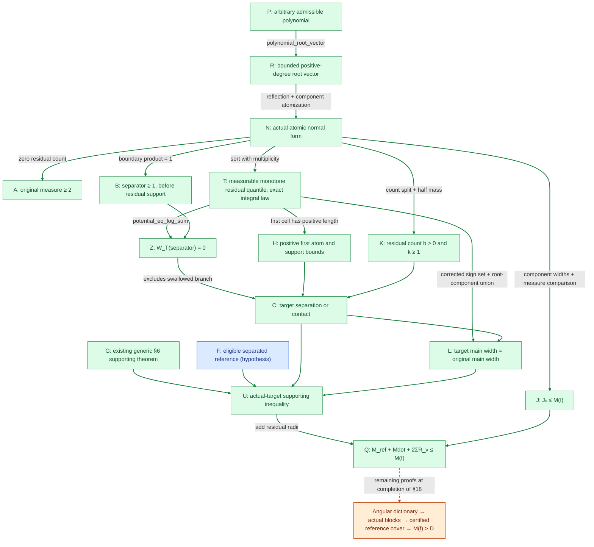
```mermaid
flowchart TD
  P["P: arbitrary admissible polynomial"] -->|polynomial_root_vector| R["R: bounded positive-degree root vector"]
  R -->|reflection + component atomization| N["N: actual atomic normal form"]
  N -->|zero residual count| A["A: original measure ≥ 2"]
  N -->|count split + half mass| K["K: residual count b > 0 and k ≥ 1"]
  N -->|component widths + measure comparison| J["J: Jₖ ≤ M(f)"]
  N -->|sort with multiplicity| T["T: measurable monotone residual quantile; exact integral law"]
  N -->|boundary product = 1| B["B: separator ≥ 1, before residual support"]
  T -->|potential_eq_log_sum| Z["Z: W_T(separator) = 0"]
  B --> Z
  T -->|first cell has positive length| H["H: positive first atom and support bounds"]
  Z -->|excludes swallowed branch| C["C: target separation or contact"]
  H --> C
  K --> C
  T -->|corrected sign set + root-component union| L["L: target main width = original main width"]
  C --> L
  G["G: existing generic §6 supporting theorem"] --> U["U: actual-target supporting inequality"]
  F["F: eligible separated reference (hypothesis)"] --> U
  C --> U
  L --> U
  U -->|add residual radii| Q["Q: M_ref + Mdot + 2ΣR_v ≤ M(f)"]
  J --> Q
  Q -. "remaining proofs at completion of §18" .-> X["Angular dictionary → actual blocks → certified reference cover → M(f) > D"]
  classDef done fill:#dcfce7,stroke:#15803d,color:#14532d;
  classDef pending fill:#ffedd5,stroke:#c2410c,color:#7c2d12;
  classDef input fill:#dbeafe,stroke:#2563eb,color:#1e3a8a;
  class P,R,N,A,K,J,T,B,Z,H,C,L,G,U,Q done;
  class F input;
  class X pending;
  linkStyle 0,1,2,3,4,5,6,7,8,9,10,11,12,13,14,15,16,17,18,19,20 stroke:#15803d,stroke-width:2px;
  linkStyle 21 stroke:#c2410c,stroke-dasharray:5 5;
```

The logarithmic convention was checked explicitly. `potential_eq_log_sum` uses totalized real logs on both sides. It is not a claim of equality with the extended potential at a polynomial root. `correctedNegSet_iff_sublevel` is restricted to `x < a₁`, where the only possible root is the main atom at zero; that point is inserted by `correctedNegSet`. Residual atom singularities are not silently included in a false global sign-set equality.

Verification evidence:

- [verification.json](audit_cert_runs/normal-form-20260930/verification.json): commands, successful exit codes, module counts, new-source hashes, and scope.
- [build.log](audit_cert_runs/normal-form-20260930/build.log): successful `lake -q build LeanProject` run using Lean 4.34.1; existing style warnings remain.
- [axiom_probes.lean](audit_cert_runs/normal-form-20260930/axiom_probes.lean) and [axioms.out](audit_cert_runs/normal-form-20260930/axioms.out): 17 principal declarations, including the integrated polynomial reduction, use only `propext`, `Classical.choice`, and `Quot.sound`.

At completion of §18, the next gap was the atomic adjoint, including jump velocities and the endpoint correction. §19 now supplies its required inequality for finite angular step velocities. The final inequality `M(f) > D`, nonattainment, and kernel-certified numerical bounds for `D` are still unproved in this project.

## 19. Completed finite-jump adjoint inequality and endpoint correction

This stage added **56 proved declarations in four modules**, imported by the root through `AtomicVelocity`. It supplies the inequality needed in the lower-bound chain. At completion of this stage, the residual coordinate dictionary and identification with `Stage10.Mdot` were still missing; §20 now supplies those connections. Exact jump adjoint equality remains unproved.

Write `J_z(θ) = 1` when `cos θ < z`, and `0` otherwise. At the threshold the value is zero; changing finitely many such values does not affect the integral dictionary to be proved. For a finite set of jumps put

\[
T_\theta=d_0+\sum_i\delta_iJ_{z_i}(\theta),\quad
d(\theta)=c-r\cos\theta,\quad
\alpha(\theta)=k+1-kP_\rho(\theta),\quad
F(\theta)=\alpha(\theta)(T_\theta-d(\theta)).
\]

The explicit hypotheses are `k ≥ 0`, `0 ≤ ρ < 1`, `α(0) ≥ 0`, `r > 0`, `0 < ρ₁,ρ₂ < 1`, `σ₁,σ₂ ≥ 0`, `δᵢ ≥ 0`, `-1 < zᵢ < 1`, and `d₀ + Σδᵢ ≤ c+r`. The reference parameters and angular step representation are inputs to the theorem at this stage. §20 constructs them from the actual residual quantile and a separated reference.

| Statement / proved implication | Lean declaration | Exact conclusion |
|---|---|---|
| Cosine-Lipschitz function ⇒ polynomial approximants with a common bound | `bernPoly_derivative`, `bernPoly_derivative_bound`, `lipApprox_XLip` | The Bernstein derivative is a positive average of adjacent differences; the Lipschitz bound is retained. |
| Cosine-Lipschitz function ⇒ continuous-part adjoint equality | `L_XLip` | `Lfun f = 0`; the approximants required by `Stage11C.L_limit` are constructed. |
| Increasing clipped ramps ⇒ pointwise atomic jump | `jumpRamp_XLip`, `jumpRamp_pi`, `jumpRamp_tendsto` | Each ramp has its own finite bound, lies in `[0,1]`, and has endpoint value 1. No common ramp Lipschitz bound is assumed. |
| Monotone function + nonnegative weight ⇒ nonnegative joint kernel | `dq_nonneg_of_monotone`, `weightedDQ_nonneg`, `Bxi_bounds` | The quotient and weight have compatible signs. |
| Converging nonnegative kernels + converging integrals ⇒ finite limit and integral bound | `nonnegative_integral_limit` | Real-valued Fatou, including integrability of the limiting kernel. |
| Ramp equality + Fatou ⇒ atomic jump adjoint inequality | `L_jump_nonneg` | The weighted joint kernel is integrable and `Lfun J_z ≥ 0`. This does **not** assert `Lfun J_z = 0`. |
| Integrable joint kernel ⇒ iterated transform integral | `integral_weightedDQ`, `integrable_HT_weight` | Fubini applies to the ordinary integrable difference quotient; `∫∫ q = π ∫ HT(f) B`. |
| Integrable functions ⇒ linearity of the full functional | `Lfun_add`, `Lfun_smul` | Both Poisson terms and the transform term are proved linear on the stated domain. |
| Lipschitz remainder + finitely many positive jumps ⇒ adjoint inequality | `finite_jump_adjoint` | All three terms are integrable and `Lfun F ≥ 0`. |
| Density-weighted step velocity ⇒ explicit jump decomposition | `density_jump_hinge`, `atomicVelocity_decomposition` | `Δᵢ = α(arccos zᵢ) δᵢ ≥ 0`; the remaining term is continuous. |
| Explicit remainder ⇒ cosine-Lipschitz regularity | `Pq_XLip`, `alpha_XLip`, `velocityRemainder_XLip` | A finite nonnegative bound is constructed, so the continuous-part theorem applies. |
| Final target position ⇒ endpoint value | `atomicVelocity_pi`, `atomicVelocity_endpoint_formula` | For `c+r=2`, `-ΓF(π) = Γ α(π) (2-d_last)`, with `d_last=d₀+Σδᵢ`. |
| Full finite-step velocity ⇒ favorable endpoint-corrected inequality | `atomicVelocity_adjoint` | Integrability and `widthVariation - adjointIntegral ≥ -ΓF(π) ≥ 0`. |
| Endpoint-corrected inequality ⇒ usable lower-bound direction | `atomicVelocity_adjoint_bound` | `adjointIntegral F ≤ widthVariation F`. |

The continuous remainder is constructed as

\[
F_c(\theta)=\alpha(\theta)(d_0-d(\theta))+
\sum_i\delta_i\max\{0,\alpha(\theta)-\alpha(\arccos z_i)\}.
\]

The hinge identity proves `F = F_c + ΣΔᵢ J_{zᵢ}`. Bounds on the Poisson denominators prove cosine-Lipschitz regularity of `F_c`. This discharges the regularity premise for this velocity class, rather than assuming that angular Lipschitz regularity implies cosine-Lipschitz regularity.

For a jump, Fatou is applied to the nonnegative kernel

\[
q_n(\theta,\phi)=
\frac{J_{z,n}(\phi)-J_{z,n}(\theta)}{\cos\theta-\cos\phi}B(\theta).
\]

The continuous-ramp adjoint equality and dominated convergence of the bounded Poisson terms give the limit of `∫∫ q_n`. Fatou bounds the limiting joint integral and proves its finiteness. Fubini then identifies it with the transform term. This yields an inequality; it does not identify the limit of the singular integral by uniform convergence alone and does not perform a principal-value Fubini swap.

Here the formally defined terms are

\[
V(F)=-\operatorname{poissonPair}(F),\qquad
I(F)=\frac1{\pi r}\int_0^\pi\mathcal H F(\theta)B(\theta)\,d\theta.
\]

The names `widthVariation` and `adjointIntegral` refer to these explicit formulas. **At completion of §19, `Stage10.Mdot = V(F)` and the spatial material-integral identity were unproved.** §20 now proves both for the independently defined static material expression and applies the inequality to the actual polynomial target. Identification of that expression as a moving-potential derivative remains separate.

The following diagram records the status **at completion of §19**. The detailed block chain is in §21, the full-R1 reference branch in §22, and the completed pilot certificates in §23. Green boxes and solid green arrows are verified statements and implications; blue boxes are explicit input hypotheses; orange boxes and dashed orange arrows were missing construction/identification proofs at this stage. Arrows entering a common conclusion require their inputs together.


[Open SVG for zooming](proof_diagrams/dependency-stage-19.svg) · [Mermaid source](proof_diagrams/dependency-stage-19.mmd)

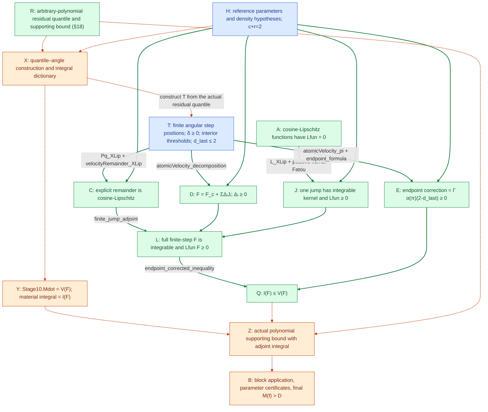
```mermaid
flowchart TD
  R["R: arbitrary-polynomial residual quantile and supporting bound (§18)"]
  H["H: reference parameters and density hypotheses; c+r=2"]
  T["T: finite angular step positions; δ ≥ 0; interior thresholds; d_last ≤ 2"]
  A["A: cosine-Lipschitz functions have Lfun = 0"]
  J["J: one jump has integrable kernel and Lfun ≥ 0"]
  C["C: explicit remainder is cosine-Lipschitz"]
  D["D: F = F_c + ΣΔᵢJᵢ; Δᵢ ≥ 0"]
  L["L: full finite-step F is integrable and Lfun F ≥ 0"]
  E["E: endpoint correction = Γ α(π)(2-d_last) ≥ 0"]
  Q["Q: I(F) ≤ V(F)"]
  X["X: quantile–angle construction and integral dictionary"]
  Y["Y: Stage10.Mdot = V(F); material integral = I(F)"]
  Z["Z: actual polynomial supporting bound with adjoint integral"]
  B["B: block application, parameter certificates, final M(f) > D"]
  T -->|Pq_XLip + velocityRemainder_XLip| C
  H --> C
  T -->|atomicVelocity_decomposition| D
  H --> D
  A -->|L_XLip + positive-kernel Fatou| J
  H --> J
  C -->|finite_jump_adjoint| L
  D --> L
  J --> L
  T -->|atomicVelocity_pi + endpoint_formula| E
  H --> E
  L -->|endpoint_corrected_inequality| Q
  E --> Q
  R -.-> X
  H -.-> X
  X -. "construct T from the actual residual quantile" .-> T
  X -.-> Y
  Y -.-> Z
  Q -.-> Z
  R -.-> Z
  Z -.-> B
  classDef done fill:#dcfce7,stroke:#15803d,color:#14532d;
  classDef input fill:#dbeafe,stroke:#2563eb,color:#1e3a8a;
  classDef pending fill:#ffedd5,stroke:#c2410c,color:#7c2d12;
  class R,A,J,C,D,L,E,Q done;
  class H,T input;
  class X,Y,Z,B pending;
  linkStyle 0,1,2,3,4,5,6,7,8,9,10,11,12 stroke:#15803d,stroke-width:2px;
  linkStyle 13,14,15,16,17,18,19,20 stroke:#c2410c,stroke-width:2px;
```

Verification evidence:

- [build.log](audit_cert_runs/adjoint-jumps-20260930/build.log): `lake -q build LeanProject`, exit 0, with the entire new chain imported by the root.
- [axiom_probes.lean](audit_cert_runs/adjoint-jumps-20260930/axiom_probes.lean) and [axioms.out](audit_cert_runs/adjoint-jumps-20260930/axioms.out): 21 principal new declarations use only `propext`, `Classical.choice`, and `Quot.sound`.
- [verification.json](audit_cert_runs/adjoint-jumps-20260930/verification.json): commands, module/import counts, source hashes, declared scope, and source scan.

The next task at completion of §19 was the quantile–angle dictionary and the derivative/material-integral identifications `Y`; §20 completes the required static-integral connections. The sharp universal lower theorem, nonattainment, and numerical parameter certificates remain unfinished in Lean. Exact jump adjoint equality also remains open as a stronger statement, but it is not required for this inequality route.

## 20. Completed actual quantile, derivative and static material-integral connections

This stage adds **83 proved declarations in five modules**, all imported by the root through `MaterialDictionary`. It closes the construction and identification steps `X`, `Y` and `Z` in the preceding diagram, where the material term means the independent static difference-quotient expression defined below. The reference's strict separation remains an explicit hypothesis. No final sharp lower-bound or nonattainment declaration is asserted.

The module dependencies are

```text
AtomicVelocity → AngleCDF → QuantileAngle → DerivativeDictionary
NormalFormComponent + DerivativeDictionary → SupportingAdjoint → MaterialDictionary
```

### Constructed statements and proved implications

Write

\[
U(\theta)=\frac1\pi\int_0^\theta\alpha(\phi)\,d\phi,
\qquad d(\theta)=c-r\cos\theta,
\qquad T_0(u)=d(U^{-1}(u)).
\]

`AngleReference` requires `k > 0`, `0 < ρ < 1`, and `α(0) ≥ 0`. These imply that `U` is continuous and strictly increasing on `[0,π]`, including when `α(0)=0`. Its image is `[0,1]`. The inverse is constructed, not assumed, and is extended by the endpoints outside `[0,1]`. For the physical interval `[a,2]`, `AngleReference.ofInterval` constructs the density from `ρ=qa a` and discharges `α(0) ≥ 0` using `(H1): 2(k/(k+1))² ≤ a`.

| Statement / proved implication | Lean declarations | Exact conclusion and inputs |
|---|---|---|
| Density hypotheses ⇒ actual cumulative mass and inverse | `AngleReference.cdf_strictMonoOn`, `cdf_image`, `cdf_inverse`, `inverse_cdf` | `U` maps `[0,π]` bijectively onto `[0,1]`; the inverse is monotone, measurable and interior-preserving. |
| Constructed inverse ⇒ reference quantile and integral law | `quantile_monotone`, `quantile_bounds`, `integral_cdf`, `integral_quantile` | `T₀` has the required support and monotonicity; `∫₀¹ h(T₀(u)) du = π⁻¹∫₀^π h(d(θ))α(θ)dθ`. |
| Sorted residual occurrences ⇒ finite nonnegative jumps | `AtomicQuantile.step_expansion`, `sum_jumps`, `jump_nonneg` | Adjacent differences are nonnegative and telescope to the last residual root. Repeated roots are retained and contribute zero jumps. |
| Cell boundaries + cumulative inverse ⇒ interior angular thresholds | `AngleReference.threshold_interior`, `cdf_lt_iff_cos` | `zᵢ=cos(U⁻¹((i+1)/b))` lies strictly in `(-1,1)` for every actual jump index. |
| Actual residual quantile ⇒ the velocity class of §19 | `angularTarget_step`, `angularVelocity_step`, `residual_quantile_adjoint` | `T(U(θ))` is the finite angular step position; the target's last root is at most `2`, supplying the endpoint correction. |
| Exterior point ⇒ Poisson parameter and kernel identity | `exterior_parameter_exists`, `exteriorParameter_spec`, `poisson_exterior` | Constructs `0 < ρₓ < 1` with `x=c-r(ρₓ+ρₓ⁻¹)/2` and `P_{ρₓ}(θ)=Kₓ/(d(θ)-x)`. |
| Separated reference ⇒ actual endpoint parameters and positive coefficients | `SeparatedReference.xp_exterior`, `xm_exterior`, `rhoPlus_spec`, `rhoMinus_spec`, `sigmaPlus_pos`, `sigmaMinus_pos` | Uses the existing reference endpoints `xpS`, `xmS` and their slopes. Those parameters are not free hypotheses in the integrated theorem. |
| Quantile integral law + Poisson identity ⇒ existing derivative formula | `AngleReference.integral_velocity_exterior`, `Mdot_eq_widthVariation`, `SeparatedReference.Mdot_eq` | Proves `Stage10.Mdot k T₀ T = widthVariation F`, with `F=α(T∘U-d)` and the constructed endpoint coefficients. |
| Actual target + previous supporting theorem + adjoint inequality ⇒ main-width bound | `normal_form_adjoint_supporting`, `polynomial_adjoint_reduction` | Discharges all target, jump and endpoint hypotheses. A separated reference with the matching `k` remains input. |
| Density transform + physical platform relation ⇒ cancellation | `HT_alpha`, `platform_density_transform`, `interval_zero_exterior` | Proves `HT α/r=k/d`. The relation `0=c-r(ρ+ρ⁻¹)/2` follows automatically for `c=(a+2)/2`, `r=(2-a)/2`, `ρ=qa a`. |
| Joint integrability ⇒ independent static material identity | `ae_dq_integrable`, `materialAngular_eq_HT`, `AngleReference.material_eq_HT_ae` | The static material expression equals `HT F/r` almost everywhere; integrable fibers are proved using the positive adjoint weight. |
| Angular measure ⇒ spatial integral and integrability | `integral_spatialAdjoint`, `integrable_spatialAdjoint`, `AngleReference.material_integral_dictionary` | Constructs the push-forward measure `ξ` and proves `∫g_static dξ = adjointIntegral F`, with integrability. |
| Actual residual target ⇒ actual spatial material supporting bound | `SeparatedReference.residual_material_dictionary`, `normal_form_material_supporting`, `polynomial_material_reduction` | For every eligible reference, `M_ref + ∫g_static dξ + 2Σ_distinct R_v ≤ M(f)`. The no-residual branch gives `M(f) ≥ 2`. |

The empirical step convention is checked pointwise, including cell boundaries: each jump is `1` exactly when `(i+1)/b < u`. After the coordinate transformation this is exactly `cos θ < zᵢ`. Thus the finite angular expansion does not silently change the quantile at a threshold. `foldedAngle θ=arccos(cos θ)` extends the angular target to all real angles; it is the identity on `[0,π]` and permits application of the globally stated cosine-coordinate lemmas.

For an exterior endpoint, the constructive proof uses

\[
m=c-x>r,\qquad K_x=\sqrt{m^2-r^2},\qquad
\rho_x=\frac r{m+K_x}.
\]

The coefficients are taken from the actual reference:

\[
\sigma_+=\frac1{k\,GS(k,T_0,x_+) }>0,
\qquad
\sigma_-=-\frac1{k\,GS(k,T_0,x_-) }>0.
\]

The `Mdot` identity expands the existing `Stage10.Mdot` definition and transforms its integrals. It is not an alias defining a new expression to equal the old one. The earlier `Stage10` supporting/derivative results continue to supply their stated separated-reference conclusions.

### What the material identity proves

Put `v(θ)=T(U(θ))-d(θ)`. The new static expression is defined independently of `HT` by

\[
g_{\rm static}(d(\theta))=
\frac{k\,v(\theta)}{d(\theta)}+
\frac1\pi\int_0^\pi
\frac{v(\phi)-v(\theta)}{d(\phi)-d(\theta)}\alpha(\phi)\,d\phi.
\]

The pointwise algebraic identity splits its kernel into the difference quotient of `F=αv` and that of `α`. The proved platform cancellation removes the latter. The weighted joint integrability from §19 and the strict positivity of `B` on `(0,π)` give ordinary integrable fibers almost everywhere. Consequently `g_static(d(θ))=HT F(θ)/r` almost everywhere.

The spatial measure is constructed as

\[
\xi=d_*\!\left(\frac{B(\theta)}\pi\,d\theta\bigg|_{(0,\pi]}\right).
\]

The change-of-variables theorem proves integrability and

\[
\int g_{\rm static}\,d\xi
=\frac1{\pi r}\int_0^\pi HT F(\theta)B(\theta)\,d\theta
=I(F)\le V(F)=\operatorname{Stage10.Mdot}(k,T_0,T).
\]

The endpoint convention does not change this measure. These are ordinary integrable difference-quotient identities; no principal-value Fubini exchange is used. **The new code does not prove that `g_static` is the derivative in the deformation parameter of the moving logarithmic potential at each interior block point**, nor the equivalence of spatial and angular principal-value truncations. Those stronger claims remain unformalized. The direct lower-bound route can proceed by estimating this already constructed static expression.

### Dependency diagram at completion of §20

This historical diagram records the status before §21. Green boxes are formalized statements and green solid arrows are proved implications. Blue boxes state reference hypotheses still supplied as inputs. Orange boxes and dashed orange arrows were remaining work at this stage. All arrows entering one conclusion require their inputs together; they do not mean that each individual input suffices. The completed block chain is in §21, the full-R1 reference branch in §22, and the pilot certificates in §23.


[Open SVG for zooming](proof_diagrams/dependency-stage-20.svg) · [Mermaid source](proof_diagrams/dependency-stage-20.mmd)

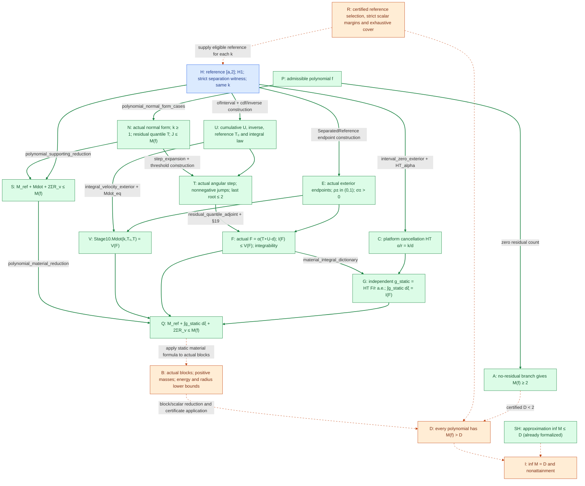
```mermaid
flowchart TD
  P["P: admissible polynomial f"]
  N["N: actual normal form; k ≥ 1; residual quantile T; J ≤ M(f)"]
  A["A: no-residual branch gives M(f) ≥ 2"]
  H["H: reference [a,2]; H1; strict separation witness; same k"]
  U["U: cumulative U, inverse, reference T₀ and integral law"]
  T["T: actual angular step; nonnegative jumps; last root ≤ 2"]
  E["E: actual exterior endpoints; ρ± in (0,1); σ± > 0"]
  F["F: actual F = α(T∘U-d); I(F) ≤ V(F); integrability"]
  V["V: Stage10.Mdot(k,T₀,T) = V(F)"]
  S["S: M_ref + Mdot + 2ΣR_v ≤ M(f)"]
  C["C: platform cancellation HT α/r = k/d"]
  G["G: independent g_static = HT F/r a.e.; ∫g_static dξ = I(F)"]
  Q["Q: M_ref + ∫g_static dξ + 2ΣR_v ≤ M(f)"]
  B["B: actual blocks; positive masses; energy and radius lower bounds"]
  R["R: certified reference selection, strict scalar margins and exhaustive cover"]
  D["D: every polynomial has M(f) > D"]
  I["I: inf M = D and nonattainment"]
  SH["SH: approximation inf M ≤ D (already formalized)"]
  P -->|polynomial_normal_form_cases| N
  P -->|zero residual count| A
  H -->|ofInterval + cdf/inverse construction| U
  N -->|step_expansion + threshold construction| T
  U --> T
  H -->|SeparatedReference endpoint construction| E
  T -->|residual_quantile_adjoint + §19| F
  E --> F
  U -->|integral_velocity_exterior + Mdot_eq| V
  E --> V
  N -->|polynomial_supporting_reduction| S
  H --> S
  H -->|interval_zero_exterior + HT_alpha| C
  F -->|material_integral_dictionary| G
  C --> G
  S -->|polynomial_material_reduction| Q
  V --> Q
  F --> Q
  G --> Q
  Q -. "apply static material formula to actual blocks" .-> B
  B -. "block/scalar reduction and certificate application" .-> D
  R -.-> D
  R -. "supply eligible reference for each k" .-> H
  A -. "certified D < 2" .-> D
  D -.-> I
  SH -.-> I
  classDef done fill:#dcfce7,stroke:#15803d,color:#14532d;
  classDef input fill:#dbeafe,stroke:#2563eb,color:#1e3a8a;
  classDef pending fill:#ffedd5,stroke:#c2410c,color:#7c2d12;
  class P,N,A,U,T,E,F,V,S,C,G,Q,SH done;
  class H input;
  class B,R,D,I pending;
  linkStyle 0,1,2,3,4,5,6,7,8,9,10,11,12,13,14,15,16,17,18 stroke:#15803d,stroke-width:2px;
  linkStyle 19,20,21,22,23,24,25 stroke:#c2410c,stroke-dasharray:5 5;
```

The paper interval constructor `intervalReference` discharges positivity of `r`, the support endpoints, `c+r=2`, density positivity from `(H1)`, and the platform relation. It still takes a strict separation witness as input. Neither the constructor nor the universal conditional theorem proves that the parameter cover supplies such a reference for every required `k`.

### Verification and next task

- [build.log](audit_cert_runs/quantile-angle-20260930/build.log): `lake -q build LeanProject`, exit 0. Style/deprecation warnings remain. The root directly imports 92 modules and its transitive closure contains all 103 project modules.
- [axiom_probes.lean](audit_cert_runs/quantile-angle-20260930/axiom_probes.lean) and [axioms.out](audit_cert_runs/quantile-angle-20260930/axioms.out): **all 83 new proved declarations** were checked; their axiom dependencies are contained in `{propext, Classical.choice, Quot.sound}`.
- [verification.json](audit_cert_runs/quantile-angle-20260930/verification.json): per-declaration axiom results, source hashes, commands, import counts, exact scope and remaining work. All 104 project files including the root were scanned, with no `sorry`, `admit`, `native_decide`, or explicit `axiom` declaration.

The next task at completion of §20 was **constructing the actual quantile blocks and applying the static material expression to their block energies and residual radii**. Section 21 now completes positive block masses, the finite block partition/integral decomposition, the mass/radius identities, and application of `BlockEnergy`/`BlockRed` under their exact hypotheses. Reference choices, scalar margins, parameter coverage and final assembly remain. The stronger moving-potential derivative and exact jump equality remain separate unfinished statements; neither has been silently assumed by the polynomial material-integral reduction.

## 21. Completed actual blocks and conditional strict lower-bound reduction

This stage adds **87 proved declarations in five modules**. It completes the actual-block node `B` and its algebraic/scalar reduction arrow from the historical §20 diagram. The resulting strict bound is conditional on an eligible reference and its scalar positivity certificate. Existence of those inputs throughout the remaining parameter range is still unproved in Lean.

| New module | Proved declarations | Dependency and role |
|---|---:|---|
| [ActualBlocks.lean](Lean/LeanProject/ActualBlocks.lean) | 32 | `MaterialDictionary` + `BlockRed`; constructs actual blocks, masses, radii and the integral partition. |
| [BlockLogKernel.lean](Lean/LeanProject/BlockLogKernel.lean) | 7 | `MaterialDictionary`; proves absolute joint logarithmic-kernel integrability. |
| [ActualBlockEnergy.lean](Lean/LeanProject/ActualBlockEnergy.lean) | 31 | Both preceding modules; identifies the physical energy and applies the existing angular energy inequality. |
| [ActualBlockMaterial.lean](Lean/LeanProject/ActualBlockMaterial.lean) | 11 | `ActualBlockEnergy`; proves the pointwise and integrated static material lower bounds. |
| [ActualBlockReduction.lean](Lean/LeanProject/ActualBlockReduction.lean) | 6 | `ActualBlockMaterial`; supplies the certificate interface, strict reduction and small-ratio branch. |

The root imports `ActualBlockReduction`, so all five modules lie in its checked import closure.

### Actual blocks and their identities

Let `a : NormalData n`, let `b=a.residualCount>0`, and write `x₀=a.roots a.main`. Index blocks by the finite set `V=a.residualValues` of **distinct original residual roots**. For `v∈V`, let `m_v` be its multiplicity among all listed roots. Since `v≠x₀`, this is also its residual multiplicity. With the actual empirical residual quantile `T` from §18 and the reference cumulative distribution `U` from §20, define

\[
S_v=\{\theta\in[0,\pi]:T(U(\theta))=v-x_0\},\quad
q_v=\frac1\pi\int_{S_v}\alpha(\theta)\,d\theta,\quad
r_v=\frac1\pi\int_{S_v}B(\theta)\,d\theta.
\]

The `S_v` are measurable, pairwise disjoint, order-convex fibers and cover `[0,π]`. Repeated roots are grouped in one fiber; their multiplicity contributes to `q_v`, while their residual radius appears only once in the finite sum. The coordinate dictionary and empirical measure law prove

\[
q_v=\frac{m_v}{b}>0,\qquad \sum_{v\in V}q_v=1,
\qquad r_v>0,\qquad \sum_{v\in V}r_v=R_\xi>0.
\]

Here `B` is the actual adjoint weight derived from the reference endpoints, and

\[
R_\xi=\sigma_+\frac{2\rho_+}{1-\rho_+}
       +\sigma_-\frac{2\rho_-}{1-\rho_-}.
\]

Strict positivity of `r_v` is proved from positive `α`-mass of the fiber and `B>0` on `(0,π)`; it is not an extra block hypothesis. The actual `Stage7.Rv` satisfies

\[
R_v>0,\qquad -q_v\log R_v=W_{k,T}(v-x_0).
\]

The latter equality uses the finite log-sum definition and Lean's totalized `Real.log 0=0` to omit occurrences equal to `v`. It is an equality of the stated real-valued expressions, not a claim that the extended logarithmic potential is finite at an atom.

### Physical energy and static material estimate

Put `d(θ)=c-r cos θ`, `a_π=α(π)>0`, `b_π=B(π)>0`, and

\[
F_v=\mathbf1_{S_v}\alpha/a_\pi,\qquad
G_v=\mathbf1_{S_v}B/b_\pi,\qquad
Q_v=\int_0^\pi F_v,\quad V_v=\int_0^\pi G_v.
\]

Both normalized functions are measurable and lie in `[0,1]`. Their integrals satisfy

\[
q_v=a_\pi Q_v/\pi,\quad r_v=b_\pi V_v/\pi,\quad
0<Q_v\le\pi/a_\pi,\quad 0<V_v\le\pi R_\xi/b_\pi.
\]

The two upper bounds are at most `π`. The normalized energy is independently identified with the physical double integral

\[
E_v=\frac1{\pi^2}\int_{S_v}\!\int_{S_v}
\log|d(\theta)-d(\phi)|\,\alpha(\theta)B(\phi)\,d\phi\,d\theta.
\]

`BlockLogKernel` proves absolute joint integrability, and `blockEnergy_raw_swap` justifies reversing the integration order. These are ordinary Fubini statements. No principal-value exchange or unproved moving-potential derivative is used.

Let

\[
C=\log(r/2)+k\log\!\left(\frac r{2\rho}\right),\qquad
G_v^{\log}(\theta)=\frac1\pi\int_{S_v}
\log|d(\theta)-d(\phi)|\alpha(\phi)\,d\phi.
\]

The reference platform identity, monotonicity of the actual quantile, and `log t≤t−1` yield the almost-everywhere block estimate

\[
g_{\rm static}(d(\theta))
\ge-q_v\log R_v-C-q_v+G_v^{\log}(\theta),\qquad\theta\in S_v.
\]

Within a fiber the difference-quotient kernel equals `−α(φ)` away from the diagonal. Between fibers, the numerator and denominator of the relevant ratio have the same sign by monotonicity, so the logarithmic inequality applies. The diagonal has measure zero. Integrability of all terms is established before integrating the inequality.

Consequently, with `I_v=π⁻¹∫_{S_v}g_static(d(θ))B(θ)dθ`,

\[
\boxed{I_v\ge r_v(-q_v\log R_v-C-q_v)+E_v.}
\]

The finite partition gives `Σ_v I_v=∫g_static dξ`. The supporting inequality from §20 therefore gives `M₀+Σ_v I_v≤M_k`, where `M₀` is the actual reference main width and `M_k` is the target main width.

### Statements and proved implications

All declaration names in this table are in `EP1038.Stage12`, except the existing `EP1038.Arc.block_reduction_strict`.

| Input statements `P` | Conclusion `Q` | Proved `P ⇒ Q` |
|---|---|---|
| Actual residual quantile and reference cumulative law | Measurable disjoint interval fibers; finite integral partition | `blockSet_measurable`, `blockSet_disjoint`, `blockSet_cover`, `blockSet_orderConvex`, `sum_block_integral` |
| The partition and empirical multiplicities | `q_v=m_v/b>0`, `Σq_v=1`, `r_v>0`, `Σr_v=R_ξ>0` | `blockMass_eq_multiplicity`, `blockMass_pos`, `sum_blockMass`, `blockXi_pos`, `sum_blockXi`, `totalXi_pos` |
| Actual finite root list and radius definition | `R_v>0`, `−q_v log R_v=W(v−x₀)` | `blockRadius_pos`, `block_radius_identity` |
| Actual fibers and bounded weights | The normalized block rectangle and the physical energy identity | `actual_block_rectangle`, `blockEnergy_raw`, `block_log_joint_integrable`, `blockEnergy_raw_swap` |
| Actual blocks, matching `k`, platform relation and eligible reference | `I_v≥r_v(−q_v log R_v−C−q_v)+E_v` | `material_block_pointwise`, `block_log_potential_energy`, `blockMaterial_lower_bound` |
| The finite partition and §20 supporting bound | `M₀+ΣI_v≤M_k` | `sum_blockMaterialIntegral`, `normal_form_block_supporting` |
| Normalized block bounds and existing angular energy inequality | `rhs(Q_v,V_v)≤E_v/(q_v r_v)−log(q_v r_v/2)−C_eff/q_v` | `actual_block_ineq` |
| The preceding energy estimate and `rhs(Q_v,V_v)>0` | `E_v>q_v r_v log(q_v r_v/2)+C_eff r_v` | `blockEnergy_strict_of_rhs_pos` |
| Positive masses/radii, material/supporting bounds, one strict energy bound, `Σr_v=R_ξ`, calibration | `J=M_k+2Σ_distinct R_v>L` | Existing `block_reduction_strict`, applied by `normal_form_strict_lower_of_scalarPositive` |
| Actual normal form with `0<b` and `k≤29/20` | `J>2` | `normal_form_small_ratio`, applying existing `Stage8.prop81` |
| Any admissible polynomial and the preceding reductions | `M(f)≥2`, or an actual target with `k>29/20` and the conditional strict lower theorem | `polynomial_certificate_reduction` |
| `C_eff≤0` and a strict small-case scalar margin | Positivity on the entire actual rectangle | `scalarPositive_small` |
| `C_eff≤0`, ordered partition with correct endpoints and strict finite margins | Positivity on the entire actual rectangle | `scalarPositive_partition` |

The final certificate predicate is explicit:

\[
\operatorname{ScalarPositive}(R,C_{\rm eff})\iff
\forall\,0<Q\le\pi/a_\pi,\ 0<V\le\pi R_\xi/b_\pi,
\quad\operatorname{rhs}(c_0,C_{\rm eff},a_\pi,Q,V)>0,
\quad c_0=\log\!\frac{r}{a_\pi b_\pi}.
\]

For `C_eff=C+(L−M₀)/R_ξ`, the proved integrated implication is

\[
\boxed{\text{eligible reference with matching }k\text{ and platform relation}
\ \land\ \operatorname{ScalarPositive}(R,C_{\rm eff})
\ \Longrightarrow\ L<J\le M(f).}
\]

The universal theorem quantifies over every reference satisfying these inputs; it does **not** assert that such a reference and certificate exist. `polynomial_certificate_reduction` additionally leaves only `k>29/20`, hence `k≥36/25`, in the non-elementary branch. No-residual targets give `M(f)≥2`; small-ratio residual targets give `M(f)>2`.

### Dependency diagram at completion of §21

Green boxes state constructed objects or verified conclusions; green solid arrows are proved implications under their displayed inputs. Blue boxes are explicit reference/certificate inputs whose definitions are formalized, but whose existence for every required `k` remains open. Orange boxes and dashed orange arrows are unproved whole-theorem steps. Multiple incoming arrows require their inputs together. The arrows from `N` to `A` and `T` are the two cases of a proved dichotomy.


[Open SVG for zooming](proof_diagrams/dependency-stage-21.svg) · [Mermaid source](proof_diagrams/dependency-stage-21.mmd)

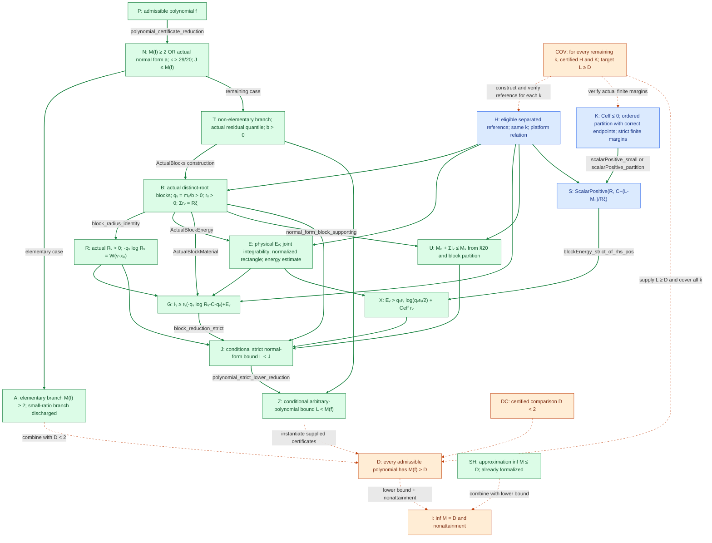
```mermaid
flowchart TD
  P["P: admissible polynomial f"]
  N["N: M(f) ≥ 2 OR actual normal form a; k > 29/20; J ≤ M(f)"]
  A["A: elementary branch M(f) ≥ 2; small-ratio branch discharged"]
  T["T: non-elementary branch; actual residual quantile; b > 0"]
  H["H: eligible separated reference; same k; platform relation"]
  B["B: actual distinct-root blocks; qᵥ = mᵥ/b > 0; rᵥ > 0; Σrᵥ = Rξ"]
  R["R: actual Rᵥ > 0; -qᵥ log Rᵥ = W(v-x₀)"]
  E["E: physical Eᵥ; joint integrability; normalized rectangle; energy estimate"]
  G["G: Iᵥ ≥ rᵥ(-qᵥ log Rᵥ-C-qᵥ)+Eᵥ"]
  U["U: M₀ + ΣIᵥ ≤ Mₖ from §20 and block partition"]
  S["S: ScalarPositive(R, C+(L-M₀)/Rξ)"]
  K["K: Ceff ≤ 0; ordered partition with correct endpoints; strict finite margins"]
  X["X: Eᵥ > qᵥrᵥ log(qᵥrᵥ/2) + Ceff rᵥ"]
  J["J: conditional strict normal-form bound L < J"]
  Z["Z: conditional arbitrary-polynomial bound L < M(f)"]
  COV["COV: for every remaining k, certified H and K; target L ≥ D"]
  DC["DC: certified comparison D < 2"]
  D["D: every admissible polynomial has M(f) > D"]
  SH["SH: approximation inf M ≤ D; already formalized"]
  I["I: inf M = D and nonattainment"]
  P -->|polynomial_certificate_reduction| N
  N -->|elementary case| A
  N -->|remaining case| T
  T -->|ActualBlocks construction| B
  H --> B
  B -->|block_radius_identity| R
  B -->|ActualBlockEnergy| E
  H --> E
  B -->|ActualBlockMaterial| G
  R --> G
  E --> G
  H --> G
  B -->|normal_form_block_supporting| U
  H --> U
  K -->|scalarPositive_small or scalarPositive_partition| S
  H --> S
  S -->|blockEnergy_strict_of_rhs_pos| X
  E --> X
  G -->|block_reduction_strict| J
  U --> J
  X --> J
  B --> J
  R --> J
  J -->|polynomial_strict_lower_reduction| Z
  T --> Z
  COV -. "construct and verify reference for each k" .-> H
  COV -. "verify actual finite margins" .-> K
  COV -. "supply L ≥ D and cover all k" .-> D
  Z -. "instantiate supplied certificates" .-> D
  A -. "combine with D < 2" .-> D
  DC -.-> D
  D -. "lower bound + nonattainment" .-> I
  SH -. "combine with lower bound" .-> I
  classDef done fill:#dcfce7,stroke:#15803d,color:#14532d;
  classDef input fill:#dbeafe,stroke:#2563eb,color:#1e3a8a;
  classDef pending fill:#ffedd5,stroke:#c2410c,color:#7c2d12;
  class P,N,A,T,B,R,E,G,U,X,J,Z,SH done;
  class H,K,S input;
  class COV,DC,D,I pending;
  linkStyle 0,1,2,3,4,5,6,7,8,9,10,11,12,13,14,15,16,17,18,19,20,21,22,23,24 stroke:#15803d,stroke-width:2px;
  linkStyle 25,26,27,28,29,30,31,32 stroke:#c2410c,stroke-dasharray:5 5;
```

### Verification and remaining work

- [build.log](audit_cert_runs/actual-blocks-20260930/build.log): `lake -q build LeanProject`, exit 0. The root directly imports 93 modules and its transitive closure covers all 108 project modules, including `Stage11C`. Style/deprecation warnings remain.
- [axiom_probes.lean](audit_cert_runs/actual-blocks-20260930/axiom_probes.lean) and [axioms.out](audit_cert_runs/actual-blocks-20260930/axioms.out): **all 87 new proved declarations** were checked; each depends only on axioms from `{propext, Classical.choice, Quot.sound}`.
- [verification.json](audit_cert_runs/actual-blocks-20260930/verification.json): current source hashes, declaration names/locations, per-declaration axiom results, commands, import counts and remaining scope. All 109 project files including the root were scanned with no `sorry`, `admit`, `native_decide`, or explicit `axiom` declaration.

At completion of §21, the next work was to **supply kernel-checked reference and scalar certificates throughout the remaining parameter range**. Section 22 proves R1's `(H1)` and constructs its actual separated reference conditional on a certified negative exterior value. Actual numerical bounds, scalar margins, the other rows, exhaustive parameter coverage and comparisons with `D` remain. The existing Python interval evidence does not discharge these Lean hypotheses; it was not rerun in this update. The numerical enclosure of `D`, moving-potential derivative/PV identification and exact jump adjoint equality remain unformalized; the latter two stronger auxiliary statements are unused by the proved static-expression route.

## 22. Completed R1 conditions and certificate-to-separation bridge

This stage adds **29 proved declarations in two modules**, imported by the root through `R1Reference`. It follows the paper's reference-row strategy in §9. The numerical certificate's strict inequality is still a premise; the conversion from that premise to the actual reference required by §21 is now proved.

| Module | Proved declarations | Role |
|---|---:|---|
| [ReferenceSeparation.lean](Lean/LeanProject/ReferenceSeparation.lean) | 15 | Actual interval quantile, positive exterior point, physical potential identity, separation implication and reference constructor. |
| [R1Reference.lean](Lean/LeanProject/R1Reference.lean) | 14 | Full-row basic conditions, density condition, actual R1 reference, uniform slab interface and conditional strict normal-form bound. |

### The full R1 parameter interval

Define

\[
a_1(k)=\frac{1153}{500}-\frac{k}{4},\qquad
\frac{36}{25}\le k\le\frac{21}{10}.
\]

The exact rational argument proves

\[
\frac{1781}{1000}\le a_1(k)\le\frac{973}{500},\qquad
k>0,\quad 1\le a_1(k)<2,\quad
2\left(\frac{k}{k+1}\right)^2<a_1(k).
\]

In particular `(H1)` holds throughout R1, without a numerical checker. The proof bounds `k/(k+1)≤21/31`, giving `2(k/(k+1))²<1≤a₁(k)`. The existing density theorem yields `α(k,qa(a₁(k)),θ)≥0` for every angle. This discharges the basic inputs to `AngleReference.ofInterval`; it does not prove separation by itself.

### The actual certificate expression and reference potential

For an interval satisfying `k>0`, `0<a<2` and `(H1)`, let `T₀` be the **constructed** interval reference quantile. Put

\[
q=qa(a),\quad D_0=D0a(a),\qquad
x(v)=\frac{a+2}{2}-D_0v-\frac{D_0q^2}{v},
\]

\[
\mathfrak E(k,a,v)
=\frac{k}{k+1}\log\!\left(\frac{v-q^2}{|1-v|}\right)
-\log v-\log D_0.
\]

These are `certPoint` and `certE`, matching the paper's certificate variables. For `q<v<1`, the proved factorization is

\[
x(v)=D_0\frac{(v-q^2)(1-v)}v,
\qquad 0<x(v)<a.
\]

The change of variables `p=q/v∈(0,1)` identifies `x(v)` with the existing `xoff` parameter. The quantile integral law and evenness convert the existing full-circle `W0_off` formula into the physical potential of `T₀`. Logarithm identities then prove

\[
\boxed{\operatorname{Stage10.WS}(k,T_0,x(v))
=-(k+1)\mathfrak E(k,a,v).}
\]

The equality expands the independently defined `Stage10.WS` and uses the actual quantile law. It is not a definition identifying a surrogate expression with the potential. Its certificate form is proved here on the **positive exterior branch** `q<v<1`; it does not assert the full negative-exterior/root-derivative dictionary needed later for scalar endpoint certificates.

Consequently, an upper bound `\mathfrak E(k,a,v)≤e_hi<0` gives

\[
0<\operatorname{WS}(k,T_0,x(v))
\quad\Longrightarrow\quad
\operatorname{RS}(k,T_0)<\operatorname{PsiS}(k,T_0,x(v)).
\]

The second implication uses the existing `WS_pos_iff` and positivity of `PsiS` at `x(v)>0`. Thus `referenceOfCertificate` constructs a `SeparatedReference` with separator `x(v)`, matching `k`, and the platform relation. Both simple endpoint crossings and positive slope coefficients subsequently follow from the existing separated-reference development; they are not new certificate premises at this construction step.

### Statements and proved implications

All names in this table are in `EP1038.ReferenceCert`.

| Inputs `P` | Conclusion `Q` | Proved `P ⇒ Q` |
|---|---|---|
| R1 bounds on `k` | Exact `a₁(k)` bounds, `k>0`, `1≤a₁(k)<2`, strict `(H1)` | `r1_k_pos`, `r1_a_bounds`, `r1_a_mem`, `r1_a_pos`, `r1_H1_strict`, `r1_H1` |
| R1 basic conditions | Nonnegative reference density at every angle | `r1_density_nonneg` |
| General interval hypotheses and `(H1)` | Actual measurable `T₀` with values in `[a,2]` | `intervalQuantile_measurable`, `intervalQuantile_bounds` |
| `0<a<2`, `q<v<1` | `0<x(v)<a` and the `p=q/v` geometry | `interval_left_identity`, `certPoint_factor`, `certPoint_eq_xoff`, `cert_parameter_bounds`, `certPoint_bounds` |
| Actual quantile law and exterior point | Physical potential equals the closed expression | `intervalQuantile_potential_off`, `certPoint_log`, `certificate_potential_eq` |
| Interval hypotheses, `q<v<1`, `E<0` | Positive physical potential and exact strict separation | `certificate_potential_pos`, `certificate_separation` |
| The same geometry and `E≤e_hi<0` | Exact strict separation from a certified upper bound | `certificate_separation_of_upper_bound` |
| Constructed certificate reference | Matching `k` and the platform relation | `referenceOfCertificate_k`, `referenceOfCertificate_platform` |
| R1 range, `q<v<1`, `E<0` | Actual R1 reference has matching `k`, separator `x(v)`, platform relation; eligible reference exists | `r1Reference_k`, `r1Reference_separator`, `r1Reference_platform`, `r1_certificate_reference_exists` |
| R1 range and a negative upper bound | Eligible R1 reference exists | `r1_reference_exists_of_upper_bound` |
| A parameter slab inside R1, a common `v<1`, uniform `q(k)<v`, and uniform `E(k,a₁(k),v)≤e_hi<0` | For every `k` in that slab, an eligible matching reference exists | `r1_reference_on_slab` |
| Actual normal form in R1, certificate value `E<0`, and actual `ScalarPositive` at the calibrated constant | `L<J` | `r1_normal_form_strict_lower` |

`r1_reference_on_slab` is the interface for an interval certificate. The premises `q(k)<v` and `E(k,a₁(k),v)≤e_hi` are exact real statements throughout the slab. No Python return value, floating-point sign test, or assumed checker correctness is used as a proof. The implemented theorem does not yet provide those numerical premises for the paper's slabs.

### Certificate-branch dependency diagram at completion of §22

This diagram records the R1 branch at completion of §22; the completed pilot branch is expanded in §23 and the internal block dependencies remain in §21. Green boxes and solid arrows are proved constructions/implications. Blue boxes are explicit certificate inputs. Orange boxes are unproved unconditional conclusions; dashed orange arrows are missing proofs supplying inputs or completing the other ranges. A green conditional reference does not imply unconditional existence throughout R1. Incoming arrows require their premises together. The existing `DeepMindInfimumBridge.strict_lower_implies_exact_inf_and_nonattainment` already proves the final conditional implication, using the proved approximation direction; its green arrows enter an orange conclusion because the universal strict lower-bound premise is still unproved.


[Open SVG for zooming](proof_diagrams/dependency-stage-22.svg) · [Mermaid source](proof_diagrams/dependency-stage-22.mmd)

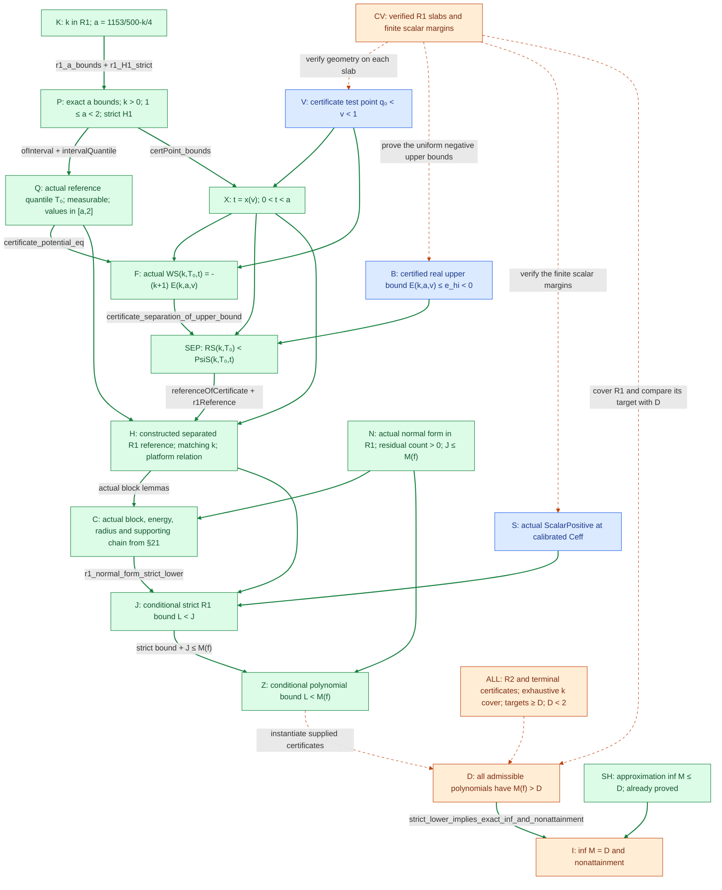
```mermaid
flowchart TD
  K["K: k in R1; a = 1153/500-k/4"]
  P["P: exact a bounds; k > 0; 1 ≤ a < 2; strict H1"]
  Q["Q: actual reference quantile T₀; measurable; values in [a,2]"]
  V["V: certificate test point q₀ < v < 1"]
  X["X: t = x(v); 0 < t < a"]
  F["F: actual WS(k,T₀,t) = -(k+1) E(k,a,v)"]
  B["B: certified real upper bound E(k,a,v) ≤ e_hi < 0"]
  SEP["SEP: RS(k,T₀) < PsiS(k,T₀,t)"]
  H["H: constructed separated R1 reference; matching k; platform relation"]
  N["N: actual normal form in R1; residual count > 0; J ≤ M(f)"]
  C["C: actual block, energy, radius and supporting chain from §21"]
  S["S: actual ScalarPositive at calibrated Ceff"]
  J["J: conditional strict R1 bound L < J"]
  Z["Z: conditional polynomial bound L < M(f)"]
  CV["CV: verified R1 slabs and finite scalar margins"]
  ALL["ALL: R2 and terminal certificates; exhaustive k cover; targets ≥ D; D < 2"]
  D["D: all admissible polynomials have M(f) > D"]
  SH["SH: approximation inf M ≤ D; already proved"]
  I["I: inf M = D and nonattainment"]
  K -->|r1_a_bounds + r1_H1_strict| P
  P -->|ofInterval + intervalQuantile| Q
  P -->|certPoint_bounds| X
  V --> X
  Q -->|certificate_potential_eq| F
  V --> F
  X --> F
  F -->|certificate_separation_of_upper_bound| SEP
  B --> SEP
  X --> SEP
  SEP -->|referenceOfCertificate + r1Reference| H
  Q --> H
  X --> H
  H -->|actual block lemmas| C
  N --> C
  C -->|r1_normal_form_strict_lower| J
  S --> J
  H --> J
  J -->|"strict bound + J ≤ M(f)"| Z
  N --> Z
  CV -. "verify geometry on each slab" .-> V
  CV -. "prove the uniform negative upper bounds" .-> B
  CV -. "verify the finite scalar margins" .-> S
  Z -. "instantiate supplied certificates" .-> D
  CV -. "cover R1 and compare its target with D" .-> D
  ALL -.-> D
  D -->|strict_lower_implies_exact_inf_and_nonattainment| I
  SH --> I
  classDef done fill:#dcfce7,stroke:#15803d,color:#14532d;
  classDef input fill:#dbeafe,stroke:#2563eb,color:#1e3a8a;
  classDef pending fill:#ffedd5,stroke:#c2410c,color:#7c2d12;
  class K,P,Q,X,F,SEP,H,N,C,J,Z,SH done;
  class V,B,S input;
  class CV,ALL,D,I pending;
  linkStyle 0,1,2,3,4,5,6,7,8,9,10,11,12,13,14,15,16,17,18,19,26,27 stroke:#15803d,stroke-width:2px;
  linkStyle 20,21,22,23,24,25 stroke:#c2410c,stroke-dasharray:5 5;
```

### Verification and next task

- [build.log](audit_cert_runs/reference-separation-20260930/build.log): `lake -q build LeanProject`, exit 0. At completion of §22 the root directly imported 95 modules and transitively imported all 114 project modules.
- [axiom_probes.lean](audit_cert_runs/reference-separation-20260930/axiom_probes.lean) and [axioms.out](audit_cert_runs/reference-separation-20260930/axioms.out): all **29 new proved declarations** checked; dependencies are contained in `{propext, Classical.choice, Quot.sound}`.
- [verification.json](audit_cert_runs/reference-separation-20260930/verification.json): source hashes, declaration locations, per-declaration axiom results, commands, counts and exact remaining scope. The scan of 115 project files excludes comments/strings and finds no proof gaps. It records the one harmless raw comment match separately.

The next work is to **prove the actual negative certificate bounds and connect the scalar certificates to the actual endpoint roots and slopes**. In particular, establish the remaining exterior branch/root and derivative identifications used by `v_±`, `σ_±`, `M₀`, `b_π` and `R_ξ`, then verify the R1 slab inequalities and finite scalar margins with a sound Lean certificate mechanism. R2/terminal certificates, exhaustive parameter coverage and comparisons with `D` remain. Python certificate suites were not rerun; their success is not used as a Lean premise. No unconditional `M(f)>D` or numerical enclosure is asserted by this update.

## 23. Completed exterior/endpoint dictionary and actual middle-R1 pilot certificates

This historical stage adds **72 proved declarations in four modules**. Section 24 supplies the scalar certificate that remained open at its completion. It follows Lemma 9.1 and Certificate 9.2 of the original proof. It closes actual numerical premises for a small slab within the recommended middle R1 interval. **It does not yet close `ScalarPositive` or prove an unconditional strict lower bound on that slab.**

| Module | Proved declarations | Role |
|---|---:|---|
| [CertificateExterior.lean](Lean/LeanProject/CertificateExterior.lean) | 12 | Both exterior branches, actual physical potential identity, point monotonicity and actual slope dictionary. |
| [CertificateEndpoints.lean](Lean/LeanProject/CertificateEndpoints.lean) | 18 | Actual endpoint uniqueness, identification of roots, rho/sigma parameters and width; sound sign-bracket/IVT interfaces. |
| [R1Pilot.lean](Lean/LeanProject/R1Pilot.lean) | 16 | Rational logarithm bounds, negative certificate throughout the pilot slab, actual reference and conditional strict lower bound. |
| [R1PilotRoots.lean](Lean/LeanProject/R1PilotRoots.lean) | 26 | Tight parameter bounds, 14 rational logarithm enclosures, four endpoint signs and actual root boxes throughout the slab. |

### Both exterior branches and their actual derivative

For `k>0`, `0<a<2`, `(H1)`, `qa(a)<v` and `v≠1`, the independently constructed interval quantile satisfies

\[
WS(k,T_0,x(v))=-(k+1)\mathfrak E(k,a,v).
\]

Unlike §22's certificate equality, this theorem includes the negative exterior branch `v>1`. Here `x(v)<0`; on `qa(a)<v<1`, `0<x(v)<a`. The atom `v=1`, corresponding to `x=0`, remains excluded from the finite-log identity. The map `v↦x(v)` is strictly decreasing on `(qa(a),∞)`.

`hasDerivAt_certE` and `certificate_slope_eq` prove

\[
\mathfrak E'(k,a,v)=\frac{k}{k+1}
\left(\frac1{v-qa(a)^2}+\frac1{1-v}\right)-\frac1v,
\qquad
kG_S(x(v))=
\frac{(k+1)\mathfrak E'(k,a,v)}{D_0(a)(1-qa(a)^2/v^2)}.
\]

The second equality follows by differentiating the actual potential and its proved certificate identity, then applying the chain rule. It is an equality with the previously defined physical derivative `k*Stage10.GS`, not a new surrogate derivative.

### Identification with the actual endpoints and coefficients

Let `R` be the reference constructed from a test point `v₀∈(qa(a),1)` with `E(v₀)<0`. A root `v₊∈(v₀,1)` satisfies `x(v₊)=Stage10.xpS`; a root `v₋>1` satisfies `x(v₋)=Stage10.xmS`. These are the existing series endpoints of `R.quantile`. Their uniqueness is proved from the existing physical potential sign statements to the left, inside and to the right of the main component.

The actual parameters are consequently

\[
\rho_\pm=\frac{qa(a)}{v_\pm},\qquad
\sigma_+=\frac{D_0(a)(1-qa(a)^2/v_+^2)}{(k+1)E'(v_+)},\qquad
\sigma_-=-\frac{D_0(a)(1-qa(a)^2/v_-^2)}{(k+1)E'(v_-)},
\]

and `referenceWidth R=x(v₊)−x(v₋)`. The derivative signs `E'(v₊)>0` and `E'(v₋)<0` follow from the actual endpoint slope signs. They are proved consequences, not additional numerical hypotheses. `certificate_plus_bracket` and `certificate_minus_bracket` construct these roots from opposite endpoint signs by continuity and the intermediate value theorem. Existing `totalXi_formula` and `bpi_eq`, together with the proved rho/sigma identities, supply the formulas needed for the remaining scalar enclosures.

### Actual numerical certificates throughout the pilot slab

The chosen slab and separator test point are exact rationals:

\[
K_{\rm pilot}=\left[\frac95,\frac{9001}{5000}\right]
=[1.8,1.8002],\qquad v_0=\frac9{25},\qquad
 a(k)=\frac{1153}{500}-\frac k4.
\]

The kernel proves for **every** `k∈Kpilot`

\[
\boxed{\mathfrak E(k,a(k),9/25)\le-1/250<0.}
\]

Thus `pilotReference` constructs the eligible reference throughout this slab with matching `k` and the platform relation. No negative numerical bound remains an input to this construction.

The tight parameter enclosures are

\[
1.927301\le D_0(a(k))\le1.927329,\quad
0.018678\le qa(a(k))\le0.018686,\quad
\frac9{14}\le\frac{k}{k+1}\le\frac{9001}{14001}.
\]

The four strict certificate signs are proved uniformly on the same slab:

| Point | Proved sign | Declaration |
|---|---|---|
| `2027/5000 = 0.4054` | `E<0` | `pilot_E_plus_lo` |
| `4057/10000 = 0.4057` | `E>0` | `pilot_E_plus_hi` |
| `131/100 = 1.31` | `E>0` | `pilot_E_minus_lo` |
| `6551/5000 = 1.3102` | `E<0` | `pilot_E_minus_hi` |

`pilot_positive_root_box` and `pilot_negative_root_box` therefore prove existence of the **actual** endpoint roots in `(0.4054,0.4057)` and `(1.31,1.3102)`, respectively, for every `k` in the slab.

All logarithm enclosures use the Mathlib-proved bound

\[
\left|\tfrac12\log\frac{1+t}{1-t}
-\sum_{i=0}^{n-1}\frac{t^{2i+1}}{2i+1}\right|
\le\frac{|t|^{2n+1}}{1-t^2},\qquad |t|<1.
\]

`log_bounds_of_series` transfers finite rational lower/upper checks to `Real.log`. The 14 endpoint-log enclosures use at most 23 terms. Their finite checks are discharged by `norm_num` in the kernel; no `native_decide`, Python sign test or checker-soundness axiom is used. The [candidate generator](audit_cert_runs/r1-pilot-20260930/generate_log_candidates.py) uses exact fractions to choose rational bounds; [log_candidates.json](audit_cert_runs/r1-pilot-20260930/log_candidates.json) records them. The generator's execution is not a proof premise. The complete generated inequalities are present and proved in `R1PilotRoots.lean`.

### Pilot dependency diagram at completion of §23

This is the historical status before §24. Green boxes and arrows are proved constructions/implications, blue boxes are then-remaining inputs, and orange marks then-missing proofs. Incoming arrows are joint premises. At this stage the conditional lower bound depended on the blue scalar premise; §24 discharges it on the same slab.


[Open SVG for zooming](proof_diagrams/dependency-stage-23.svg) · [Mermaid source](proof_diagrams/dependency-stage-23.mmd)

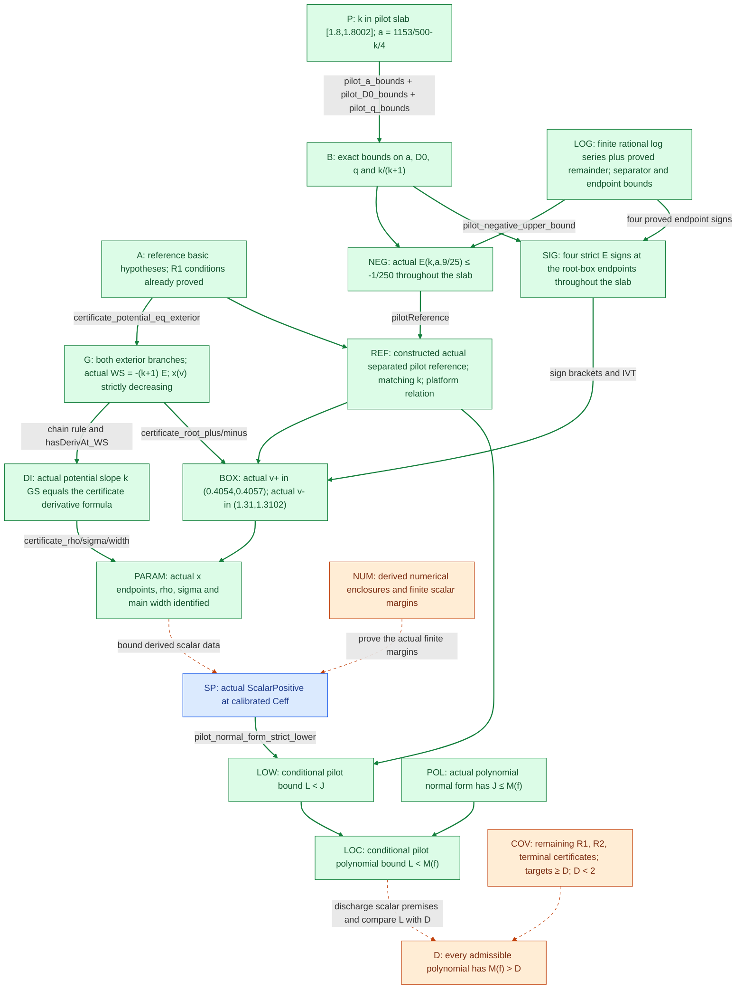
```mermaid
flowchart TD
  A["A: reference basic hypotheses; R1 conditions already proved"]
  G["G: both exterior branches; actual WS = -(k+1) E; x(v) strictly decreasing"]
  DI["DI: actual potential slope k GS equals the certificate derivative formula"]
  P["P: k in pilot slab [1.8,1.8002]; a = 1153/500-k/4"]
  B["B: exact bounds on a, D0, q and k/(k+1)"]
  LOG["LOG: finite rational log series plus proved remainder; separator and endpoint bounds"]
  NEG["NEG: actual E(k,a,9/25) ≤ -1/250 throughout the slab"]
  REF["REF: constructed actual separated pilot reference; matching k; platform relation"]
  SIG["SIG: four strict E signs at the root-box endpoints throughout the slab"]
  BOX["BOX: actual v+ in (0.4054,0.4057); actual v- in (1.31,1.3102)"]
  PARAM["PARAM: actual x endpoints, rho, sigma and main width identified"]
  NUM["NUM: derived numerical enclosures and finite scalar margins"]
  SP["SP: actual ScalarPositive at calibrated Ceff"]
  LOW["LOW: conditional pilot bound L < J"]
  POL["POL: actual polynomial normal form has J ≤ M(f)"]
  LOC["LOC: conditional pilot polynomial bound L < M(f)"]
  COV["COV: remaining R1, R2, terminal certificates; targets ≥ D; D < 2"]
  D["D: every admissible polynomial has M(f) > D"]
  A -->|certificate_potential_eq_exterior| G
  G -->|chain rule and hasDerivAt_WS| DI
  P -->|pilot_a_bounds + pilot_D0_bounds + pilot_q_bounds| B
  B --> NEG
  LOG -->|pilot_negative_upper_bound| NEG
  NEG -->|pilotReference| REF
  A --> REF
  B --> SIG
  LOG -->|four proved endpoint signs| SIG
  SIG -->|sign brackets and IVT| BOX
  REF --> BOX
  G -->|certificate_root_plus/minus| BOX
  BOX --> PARAM
  DI -->|certificate_rho/sigma/width| PARAM
  NUM -. "prove the actual finite margins" .-> SP
  PARAM -. "bound derived scalar data" .-> SP
  REF --> LOW
  SP -->|pilot_normal_form_strict_lower| LOW
  LOW --> LOC
  POL --> LOC
  LOC -. "discharge scalar premises and compare L with D" .-> D
  COV -.-> D
  classDef done fill:#dcfce7,stroke:#15803d,color:#14532d;
  classDef input fill:#dbeafe,stroke:#2563eb,color:#1e3a8a;
  classDef pending fill:#ffedd5,stroke:#c2410c,color:#7c2d12;
  class A,G,DI,P,B,LOG,NEG,REF,SIG,BOX,PARAM,LOW,POL,LOC done;
  class SP input;
  class NUM,COV,D pending;
  linkStyle 0,1,2,3,4,5,6,7,8,9,10,11,12,13,16,17,18,19 stroke:#15803d,stroke-width:2px;
  linkStyle 14,15,20,21 stroke:#c2410c,stroke-dasharray:5 5;
```

### Verification and next task

- [build.log](audit_cert_runs/r1-pilot-20260930/build.log): `lake -q build LeanProject`, exit 0. The root directly imports 96 modules and transitively covers all 118 project modules.
- [axiom_probes.lean](audit_cert_runs/r1-pilot-20260930/axiom_probes.lean) and [axioms.out](audit_cert_runs/r1-pilot-20260930/axioms.out): all 72 new proved declarations checked; dependencies are contained in `{propext, Classical.choice, Quot.sound}`.
- [verification.json](audit_cert_runs/r1-pilot-20260930/verification.json): source hashes, declaration locations, axiom results, commands, import counts, exact pilot bounds and remaining scope. The proof-source scan of 119 files excludes comments/strings and finds no proof gaps; the existing harmless raw comment match is recorded separately.

At completion of §23, the immediate next task was to **bound the derived sigma coefficients, bπ, Rξ, main width and calibrated Ceff, then certify the finite scalar margins on this same pilot slab**. Section 24 supplies these proofs. This will discharge the last numerical premise of `pilot_normal_form_strict_lower`. Only after that should this certificate be extended across the rest of middle R1, then the remaining R1 pieces, R2 and the terminal family. The full strict sharp polynomial lower bound and the numerical enclosure of `D` remain unproved. Existing Python certificate suites were not rerun in this update.

## 24. Completed actual scalar positivity and strict pilot target bound

Completed **1 October 2026**. This update adds **28 proved declarations in five modules**, imported by the root through `R1PilotScalar`. It follows the actual-reference/block route of §§21–23 and the original diagonal-energy-tail and finite-partition argument. All numerical premises of the pilot scalar predicate are now kernel proved.

| Module | Proved declarations | Role |
|---|---:|---|
| [ScalarIntervals.lean](Lean/LeanProject/ScalarIntervals.lean) | 6 | Sound widening, addition, subtraction, positive multiplication/division and squares. |
| [R1PilotData.lean](Lean/LeanProject/R1PilotData.lean) | 1 | Eight uniform data enclosures, proved by 64 rational arithmetic steps. |
| [R1PilotActual.lean](Lean/LeanProject/R1PilotActual.lean) | 4 | Actual endpoint choices, physical-data dictionary and transfer of the enclosures. |
| [ScalarPilotMargins.lean](Lean/LeanProject/ScalarPilotMargins.lean) | 5 | Proved log, diagonal-energy and sinc bounds; three-cell whole-rectangle certificate. |
| [R1PilotScalar.lean](Lean/LeanProject/R1PilotScalar.lean) | 12 | Actual rectangle/calibration bounds, uniform margin, scalar positivity and strict target bound. |

### Exact scope

Let
\[
K_{\rm pilot}=[9/5,9001/5000],\qquad
L_{\rm hi}=18344304757628/10^{13}=1.8344304757628.
\]
For every k∈Kpilot, `R=pilotReference hk` is the actual separated reference from §23. For every L≤Lhi, and **every**
\[
0<Q\le\pi/a_\pi,\qquad 0<V\le\pi R_\xi/b_\pi,
\]
`pilot_scalar_margin` proves
\[
\operatorname{rhs}(c_0,C_{\rm eff}(R,L),a_\pi,Q,V)>1/100.
\]
`pilot_scalar_positive` therefore supplies actual `ScalarPositive R (calibratedCeff R L)` without numerical hypotheses. `pilot_normal_form_lower` proves Lhi<J for every actual normal form with positive residual count and k∈Kpilot. `pilot_polynomial_lower` transfers this to Lhi<M(f) under the already established reduction relation J≤M(f).

This is a uniform theorem on one slab. The other parameter ranges and the comparison Lhi≥D are still open. No universal M(f)>D, exact infimum, nonattainment or Lean enclosure of D is asserted.

### Actual-data bounds and calibration

`pilotVp` and `pilotVm` choose the actual roots supplied by the whole-slab sign/IVT theorems. `pilot_reference_dictionary` identifies all certificate formulas with the actual rho/sigma coefficients, `bpi`, `totalXi`, `api`, `referenceWidth` and `refD0`. The numerical proof is applied only after this physical identification.

`pilot_actual_bounds` proves the following inclusions throughout the slab:

| Actual quantity | Certified interval |
|---|---|
| σ+ | [3.366, 3.428] |
| σ− | [0.2932, 0.2936] |
| bπ | [0.6379, 0.6501] |
| Rξ | [0.3333, 0.3398] |
| aπ | [1.066, 1.06605] |
| M0, physical reference width | [1.7417, 1.7428] |
| ρ+ | [0.04603, 0.0461] |
| ρ− | [0.01425, 0.01427] |

The [candidate generator](audit_cert_runs/r1-scalar-20261001/generate_rational_candidates.py) uses exact fractions and outward rational rounding to propose the 64 steps in [rational_candidates.json](audit_cert_runs/r1-scalar-20261001/rational_candidates.json). It is not trusted as a proof premise: each step is present in Lean, applies a proved enclosure lemma, and checks rational endpoints with `norm_num`.

For positive t±=4σ±ρ±/(1−ρ±²), the actual formulas give bπ=t++t− and Rξ=t+(1+ρ+)/2+t−(1+ρ−)/2. Thus 2Rξ≤1.0461bπ. This avoids the excessive width from dividing independent enclosures. The actual scalar bounds are
\[
Q_{\max}\le2.95,\quad R_{\max}\le1.645,\quad
c_0\ge-2.27,\quad C_{\rm eff}(R,L)\le-1.86,\quad
P=-\pi C_{\rm eff}/a_\pi\ge5.47.
\]
They hold for every L≤Lhi. The effective constant is calibrated with the **actual** reference width and auxiliary mass.

### Whole-rectangle scalar proof

At X=329/200, `scalar_h_R_bound` applies the existing `AE_tail` with N=4, bounds each sin² term by 1, and uses a proved lower log bound. It gives h(X)≥1/5. Monotonicity gives h(Rmax)≥1/5; existing nonnegativity gives h(Qmax)≥0. Hence
\[
B=c_0+h(Q_{\max})+h(R_{\max})\ge-2.07.
\]
The bound cos t≥1−t²/2 at t=X−π/2 proves sinc(X)≥3/5, and thus sinc(Rmax)≥3/5. For 0<x≤π, sin x=sin(π−x)≤π−x and π<22/7 give sinc(x)≤(22/7−x)/x.

The existing `rhs_ge_Lam`, `Lam_case1` and `Lam_case2` now prove positivity on three exact Q cells. The square is dropped in the first cell; the other two use V≤Rmax and the lower cell endpoint to bound the sinc difference. No monotonicity of the full scalar expression in Q is assumed.

| Q cell | Certified lower value | Comparison |
|---|---|---|
| (0,13/5] | −207/100+(547/100)/(13/5)=11/325 | >1/100 |
| (13/5,14/5] | −207/100+(547/100)/(14/5)+(3/5−19/91)²=60643/1656200 | >1/100 |
| (14/5,59/20] | −207/100+(547/100)/(59/20)+(3/5−6/49)²=174131/14165900 | >1/100 |

These cells cover all actual Q≤Qmax, with exact boundary handling. Their bounds certify every admissible Q,V, rather than samples. Log series have proved remainders; no externally trusted trigonometric or diagonal-energy table is used.

### Current pilot dependency diagram

Compared with §23, `NUM` and `SP` and their formerly missing incoming proofs are now green. `CAL`, `HC` and `MARG` expose calibration and the finite-margin argument. `LOW` no longer assumes a numerical certificate. `POL` includes the actual normal-form/reduction hypotheses; it does not assert that every polynomial has its ratio in the pilot slab. Incoming arrows require their premises together. The global coverage/comparison and final assembly remain orange.


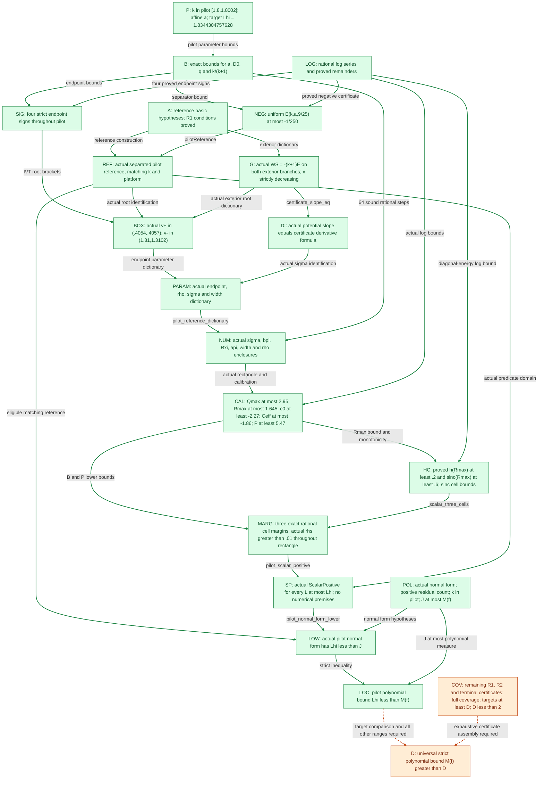
```mermaid
flowchart TD
  classDef done fill:#dcfce7,stroke:#15803d,color:#14532d
  classDef pending fill:#ffedd5,stroke:#c2410c,color:#7c2d12
  A["A: reference basic hypotheses; R1 conditions proved"]
  G["G: actual WS = -(k+1)E on both exterior branches; x strictly decreasing"]
  DI["DI: actual potential slope equals certificate derivative formula"]
  P["P: k in pilot [1.8,1.8002]; affine a; target Lhi = 1.8344304757628"]
  B["B: exact bounds for a, D0, q and k/(k+1)"]
  LOG["LOG: rational log series and proved remainders"]
  NEG["NEG: uniform E(k,a,9/25) at most -1/250"]
  REF["REF: actual separated pilot reference; matching k and platform"]
  SIG["SIG: four strict endpoint signs throughout pilot"]
  BOX["BOX: actual v+ in (.4054,.4057); v- in (1.31,1.3102)"]
  PARAM["PARAM: actual endpoint, rho, sigma and width dictionary"]
  NUM["NUM: actual sigma, bpi, Rxi, api, width and rho enclosures"]
  CAL["CAL: Qmax at most 2.95; Rmax at most 1.645; c0 at least -2.27; Ceff at most -1.86; P at least 5.47"]
  HC["HC: proved h(Rmax) at least .2 and sinc(Rmax) at least .6; sinc cell bounds"]
  MARG["MARG: three exact rational cell margins; actual rhs greater than .01 throughout rectangle"]
  SP["SP: actual ScalarPositive for every L at most Lhi; no numerical premises"]
  LOW["LOW: actual pilot normal form has Lhi less than J"]
  POL["POL: actual normal form; positive residual count; k in pilot; J at most M(f)"]
  LOC["LOC: pilot polynomial bound Lhi less than M(f)"]
  COV["COV: remaining R1, R2 and terminal certificates; full coverage; targets at least D; D less than 2"]
  D["D: universal strict polynomial bound M(f) greater than D"]
  A -->|exterior dictionary| G
  G -->|certificate_slope_eq| DI
  P -->|pilot parameter bounds| B
  B -->|separator bound| NEG
  LOG -->|proved negative certificate| NEG
  A -->|reference construction| REF
  NEG -->|pilotReference| REF
  B -->|endpoint bounds| SIG
  LOG -->|four proved endpoint signs| SIG
  SIG -->|IVT root brackets| BOX
  REF -->|actual root identification| BOX
  G -->|actual exterior root dictionary| BOX
  BOX -->|endpoint parameter dictionary| PARAM
  DI -->|actual sigma identification| PARAM
  PARAM -->|pilot_reference_dictionary| NUM
  B -->|64 sound rational steps| NUM
  NUM -->|actual rectangle and calibration| CAL
  LOG -->|actual log bounds| CAL
  CAL -->|Rmax bound and monotonicity| HC
  LOG -->|diagonal-energy log bound| HC
  CAL -->|B and P lower bounds| MARG
  HC -->|scalar_three_cells| MARG
  MARG -->|pilot_scalar_positive| SP
  REF -->|actual predicate domain| SP
  REF -->|eligible matching reference| LOW
  SP -->|pilot_normal_form_lower| LOW
  POL -->|normal form hypotheses| LOW
  LOW -->|strict inequality| LOC
  POL -->|J at most polynomial measure| LOC
  LOC -. "target comparison and all other ranges required" .-> D
  COV -. "exhaustive certificate assembly required" .-> D
  class A,G,DI,P,B,LOG,NEG,REF,SIG,BOX,PARAM,NUM,CAL,HC,MARG,SP,LOW,POL,LOC done
  class COV,D pending
  linkStyle 0,1,2,3,4,5,6,7,8,9,10,11,12,13,14,15,16,17,18,19,20,21,22,23,24,25,26,27,28 stroke:#15803d,stroke-width:2px
  linkStyle 29,30 stroke:#c2410c,stroke-width:2px,stroke-dasharray:6 4
```

### Verification and remaining scope

- [build.log](audit_cert_runs/r1-scalar-20261001/build.log): `lake -q build LeanProject`, exit 0. The root directly imports 97 modules and transitively covers all 123 project modules.
- [axiom_probes.lean](audit_cert_runs/r1-scalar-20261001/axiom_probes.lean) and [axioms.out](audit_cert_runs/r1-scalar-20261001/axioms.out): all 28 new proved declarations checked; only `{propext, Classical.choice, Quot.sound}` occur.
- [verification.json](audit_cert_runs/r1-scalar-20261001/verification.json): all 124 source hashes, declaration locations, import closure, commands, scalar constants and exact remaining scope. The proof-source scan excludes comments/strings and finds no `sorry`, `admit`, `native_decide` or explicit axiom declaration.

The next certificate work is extension across the rest of middle R1, then the other R1 pieces, R2 and terminal ranges. Full coverage, Lhi≥D, D<2 and final universal strict lower-bound assembly remain. The stronger interior moving-potential/PV and exact jump-equality statements remain unproved and unused by this route. The frozen registration package, original paper and certificate implementations were left unchanged; Python certificate suites were not rerun. Candidate generation only proposes proof data.

## 25. Target comparison with D and exhaustive parameter geometry (1 October 2026)

This update follows Certificate 5.5, the side checks of Certificate 9.2, and the final assembly of Theorem 10.1. It adds **45 proved declarations in three modules**. The target comparison and parameter geometry are now unconditional Lean results. Full COV and the universal sharp lower theorem still require the actual certificates outside the pilot. A proved conditional assembly does not discharge its premises.

| New module | Proved declarations | Scope |
|---|---:|---|
| [DWitnessData.lean](Lean/LeanProject/DWitnessData.lean) | 13 | Nine rational log enclosures; admissibility of the witness; an upper bound on its A; two strict root signs. |
| [DTargetComparison.lean](Lean/LeanProject/DTargetComparison.lean) | 8 | Actual-root width upper bound; D<Lhi<2; actual pilot scalar positivity and strict bounds at D. |
| [ParameterCoverage.lean](Lean/LeanProject/ParameterCoverage.lean) | 24 | Terminal admissibility and ratio identity; exact overlap; continuity/IVT coverage; complete interval partition; conditional universal/official assembly; unconditional official upper bound. |

### D comparison: a family member, with no minimizer assumption

Let qhat=257155/10^7. The proved rational logarithm bounds show qhat∈Qadm and A(qhat)≤4122608891691380449197/(5·10^21). At the exact rational points
\[
p_{-,\mathrm{lo}}=0.01804217778450589824,\qquad
p_{+,\mathrm{hi}}=0.05598500905032671180,
\]
Lean proves both G-values are strictly negative. These points are strictly within the appropriate branches (0,qhat) and (qhat,1).

`Lam_lt_of_outer_signs` uses the already-proved branch sign characterizations and root uniqueness to infer
\[
p_{-,\mathrm{lo}}<p_-<qhat<p_+<p_{+,\mathrm{hi}}<1.
\]
Since p+1/p is strictly decreasing on (0,1), the actual width satisfies
\[
\Lambda(qhat)
<\frac{2qhat}{(1+qhat)^2}
\left(p_{-,\mathrm{lo}}+\frac1{p_{-,\mathrm{lo}}}
-p_{+,\mathrm{hi}}-\frac1{p_{+,\mathrm{hi}}}\right)
<L_{\rm hi}=\frac{18344304757628}{10^{13}}.
\]
The last inequality is an exact rational check. Finally, the definition of D gives
\[
\boxed{D\le\Lambda(qhat)<L_{\rm hi}<2.}
\]
The witness is not asserted to minimize Λ. The finite log series, range reduction by powers of 2, remainder bounds, sign inequalities and width comparison are all kernel checked. The [candidate generator](audit_cert_runs/d-coverage-20261001/generate_witness.py) proposes data in [witness_candidates.json](audit_cert_runs/d-coverage-20261001/witness_candidates.json); its correctness is not a Lean premise.

Consequences: the §24 pilot certificate is now proved at L=D; for every eligible pilot normal form D<J, and under the proved reduction hypothesis J≤M(f), D<M(f). The official infimum is also strictly below Lhi, and an admissible polynomial with measure below Lhi exists. **Only the upper numerical endpoint for D is proved here; the lower endpoint 1.8344304757≤D remains unformalized.**

### COV geometry: the terminal family actually covers the unbounded range

For q∈(0,21/500], define
\[
k(q)=\frac{-\log q}{\log(2/(1+q)^2)}-1.
\]
Lean proves log(D0q q)>0, k(q)>0, k/(k+1)=A(q), and A(q)(1+q)<1−q. The strict decrease of f together with the certified f(21/500)>0 proves **every** q in this interval is admissible. Consequently Λ(q)≥D throughout it.

The endpoint comparison is certified by exact logarithm bounds:
\[
4.18951734\le k(21/500)\le4.18951735<4.2.
\]
`terminal_parameter_exists` uses continuity and the intermediate value theorem. Since −log q→∞ as q↓0, while log(D0q q)≤log 2, a sufficiently small positive q gives k(q)>any prescribed k≥k(21/500). IVT on a compact positive-q interval supplies equality. **The point q=0 is never included in the reference domain.** Thus every finite k≥4.2 has an actual admissible terminal parameter.

The combined `remaining_ratio_family_cover` proves that each k>29/20 lies in R1=[36/25,21/10], R2=[21/10,21/5], or is represented by an admissible terminal q. Equality endpoints are included, and the small-ratio/R1 and R2/terminal overlaps are exact. This closes the coverage geometry, rather than merely asserting that the listed ranges appear to meet.

### The four remaining actual certificate statements

`RatioCertified k` means: an actual separated reference R exists, its mass ratio equals k, it satisfies the platform relation, and its actual `ScalarPositive` predicate holds at calibrated L=D. Its pilot instance is already proved.

| Remaining statement | Exact domain | Current status |
|---|---|---|
| C1: every ratio on the left pilot complement is `RatioCertified` | [36/25,9/5) | Unproved actual certificates |
| C2: every ratio on the right pilot complement is `RatioCertified` | (9001/5000,21/10] | Unproved actual certificates |
| C3: every R2 ratio is `RatioCertified` | [21/10,21/5] | Unproved actual certificates |
| C4: `RatioCertified (terminalK q)` for every terminal q | (0,21/500] | Unproved actual reference/scalar certificate |

The terminal results above do not yet construct its actual separated reference or identify its `referenceWidth` with Λ(q); that physical dictionary and the scalar margin are parts of C4. For R1/R2, a scalar certificate uniform for L≤Lhi automatically applies at D by the now-proved comparison.

`all_ratios_certified_of_remaining` combines C1–C4 with the proved pilot and geometry. `universal_gt_D_of_ratio_certificates` then applies the existing polynomial certificate reduction; its M(f)≥2 branch is now discharged by D<2. `official_strict_lower_of_ratio_certificates` transfers the strict inequality to the official polynomial class and ENNReal measure. Finally, `exact_infimum_and_nonattainment_of_remaining` combines it with the already-proved approximation direction. **Every one of these implications is proved, but C1–C4 remain hypotheses. The universal conclusion is not yet proved without them.**

### Current dependency diagram

Boxes are statements. Green boxes are proved; orange boxes are remaining statements. Green arrows are proved implications, including conditional implications whose input boxes remain orange. All inputs to the conjunction box are required together. Dashed orange arrows denote missing certificate proofs.


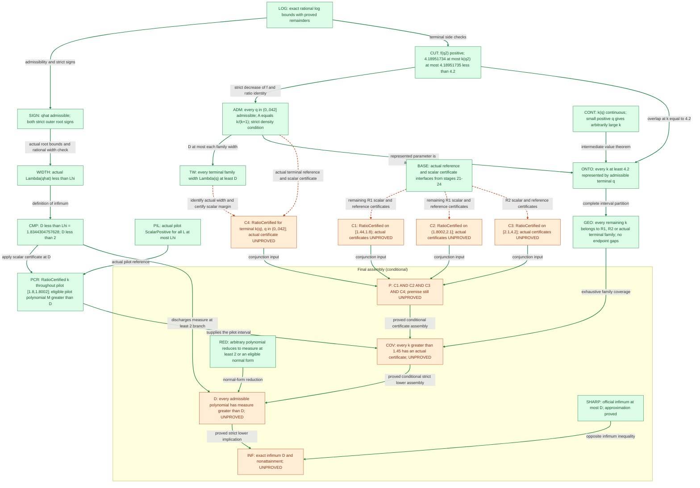
```mermaid
flowchart TD
  classDef done fill:#dcfce7,stroke:#15803d,color:#14532d
  classDef pending fill:#ffedd5,stroke:#c2410c,color:#7c2d12
  LOG["LOG: exact rational log bounds with proved remainders"]
  SIGN["SIGN: qhat admissible; both strict outer root signs"]
  WIDTH["WIDTH: actual Lambda(qhat) less than Lhi"]
  CMP["CMP: D less than Lhi = 1.8344304757628; D less than 2"]
  PIL["PIL: actual pilot ScalarPositive for all L at most Lhi"]
  PCR["PCR: RatioCertified k throughout pilot [1.8,1.8002]; eligible pilot polynomial M greater than D"]
  CUT["CUT: f(q2) positive; 4.18951734 at most k(q2) at most 4.18951735 less than 4.2"]
  ADM["ADM: every q in (0,.042] admissible; A equals k/(k+1); strict density condition"]
  TW["TW: every terminal family width Lambda(q) at least D"]
  CONT["CONT: k(q) continuous; small positive q gives arbitrarily large k"]
  ONTO["ONTO: every k at least 4.2 represented by admissible terminal q"]
  GEO["GEO: every remaining k belongs to R1, R2 or actual terminal family; no endpoint gaps"]
  BASE["BASE: actual reference and scalar certificate interfaces from stages 21-24"]
  C1["C1: RatioCertified on [1.44,1.8); actual certificates UNPROVED"]
  C2["C2: RatioCertified on (1.8002,2.1]; actual certificates UNPROVED"]
  C3["C3: RatioCertified on [2.1,4.2]; actual certificates UNPROVED"]
  C4["C4: RatioCertified for terminal k(q), q in (0,.042]; actual certificate UNPROVED"]
  subgraph FINAL["Final assembly (conditional)"]
  direction TB
  ALL["P: C1 AND C2 AND C3 AND C4; premise still UNPROVED"]
  COV["COV: every k greater than 1.45 has an actual certificate; UNPROVED"]
  RED["RED: arbitrary polynomial reduces to measure at least 2 or an eligible normal form"]
  D["D: every admissible polynomial has measure greater than D; UNPROVED"]
  SHARP["SHARP: official infimum at most D; approximation proved"]
  INF["INF: exact infimum D and nonattainment; UNPROVED"]
  end
  LOG -->|admissibility and strict signs| SIGN
  SIGN -->|actual root bounds and rational width check| WIDTH
  WIDTH -->|definition of infimum| CMP
  PIL -->|actual pilot reference| PCR
  CMP -->|apply scalar certificate at D| PCR
  LOG -->|terminal side checks| CUT
  CUT -->|strict decrease of f and ratio identity| ADM
  ADM -->|D at most each family width| TW
  CUT -->|overlap at k equal to 4.2| ONTO
  CONT -->|intermediate value theorem| ONTO
  ADM -->|represented parameter is admissible| ONTO
  ONTO -->|complete interval partition| GEO
  BASE -. "remaining R1 scalar and reference certificates" .-> C1
  BASE -. "remaining R1 scalar and reference certificates" .-> C2
  BASE -. "R2 scalar and reference certificates" .-> C3
  ADM -. "actual terminal reference and scalar certificate" .-> C4
  TW -. "identify actual width and certify scalar margin" .-> C4
  C1 -->|conjunction input| ALL
  C2 -->|conjunction input| ALL
  C3 -->|conjunction input| ALL
  C4 -->|conjunction input| ALL
  ALL -->|proved conditional certificate assembly| COV
  PCR -->|supplies the pilot interval| COV
  GEO -->|exhaustive family coverage| COV
  COV -->|proved conditional strict lower assembly| D
  RED -->|normal-form reduction| D
  CMP -->|discharges measure at least 2 branch| D
  D -->|proved strict lower implication| INF
  SHARP -->|opposite infimum inequality| INF
  class LOG,SIGN,WIDTH,CMP,PIL,PCR,CUT,ADM,TW,CONT,ONTO,GEO,BASE,RED,SHARP done
  class C1,C2,C3,C4,ALL,COV,D,INF pending
  linkStyle 0,1,2,3,4,5,6,7,8,9,10,11,17,18,19,20,21,22,23,24,25,26,27,28 stroke:#15803d,stroke-width:2px
  linkStyle 12,13,14,15,16 stroke:#c2410c,stroke-width:2px,stroke-dasharray:6 4
```

### Verification and remaining scope

- [build.log](audit_cert_runs/d-coverage-20261001/build.log): `lake -q build LeanProject`, exit 0; all 126 project modules are in the root import closure.
- [axiom_probes.lean](audit_cert_runs/d-coverage-20261001/axiom_probes.lean) and [axioms.out](audit_cert_runs/d-coverage-20261001/axioms.out): every one of the 45 new proved declarations checked; only the standard logical axioms `{propext, Classical.choice, Quot.sound}` occur.
- [verification.json](audit_cert_runs/d-coverage-20261001/verification.json): source hashes, declarations, commands, exact witness data and remaining domains. The proof-source scan finds no `sorry`, `admit`, `native_decide` or explicit axiom declaration, excluding comments/strings. All 123 previous module sources are unchanged; only the old root's import list was extended.

The remaining work is C1–C4: actual certificates on the two R1 complement intervals, R2 and terminal. The geometric cover, target comparison, D<2, pilot M>D and all conditional final implications are now proved. The numerical lower endpoint for D and the stronger interior moving-potential/PV and exact jump-equality statements remain unproved; the latter are unused by this route. Frozen registration files, the original paper and the Python certificate implementations were left unchanged. The candidate generator used their arithmetic to propose data; their certificate suites were not used as trusted premises or rerun as verification of the new Lean proof.

## 26. All four actual COV certificates and unconditional sharp lower theorem (1 October 2026)

**C1–C4 are now proved, and the final conclusions have no remaining certificate premises.** The root build and fresh axiom checks verify `COV`, the universal strict inequality \(M(f)>D\), the exact official infimum \(D\), and nonattainment for the stated admissible polynomial class. This update adds **77 proof modules and 3,445 proved declarations**, mostly generated exact numerical lemmas. All generated candidates are checked by Lean; neither a Python PASS result nor an external interval computation is assumed as a theorem.

### Actual statements discharged

| Obligation | Entire exact domain | Unconditional Lean declaration |
|---|---|---|
| C1 | \([36/25,9/5)\) | `cov_left_certified` |
| C2 | \((9001/5000,21/10]\) | `cov_right_certified` |
| C3 | \([21/10,21/5]\) | `r2_full_certified` |
| C4 | terminal \(q\in(0,21/500]\) | `terminal_full_certified` |

All four declarations are in [CompleteCoverage.lean](Lean/LeanProject/CompleteCoverage.lean). They assert the actual `RatioCertified` existential: a separated reference with the correct ratio and platform relation, and its actual scalar predicate at calibrated \(L=D\). They do not accept numerical certificates as input assumptions.

### Step 1: kernel-checked arithmetic and actual-reference dictionary

[CertificateArithmetic.lean](Lean/LeanProject/CertificateArithmetic.lean) proves signed interval arithmetic, square-root/log enclosure transfer, scalar cell inequalities and a bound on the actual R rectangle. [ArcNumerical.lean](Lean/LeanProject/ArcNumerical.lean) proves periodic trigonometric reductions, sine/cosine polynomial bounds and finite diagonal-energy bounds. Rational logarithms use the previously proved finite series and explicit remainder, with exact reduction by powers of two. There are 2,679 rational log endpoint bounds and 67 finite-energy point bounds in the generated cover.

[CertificateFormula.lean](Lean/LeanProject/CertificateFormula.lean) identifies the numerical expressions with the constructed reference. Write \(A=k/(k+1)\), \(q=\mathrm{qa}(a)\), \(d=\mathrm{D0a}(a)\), and let \(v_+<1<v_-\) be the certified exterior roots. The exact dictionary proves
\[
 w_+=\frac1{v_+E'(v_+)},\quad w_-=\frac1{-v_-E'(v_-)},\quad
 a_\pi=1+\frac{2kq}{1+q},
\]
\[
 M_0=d(v_--v_+)\left(1-\frac{q^2}{v_+v_-}\right),\qquad
 R_\xi=\frac{2dq}{k+1}\left[(1+q/v_+)w_++(1+q/v_-)w_-\right],
\]
\[
 c_0=\log\frac{k+1}{2a_\pi(w_++w_-)},\qquad
 C_{\rm eff}=\log(dq)+k\log d+\frac{L-M_0}{R_\xi}.
\]
The actual rectangle is contained in
\[
 0<Q\le\pi/a_\pi,\qquad 0<V\le\frac\pi2(1+q/v_+).
\]
This containment follows from the positive actual sigma/rho coefficients; the proxy rectangle is never substituted without a proved inequality.

### Step 2: complete R1 and R2 certificates

The [finite-cover manifest](audit_cert_runs/cov-full-20261001/finite-cover-manifest.json) records **102 R1 slabs** covering \([1.44,2.1]\), and **49 R2 slabs** covering \([2.1,4.2]\). Each slab has four strict endpoint signs
\[
 E(v_{+,\rm lo})<0<E(v_{+,\rm hi}),\qquad
 E(v_{-,\rm lo})>0>E(v_{-,\rm hi}).
\]
The negative positive-branch endpoint supplies the actual separator. Continuity/IVT constructs the roots; the existing exterior dictionary connects them to the reference. Basic reference hypotheses are derived from the exact R1/R2 parameter bounds.

The generated scalar proof bounds
\[
 \mathcal B=c_0+h(Q_{\max})+h(V_{\max}),\quad
 P=-\pi C_{\rm eff}/a_\pi\ge0,
\]
then checks finitely many rational Q cells. The proved cell lemmas give a positive lower bound using \(\mathcal B+P/Q\), augmented where needed by a certified lower bound on \((\operatorname{sinc}Q-\operatorname{sinc}V)^2\). Every cell endpoint, margin, logarithm and trigonometric estimate is checked in Lean. The row target is \(L_{\rm hi}\); the already-proved \(D<L_{\rm hi}\) and scalar monotonicity apply the actual certificate at D.

`cover_join` assembles the slabs with exact shared endpoints. Thus `r1_full_certified` and `r2_full_certified` hold on the whole closed ranges, from which C1 and C2 follow by restriction. The existing pilot is also available for the earlier four-premise assembly.

### Step 3: actual terminal width and zero platform

[TerminalGeometry.lean](Lean/LeanProject/TerminalGeometry.lean) proves, for every \(q\in(0,.042]\),
\[
 a(q)=2\left(\frac{1-q}{1+q}\right)^2,\quad
 \mathrm{qa}(a(q))=q,\quad \mathrm{D0a}(a(q))=\frac2{(1+q)^2},
\]
with the actual density hypothesis and matching ratio \(k(q)\). It proves the exact zero-platform identity
\[
 \log(dq)+k(q)\log d=0.
\]
The substitution \(p=q/v\) identifies each exterior certificate root with a Stage 9 root. The proved branch sign characterizations establish uniqueness, so the two independently constructed root pairs agree. Consequently the actual reference width is **exactly** \(M_0=\Lambda(q)\). Since q is admissible, the definition of D gives \(M_0\ge D\), and the positive actual \(R_\xi\) gives \(C_{\rm eff}(D)\le0\). This argument uses the family infimum, not the desired polynomial lower bound.

### Step 4: all positive terminal parameters, including the unbounded-k tail

For \(q\in[.01,.042]\), five closed slabs cover the whole remaining interval:
\[
 [.01,.026],\ [.026,.034],\ [.034,.038],\ [.038,.04],\ [.04,.042].
\]
Their certified scalar \(\mathcal B\) lower bounds are respectively
\[
 .06462659,\ .06527417,\ .06203773,\ .06382845,\ .01990158,
\]
all strictly positive at \(C_{\rm eff}=0\). Monotonicity applies them at the actual nonpositive calibrated constant.

[TerminalTail.lean](Lean/LeanProject/TerminalTail.lean) and [COVTerminalTail.lean](Lean/LeanProject/COVTerminalTail.lean) prove a uniform analytic certificate for **every** \(0<q\le.01\), without bounding k above or including q=0 as a reference. They prove
\[
 k+1\ge6.6,\quad .849\le A\le1,\quad a_\pi\le1.54,
\]
and the uniform actual-root boxes
\[
 .47<v_+<.52,\qquad1.39<v_-<1.52.
\]
Exact rational arithmetic gives \(0<w_++w_-\le2.1\). Hence
\[
 \frac{k+1}{2a_\pi(w_++w_-)}>1,\qquad c_0>0.
\]
Both rectangle variables are at most \(\pi\), so their h-values and the square-series term are nonnegative. Thus the entire scalar expression is strictly positive at zero effective constant, and also at the actual \(C_{\rm eff}(D)\le0\). Tail and compact certificates meet at q=.01 and cover all of C4.

### Step 5: unconditional COV, strict lower bound, infimum and nonattainment

The complete family geometry and C1–C4 now establish
\[
 \texttt{COV}:\quad \forall k>29/20,\ \texttt{RatioCertified}(k).
\]
`universal_strict_lower` applies this result to the already-proved polynomial reduction. The measure-at-least-2 branch uses D<2; the remaining branch uses the matching actual reference and strict block inequality. Therefore
\[
 \boxed{\forall f\text{ admissible},\quad M(f)>D.}
\]
`universal_lower` and `lower_nonattainment` give \(M(f)\ge D\) and \(M(f)\ne D\). `official_strict_lower` transfers the strict statement to the official class and ENNReal measure. Finally `exact_infimum_and_nonattainment` combines it with the already-proved approximation direction:
\[
 \boxed{\inf_f M(f)=D,\qquad\forall f\text{ admissible},\ M(f)\ne D.}
\]
All these are actual declarations with no unproved COV, scalar, reference-separation or numerical-sign hypotheses. The intended reference/energy/finite-partition proof route is preserved; the stronger unused PV derivative and exact jump-equality statements are not substituted as assumptions.

### Dependency diagram at COV completion (condensed view)

Green boxes are proved statements; green arrows are proved implications. The orange box and dashed orange arrow show the separate numerical lower-endpoint obligation, which this COV completion does not discharge. C1–C4, COV, the universal strict theorem and exact infimum/nonattainment are all green.


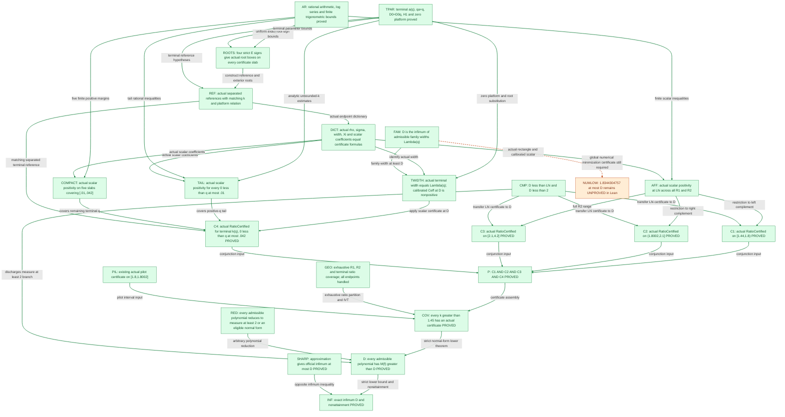
```mermaid
flowchart TD
  classDef done fill:#dcfce7,stroke:#15803d,color:#14532d
  classDef pending fill:#ffedd5,stroke:#c2410c,color:#7c2d12
  AR["AR: rational arithmetic, log series and finite trigonometric bounds proved"]
  ROOTS["ROOTS: four strict E signs give actual root boxes on every certificate slab"]
  REF["REF: actual separated references with matching k and platform relation"]
  DICT["DICT: actual rho, sigma, width, Xi and scalar coefficients equal certificate formulas"]
  AFF["AFF: actual scalar positivity at Lhi across all R1 and R2"]
  CMP["CMP: D less than Lhi and D less than 2"]
  C1["C1: actual RatioCertified on [1.44,1.8) PROVED"]
  C2["C2: actual RatioCertified on (1.8002,2.1] PROVED"]
  C3["C3: actual RatioCertified on [2.1,4.2] PROVED"]
  TPAR["TPAR: terminal a(q), qa=q, D0=D0q, H1 and zero platform proved"]
  FAM["FAM: D is the infimum of admissible family widths Lambda(q)"]
  TWIDTH["TWIDTH: actual terminal width equals Lambda(q); calibrated Ceff at D is nonpositive"]
  TAIL["TAIL: actual scalar positivity for every 0 less than q at most .01"]
  COMPACT["COMPACT: actual scalar positivity on five slabs covering [.01,.042]"]
  C4["C4: actual RatioCertified for terminal k(q), 0 less than q at most .042 PROVED"]
  GEO["GEO: exhaustive R1, R2 and terminal ratio coverage; all endpoints handled"]
  PIL["PIL: existing actual pilot certificate on [1.8,1.8002]"]
  ALL["P: C1 AND C2 AND C3 AND C4 PROVED"]
  COV["COV: every k greater than 1.45 has an actual certificate PROVED"]
  RED["RED: every admissible polynomial reduces to measure at least 2 or an eligible normal form"]
  D["D: every admissible polynomial has M(f) greater than D PROVED"]
  SHARP["SHARP: approximation gives official infimum at most D PROVED"]
  INF["INF: exact infimum D and nonattainment PROVED"]
  NUMLOW["NUMLOW: 1.8344304757 at most D remains UNPROVED in Lean"]
  AR -->|uniform exact root-sign bounds| ROOTS
  AR -->|finite scalar inequalities| AFF
  ROOTS -->|construct reference and exterior roots| REF
  REF -->|actual endpoint dictionary| DICT
  DICT -->|actual rectangle and calibrated scalar| AFF
  AFF -->|restriction to left complement| C1
  AFF -->|restriction to right complement| C2
  AFF -->|full R2 range| C3
  CMP -->|transfer Lhi certificate to D| C1
  CMP -->|transfer Lhi certificate to D| C2
  CMP -->|transfer Lhi certificate to D| C3
  TPAR -->|terminal reference hypotheses| REF
  TPAR -->|terminal parameter bounds| ROOTS
  TPAR -->|zero platform and root substitution| TWIDTH
  DICT -->|identify actual width| TWIDTH
  FAM -->|family width at least D| TWIDTH
  TPAR -->|analytic unbounded-k estimates| TAIL
  AR -->|tail rational inequalities| TAIL
  AR -->|five finite positive margins| COMPACT
  DICT -->|actual scalar coefficients| TAIL
  DICT -->|actual scalar coefficients| COMPACT
  TWIDTH -->|apply scalar certificate at D| C4
  TAIL -->|covers positive-q tail| C4
  COMPACT -->|covers remaining terminal q| C4
  REF -->|matching separated terminal reference| C4
  C1 -->|conjunction input| ALL
  C2 -->|conjunction input| ALL
  C3 -->|conjunction input| ALL
  C4 -->|conjunction input| ALL
  ALL -->|certificate assembly| COV
  GEO -->|exhaustive ratio partition and IVT| COV
  PIL -->|pilot interval input| COV
  COV -->|strict normal-form lower theorem| D
  RED -->|arbitrary polynomial reduction| D
  CMP -->|discharges measure at least 2 branch| D
  D -->|strict lower bound and nonattainment| INF
  SHARP -->|opposite infimum inequality| INF
  FAM -. "global numerical minimization certificate still required" .-> NUMLOW
  class AR,ROOTS,REF,DICT,AFF,CMP,C1,C2,C3,TPAR,FAM,TWIDTH,TAIL,COMPACT,C4,GEO,PIL,ALL,COV,RED,D,SHARP,INF done
  class NUMLOW pending
  linkStyle 0,1,2,3,4,5,6,7,8,9,10,11,12,13,14,15,16,17,18,19,20,21,22,23,24,25,26,27,28,29,30,31,32,33,34,35,36 stroke:#15803d,stroke-width:2px
  linkStyle 37 stroke:#c2410c,stroke-width:2px,stroke-dasharray:6 4
```

### Verification and exact remaining scope

- [Root build log](audit_cert_runs/cov-full-20261001/build.log): `lake -q --log-level=error build LeanProject`, exit 0. The root directly imports 99 modules and its closure covers all **203 modules of this proof route**.
- [Axiom probes](audit_cert_runs/cov-full-20261001/axiom_probes.lean) and [axiom output](audit_cert_runs/cov-full-20261001/axioms.out): all **3,445 new proved declarations** checked; their dependencies are contained in `{propext, Classical.choice, Quot.sound}`.
- [Verification record](audit_cert_runs/cov-full-20261001/verification.json): exact source hashes, declaration locations, import closure, 156 finite certificate slabs, remaining scope and the four-hour deadline. The proof-source scan, excluding comments and strings, finds no `sorry`, `admit`, `native_decide` or explicit axiom declarations.
- The original 126 validated proof-module sources were preserved. Only their root import list was extended. Ten separate side-session modules are outside this entry point; their hashes and concurrent changes are recorded separately, and this work does not edit them. Frozen registration artifacts, the original paper and the external certificate implementations were not edited by this work.

**Remaining:** the independent numerical lower endpoint \(1.8344304757\le D\), hence the full two-sided numerical enclosure, is still not Lean proved. The stronger interior moving-potential/PV and exact jump adjoint equality statements remain unproved and unused by this completed inequality route. They are not missing premises of the final theorem. The numerical upper endpoint \(D<1.8344304757628\) remains proved.


## 27. Expanded remaining obligations and proof dependencies (1 October 2026)

This section corrects a presentation omission, without changing the mathematical or Lean status. The stage-26 diagram compressed the global numerical lower-bound route into one `NUMLOW` box and omitted the two stronger unused auxiliary claims. Consequently it did not display the eight items in the remaining-work list. The following diagrams make each item and its proof dependencies explicit.

Green rectangles are proved statements under their declared hypotheses. Green arrows are proved dependencies. Orange rectangles are the intended statements still awaiting a Lean proof; dashed orange arrows are proof steps not yet supplied. At a statement with several incoming arrows, all the shown inputs are used together; an individual incoming arrow is not a claim that its source alone implies the entire target. This convention also applies to the preserved stage-26 graph.

The following table records the historical stage-27 remaining-work list. Item 1 is completed in §28, and items 7 and 8 are completed in §29; numerical items 2–6 remain open:

| Number | Pending statement or proof obligation | Inputs |
|---|---|---|
| 1 | Every admissible q lies in T, M or S; exact subinterval endpoints and exhaustive leaf coverage | Existing admissibility characterization; exact endpoint certificates |
| 2 | Λ(q) ≥ L for admissible q in T or S | Actual root/width formula; uniform E signs; exact numerical inequalities; leaf coverage |
| 3 | Actual middle-region roots are C², Eᵥ ≠ 0, and the implicit derivatives compute actual Λ′ and Λ″ | Existing actual root existence, uniqueness and width formula |
| 4 | Λ(q) ≥ L in M, using rigorous second-order Taylor bounds on every slab | 3; actual midpoint values and derivatives; interval second-derivative and remainder bounds; leaf coverage |
| 5 | For every q ∈ Qadm, Λ(q) ≥ L | 1, 2 and 4 |
| 6 | L ≤ D < U, where L=1.8344304757 and U=1.8344304757628 | 5; D=inf Λ(Qadm); already-proved D<U |
| 7 | The actual material derivative of the moving logarithmic potential equals the existing static g and the stated spatial/angular PV expression | Static material dictionary; singular differentiation and PV-limit justification |
| 8 | Exact jump adjoint equality Ṁ−∫g dξ=−ΓF(2), with the original derivative/PV interpretation | Exact XLip identity; regularization convergence retaining the endpoint term; finite-jump assembly; 7 for the original interpretation of g |

The T/M/S regions refer to the independent `cert/cert3/dlower3.py` numerical-D route, covering the **whole** admissible family. They are not the COV terminal cover 0<q≤.042. Approximate printed endpoints are not exact boundaries; the certificate's dyadic or rational endpoints and q=exp(−1/ρ) change of variable must be justified. Existing generic root/log/arithmetic lemmas can be reused; these orange boxes do not assert that every generic helper needs to be reproved. The final infimum-transfer and conjunction steps are routine, but the specialized numerical lower-bound declarations have not been supplied.

Items 7 and 8 are stronger original-paper auxiliary claims. The completed lower-bound proof uses the static material dictionary and an endpoint-corrected **inequality** obtained from Fatou. Neither 7 nor 8 is a missing hypothesis of `CompleteCoverage.universal_strict_lower` or `exact_infimum_and_nonattainment`. The numerical lower enclosure is likewise a separate conclusion: the exact symbolic infimum and nonattainment do not depend on item 6.

### Full graph, preserving the completed route

All 23 completed statement boxes and all 37 completed dependency arrows from stage 26 are retained. The old single `NUMLOW` box and arrow are replaced by the detailed numerical branch. The optional auxiliary branch includes its existing proved inputs and the stronger pending claims.



```mermaid
flowchart TD
  classDef done fill:#dcfce7,stroke:#15803d,color:#14532d
  classDef pending fill:#ffedd5,stroke:#c2410c,color:#7c2d12
  subgraph CORE["완료된 핵심 증명: 모든 기존 의존관계 유지"]
  AR["AR: rational arithmetic, log series and finite trigonometric bounds proved"]
  ROOTS["ROOTS: four strict E signs give actual root boxes on every certificate slab"]
  REF["REF: actual separated references with matching k and platform relation"]
  DICT["DICT: actual rho, sigma, width, Xi and scalar coefficients equal certificate formulas"]
  AFF["AFF: actual scalar positivity at Lhi across all R1 and R2"]
  CMP["CMP: D less than Lhi and D less than 2"]
  C1["C1: actual RatioCertified on [1.44,1.8) PROVED"]
  C2["C2: actual RatioCertified on (1.8002,2.1] PROVED"]
  C3["C3: actual RatioCertified on [2.1,4.2] PROVED"]
  TPAR["TPAR: terminal a(q), qa=q, D0=D0q, H1 and zero platform proved"]
  FAM["FAM: D is the infimum of admissible family widths Lambda(q)"]
  TWIDTH["TWIDTH: actual terminal width equals Lambda(q); calibrated Ceff at D is nonpositive"]
  TAIL["TAIL: actual scalar positivity for every 0 less than q at most .01"]
  COMPACT["COMPACT: actual scalar positivity on five slabs covering [.01,.042]"]
  C4["C4: actual RatioCertified for terminal k(q), 0 less than q at most .042 PROVED"]
  GEO["GEO: exhaustive R1, R2 and terminal ratio coverage; all endpoints handled"]
  PIL["PIL: existing actual pilot certificate on [1.8,1.8002]"]
  ALL["P: C1 AND C2 AND C3 AND C4 PROVED"]
  COV["COV: every k greater than 1.45 has an actual certificate PROVED"]
  RED["RED: every admissible polynomial reduces to measure at least 2 or an eligible normal form"]
  D["D: every admissible polynomial has M(f) greater than D PROVED"]
  SHARP["SHARP: approximation gives official infimum at most D PROVED"]
  INF["INF: exact infimum D and nonattainment PROVED"]
  end
  subgraph NUM["남은 수치 인증: 앞선 목록의 1–6번"]

  NQ["기존 전제: admissible q 범위의 특성화<br/>실제 근의 존재·유일성 및 Λ(q)의 폭 공식"]
  N1["1. 전체 매개변수 범위 덮개<br/>Qadm ⊆ T ∪ M ∪ S<br/>각 세부 구간의 끝점·빈틈 검증 · 미완료"]
  N2["2. 양쪽 T·S 구간의 실제 폭 하한<br/>q ∈ Qadm ∩ (T ∪ S) ⇒ L ≤ Λ(q)<br/>근의 부호 경계·로그 수치 인증 · 미완료"]
  N3["3. 중앙 M 구간의 실제 근 미분<br/>Eᵥ ≠ 0, 근의 C² 정칙성<br/>Λ′·Λ″와 implicit 미분식 일치 · 미완료"]
  N4["4. 중앙 M 구간의 Taylor 하한<br/>q ∈ Qadm ∩ M ⇒ L ≤ Λ(q)<br/>실제 함수값·도함수·나머지 인증 · 미완료"]
  N5["5. 기준 가족 전체의 수치 하한<br/>∀ q ∈ Qadm, L ≤ Λ(q)<br/>1·2·4를 결합 · 미완료"]
  N6["6. D의 수치 범위 완성<br/>L ≤ D &lt; U<br/>L = 1.8344304757<br/>U = 1.8344304757628 · 미완료"]
  end
  subgraph AUX["원문의 강한 보조명제: 7–8번 / 핵심 결론의 미해결 전제가 아님"]

  SG["기존 전제: 정적 material 표현과 적분 dictionary<br/>g = HT / ℓ, 실제 공간 적분과 각도 적분 일치"]
  XL["기존 전제: XLip 연속 부분의<br/>정확한 adjoint 항등식"]
  JI["기존 전제: 유한 jump 분해·적분가능성<br/>endpoint 보정을 포함한 adjoint 부등식"]
  P7["7의 준비 명제: 특이 로그 potential의<br/>미분 극한·공간/각도 PV 일치 · 미완료"]
  N7["7. 실제 움직이는 potential의 미분 인증<br/>s=0에서 ∂ₛ Wₛ(Tₛd) = g(d)<br/>공간·각도 PV 표현과 일치 · 미완료"]
  P8["8의 준비 명제: jump regularization<br/>adjoint 적분의 수렴·endpoint 항 보존 · 미완료"]
  N8["8. 원문의 정확한 jump adjoint 등식<br/>Ṁ − ∫ g dξ = −Γ F(2)<br/>정확한 등식과 미분/PV 해석 · 미완료"]
  end
  AR -->|uniform exact root-sign bounds| ROOTS
  AR -->|finite scalar inequalities| AFF
  ROOTS -->|construct reference and exterior roots| REF
  REF -->|actual endpoint dictionary| DICT
  DICT -->|actual rectangle and calibrated scalar| AFF
  AFF -->|restriction to left complement| C1
  AFF -->|restriction to right complement| C2
  AFF -->|full R2 range| C3
  CMP -->|transfer Lhi certificate to D| C1
  CMP -->|transfer Lhi certificate to D| C2
  CMP -->|transfer Lhi certificate to D| C3
  TPAR -->|terminal reference hypotheses| REF
  TPAR -->|terminal parameter bounds| ROOTS
  TPAR -->|zero platform and root substitution| TWIDTH
  DICT -->|identify actual width| TWIDTH
  FAM -->|family width at least D| TWIDTH
  TPAR -->|analytic unbounded-k estimates| TAIL
  AR -->|tail rational inequalities| TAIL
  AR -->|five finite positive margins| COMPACT
  DICT -->|actual scalar coefficients| TAIL
  DICT -->|actual scalar coefficients| COMPACT
  TWIDTH -->|apply scalar certificate at D| C4
  TAIL -->|covers positive-q tail| C4
  COMPACT -->|covers remaining terminal q| C4
  REF -->|matching separated terminal reference| C4
  C1 -->|conjunction input| ALL
  C2 -->|conjunction input| ALL
  C3 -->|conjunction input| ALL
  C4 -->|conjunction input| ALL
  ALL -->|certificate assembly| COV
  GEO -->|exhaustive ratio partition and IVT| COV
  PIL -->|pilot interval input| COV
  COV -->|strict normal-form lower theorem| D
  RED -->|arbitrary polynomial reduction| D
  CMP -->|discharges measure at least 2 branch| D
  D -->|strict lower bound and nonattainment| INF
  SHARP -->|opposite infimum inequality| INF
  SG -->|기존 정적 material 적분 reduction| RED
  JI -->|완료된 endpoint 보정 부등식 경로| RED
  NQ -. "전체 admissible 범위와 인증 끝점 연결" .-> N1
  AR -. "정확한 끝점 수치·덮개 검증" .-> N1
  NQ -. "실제 근의 부호에서 폭 하한 도출" .-> N2
  AR -. "T·S의 모든 세부 부등식 인증" .-> N2
  N1 -. "T·S 세부 인증 구간 조립" .-> N2
  NQ -. "implicit 미분 및 실제 폭과 일치" .-> N3
  N3 -. "실제 Λ의 2차 Taylor 정리 적용" .-> N4
  AR -. "함수값·도함수·나머지의 수치 경계" .-> N4
  N1 -. "M의 모든 세부 구간 조립" .-> N4
  N1 -. "admissible q의 경우 분할" .-> N5
  N2 -. "T·S 하한 입력" .-> N5
  N4 -. "M 하한 입력" .-> N5
  N5 -. "모든 가족 원소의 하한을 infimum으로 이전" .-> N6
  FAM -. "D = inf Λ(Qadm) 사용" .-> N6
  CMP -. "이미 증명된 D &lt; U와 결합" .-> N6
  SG -. "정적 표현을 실제 미분·PV와 연결" .-> P7
  P7 -. "극한·미분 교환 및 PV 정의 확인" .-> N7
  SG -. "기존 정적 g와 동일시" .-> N7
  XL -. "연속 근사의 등식을 jump 극한으로 이전" .-> P8
  JI -. "적분가능성에 수렴 정당화를 추가" .-> P8
  P8 -. "jump 극한과 유한 합으로 등식 조립" .-> N8
  XL -. "연속 부분의 정확한 등식 입력" .-> N8
  SG -. "각도 adjoint를 공간 적분으로 이전" .-> N8
  N7 -. "원문의 g에 미분·PV 해석 부여" .-> N8
  class AR,ROOTS,REF,DICT,AFF,CMP,C1,C2,C3,TPAR,FAM,TWIDTH,TAIL,COMPACT,C4,GEO,PIL,ALL,COV,RED,D,SHARP,INF,NQ,SG,XL,JI done
  class N1,N2,N3,N4,N5,N6,P7,N7,P8,N8 pending
  linkStyle 0,1,2,3,4,5,6,7,8,9,10,11,12,13,14,15,16,17,18,19,20,21,22,23,24,25,26,27,28,29,30,31,32,33,34,35,36,37,38 stroke:#15803d,stroke-width:2px
  linkStyle 39,40,41,42,43,44,45,46,47,48,49,50,51,52,53,54,55,56,57,58,59,60,61,62 stroke:#c2410c,stroke-width:2px,stroke-dasharray:6 4
```

### Numerical lower-bound detail: items 1–6


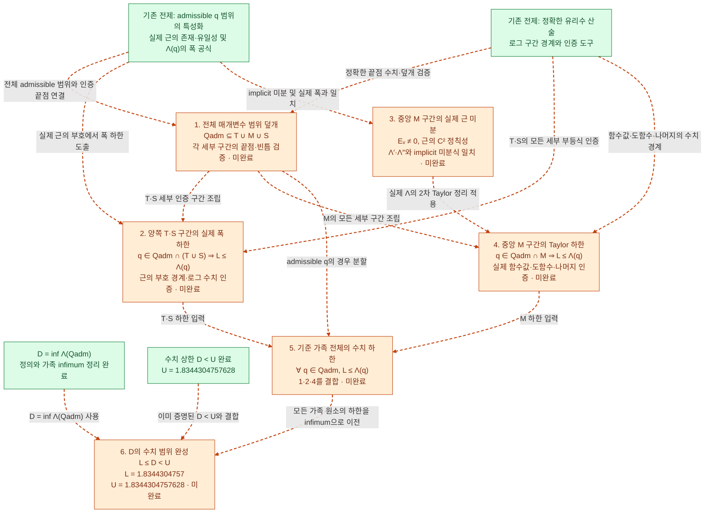
```mermaid
flowchart TD
  classDef done fill:#dcfce7,stroke:#15803d,color:#14532d
  classDef pending fill:#ffedd5,stroke:#c2410c,color:#7c2d12
  AR["기존 전제: 정확한 유리수 산술<br/>로그 구간 경계와 인증 도구"]
  FAM["D = inf Λ(Qadm)<br/>정의와 가족 infimum 정리 완료"]
  CMP["수치 상한 D &lt; U 완료<br/>U = 1.8344304757628"]

  NQ["기존 전제: admissible q 범위의 특성화<br/>실제 근의 존재·유일성 및 Λ(q)의 폭 공식"]
  N1["1. 전체 매개변수 범위 덮개<br/>Qadm ⊆ T ∪ M ∪ S<br/>각 세부 구간의 끝점·빈틈 검증 · 미완료"]
  N2["2. 양쪽 T·S 구간의 실제 폭 하한<br/>q ∈ Qadm ∩ (T ∪ S) ⇒ L ≤ Λ(q)<br/>근의 부호 경계·로그 수치 인증 · 미완료"]
  N3["3. 중앙 M 구간의 실제 근 미분<br/>Eᵥ ≠ 0, 근의 C² 정칙성<br/>Λ′·Λ″와 implicit 미분식 일치 · 미완료"]
  N4["4. 중앙 M 구간의 Taylor 하한<br/>q ∈ Qadm ∩ M ⇒ L ≤ Λ(q)<br/>실제 함수값·도함수·나머지 인증 · 미완료"]
  N5["5. 기준 가족 전체의 수치 하한<br/>∀ q ∈ Qadm, L ≤ Λ(q)<br/>1·2·4를 결합 · 미완료"]
  N6["6. D의 수치 범위 완성<br/>L ≤ D &lt; U<br/>L = 1.8344304757<br/>U = 1.8344304757628 · 미완료"]
  NQ -. "전체 admissible 범위와 인증 끝점 연결" .-> N1
  AR -. "정확한 끝점 수치·덮개 검증" .-> N1
  NQ -. "실제 근의 부호에서 폭 하한 도출" .-> N2
  AR -. "T·S의 모든 세부 부등식 인증" .-> N2
  N1 -. "T·S 세부 인증 구간 조립" .-> N2
  NQ -. "implicit 미분 및 실제 폭과 일치" .-> N3
  N3 -. "실제 Λ의 2차 Taylor 정리 적용" .-> N4
  AR -. "함수값·도함수·나머지의 수치 경계" .-> N4
  N1 -. "M의 모든 세부 구간 조립" .-> N4
  N1 -. "admissible q의 경우 분할" .-> N5
  N2 -. "T·S 하한 입력" .-> N5
  N4 -. "M 하한 입력" .-> N5
  N5 -. "모든 가족 원소의 하한을 infimum으로 이전" .-> N6
  FAM -. "D = inf Λ(Qadm) 사용" .-> N6
  CMP -. "이미 증명된 D &lt; U와 결합" .-> N6
  class AR,FAM,CMP,NQ done
  class N1,N2,N3,N4,N5,N6 pending
  linkStyle 0,1,2,3,4,5,6,7,8,9,10,11,12,13,14 stroke:#c2410c,stroke-width:2px,stroke-dasharray:6 4
```

### Original-paper auxiliary detail: items 7–8

The two green arrows to the completed-core box denote the inputs from this branch, together with the other completed reductions, block-energy arguments and scalar certificates shown in the full graph. There is no pending arrow from 7 or 8 to the completed theorem. The arrow 7→8 concerns only the original moving-potential/PV interpretation of the exact equality; the static algebraic adjoint identity can be investigated separately.


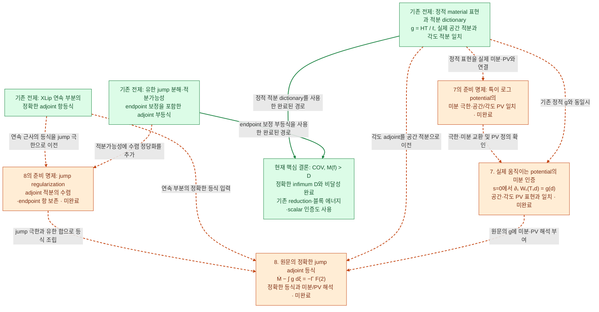
```mermaid
flowchart TD
  classDef done fill:#dcfce7,stroke:#15803d,color:#14532d
  classDef pending fill:#ffedd5,stroke:#c2410c,color:#7c2d12

  SG["기존 전제: 정적 material 표현과 적분 dictionary<br/>g = HT / ℓ, 실제 공간 적분과 각도 적분 일치"]
  XL["기존 전제: XLip 연속 부분의<br/>정확한 adjoint 항등식"]
  JI["기존 전제: 유한 jump 분해·적분가능성<br/>endpoint 보정을 포함한 adjoint 부등식"]
  P7["7의 준비 명제: 특이 로그 potential의<br/>미분 극한·공간/각도 PV 일치 · 미완료"]
  N7["7. 실제 움직이는 potential의 미분 인증<br/>s=0에서 ∂ₛ Wₛ(Tₛd) = g(d)<br/>공간·각도 PV 표현과 일치 · 미완료"]
  P8["8의 준비 명제: jump regularization<br/>adjoint 적분의 수렴·endpoint 항 보존 · 미완료"]
  N8["8. 원문의 정확한 jump adjoint 등식<br/>Ṁ − ∫ g dξ = −Γ F(2)<br/>정확한 등식과 미분/PV 해석 · 미완료"]

  COREOK["현재 핵심 결론: COV, M(f) &gt; D<br/>정확한 infimum D와 비달성 완료<br/>기존 reduction·블록 에너지·scalar 인증도 사용"]
  SG -->|정적 적분 dictionary를 사용한 완료된 경로| COREOK
  JI -->|endpoint 보정 부등식을 사용한 완료된 경로| COREOK
  SG -. "정적 표현을 실제 미분·PV와 연결" .-> P7
  P7 -. "극한·미분 교환 및 PV 정의 확인" .-> N7
  SG -. "기존 정적 g와 동일시" .-> N7
  XL -. "연속 근사의 등식을 jump 극한으로 이전" .-> P8
  JI -. "적분가능성에 수렴 정당화를 추가" .-> P8
  P8 -. "jump 극한과 유한 합으로 등식 조립" .-> N8
  XL -. "연속 부분의 정확한 등식 입력" .-> N8
  SG -. "각도 adjoint를 공간 적분으로 이전" .-> N8
  N7 -. "원문의 g에 미분·PV 해석 부여" .-> N8
  class SG,XL,JI,COREOK done
  class P7,N7,P8,N8 pending
  linkStyle 0,1 stroke:#15803d,stroke-width:2px
  linkStyle 2,3,4,5,6,7,8,9,10 stroke:#c2410c,stroke-width:2px,stroke-dasharray:6 4
```

### Evidence and scope

The proof statuses use the existing successful kernel build and axiom checks in [cov-full-20261001/verification.json](audit_cert_runs/cov-full-20261001/verification.json). Relevant declarations are in [CompleteCoverage.lean](Lean/LeanProject/CompleteCoverage.lean), [DTargetComparison.lean](Lean/LeanProject/DTargetComparison.lean), [MaterialDictionary.lean](Lean/LeanProject/MaterialDictionary.lean), [AdjointJump.lean](Lean/LeanProject/AdjointJump.lean) and [AtomicAdjoint.lean](Lean/LeanProject/AtomicAdjoint.lean). No Lean file, frozen evaluator, numerical certificate implementation or registration artifact was changed for this diagram correction, and this correction does not claim a new proof completion. Rendering checks are recorded in [render-verification.json](proof_diagrams/render-verification.json).

## 28. Obligation 1 completed: actual numerical-D domain and leaf coverage (1 October 2026)

This update supplies the first numbered numerical-D obligation from §27. It does not assert any new numerical lower bound on Λ or D. The existing sharp symbolic infimum and nonattainment proof remains complete.

### Exact endpoints and actual replay leaves

[DLowerPartition.lean](Lean/LeanProject/DLowerPartition.lean) defines dyad(m)=m/2^112 and the actual endpoints used by `cert3/dlower3.py`:

| Endpoint | Exact integer numerator over 2^112 |
|---|---|
| rho1 | 1127766877673764582591748089315328 |
| QA | 51922968585348276285304963292200 |
| QB | 259614842926741381426524816461005 |
| QHI | 641975583589246087484225104117760 |

The module embeds the **16 T, 15 M and 79 S** actual leaf intervals from the independent replay. `t_leaves_tile`, `m_leaves_tile` and `s_leaves_tile` check every adjacent endpoint equality, interval orientation and both outer endpoints in the Lean kernel. The generic `tiles_cover_Ioc` and `tiles_cover_Icc` prove pointwise exhaustive coverage. Only the first three endpoint columns are imported; the external numerical width lower-bound column is neither imported nor trusted.

### Admissible cutoff and T/M overlap

[DLowerBoundaryData.lean](Lean/LeanProject/DLowerBoundaryData.lean) supplies five rational logarithmic enclosures, each from the already-proved finite log series and remainder estimate. They prove:

- `fq_qHi_neg`: the actual dyadic QHI satisfies f(QHI)<0, using the rational probe 123639/1000000<QHI and the proved strict decrease of f.
- `qA_log_upper`: log(QA)≤−921/200.
- `tail_overlap_log`: log(QA)<−1/rho1, and hence QA<exp(−1/rho1).
- `fq_tenth_pos`: f(1/10)>0; because QB<1/10, the whole middle region is admissible.

These are actual finite-series/rational proofs, not assumptions that an external checker returned PASS.

### Unconditional coverage of every actual family parameter

[DLowerCoverage.lean](Lean/LeanProject/DLowerCoverage.lean) defines

\[
 
ho(q)=rac1{-\log q}=rac1{\log(1/q)},\qquad
 q_T(
ho)=e^{-1/
ho}\quad(
ho>0),
\]
with the auxiliary continuous endpoint q_T(0)=0, and

\[
 T=(0,q_T(
ho_1)],\qquad M=[Q_A,Q_B],\qquad S=[Q_B,Q_{
m hi}].
\]

The actual declarations have only the stated admissibility/reference inputs:

| Declaration | Proved result |
|---|---|
| `admissible_lt_qHi`, `exists_qs_lt_qHi` | Every admissible q and the actual threshold q_s lie below QHI |
| `tail_M_overlap` | QA<q_T(rho1), with the true exponential |
| `rho_eq_replay`, `tailQ_rho`, `tail_rho_bounds` | The real positive tail parameter is the replay parameter, q=q_T(rho(q)), and 0<rho(q)≤rho1 |
| `MRegion_admissible` | Every q∈M belongs to Qadm |
| `admissible_region_cover`, `Qadm_subset_three_regions` | Every q∈Qadm belongs to T, M or S |
| `admissible_exact_leaf_cover` | Every q∈Qadm lies in one actual M/S leaf, or has a positive rho in one actual T leaf with q=q_T(rho) |

Thus no admissible positive q, including arbitrarily small q and all exact region/leaf boundaries, is lost. The rho=0 endpoint is not represented as an admissible q. No numerical root-sign or width-lower-bound hypothesis occurs in `admissible_exact_leaf_cover`.

`family_lower_of_actual_leaf_bounds` supplies the exact replay-leaf consumer, and `family_lower_of_region_bounds` proves the conditional implication **(1 AND 2 AND 4) ⇒ 5**. Accordingly the assembler arrows into statement 5 are green while statement 5 itself remains orange: the numerical inputs 2 and 4 have not yet been proved at L=1.8344304757.

### Existing auxiliary completion discovered and verified

The current root also imports `MaterialFirstVariation`. This extension was already present when this coverage work inspected the root; these six source modules were not edited by the present work. The previous §27 orange auxiliary branch was therefore out of date. This update reads their exact statements and runs fresh axiom checks on all **69 proved declarations** in `MaterialDerivative`, `ActualMaterialDerivative`, `PrincipalValue`, `JumpAdjointEquality`, `AtomicAdjointEquality` and `MaterialFirstVariation`.

- [MaterialFirstVariation.lean](Lean/LeanProject/MaterialFirstVariation.lean), `residual_block_first_variation`, `residual_material_first_variation_ae` and `residual_spatial_first_variation_ae`, prove the actual derivative of WS(T_s,T_s(u)), its equality to the existing material g, and both raw angular/spatial PV limits, at block interiors and almost everywhere. The declared reference geometry is `hzero : 0=c−r/2*(rho+1/rho)`.
- [JumpAdjointEquality.lean](Lean/LeanProject/JumpAdjointEquality.lean) proves convergence of regularized jump adjoint integrals and the exact jump identity. [AtomicAdjointEquality.lean](Lean/LeanProject/AtomicAdjointEquality.lean) applies it to the actual sorted residual target. `original_jump_adjoint_identity` in `MaterialFirstVariation` gives the original exact spatial equality together with integrability, under the declared reference geometry.

Consequently 7 and 8 are green in the latest diagram. This is a verified current-source status update, not a claim that the new coverage modules prove those auxiliary results. They remain additional results beyond the complete static-inequality route to the core theorem.

### Updated statement and proof dependencies

Green boxes are proved statements under their declared hypotheses; orange boxes await their numerical proofs. Green arrows are proved implications, including conditional assembly from several inputs together. Orange dashed arrows still lack their specialized proof. The current pending numbered statements are **2, 3, 4, 5 and 6**. The 23 completed statement boxes and 37 completed arrows from the original stage-26 core graph are retained.



```mermaid
flowchart TD
  classDef done fill:#dcfce7,stroke:#15803d,color:#14532d
  classDef pending fill:#ffedd5,stroke:#c2410c,color:#7c2d12
  subgraph CORE["완료된 핵심 증명: 모든 기존 의존관계 유지"]
  AR["AR: rational arithmetic, log series and finite trigonometric bounds proved"]
  ROOTS["ROOTS: four strict E signs give actual root boxes on every certificate slab"]
  REF["REF: actual separated references with matching k and platform relation"]
  DICT["DICT: actual rho, sigma, width, Xi and scalar coefficients equal certificate formulas"]
  AFF["AFF: actual scalar positivity at Lhi across all R1 and R2"]
  CMP["CMP: D less than Lhi and D less than 2"]
  C1["C1: actual RatioCertified on [1.44,1.8) PROVED"]
  C2["C2: actual RatioCertified on (1.8002,2.1] PROVED"]
  C3["C3: actual RatioCertified on [2.1,4.2] PROVED"]
  TPAR["TPAR: terminal a(q), qa=q, D0=D0q, H1 and zero platform proved"]
  FAM["FAM: D is the infimum of admissible family widths Lambda(q)"]
  TWIDTH["TWIDTH: actual terminal width equals Lambda(q); calibrated Ceff at D is nonpositive"]
  TAIL["TAIL: actual scalar positivity for every 0 less than q at most .01"]
  COMPACT["COMPACT: actual scalar positivity on five slabs covering [.01,.042]"]
  C4["C4: actual RatioCertified for terminal k(q), 0 less than q at most .042 PROVED"]
  GEO["GEO: exhaustive R1, R2 and terminal ratio coverage; all endpoints handled"]
  PIL["PIL: existing actual pilot certificate on [1.8,1.8002]"]
  ALL["P: C1 AND C2 AND C3 AND C4 PROVED"]
  COV["COV: every k greater than 1.45 has an actual certificate PROVED"]
  RED["RED: every admissible polynomial reduces to measure at least 2 or an eligible normal form"]
  D["D: every admissible polynomial has M(f) greater than D PROVED"]
  SHARP["SHARP: approximation gives official infimum at most D PROVED"]
  INF["INF: exact infimum D and nonattainment PROVED"]
  end
  subgraph NUM["수치 인증: 1번 완료, 2–6번 입력 또는 결론 대기"]

  NQ["기존 전제: admissible q 범위의 특성화<br/>실제 근의 존재·유일성 및 Λ(q)의 폭 공식"]
  N1["1. 전체 매개변수 범위 덮개<br/>Qadm ⊆ T ∪ M ∪ S<br/>실제 110개 leaf의 끝점·빈틈 검증 완료"]
  N2["2. 양쪽 T·S 구간의 실제 폭 하한<br/>q ∈ Qadm ∩ (T ∪ S) ⇒ L ≤ Λ(q)<br/>근의 부호 경계·로그 수치 인증 · 미완료"]
  N3["3. 중앙 M 구간의 실제 근 미분<br/>Eᵥ ≠ 0, 근의 C² 정칙성<br/>Λ′·Λ″와 implicit 미분식 일치 · 미완료"]
  N4["4. 중앙 M 구간의 Taylor 하한<br/>q ∈ Qadm ∩ M ⇒ L ≤ Λ(q)<br/>실제 함수값·도함수·나머지 인증 · 미완료"]
  N5["5. 기준 가족 전체의 수치 하한<br/>∀ q ∈ Qadm, L ≤ Λ(q)<br/>2·4 입력 대기; 1·2·4 ⇒ 5 조립 증명 완료"]
  N6["6. D의 수치 범위 완성<br/>L ≤ D &lt; U<br/>L = 1.8344304757<br/>U = 1.8344304757628 · 미완료"]
  end
  subgraph AUX["현재 소스에서 완료된 원문의 보조명제 7–8번"]

  SG["기존 전제: 정적 material 표현과 적분 dictionary<br/>g = HT / ℓ, 실제 공간 적분과 각도 적분 일치"]
  XL["기존 전제: XLip 연속 부분의<br/>정확한 adjoint 항등식"]
  JI["기존 전제: 유한 jump 분해·적분가능성<br/>endpoint 보정을 포함한 adjoint 부등식"]
  P7["7의 준비 명제: 특이 로그 potential의<br/>미분 극한·공간/각도 PV 일치 완료"]
  N7["7. 실제 움직이는 potential의 미분 인증<br/>s=0에서 ∂ₛ Wₛ(Tₛd) = g(d)<br/>공간·각도 PV 일치 완료<br/>블록 내부·거의 모든 점, reference 기하전제 하"]
  P8["8의 준비 명제: jump regularization<br/>adjoint 적분 수렴·endpoint 항 보존 완료"]
  N8["8. 원문의 정확한 jump adjoint 등식<br/>Ṁ − ∫ g dξ = −Γ F(2)<br/>실제 residual target의 등식·미분/PV 해석 완료<br/>reference 기하전제 하"]
  end
  AR -->|uniform exact root-sign bounds| ROOTS
  AR -->|finite scalar inequalities| AFF
  ROOTS -->|construct reference and exterior roots| REF
  REF -->|actual endpoint dictionary| DICT
  DICT -->|actual rectangle and calibrated scalar| AFF
  AFF -->|restriction to left complement| C1
  AFF -->|restriction to right complement| C2
  AFF -->|full R2 range| C3
  CMP -->|transfer Lhi certificate to D| C1
  CMP -->|transfer Lhi certificate to D| C2
  CMP -->|transfer Lhi certificate to D| C3
  TPAR -->|terminal reference hypotheses| REF
  TPAR -->|terminal parameter bounds| ROOTS
  TPAR -->|zero platform and root substitution| TWIDTH
  DICT -->|identify actual width| TWIDTH
  FAM -->|family width at least D| TWIDTH
  TPAR -->|analytic unbounded-k estimates| TAIL
  AR -->|tail rational inequalities| TAIL
  AR -->|five finite positive margins| COMPACT
  DICT -->|actual scalar coefficients| TAIL
  DICT -->|actual scalar coefficients| COMPACT
  TWIDTH -->|apply scalar certificate at D| C4
  TAIL -->|covers positive-q tail| C4
  COMPACT -->|covers remaining terminal q| C4
  REF -->|matching separated terminal reference| C4
  C1 -->|conjunction input| ALL
  C2 -->|conjunction input| ALL
  C3 -->|conjunction input| ALL
  C4 -->|conjunction input| ALL
  ALL -->|certificate assembly| COV
  GEO -->|exhaustive ratio partition and IVT| COV
  PIL -->|pilot interval input| COV
  COV -->|strict normal-form lower theorem| D
  RED -->|arbitrary polynomial reduction| D
  CMP -->|discharges measure at least 2 branch| D
  D -->|strict lower bound and nonattainment| INF
  SHARP -->|opposite infimum inequality| INF
  SG -->|기존 정적 material 적분 reduction| RED
  JI -->|완료된 endpoint 보정 부등식 경로| RED
  NQ -->|전체 admissible 범위와 인증 끝점 연결| N1
  AR -->|정확한 끝점 수치·덮개 검증| N1
  NQ -. "실제 근의 부호에서 폭 하한 도출" .-> N2
  AR -. "T·S의 모든 세부 부등식 인증" .-> N2
  N1 -. "T·S 세부 인증 구간 조립" .-> N2
  NQ -. "implicit 미분 및 실제 폭과 일치" .-> N3
  N3 -. "실제 Λ의 2차 Taylor 정리 적용" .-> N4
  AR -. "함수값·도함수·나머지의 수치 경계" .-> N4
  N1 -. "M의 모든 세부 구간 조립" .-> N4
  N1 -->|admissible q의 경우 분할 · 조건부 조립 완료| N5
  N2 -->|T·S 하한 입력 · 조건부 조립 완료| N5
  N4 -->|M 하한 입력 · 조건부 조립 완료| N5
  N5 -. "모든 가족 원소의 하한을 infimum으로 이전" .-> N6
  FAM -. "D = inf Λ(Qadm) 사용" .-> N6
  CMP -. "이미 증명된 D &lt; U와 결합" .-> N6
  SG -->|정적 표현을 실제 미분·PV와 연결| P7
  P7 -->|극한·미분 교환 및 PV 정의 확인| N7
  SG -->|기존 정적 g와 동일시| N7
  XL -->|연속 근사의 등식을 jump 극한으로 이전| P8
  JI -->|적분가능성에 수렴 정당화를 추가| P8
  P8 -->|jump 극한과 유한 합으로 등식 조립| N8
  XL -->|연속 부분의 정확한 등식 입력| N8
  SG -->|각도 adjoint를 공간 적분으로 이전| N8
  N7 -->|원문의 g에 미분·PV 해석 부여| N8
  class AFF,ALL,AR,C1,C2,C3,C4,CMP,COMPACT,COV,D,DICT,FAM,GEO,INF,JI,N1,N7,N8,NQ,P7,P8,PIL,RED,REF,ROOTS,SG,SHARP,TAIL,TPAR,TWIDTH,XL done
  class N2,N3,N4,N5,N6 pending
  linkStyle 0,1,2,3,4,5,6,7,8,9,10,11,12,13,14,15,16,17,18,19,20,21,22,23,24,25,26,27,28,29,30,31,32,33,34,35,36,37,38,39,40,48,49,50,54,55,56,57,58,59,60,61,62 stroke:#15803d,stroke-width:2px
  linkStyle 41,42,43,44,45,46,47,51,52,53 stroke:#c2410c,stroke-width:2px,stroke-dasharray:6 4
```


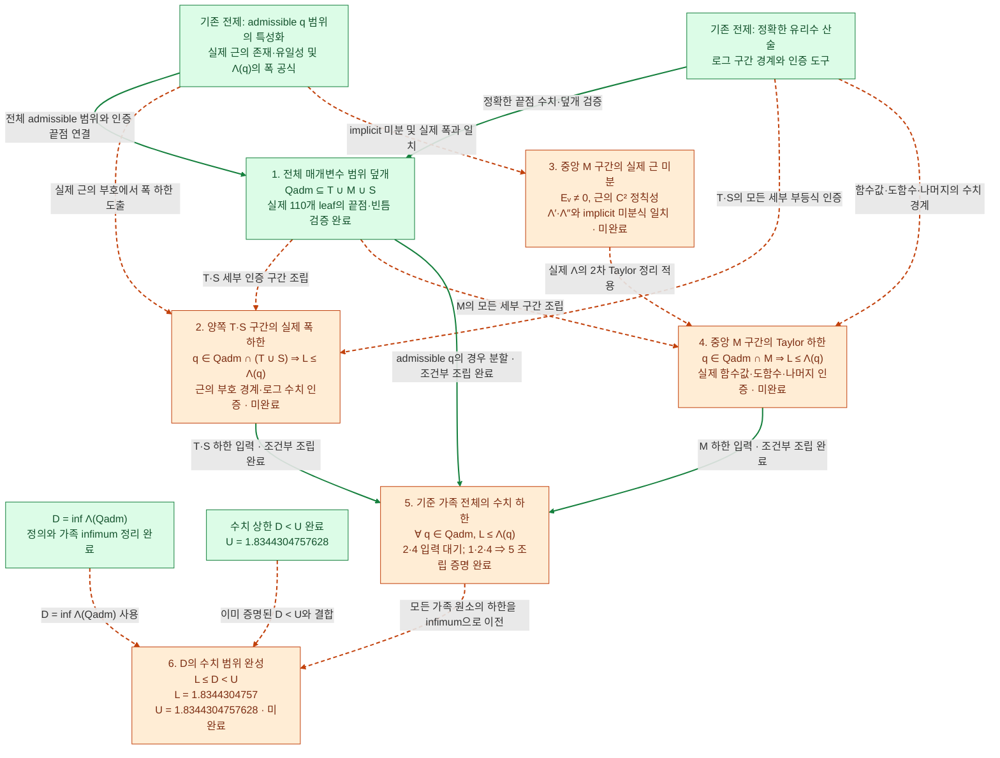
```mermaid
flowchart TD
  classDef done fill:#dcfce7,stroke:#15803d,color:#14532d
  classDef pending fill:#ffedd5,stroke:#c2410c,color:#7c2d12
  AR["기존 전제: 정확한 유리수 산술<br/>로그 구간 경계와 인증 도구"]
  FAM["D = inf Λ(Qadm)<br/>정의와 가족 infimum 정리 완료"]
  CMP["수치 상한 D &lt; U 완료<br/>U = 1.8344304757628"]

  NQ["기존 전제: admissible q 범위의 특성화<br/>실제 근의 존재·유일성 및 Λ(q)의 폭 공식"]
  N1["1. 전체 매개변수 범위 덮개<br/>Qadm ⊆ T ∪ M ∪ S<br/>실제 110개 leaf의 끝점·빈틈 검증 완료"]
  N2["2. 양쪽 T·S 구간의 실제 폭 하한<br/>q ∈ Qadm ∩ (T ∪ S) ⇒ L ≤ Λ(q)<br/>근의 부호 경계·로그 수치 인증 · 미완료"]
  N3["3. 중앙 M 구간의 실제 근 미분<br/>Eᵥ ≠ 0, 근의 C² 정칙성<br/>Λ′·Λ″와 implicit 미분식 일치 · 미완료"]
  N4["4. 중앙 M 구간의 Taylor 하한<br/>q ∈ Qadm ∩ M ⇒ L ≤ Λ(q)<br/>실제 함수값·도함수·나머지 인증 · 미완료"]
  N5["5. 기준 가족 전체의 수치 하한<br/>∀ q ∈ Qadm, L ≤ Λ(q)<br/>2·4 입력 대기; 1·2·4 ⇒ 5 조립 증명 완료"]
  N6["6. D의 수치 범위 완성<br/>L ≤ D &lt; U<br/>L = 1.8344304757<br/>U = 1.8344304757628 · 미완료"]
  NQ -->|전체 admissible 범위와 인증 끝점 연결| N1
  AR -->|정확한 끝점 수치·덮개 검증| N1
  NQ -. "실제 근의 부호에서 폭 하한 도출" .-> N2
  AR -. "T·S의 모든 세부 부등식 인증" .-> N2
  N1 -. "T·S 세부 인증 구간 조립" .-> N2
  NQ -. "implicit 미분 및 실제 폭과 일치" .-> N3
  N3 -. "실제 Λ의 2차 Taylor 정리 적용" .-> N4
  AR -. "함수값·도함수·나머지의 수치 경계" .-> N4
  N1 -. "M의 모든 세부 구간 조립" .-> N4
  N1 -->|admissible q의 경우 분할 · 조건부 조립 완료| N5
  N2 -->|T·S 하한 입력 · 조건부 조립 완료| N5
  N4 -->|M 하한 입력 · 조건부 조립 완료| N5
  N5 -. "모든 가족 원소의 하한을 infimum으로 이전" .-> N6
  FAM -. "D = inf Λ(Qadm) 사용" .-> N6
  CMP -. "이미 증명된 D &lt; U와 결합" .-> N6
  class AR,CMP,FAM,N1,NQ done
  class N2,N3,N4,N5,N6 pending
  linkStyle 0,1,9,10,11 stroke:#15803d,stroke-width:2px
  linkStyle 2,3,4,5,6,7,8,12,13,14 stroke:#c2410c,stroke-width:2px,stroke-dasharray:6 4
```


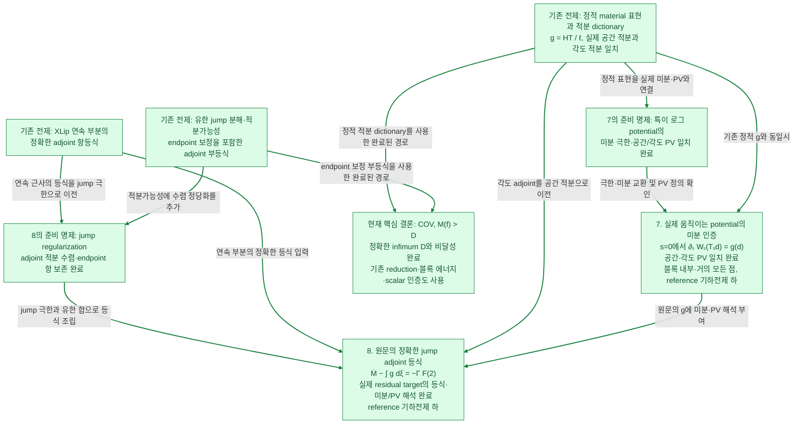
```mermaid
flowchart TD
  classDef done fill:#dcfce7,stroke:#15803d,color:#14532d
  classDef pending fill:#ffedd5,stroke:#c2410c,color:#7c2d12

  SG["기존 전제: 정적 material 표현과 적분 dictionary<br/>g = HT / ℓ, 실제 공간 적분과 각도 적분 일치"]
  XL["기존 전제: XLip 연속 부분의<br/>정확한 adjoint 항등식"]
  JI["기존 전제: 유한 jump 분해·적분가능성<br/>endpoint 보정을 포함한 adjoint 부등식"]
  P7["7의 준비 명제: 특이 로그 potential의<br/>미분 극한·공간/각도 PV 일치 완료"]
  N7["7. 실제 움직이는 potential의 미분 인증<br/>s=0에서 ∂ₛ Wₛ(Tₛd) = g(d)<br/>공간·각도 PV 일치 완료<br/>블록 내부·거의 모든 점, reference 기하전제 하"]
  P8["8의 준비 명제: jump regularization<br/>adjoint 적분 수렴·endpoint 항 보존 완료"]
  N8["8. 원문의 정확한 jump adjoint 등식<br/>Ṁ − ∫ g dξ = −Γ F(2)<br/>실제 residual target의 등식·미분/PV 해석 완료<br/>reference 기하전제 하"]

  COREOK["현재 핵심 결론: COV, M(f) &gt; D<br/>정확한 infimum D와 비달성 완료<br/>기존 reduction·블록 에너지·scalar 인증도 사용"]
  SG -->|정적 적분 dictionary를 사용한 완료된 경로| COREOK
  JI -->|endpoint 보정 부등식을 사용한 완료된 경로| COREOK
  SG -->|정적 표현을 실제 미분·PV와 연결| P7
  P7 -->|극한·미분 교환 및 PV 정의 확인| N7
  SG -->|기존 정적 g와 동일시| N7
  XL -->|연속 근사의 등식을 jump 극한으로 이전| P8
  JI -->|적분가능성에 수렴 정당화를 추가| P8
  P8 -->|jump 극한과 유한 합으로 등식 조립| N8
  XL -->|연속 부분의 정확한 등식 입력| N8
  SG -->|각도 adjoint를 공간 적분으로 이전| N8
  N7 -->|원문의 g에 미분·PV 해석 부여| N8
  class COREOK,JI,N7,N8,P7,P8,SG,XL done
  linkStyle 0,1,2,3,4,5,6,7,8,9,10 stroke:#15803d,stroke-width:2px
```

### Verification and remaining work

- Root build: `lake -q --log-level=error build LeanProject`, exit 0; current import closure **212 modules**, including the three new coverage modules and the six existing auxiliary extension modules.
- Fresh axiom checks: **46 new coverage declarations** and **69 already-existing auxiliary declarations**, all with dependencies contained in `{propext, Classical.choice, Quot.sound}`.
- [Verification record](audit_cert_runs/d-lower-cover-20261001/verification.json), [coverage axiom output](audit_cert_runs/d-lower-cover-20261001/axioms.out), [auxiliary axiom output](audit_cert_runs/d-lower-cover-20261001/auxiliary-axioms.out) and [exact leaf input manifest](audit_cert_runs/d-lower-cover-20261001/input-manifest.json).
- All previously verified original/COV proof modules retain their recorded source hashes. The frozen paper, registration artifacts and external numerical certificate implementations were not edited by this work.

**Next numerical obligation:** 2, prove the actual width lower bound Λ(q)≥1.8344304757 throughout T and S using the now-proved exact region/leaf coverage. The central implicit-root/Taylor route 3–4 and the actual family lower bound 5 remain. Statement 6 still lacks its lower endpoint; D<1.8344304757628 is already proved. No numerical width lower bound is claimed by this coverage update.

## 29. Actual material derivative, raw PV and exact jump adjoint equality (1 October 2026)

**Items 7 and 8 are complete.** Six added Lean modules contain **69 proved declarations**, all imported by the project root. The root build succeeds; every new declaration's axiom dependencies are contained in `{propext, Classical.choice, Quot.sound}`. The proof-source scan finds no `sorry`, `admit`, `native_decide` or explicit axioms. All previously pinned proof-module sources are unchanged; the root adds the first-variation import.

### Statement 7: actual potential differentiation and original raw PV

For the existing actual reference quantile $T_0$ and actual residual-root target $T$, define


\[
T_s(u)=T_0(u)+s(T(u)-T_0(u)),\qquad
\Phi_u(s)=\operatorname{WS}(k,T_s,T_s(u)).
\]

[MaterialDerivative.lean](Lean/LeanProject/MaterialDerivative.lean) defines the moving logarithmic integral of genuinely displaced positions and proves it is exactly the existing `Stage10.WS` in mass coordinates. Its derivative is obtained from the actual integral. Near zero, the gap factors as

\[
d_s(\theta)-d_s(\phi)
=(d(\theta)-d(\phi))(1+s q_\theta(\phi)),\qquad
q_\theta(\phi)=\frac{v(\phi)-v(\theta)}{d(\phi)-d(\theta)}.
\]

The neighborhood, logarithmic integrability and derivative majorant are constructed explicitly. [ActualMaterialDerivative.lean](Lean/LeanProject/ActualMaterialDerivative.lean) constructs the required fiber bound at **every interior point of every actual residual-root block**: the target is constant nearby; outside that neighborhood the cosine chord has a positive distance bound. The finite actual residual target supplies its global bound. No derivative or fiber-integrability hypothesis is left for the caller to supply.

The resulting derivative is the previously defined, independent material expression

\[
g(d)=\frac{k v(d)}{d}
+\frac1\pi\int_0^\pi
 \frac{v(\phi)-v(\theta)}{d(\phi)-d(\theta)}\alpha(\phi)\,d\phi.
\]

[PrincipalValue.lean](Lean/LeanProject/PrincipalValue.lean) proves the **original raw** PV limits; the numerator has not been replaced in the definition by a subtracted quotient. The angular cutoff is the sum of the raw integrals over $[0,\theta-\epsilon]$ and $[\theta+\epsilon,\pi]$. The spatial cutoff is the actual integral of $F(e)/(e-d)$ against the existing push-forward equilibrium measure $de_I$, with the indicator $|e-d|>\epsilon$. Both use the filter `nhdsWithin 0 (Ioi 0)`.

The raw constant part is evaluated using the explicit primitive

\[
G_\theta(\phi)=\frac{\log|\sin((\phi-\theta)/2)|
 -\log|\sin((\phi+\theta)/2)|}{\sin\theta},\qquad
G_\theta'(\phi)=\frac1{\cos\theta-\cos\phi}.
\]

Its endpoint values vanish. Angular symmetric cutoffs cancel the singular logarithm directly. Spatial symmetric cutoffs use $\phi_-=\arccos(\cos\theta+\epsilon/r)$, $\phi_+=\arccos(\cos\theta-\epsilon/r)$ and the exact cosine-gap factorization to cancel it. Both constant PV limits are zero. The remaining absolutely integrable fiber converges for either pair of cutoffs, so both raw PV limits equal `HT F θ / r`, hence $g(d)$.

[MaterialFirstVariation.lean](Lean/LeanProject/MaterialFirstVariation.lean) applies the results to the actual normal-form polynomial, excludes only finitely many quantile cuts and the endpoints, and transports the almost-everywhere statement to the actual adjoint measure $d\xi$.

| Proved declaration | Exact role |
|---|---|
| `Stage11.AngleReference.movingLogPotential_eq_WS` | Equality with the original mass-coordinate moving potential |
| `Stage12.residual_block_WS_derivative` | Actual derivative equals independent material $g$ at every block-interior point |
| `Stage12.residual_block_velocity_dq_integrable` | Actual weighted velocity fiber is absolutely integrable at every such point |
| `Stage11.tendsto_angularPVTrunc` | Raw angular PV tends to `HT` |
| `Stage11.spatialPVTrunc_eq_cosine` | Actual spatial-measure cutoff equals the cosine cutoff with the correct radius factor |
| `Stage11.tendsto_spatialPVTrunc` | Actual spatial raw PV tends to `HT / r` |
| `Stage12.residual_block_first_variation` | Actual derivative and both PV conventions assembled pointwise |
| `Stage12.residual_spatial_first_variation_ae` | The same interpretations for $g$, almost everywhere under $d\xi$ |

Names in the table are prefixed by `EP1038`. The remaining explicit assumptions are the positive residual count and the existing separated reference, including its declared zero-platform geometric relation. There is no assumed derivative, PV convergence, uniform regularity across jumps or singular-integral exchange. Real analyticity of $g$, which is a separate clause of the original paper, is not claimed by this numbered item.

### Statement 8: exact jump adjoint equality

[JumpAdjointEquality.lean](Lean/LeanProject/JumpAdjointEquality.lean) strengthens the previous Fatou argument to an exact dominated-convergence argument. For a clipped ramp at an interior cosine threshold $z\in(-1,1)$, the difference quotient is dominated by

\[
\frac1{\sqrt{|\cos\theta-z|}\sqrt{|\cos\phi-z|}}.
\]

Each factor is integrable because an interior cosine root has a linear lower bound in the angular distance. Their product is integrable on the product measure; the bounded adjoint weight preserves the majorant. Dominated convergence therefore preserves the entire continuous-ramp adjoint equality, including its endpoint term. The single-jump identity `L_jump_eq_zero` and the exact finite-jump identity follow. Finite coefficients need not be positive for this equality.

[AtomicAdjointEquality.lean](Lean/LeanProject/AtomicAdjointEquality.lean) applies the exact identity to the **actual sorted residual-root quantile**, combines it with the cosine-Lipschitz remainder, and proves its endpoint is $F(\pi)=a_\pi(d_N-2)$. The spatial dictionary then gives

\[
\boxed{\dot M-\int_I g\,d\xi
=-\Gamma F(2)=-\Gamma a_\pi(d_N-2).}
\]

`Stage11.SeparatedReference.residual_exact_material_adjoint` is the actual equality. `Stage11.SeparatedReference.original_jump_adjoint_identity` includes the proved integrability of $g$. Statement 7, especially `residual_spatial_first_variation_ae`, now supplies the original derivative and PV meaning of that same $g$, so the equality has no remaining interpretation gap.

### Updated dependency diagrams

Green boxes are proved statements; green arrows are proved dependencies. Orange boxes and dashed arrows are the remaining numerical-D tasks 2–6. Several arrows entering one box provide their inputs jointly. The completed core proof and all existing numerical paths are preserved. The concurrently completed numerical domain/leaf cover (item 1) is also green; the three arrows assembling item 5 are proved conditional on its remaining numerical inputs. Items 7 and 8 have no pending edge into the core theorem.


[Zoomable SVG](proof_diagrams/dependency-stage-29.svg) · [Mermaid source](proof_diagrams/dependency-stage-29.mmd)


```mermaid
flowchart TD
  classDef done fill:#dcfce7,stroke:#15803d,color:#14532d
  classDef pending fill:#ffedd5,stroke:#c2410c,color:#7c2d12
  subgraph CORE["완료된 핵심 증명: 모든 기존 의존관계 유지"]
  AR["AR: rational arithmetic, log series and finite trigonometric bounds proved"]
  ROOTS["ROOTS: four strict E signs give actual root boxes on every certificate slab"]
  REF["REF: actual separated references with matching k and platform relation"]
  DICT["DICT: actual rho, sigma, width, Xi and scalar coefficients equal certificate formulas"]
  AFF["AFF: actual scalar positivity at Lhi across all R1 and R2"]
  CMP["CMP: D less than Lhi and D less than 2"]
  C1["C1: actual RatioCertified on [1.44,1.8) PROVED"]
  C2["C2: actual RatioCertified on (1.8002,2.1] PROVED"]
  C3["C3: actual RatioCertified on [2.1,4.2] PROVED"]
  TPAR["TPAR: terminal a(q), qa=q, D0=D0q, H1 and zero platform proved"]
  FAM["FAM: D is the infimum of admissible family widths Lambda(q)"]
  TWIDTH["TWIDTH: actual terminal width equals Lambda(q); calibrated Ceff at D is nonpositive"]
  TAIL["TAIL: actual scalar positivity for every 0 less than q at most .01"]
  COMPACT["COMPACT: actual scalar positivity on five slabs covering [.01,.042]"]
  C4["C4: actual RatioCertified for terminal k(q), 0 less than q at most .042 PROVED"]
  GEO["GEO: exhaustive R1, R2 and terminal ratio coverage; all endpoints handled"]
  PIL["PIL: existing actual pilot certificate on [1.8,1.8002]"]
  ALL["P: C1 AND C2 AND C3 AND C4 PROVED"]
  COV["COV: every k greater than 1.45 has an actual certificate PROVED"]
  RED["RED: every admissible polynomial reduces to measure at least 2 or an eligible normal form"]
  D["D: every admissible polynomial has M(f) greater than D PROVED"]
  SHARP["SHARP: approximation gives official infimum at most D PROVED"]
  INF["INF: exact infimum D and nonattainment PROVED"]
  end
  subgraph NUM["수치 인증: 1번 완료, 2–6번 미완료"]

  NQ["기존 전제: admissible q 범위의 특성화<br/>실제 근의 존재·유일성 및 Λ(q)의 폭 공식"]
  N1["1. 전체 매개변수 범위 덮개<br/>Qadm ⊆ T ∪ M ∪ S<br/>실제 110개 leaf의 끝점·빈틈 검증 완료"]
  N2["2. 양쪽 T·S 구간의 실제 폭 하한<br/>q ∈ Qadm ∩ (T ∪ S) ⇒ L ≤ Λ(q)<br/>근의 부호 경계·로그 수치 인증 · 미완료"]
  N3["3. 중앙 M 구간의 실제 근 미분<br/>Eᵥ ≠ 0, 근의 C² 정칙성<br/>Λ′·Λ″와 implicit 미분식 일치 · 미완료"]
  N4["4. 중앙 M 구간의 Taylor 하한<br/>q ∈ Qadm ∩ M ⇒ L ≤ Λ(q)<br/>실제 함수값·도함수·나머지 인증 · 미완료"]
  N5["5. 기준 가족 전체의 수치 하한<br/>∀ q ∈ Qadm, L ≤ Λ(q)<br/>2·4 입력 대기; 조건부 조립 증명 완료"]
  N6["6. D의 수치 범위 완성<br/>L ≤ D &lt; U<br/>L = 1.8344304757<br/>U = 1.8344304757628 · 미완료"]
  end
  subgraph AUX["원문의 강한 보조명제: 7–8번 / 핵심 결론의 미해결 전제가 아님"]

  SG["기존 전제: 정적 material 표현과 적분 dictionary<br/>g = HT / ℓ, 실제 공간 적분과 각도 적분 일치"]
  XL["기존 전제: XLip 연속 부분의<br/>정확한 adjoint 항등식"]
  JI["기존 전제: 유한 jump 분해·적분가능성<br/>endpoint 보정을 포함한 adjoint 부등식"]
  P7["7의 미분 준비: 유계 fiber 차분몫으로<br/>특이 로그 적분의 실제 미분 정당화 · 완료"]
  N7["7. 원문의 실제 material first variation<br/>∂ₛ WS(Tₛ,Tₛu)|₀ = g(d)<br/>각도·실제 공간 raw PV와 일치 · 완료"]
  P8["8의 수렴 준비: jump ramp의 차분몫<br/>적분 가능한 역제곱근 지배함수와 DCT · 완료"]
  N8["8. 원문의 정확한 jump adjoint 등식<br/>Ṁ − ∫ g dξ = −Γ aπ(dN − 2)<br/>7의 실제 미분·PV 해석 포함 · 완료"]
  end
  AR -->|uniform exact root-sign bounds| ROOTS
  AR -->|finite scalar inequalities| AFF
  ROOTS -->|construct reference and exterior roots| REF
  REF -->|actual endpoint dictionary| DICT
  DICT -->|actual rectangle and calibrated scalar| AFF
  AFF -->|restriction to left complement| C1
  AFF -->|restriction to right complement| C2
  AFF -->|full R2 range| C3
  CMP -->|transfer Lhi certificate to D| C1
  CMP -->|transfer Lhi certificate to D| C2
  CMP -->|transfer Lhi certificate to D| C3
  TPAR -->|terminal reference hypotheses| REF
  TPAR -->|terminal parameter bounds| ROOTS
  TPAR -->|zero platform and root substitution| TWIDTH
  DICT -->|identify actual width| TWIDTH
  FAM -->|family width at least D| TWIDTH
  TPAR -->|analytic unbounded-k estimates| TAIL
  AR -->|tail rational inequalities| TAIL
  AR -->|five finite positive margins| COMPACT
  DICT -->|actual scalar coefficients| TAIL
  DICT -->|actual scalar coefficients| COMPACT
  TWIDTH -->|apply scalar certificate at D| C4
  TAIL -->|covers positive-q tail| C4
  COMPACT -->|covers remaining terminal q| C4
  REF -->|matching separated terminal reference| C4
  C1 -->|conjunction input| ALL
  C2 -->|conjunction input| ALL
  C3 -->|conjunction input| ALL
  C4 -->|conjunction input| ALL
  ALL -->|certificate assembly| COV
  GEO -->|exhaustive ratio partition and IVT| COV
  PIL -->|pilot interval input| COV
  COV -->|strict normal-form lower theorem| D
  RED -->|arbitrary polynomial reduction| D
  CMP -->|discharges measure at least 2 branch| D
  D -->|strict lower bound and nonattainment| INF
  SHARP -->|opposite infimum inequality| INF
  SG -->|기존 정적 material 적분 reduction| RED
  JI -->|완료된 endpoint 보정 부등식 경로| RED
  NQ -->|전체 admissible 범위와 인증 끝점 연결| N1
  AR -->|정확한 끝점 수치·덮개 검증| N1
  NQ -. "실제 근의 부호에서 폭 하한 도출" .-> N2
  AR -. "T·S의 모든 세부 부등식 인증" .-> N2
  N1 -. "T·S 세부 인증 구간 조립" .-> N2
  NQ -. "implicit 미분 및 실제 폭과 일치" .-> N3
  N3 -. "실제 Λ의 2차 Taylor 정리 적용" .-> N4
  AR -. "함수값·도함수·나머지의 수치 경계" .-> N4
  N1 -. "M의 모든 세부 구간 조립" .-> N4
  N1 -->|admissible q의 경우 분할 · 조건부 조립 완료| N5
  N2 -->|T·S 하한 입력 · 조건부 조립 완료| N5
  N4 -->|M 하한 입력 · 조건부 조립 완료| N5
  N5 -. "모든 가족 원소의 하한을 infimum으로 이전" .-> N6
  FAM -. "D = inf Λ(Qadm) 사용" .-> N6
  CMP -. "이미 증명된 D &lt; U와 결합" .-> N6
  SG -->|정적 표현을 실제 미분·PV와 연결| P7
  P7 -->|극한·미분 교환 및 PV 정의 확인| N7
  SG -->|기존 정적 g와 동일시| N7
  XL -->|연속 근사의 등식을 jump 극한으로 이전| P8
  JI -->|적분가능성에 수렴 정당화를 추가| P8
  P8 -->|jump 극한과 유한 합으로 등식 조립| N8
  XL -->|연속 부분의 정확한 등식 입력| N8
  SG -->|각도 adjoint를 공간 적분으로 이전| N8
  N7 -->|원문의 g에 미분·PV 해석 부여| N8
  REF -->|기존 실제 reference를 사용| RF
RF["실제 reference와 잔여근 분위수 블록<br/>반지름 양수·플랫폼 기하 조건·유한 step"]
  QB["블록 내부 점의 실제 속도 차분몫 유계<br/>기본 로그 적분 가능성 · 완료"]
  CP["raw 상수 PV = 0<br/>각도 및 공간 대칭 절단의 명시적 계산 · 완료"]
  HP["raw 일반 PV = HT / r<br/>실제 deI 측도 변수변환과 극한 · 완료"]
  AE["유한 분위수 경계만 제외<br/>실제 블록 내부가 dξ 거의 모든 점을 덮음 · 완료"]
  JE["단일 jump의 정확한 L(jump) = 0<br/>유한 jump 합도 정확한 등식 · 완료"]
  QE["실제 잔여 분위수에 적용<br/>F(π) = aπ(dN − 2) · 완료"]
  RF -->|블록의 국소 상수성·유한 target 경계| QB
  QB -->|미분 근방과 공통 지배함수 구성| P7
  AR -->|로그 원시함수와 cutoff 상쇄 계산| CP
  CP -->|상수 항 소거와 적분 가능한 fiber 수렴| HP
  SG -->|독립적으로 정의된 material g와 HT 동일시| HP
  HP -->|두 raw PV가 실제 미분값과 일치| N7
  RF -->|유한 jump 경계·측도 변수변환| AE
  AE -->|모든 블록 내부 및 dξ 거의 모든 점에 적용| N7
  P8 -->|근사의 정확한 등식에 DCT 적용| JE
  XL -->|연속 remainder의 정확한 항등식| JE
  JE -->|실제 분위수의 유한 jump 분해| QE
  RF -->|실제 정렬 잔여근과 끝점 2| QE
  QE -->|끝점 보정을 포함한 정확한 공간 등식| N8
  class AR,ROOTS,REF,DICT,AFF,CMP,C1,C2,C3,TPAR,FAM,TWIDTH,TAIL,COMPACT,C4,GEO,PIL,ALL,COV,RED,D,SHARP,INF,NQ,SG,XL,JI,P7,N7,P8,N8,RF,QB,CP,HP,AE,JE,QE,N1 done
  class N2,N3,N4,N5,N6 pending
  linkStyle 0,1,2,3,4,5,6,7,8,9,10,11,12,13,14,15,16,17,18,19,20,21,22,23,24,25,26,27,28,29,30,31,32,33,34,35,36,37,38,39,40,48,49,50,54,55,56,57,58,59,60,61,62,63,64,65,66,67,68,69,70,71,72,73,74,75,76 stroke:#15803d,stroke-width:2px
  linkStyle 41,42,43,44,45,46,47,51,52,53 stroke:#c2410c,stroke-width:2px,stroke-dasharray:6 4
```

The enlarged 7–8 branch displays the actual intermediate statements, so the green endpoints do not hide the singular differentiation or jump-limit argument:


[Zoomable SVG](proof_diagrams/dependency-stage-29-auxiliary.svg) · [Mermaid source](proof_diagrams/dependency-stage-29-auxiliary.mmd)

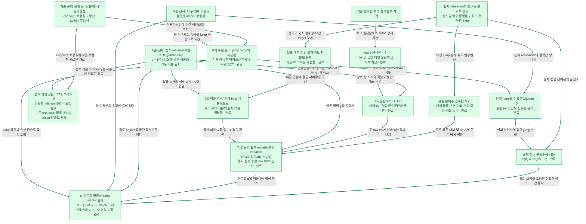
```mermaid
flowchart TD
  classDef done fill:#dcfce7,stroke:#15803d,color:#14532d
  classDef pending fill:#ffedd5,stroke:#c2410c,color:#7c2d12

  SG["기존 전제: 정적 material 표현과 적분 dictionary<br/>g = HT / ℓ, 실제 공간 적분과 각도 적분 일치"]
  XL["기존 전제: XLip 연속 부분의<br/>정확한 adjoint 항등식"]
  JI["기존 전제: 유한 jump 분해·적분가능성<br/>endpoint 보정을 포함한 adjoint 부등식"]
  P7["7의 미분 준비: 유계 fiber 차분몫으로<br/>특이 로그 적분의 실제 미분 정당화 · 완료"]
  N7["7. 원문의 실제 material first variation<br/>∂ₛ WS(Tₛ,Tₛu)|₀ = g(d)<br/>각도·실제 공간 raw PV와 일치 · 완료"]
  P8["8의 수렴 준비: jump ramp의 차분몫<br/>적분 가능한 역제곱근 지배함수와 DCT · 완료"]
  N8["8. 원문의 정확한 jump adjoint 등식<br/>Ṁ − ∫ g dξ = −Γ aπ(dN − 2)<br/>7의 실제 미분·PV 해석 포함 · 완료"]

  COREOK["현재 핵심 결론: COV, M(f) &gt; D<br/>정확한 infimum D와 비달성 완료<br/>기존 reduction·블록 에너지·scalar 인증도 사용"]
  SG -->|정적 적분 dictionary를 사용한 완료된 경로| COREOK
  JI -->|endpoint 보정 부등식을 사용한 완료된 경로| COREOK
  SG -->|정적 표현을 실제 미분·PV와 연결| P7
  P7 -->|극한·미분 교환 및 PV 정의 확인| N7
  SG -->|기존 정적 g와 동일시| N7
  XL -->|연속 근사의 등식을 jump 극한으로 이전| P8
  JI -->|적분가능성에 수렴 정당화를 추가| P8
  P8 -->|jump 극한과 유한 합으로 등식 조립| N8
  XL -->|연속 부분의 정확한 등식 입력| N8
  SG -->|각도 adjoint를 공간 적분으로 이전| N8
  N7 -->|원문의 g에 미분·PV 해석 부여| N8
  AR["기존 정확한 로그·삼각함수 계산"]
RF["실제 reference와 잔여근 분위수 블록<br/>반지름 양수·플랫폼 기하 조건·유한 step"]
  QB["블록 내부 점의 실제 속도 차분몫 유계<br/>기본 로그 적분 가능성 · 완료"]
  CP["raw 상수 PV = 0<br/>각도 및 공간 대칭 절단의 명시적 계산 · 완료"]
  HP["raw 일반 PV = HT / r<br/>실제 deI 측도 변수변환과 극한 · 완료"]
  AE["유한 분위수 경계만 제외<br/>실제 블록 내부가 dξ 거의 모든 점을 덮음 · 완료"]
  JE["단일 jump의 정확한 L(jump) = 0<br/>유한 jump 합도 정확한 등식 · 완료"]
  QE["실제 잔여 분위수에 적용<br/>F(π) = aπ(dN − 2) · 완료"]
  RF -->|블록의 국소 상수성·유한 target 경계| QB
  QB -->|미분 근방과 공통 지배함수 구성| P7
  AR -->|로그 원시함수와 cutoff 상쇄 계산| CP
  CP -->|상수 항 소거와 적분 가능한 fiber 수렴| HP
  SG -->|독립적으로 정의된 material g와 HT 동일시| HP
  HP -->|두 raw PV가 실제 미분값과 일치| N7
  RF -->|유한 jump 경계·측도 변수변환| AE
  AE -->|모든 블록 내부 및 dξ 거의 모든 점에 적용| N7
  P8 -->|근사의 정확한 등식에 DCT 적용| JE
  XL -->|연속 remainder의 정확한 항등식| JE
  JE -->|실제 분위수의 유한 jump 분해| QE
  RF -->|실제 정렬 잔여근과 끝점 2| QE
  QE -->|끝점 보정을 포함한 정확한 공간 등식| N8
  class SG,XL,JI,COREOK,AR,P7,N7,P8,N8,RF,QB,CP,HP,AE,JE,QE done
  linkStyle 0,1,2,3,4,5,6,7,8,9,10,11,12,13,14,15,16,17,18,19,20,21,22,23 stroke:#15803d,stroke-width:2px
```

### Verification evidence and remaining work

- [Replay script](audit_cert_runs/auxiliary78-20261001/verify.py), [exact commands and exit codes](audit_cert_runs/auxiliary78-20261001/commands.json), and [root build log](audit_cert_runs/auxiliary78-20261001/build.log): both checks exit 0.
- [All 69 theorem probes](audit_cert_runs/auxiliary78-20261001/axiom_probes.lean) and [axiom output](audit_cert_runs/auxiliary78-20261001/axioms.out): only the standard three logical axioms.
- [Artifact checks](audit_cert_runs/auxiliary78-20261001/artifact-verification.json): Lean source pins, rendered diagram pins and current proof colors.
- [Verification record](audit_cert_runs/auxiliary78-20261001/verification.json): theorem locations, hashes, import closure and source-gap scan. All prior pinned proof-module sources remain unchanged.

**Remaining:** the remaining independent numerical-D lower-bound tasks 2–6 (the domain/leaf cover in item 1 is proved in §28), yielding $1.8344304757\le D$, remain open within that list. Items 7–8 are now complete. The already completed COV, $M(f)>D$, exact infimum and nonattainment proofs retain their previous static/Fatou route. The original paper, registration files and numerical certificate implementations were not edited.


## 30. Integrated current status after exact numerical-D coverage (1 October 2026)

**Item 1 is complete.** [DLowerPartition.lean](Lean/LeanProject/DLowerPartition.lean), [DLowerBoundaryData.lean](Lean/LeanProject/DLowerBoundaryData.lean) and [DLowerCoverage.lean](Lean/LeanProject/DLowerCoverage.lean) contain 46 new proved declarations. They prove all of the following, rather than assuming an external numerical checker is correct:

- Every admissible q belongs to T, M or S, with the **actual** 112-bit endpoint constants.
- The T/M overlap uses the true exponential: QA<exp(−1/rho1).
- The admissibility threshold is below the actual QHI, because the rational log-series bounds prove f(QHI)<0.
- Every leaf is correctly oriented; every neighboring endpoint agrees; all region endpoints are included. The actual data have **16 T, 15 M and 79 S leaves**.
- For every actual admissible q, `admissible_exact_leaf_cover` finds a corresponding M/S leaf or a positive tail parameter rho in a T leaf, with q=exp(−1/rho). The auxiliary rho=0 endpoint is not an admissible q.

The dyadic denominator is 2^112. The endpoint numerators are rho1=1127766877673764582591748089315328, QA=51922968585348276285304963292200, QB=259614842926741381426524816461005, QHI=641975583589246087484225104117760. `qA_bounds`, `qB_bounds` and the replay manifest identify the rounded exact endpoints, not approximate displayed decimals.

The decisive declarations are `admissible_region_cover`, `Qadm_subset_three_regions`, `tail_rho_bounds`, `tailQ_rho` and **`admissible_exact_leaf_cover`**. There is no unproved endpoint, log-sign, coverage, root-sign or width-lower-bound hypothesis in that last theorem; its only input is actual q∈Qadm. The stored external leaf width lower-bound column is not imported or trusted.

`family_lower_of_actual_leaf_bounds` provides a proved consumer for future actual leaf bounds. `family_lower_of_region_bounds` proves **(1 AND 2 AND 4) ⇒ 5**. Statement 5 is still orange because its numerical input statements 2 and 4 are incomplete; the corresponding assembly arrows are green because the conditional implication itself is proved. At each multi-input node, all shown inputs are used together.

The existing material derivative/PV/exact-jump extension is preserved, including its detailed raw-PV and almost-everywhere dependencies. All 69 declarations were freshly checked when integrating the current diagram; no auxiliary source was edited for this numerical-coverage task. Items 7 and 8 hold under their declared reference geometry and actual normal-form hypotheses.

The following full graph preserves all the completed core and auxiliary dependencies from the preceding audit diagrams and adds the now-proved cover. The numerical detail has the same numbered statements as the remaining-work list.



```mermaid
flowchart TD
  classDef done fill:#dcfce7,stroke:#15803d,color:#14532d
  classDef pending fill:#ffedd5,stroke:#c2410c,color:#7c2d12
  subgraph CORE["완료된 핵심 증명: 모든 기존 의존관계 유지"]
  AR["AR: rational arithmetic, log series and finite trigonometric bounds proved"]
  ROOTS["ROOTS: four strict E signs give actual root boxes on every certificate slab"]
  REF["REF: actual separated references with matching k and platform relation"]
  DICT["DICT: actual rho, sigma, width, Xi and scalar coefficients equal certificate formulas"]
  AFF["AFF: actual scalar positivity at Lhi across all R1 and R2"]
  CMP["CMP: D less than Lhi and D less than 2"]
  C1["C1: actual RatioCertified on [1.44,1.8) PROVED"]
  C2["C2: actual RatioCertified on (1.8002,2.1] PROVED"]
  C3["C3: actual RatioCertified on [2.1,4.2] PROVED"]
  TPAR["TPAR: terminal a(q), qa=q, D0=D0q, H1 and zero platform proved"]
  FAM["FAM: D is the infimum of admissible family widths Lambda(q)"]
  TWIDTH["TWIDTH: actual terminal width equals Lambda(q); calibrated Ceff at D is nonpositive"]
  TAIL["TAIL: actual scalar positivity for every 0 less than q at most .01"]
  COMPACT["COMPACT: actual scalar positivity on five slabs covering [.01,.042]"]
  C4["C4: actual RatioCertified for terminal k(q), 0 less than q at most .042 PROVED"]
  GEO["GEO: exhaustive R1, R2 and terminal ratio coverage; all endpoints handled"]
  PIL["PIL: existing actual pilot certificate on [1.8,1.8002]"]
  ALL["P: C1 AND C2 AND C3 AND C4 PROVED"]
  COV["COV: every k greater than 1.45 has an actual certificate PROVED"]
  RED["RED: every admissible polynomial reduces to measure at least 2 or an eligible normal form"]
  D["D: every admissible polynomial has M(f) greater than D PROVED"]
  SHARP["SHARP: approximation gives official infimum at most D PROVED"]
  INF["INF: exact infimum D and nonattainment PROVED"]
  end
  subgraph NUM["수치 인증: 1번 완료, 2–6번 미완료"]

  NQ["기존 전제: admissible q 범위의 특성화<br/>실제 근의 존재·유일성 및 Λ(q)의 폭 공식"]
  N1["1. 전체 매개변수 범위 덮개<br/>Qadm ⊆ T ∪ M ∪ S<br/>실제 110개 leaf의 끝점·빈틈 검증 완료"]
  N2["2. 양쪽 T·S 구간의 실제 폭 하한<br/>q ∈ Qadm ∩ (T ∪ S) ⇒ L ≤ Λ(q)<br/>근의 부호 경계·로그 수치 인증 · 미완료"]
  N3["3. 중앙 M 구간의 실제 근 미분<br/>Eᵥ ≠ 0, 근의 C² 정칙성<br/>Λ′·Λ″와 implicit 미분식 일치 · 미완료"]
  N4["4. 중앙 M 구간의 Taylor 하한<br/>q ∈ Qadm ∩ M ⇒ L ≤ Λ(q)<br/>실제 함수값·도함수·나머지 인증 · 미완료"]
  N5["5. 기준 가족 전체의 수치 하한<br/>∀ q ∈ Qadm, L ≤ Λ(q)<br/>2·4 입력 대기; 조립 증명은 완료"]
  N6["6. D의 수치 범위 완성<br/>L ≤ D &lt; U<br/>L = 1.8344304757<br/>U = 1.8344304757628 · 미완료"]
  end
  subgraph AUX["원문의 강한 보조명제: 7–8번 / 핵심 결론의 미해결 전제가 아님"]

  SG["기존 전제: 정적 material 표현과 적분 dictionary<br/>g = HT / ℓ, 실제 공간 적분과 각도 적분 일치"]
  XL["기존 전제: XLip 연속 부분의<br/>정확한 adjoint 항등식"]
  JI["기존 전제: 유한 jump 분해·적분가능성<br/>endpoint 보정을 포함한 adjoint 부등식"]
  P7["7의 미분 준비: 유계 fiber 차분몫으로<br/>특이 로그 적분의 실제 미분 정당화 · 완료"]
  N7["7. 원문의 실제 material first variation<br/>∂ₛ WS(Tₛ,Tₛu)|₀ = g(d)<br/>각도·실제 공간 raw PV와 일치 · 완료"]
  P8["8의 수렴 준비: jump ramp의 차분몫<br/>적분 가능한 역제곱근 지배함수와 DCT · 완료"]
  N8["8. 원문의 정확한 jump adjoint 등식<br/>Ṁ − ∫ g dξ = −Γ aπ(dN − 2)<br/>7의 실제 미분·PV 해석 포함 · 완료"]
  end
  AR -->|uniform exact root-sign bounds| ROOTS
  AR -->|finite scalar inequalities| AFF
  ROOTS -->|construct reference and exterior roots| REF
  REF -->|actual endpoint dictionary| DICT
  DICT -->|actual rectangle and calibrated scalar| AFF
  AFF -->|restriction to left complement| C1
  AFF -->|restriction to right complement| C2
  AFF -->|full R2 range| C3
  CMP -->|transfer Lhi certificate to D| C1
  CMP -->|transfer Lhi certificate to D| C2
  CMP -->|transfer Lhi certificate to D| C3
  TPAR -->|terminal reference hypotheses| REF
  TPAR -->|terminal parameter bounds| ROOTS
  TPAR -->|zero platform and root substitution| TWIDTH
  DICT -->|identify actual width| TWIDTH
  FAM -->|family width at least D| TWIDTH
  TPAR -->|analytic unbounded-k estimates| TAIL
  AR -->|tail rational inequalities| TAIL
  AR -->|five finite positive margins| COMPACT
  DICT -->|actual scalar coefficients| TAIL
  DICT -->|actual scalar coefficients| COMPACT
  TWIDTH -->|apply scalar certificate at D| C4
  TAIL -->|covers positive-q tail| C4
  COMPACT -->|covers remaining terminal q| C4
  REF -->|matching separated terminal reference| C4
  C1 -->|conjunction input| ALL
  C2 -->|conjunction input| ALL
  C3 -->|conjunction input| ALL
  C4 -->|conjunction input| ALL
  ALL -->|certificate assembly| COV
  GEO -->|exhaustive ratio partition and IVT| COV
  PIL -->|pilot interval input| COV
  COV -->|strict normal-form lower theorem| D
  RED -->|arbitrary polynomial reduction| D
  CMP -->|discharges measure at least 2 branch| D
  D -->|strict lower bound and nonattainment| INF
  SHARP -->|opposite infimum inequality| INF
  SG -->|기존 정적 material 적분 reduction| RED
  JI -->|완료된 endpoint 보정 부등식 경로| RED
  NQ -->|전체 admissible 범위와 인증 끝점 연결| N1
  AR -->|정확한 끝점 수치·덮개 검증| N1
  NQ -. "실제 근의 부호에서 폭 하한 도출" .-> N2
  AR -. "T·S의 모든 세부 부등식 인증" .-> N2
  N1 -. "T·S 세부 인증 구간 조립" .-> N2
  NQ -. "implicit 미분 및 실제 폭과 일치" .-> N3
  N3 -. "실제 Λ의 2차 Taylor 정리 적용" .-> N4
  AR -. "함수값·도함수·나머지의 수치 경계" .-> N4
  N1 -. "M의 모든 세부 구간 조립" .-> N4
  N1 -->|admissible q의 경우 분할 · 조건부 조립 완료| N5
  N2 -->|T·S 하한 입력 · 조건부 조립 완료| N5
  N4 -->|M 하한 입력 · 조건부 조립 완료| N5
  N5 -. "모든 가족 원소의 하한을 infimum으로 이전" .-> N6
  FAM -. "D = inf Λ(Qadm) 사용" .-> N6
  CMP -. "이미 증명된 D &lt; U와 결합" .-> N6
  SG -->|정적 표현을 실제 미분·PV와 연결| P7
  P7 -->|극한·미분 교환 및 PV 정의 확인| N7
  SG -->|기존 정적 g와 동일시| N7
  XL -->|연속 근사의 등식을 jump 극한으로 이전| P8
  JI -->|적분가능성에 수렴 정당화를 추가| P8
  P8 -->|jump 극한과 유한 합으로 등식 조립| N8
  XL -->|연속 부분의 정확한 등식 입력| N8
  SG -->|각도 adjoint를 공간 적분으로 이전| N8
  N7 -->|원문의 g에 미분·PV 해석 부여| N8
  REF -->|기존 실제 reference를 사용| RF
RF["실제 reference와 잔여근 분위수 블록<br/>반지름 양수·플랫폼 기하 조건·유한 step"]
  QB["블록 내부 점의 실제 속도 차분몫 유계<br/>기본 로그 적분 가능성 · 완료"]
  CP["raw 상수 PV = 0<br/>각도 및 공간 대칭 절단의 명시적 계산 · 완료"]
  HP["raw 일반 PV = HT / r<br/>실제 deI 측도 변수변환과 극한 · 완료"]
  AE["유한 분위수 경계만 제외<br/>실제 블록 내부가 dξ 거의 모든 점을 덮음 · 완료"]
  JE["단일 jump의 정확한 L(jump) = 0<br/>유한 jump 합도 정확한 등식 · 완료"]
  QE["실제 잔여 분위수에 적용<br/>F(π) = aπ(dN − 2) · 완료"]
  RF -->|블록의 국소 상수성·유한 target 경계| QB
  QB -->|미분 근방과 공통 지배함수 구성| P7
  AR -->|로그 원시함수와 cutoff 상쇄 계산| CP
  CP -->|상수 항 소거와 적분 가능한 fiber 수렴| HP
  SG -->|독립적으로 정의된 material g와 HT 동일시| HP
  HP -->|두 raw PV가 실제 미분값과 일치| N7
  RF -->|유한 jump 경계·측도 변수변환| AE
  AE -->|모든 블록 내부 및 dξ 거의 모든 점에 적용| N7
  P8 -->|근사의 정확한 등식에 DCT 적용| JE
  XL -->|연속 remainder의 정확한 항등식| JE
  JE -->|실제 분위수의 유한 jump 분해| QE
  RF -->|실제 정렬 잔여근과 끝점 2| QE
  QE -->|끝점 보정을 포함한 정확한 공간 등식| N8
  class AE,AFF,ALL,AR,C1,C2,C3,C4,CMP,COMPACT,COV,CP,D,DICT,FAM,GEO,HP,INF,JE,JI,N1,N7,N8,NQ,P7,P8,PIL,QB,QE,RED,REF,RF,ROOTS,SG,SHARP,TAIL,TPAR,TWIDTH,XL done
  class N2,N3,N4,N5,N6 pending
  linkStyle 0,1,2,3,4,5,6,7,8,9,10,11,12,13,14,15,16,17,18,19,20,21,22,23,24,25,26,27,28,29,30,31,32,33,34,35,36,37,38,39,40,48,49,50,54,55,56,57,58,59,60,61,62,63,64,65,66,67,68,69,70,71,72,73,74,75,76 stroke:#15803d,stroke-width:2px
  linkStyle 41,42,43,44,45,46,47,51,52,53 stroke:#c2410c,stroke-width:2px,stroke-dasharray:6 4
```


```mermaid
flowchart TD
  classDef done fill:#dcfce7,stroke:#15803d,color:#14532d
  classDef pending fill:#ffedd5,stroke:#c2410c,color:#7c2d12
  AR["기존 전제: 정확한 유리수 산술<br/>로그 구간 경계와 인증 도구"]
  FAM["D = inf Λ(Qadm)<br/>정의와 가족 infimum 정리 완료"]
  CMP["수치 상한 D &lt; U 완료<br/>U = 1.8344304757628"]

  NQ["기존 전제: admissible q 범위의 특성화<br/>실제 근의 존재·유일성 및 Λ(q)의 폭 공식"]
  N1["1. 전체 매개변수 범위 덮개<br/>Qadm ⊆ T ∪ M ∪ S<br/>실제 110개 leaf의 끝점·빈틈 검증 완료"]
  N2["2. 양쪽 T·S 구간의 실제 폭 하한<br/>q ∈ Qadm ∩ (T ∪ S) ⇒ L ≤ Λ(q)<br/>근의 부호 경계·로그 수치 인증 · 미완료"]
  N3["3. 중앙 M 구간의 실제 근 미분<br/>Eᵥ ≠ 0, 근의 C² 정칙성<br/>Λ′·Λ″와 implicit 미분식 일치 · 미완료"]
  N4["4. 중앙 M 구간의 Taylor 하한<br/>q ∈ Qadm ∩ M ⇒ L ≤ Λ(q)<br/>실제 함수값·도함수·나머지 인증 · 미완료"]
  N5["5. 기준 가족 전체의 수치 하한<br/>∀ q ∈ Qadm, L ≤ Λ(q)<br/>2·4 입력 대기; 조립 증명은 완료"]
  N6["6. D의 수치 범위 완성<br/>L ≤ D &lt; U<br/>L = 1.8344304757<br/>U = 1.8344304757628 · 미완료"]
  NQ -->|전체 admissible 범위와 인증 끝점 연결| N1
  AR -->|정확한 끝점 수치·덮개 검증| N1
  NQ -. "실제 근의 부호에서 폭 하한 도출" .-> N2
  AR -. "T·S의 모든 세부 부등식 인증" .-> N2
  N1 -. "T·S 세부 인증 구간 조립" .-> N2
  NQ -. "implicit 미분 및 실제 폭과 일치" .-> N3
  N3 -. "실제 Λ의 2차 Taylor 정리 적용" .-> N4
  AR -. "함수값·도함수·나머지의 수치 경계" .-> N4
  N1 -. "M의 모든 세부 구간 조립" .-> N4
  N1 -->|admissible q의 경우 분할 · 조건부 조립 완료| N5
  N2 -->|T·S 하한 입력 · 조건부 조립 완료| N5
  N4 -->|M 하한 입력 · 조건부 조립 완료| N5
  N5 -. "모든 가족 원소의 하한을 infimum으로 이전" .-> N6
  FAM -. "D = inf Λ(Qadm) 사용" .-> N6
  CMP -. "이미 증명된 D &lt; U와 결합" .-> N6
  class AR,CMP,FAM,N1,NQ done
  class N2,N3,N4,N5,N6 pending
  linkStyle 0,1,9,10,11 stroke:#15803d,stroke-width:2px
  linkStyle 2,3,4,5,6,7,8,12,13,14 stroke:#c2410c,stroke-width:2px,stroke-dasharray:6 4
```


```mermaid
flowchart TD
  classDef done fill:#dcfce7,stroke:#15803d,color:#14532d
  classDef pending fill:#ffedd5,stroke:#c2410c,color:#7c2d12

  SG["기존 전제: 정적 material 표현과 적분 dictionary<br/>g = HT / ℓ, 실제 공간 적분과 각도 적분 일치"]
  XL["기존 전제: XLip 연속 부분의<br/>정확한 adjoint 항등식"]
  JI["기존 전제: 유한 jump 분해·적분가능성<br/>endpoint 보정을 포함한 adjoint 부등식"]
  P7["7의 미분 준비: 유계 fiber 차분몫으로<br/>특이 로그 적분의 실제 미분 정당화 · 완료"]
  N7["7. 원문의 실제 material first variation<br/>∂ₛ WS(Tₛ,Tₛu)|₀ = g(d)<br/>각도·실제 공간 raw PV와 일치 · 완료"]
  P8["8의 수렴 준비: jump ramp의 차분몫<br/>적분 가능한 역제곱근 지배함수와 DCT · 완료"]
  N8["8. 원문의 정확한 jump adjoint 등식<br/>Ṁ − ∫ g dξ = −Γ aπ(dN − 2)<br/>7의 실제 미분·PV 해석 포함 · 완료"]

  COREOK["현재 핵심 결론: COV, M(f) &gt; D<br/>정확한 infimum D와 비달성 완료<br/>기존 reduction·블록 에너지·scalar 인증도 사용"]
  SG -->|정적 적분 dictionary를 사용한 완료된 경로| COREOK
  JI -->|endpoint 보정 부등식을 사용한 완료된 경로| COREOK
  SG -->|정적 표현을 실제 미분·PV와 연결| P7
  P7 -->|극한·미분 교환 및 PV 정의 확인| N7
  SG -->|기존 정적 g와 동일시| N7
  XL -->|연속 근사의 등식을 jump 극한으로 이전| P8
  JI -->|적분가능성에 수렴 정당화를 추가| P8
  P8 -->|jump 극한과 유한 합으로 등식 조립| N8
  XL -->|연속 부분의 정확한 등식 입력| N8
  SG -->|각도 adjoint를 공간 적분으로 이전| N8
  N7 -->|원문의 g에 미분·PV 해석 부여| N8
  AR["기존 정확한 로그·삼각함수 계산"]
RF["실제 reference와 잔여근 분위수 블록<br/>반지름 양수·플랫폼 기하 조건·유한 step"]
  QB["블록 내부 점의 실제 속도 차분몫 유계<br/>기본 로그 적분 가능성 · 완료"]
  CP["raw 상수 PV = 0<br/>각도 및 공간 대칭 절단의 명시적 계산 · 완료"]
  HP["raw 일반 PV = HT / r<br/>실제 deI 측도 변수변환과 극한 · 완료"]
  AE["유한 분위수 경계만 제외<br/>실제 블록 내부가 dξ 거의 모든 점을 덮음 · 완료"]
  JE["단일 jump의 정확한 L(jump) = 0<br/>유한 jump 합도 정확한 등식 · 완료"]
  QE["실제 잔여 분위수에 적용<br/>F(π) = aπ(dN − 2) · 완료"]
  RF -->|블록의 국소 상수성·유한 target 경계| QB
  QB -->|미분 근방과 공통 지배함수 구성| P7
  AR -->|로그 원시함수와 cutoff 상쇄 계산| CP
  CP -->|상수 항 소거와 적분 가능한 fiber 수렴| HP
  SG -->|독립적으로 정의된 material g와 HT 동일시| HP
  HP -->|두 raw PV가 실제 미분값과 일치| N7
  RF -->|유한 jump 경계·측도 변수변환| AE
  AE -->|모든 블록 내부 및 dξ 거의 모든 점에 적용| N7
  P8 -->|근사의 정확한 등식에 DCT 적용| JE
  XL -->|연속 remainder의 정확한 항등식| JE
  JE -->|실제 분위수의 유한 jump 분해| QE
  RF -->|실제 정렬 잔여근과 끝점 2| QE
  QE -->|끝점 보정을 포함한 정확한 공간 등식| N8
  class AE,AR,COREOK,CP,HP,JE,JI,N7,N8,P7,P8,QB,QE,RF,SG,XL done
  linkStyle 0,1,2,3,4,5,6,7,8,9,10,11,12,13,14,15,16,17,18,19,20,21,22,23 stroke:#15803d,stroke-width:2px
```

### Verification and next obligation

The current root build passed for 212 proof modules. Fresh axiom checks passed for all **46 new coverage declarations**, with dependencies contained in `{propext, Classical.choice, Quot.sound}`. The separately existing auxiliary extension's **69 declarations** passed the same checks. Previous original/COV proof module hashes match their pinned values. See [verification.json](audit_cert_runs/d-lower-cover-20261001/verification.json), [coverage axioms](audit_cert_runs/d-lower-cover-20261001/axioms.out), [auxiliary axioms](audit_cert_runs/d-lower-cover-20261001/auxiliary-axioms.out), and [exact leaf input manifest](audit_cert_runs/d-lower-cover-20261001/input-manifest.json).

**Next:** item 2, certify the actual T/S width lower bounds Λ(q)≥1.8344304757 on these now-proved exact domains and leaves. Central implicit-root/Taylor items 3–4 and the actual family/numerical-D lower conclusions 5–6 remain. The symbolic theorem M(f)>D, exact infimum and nonattainment do not depend on the numerical lower endpoint. No numerical width lower bound is asserted by this coverage completion. Frozen certificate implementations, the original paper and registration files were not changed.

## 31. Completed numerical-D implication 5 → 6 (1 October 2026)

**The implication 5 → 6 is now Lean proved.** This does not certify the numerical inputs to statement 5: statements 5 and 6 remain conditional until the actual T/S and M width bounds are supplied. The concurrent work on statements 2 and 3 was not edited.

[DLowerInfimum.lean](Lean/LeanProject/DLowerInfimum.lean) defines the exact rational endpoints

\[
L=\frac{18344304757}{10^{10}}=1.8344304757,\qquad
U=\frac{18344304757628}{10^{13}}=1.8344304757628.
\]

`NumericalFamilyLower` is statement 5, $\forall q\in Q_{\rm adm},\ L\le\Lambda(q)$.
`NumericalDEnclosure` is statement 6, $L\le D<U$. They use the existing actual `Stage9.Lam`, `Qadm` and `Dval`, not a replacement numerical function or an assumed infimum.

The proof is:

1. `Qadm_nonempty` supplies a genuine admissible parameter, so the set $\Lambda(Q_{\rm adm})$ is nonempty.
2. Statement 5 makes $L$ a lower bound for every element of that image.
3. `le_csInf` transfers that lower bound to the actual $D=\operatorname{sInf}(\Lambda(Q_{\rm adm}))$. No positivity hypothesis on $L$ or minimizer premise is required.
4. `Dval_lt_pilotTarget`, already proved using an admissible witness and certified root signs, supplies $D<U$.
5. Their conjunction proves statement 6.

The reverse lower-bound direction uses `Dval_le_Lam`, so with the upper endpoint already proved, statements 5 and 6 are also proved equivalent.

| Proved declaration in `EP1038.DLowerCert` | Role / remaining input |
|---|---|
| `le_Dval_of_family_lower` | Generic actual family lower bound transfers to actual D |
| `le_Dval_iff_family_lower` | Generic lower bound on D iff every actual family width has that bound |
| `Dval_lt_dUpperTarget` | Unconditional already-certified strict upper endpoint |
| `numerical_enclosure_of_family_lower` | **5 → 6**, with statement 5 as its only input |
| `numerical_enclosure_iff_family_lower` | Statement 6 iff statement 5 |
| `numerical_enclosure_of_region_bounds` | The proved cover assembler followed by 5 → 6; inputs are actual statements 2 and 4 |
| `numerical_enclosure_of_actual_leaf_bounds` | Direct consumer of the actual T/M/S replay-leaf width certificates |

All **7 new theorems** passed axiom checks using only `propext`, `Classical.choice` and `Quot.sound`; the updated root build passed. The root imports the new module. The numerical region and leaf certificates remain explicit premises in the final two interfaces, so no pending certificate is silently treated as proved. Evidence: [verification](audit_cert_runs/d-infimum-transfer-20261001/verification.json), [axiom and printed-type checks](audit_cert_runs/d-infimum-transfer-20261001/axioms.out).

### Updated proof dependencies

The full diagram preserves the completed core and all detailed 7–8 dependencies from §30. Only the three inputs assembling 6 have changed from dashed orange arrows to proved green arrows. **N5 and N6 remain orange**, because their unconditional truth still needs the actual numerical inputs 2 and 4. At a box with several incoming arrows, the inputs are used jointly. User-reported work on 2 and 3 is in progress in other sessions; this diagram does not mark it proved before its evidence arrives.


[Zoomable SVG](proof_diagrams/dependency-stage-31-infimum-transfer.svg) · [Mermaid source](proof_diagrams/dependency-stage-31-infimum-transfer.mmd)

```mermaid
flowchart TD
  classDef done fill:#dcfce7,stroke:#15803d,color:#14532d
  classDef pending fill:#ffedd5,stroke:#c2410c,color:#7c2d12
  subgraph CORE["완료된 핵심 증명: 모든 기존 의존관계 유지"]
  AR["AR: rational arithmetic, log series and finite trigonometric bounds proved"]
  ROOTS["ROOTS: four strict E signs give actual root boxes on every certificate slab"]
  REF["REF: actual separated references with matching k and platform relation"]
  DICT["DICT: actual rho, sigma, width, Xi and scalar coefficients equal certificate formulas"]
  AFF["AFF: actual scalar positivity at Lhi across all R1 and R2"]
  CMP["CMP: D less than Lhi and D less than 2"]
  C1["C1: actual RatioCertified on [1.44,1.8) PROVED"]
  C2["C2: actual RatioCertified on (1.8002,2.1] PROVED"]
  C3["C3: actual RatioCertified on [2.1,4.2] PROVED"]
  TPAR["TPAR: terminal a(q), qa=q, D0=D0q, H1 and zero platform proved"]
  FAM["FAM: D is the infimum of admissible family widths Lambda(q)"]
  TWIDTH["TWIDTH: actual terminal width equals Lambda(q); calibrated Ceff at D is nonpositive"]
  TAIL["TAIL: actual scalar positivity for every 0 less than q at most .01"]
  COMPACT["COMPACT: actual scalar positivity on five slabs covering [.01,.042]"]
  C4["C4: actual RatioCertified for terminal k(q), 0 less than q at most .042 PROVED"]
  GEO["GEO: exhaustive R1, R2 and terminal ratio coverage; all endpoints handled"]
  PIL["PIL: existing actual pilot certificate on [1.8,1.8002]"]
  ALL["P: C1 AND C2 AND C3 AND C4 PROVED"]
  COV["COV: every k greater than 1.45 has an actual certificate PROVED"]
  RED["RED: every admissible polynomial reduces to measure at least 2 or an eligible normal form"]
  D["D: every admissible polynomial has M(f) greater than D PROVED"]
  SHARP["SHARP: approximation gives official infimum at most D PROVED"]
  INF["INF: exact infimum D and nonattainment PROVED"]
  end
  subgraph NUM["수치 인증: 1번 완료, 2–6번 미완료"]

  NQ["기존 전제: admissible q 범위의 특성화<br/>실제 근의 존재·유일성 및 Λ(q)의 폭 공식"]
  N1["1. 전체 매개변수 범위 덮개<br/>Qadm ⊆ T ∪ M ∪ S<br/>실제 110개 leaf의 끝점·빈틈 검증 완료"]
  N2["2. 양쪽 T·S 구간의 실제 폭 하한<br/>q ∈ Qadm ∩ (T ∪ S) ⇒ L ≤ Λ(q)<br/>근의 부호 경계·로그 수치 인증 · 미완료"]
  N3["3. 중앙 M 구간의 실제 근 미분<br/>Eᵥ ≠ 0, 근의 C² 정칙성<br/>Λ′·Λ″와 implicit 미분식 일치 · 미완료"]
  N4["4. 중앙 M 구간의 Taylor 하한<br/>q ∈ Qadm ∩ M ⇒ L ≤ Λ(q)<br/>실제 함수값·도함수·나머지 인증 · 미완료"]
  N5["5. 기준 가족 전체의 수치 하한<br/>∀ q ∈ Qadm, L ≤ Λ(q)<br/>2·4 입력 대기; 조립 증명은 완료"]
  N6["6. D의 수치 범위 완성<br/>L ≤ D &lt; U<br/>L = 1.8344304757<br/>U = 1.8344304757628<br/>5 입력 대기; 5 ⇒ 6 증명 완료"]
  end
  subgraph AUX["원문의 강한 보조명제: 7–8번 / 핵심 결론의 미해결 전제가 아님"]

  SG["기존 전제: 정적 material 표현과 적분 dictionary<br/>g = HT / ℓ, 실제 공간 적분과 각도 적분 일치"]
  XL["기존 전제: XLip 연속 부분의<br/>정확한 adjoint 항등식"]
  JI["기존 전제: 유한 jump 분해·적분가능성<br/>endpoint 보정을 포함한 adjoint 부등식"]
  P7["7의 미분 준비: 유계 fiber 차분몫으로<br/>특이 로그 적분의 실제 미분 정당화 · 완료"]
  N7["7. 원문의 실제 material first variation<br/>∂ₛ WS(Tₛ,Tₛu)|₀ = g(d)<br/>각도·실제 공간 raw PV와 일치 · 완료"]
  P8["8의 수렴 준비: jump ramp의 차분몫<br/>적분 가능한 역제곱근 지배함수와 DCT · 완료"]
  N8["8. 원문의 정확한 jump adjoint 등식<br/>Ṁ − ∫ g dξ = −Γ aπ(dN − 2)<br/>7의 실제 미분·PV 해석 포함 · 완료"]
  end
  AR -->|uniform exact root-sign bounds| ROOTS
  AR -->|finite scalar inequalities| AFF
  ROOTS -->|construct reference and exterior roots| REF
  REF -->|actual endpoint dictionary| DICT
  DICT -->|actual rectangle and calibrated scalar| AFF
  AFF -->|restriction to left complement| C1
  AFF -->|restriction to right complement| C2
  AFF -->|full R2 range| C3
  CMP -->|transfer Lhi certificate to D| C1
  CMP -->|transfer Lhi certificate to D| C2
  CMP -->|transfer Lhi certificate to D| C3
  TPAR -->|terminal reference hypotheses| REF
  TPAR -->|terminal parameter bounds| ROOTS
  TPAR -->|zero platform and root substitution| TWIDTH
  DICT -->|identify actual width| TWIDTH
  FAM -->|family width at least D| TWIDTH
  TPAR -->|analytic unbounded-k estimates| TAIL
  AR -->|tail rational inequalities| TAIL
  AR -->|five finite positive margins| COMPACT
  DICT -->|actual scalar coefficients| TAIL
  DICT -->|actual scalar coefficients| COMPACT
  TWIDTH -->|apply scalar certificate at D| C4
  TAIL -->|covers positive-q tail| C4
  COMPACT -->|covers remaining terminal q| C4
  REF -->|matching separated terminal reference| C4
  C1 -->|conjunction input| ALL
  C2 -->|conjunction input| ALL
  C3 -->|conjunction input| ALL
  C4 -->|conjunction input| ALL
  ALL -->|certificate assembly| COV
  GEO -->|exhaustive ratio partition and IVT| COV
  PIL -->|pilot interval input| COV
  COV -->|strict normal-form lower theorem| D
  RED -->|arbitrary polynomial reduction| D
  CMP -->|discharges measure at least 2 branch| D
  D -->|strict lower bound and nonattainment| INF
  SHARP -->|opposite infimum inequality| INF
  SG -->|기존 정적 material 적분 reduction| RED
  JI -->|완료된 endpoint 보정 부등식 경로| RED
  NQ -->|전체 admissible 범위와 인증 끝점 연결| N1
  AR -->|정확한 끝점 수치·덮개 검증| N1
  NQ -. "실제 근의 부호에서 폭 하한 도출" .-> N2
  AR -. "T·S의 모든 세부 부등식 인증" .-> N2
  N1 -. "T·S 세부 인증 구간 조립" .-> N2
  NQ -. "implicit 미분 및 실제 폭과 일치" .-> N3
  N3 -. "실제 Λ의 2차 Taylor 정리 적용" .-> N4
  AR -. "함수값·도함수·나머지의 수치 경계" .-> N4
  N1 -. "M의 모든 세부 구간 조립" .-> N4
  N1 -->|admissible q의 경우 분할 · 조건부 조립 완료| N5
  N2 -->|T·S 하한 입력 · 조건부 조립 완료| N5
  N4 -->|M 하한 입력 · 조건부 조립 완료| N5
  N5 -->|"모든 가족 원소의 하한을 infimum으로 이전 · 5 ⇒ 6 증명 완료"| N6
  FAM -->|"D = inf Λ(Qadm) 사용 · 5 ⇒ 6 증명 완료"| N6
  CMP -->|"이미 증명된 D &lt; U와 결합 · 5 ⇒ 6 증명 완료"| N6
  SG -->|정적 표현을 실제 미분·PV와 연결| P7
  P7 -->|극한·미분 교환 및 PV 정의 확인| N7
  SG -->|기존 정적 g와 동일시| N7
  XL -->|연속 근사의 등식을 jump 극한으로 이전| P8
  JI -->|적분가능성에 수렴 정당화를 추가| P8
  P8 -->|jump 극한과 유한 합으로 등식 조립| N8
  XL -->|연속 부분의 정확한 등식 입력| N8
  SG -->|각도 adjoint를 공간 적분으로 이전| N8
  N7 -->|원문의 g에 미분·PV 해석 부여| N8
  REF -->|기존 실제 reference를 사용| RF
RF["실제 reference와 잔여근 분위수 블록<br/>반지름 양수·플랫폼 기하 조건·유한 step"]
  QB["블록 내부 점의 실제 속도 차분몫 유계<br/>기본 로그 적분 가능성 · 완료"]
  CP["raw 상수 PV = 0<br/>각도 및 공간 대칭 절단의 명시적 계산 · 완료"]
  HP["raw 일반 PV = HT / r<br/>실제 deI 측도 변수변환과 극한 · 완료"]
  AE["유한 분위수 경계만 제외<br/>실제 블록 내부가 dξ 거의 모든 점을 덮음 · 완료"]
  JE["단일 jump의 정확한 L(jump) = 0<br/>유한 jump 합도 정확한 등식 · 완료"]
  QE["실제 잔여 분위수에 적용<br/>F(π) = aπ(dN − 2) · 완료"]
  RF -->|블록의 국소 상수성·유한 target 경계| QB
  QB -->|미분 근방과 공통 지배함수 구성| P7
  AR -->|로그 원시함수와 cutoff 상쇄 계산| CP
  CP -->|상수 항 소거와 적분 가능한 fiber 수렴| HP
  SG -->|독립적으로 정의된 material g와 HT 동일시| HP
  HP -->|두 raw PV가 실제 미분값과 일치| N7
  RF -->|유한 jump 경계·측도 변수변환| AE
  AE -->|모든 블록 내부 및 dξ 거의 모든 점에 적용| N7
  P8 -->|근사의 정확한 등식에 DCT 적용| JE
  XL -->|연속 remainder의 정확한 항등식| JE
  JE -->|실제 분위수의 유한 jump 분해| QE
  RF -->|실제 정렬 잔여근과 끝점 2| QE
  QE -->|끝점 보정을 포함한 정확한 공간 등식| N8
  class AE,AFF,ALL,AR,C1,C2,C3,C4,CMP,COMPACT,COV,CP,D,DICT,FAM,GEO,HP,INF,JE,JI,N1,N7,N8,NQ,P7,P8,PIL,QB,QE,RED,REF,RF,ROOTS,SG,SHARP,TAIL,TPAR,TWIDTH,XL done
  class N2,N3,N4,N5,N6 pending
  linkStyle 0,1,2,3,4,5,6,7,8,9,10,11,12,13,14,15,16,17,18,19,20,21,22,23,24,25,26,27,28,29,30,31,32,33,34,35,36,37,38,39,40,48,49,50,51,52,53,54,55,56,57,58,59,60,61,62,63,64,65,66,67,68,69,70,71,72,73,74,75,76 stroke:#15803d,stroke-width:2px
  linkStyle 41,42,43,44,45,46,47 stroke:#c2410c,stroke-width:2px,stroke-dasharray:6 4
```


[Zoomable SVG](proof_diagrams/dependency-stage-31-infimum-transfer-numerical.svg) · [Mermaid source](proof_diagrams/dependency-stage-31-infimum-transfer-numerical.mmd)

```mermaid
flowchart TD
  classDef done fill:#dcfce7,stroke:#15803d,color:#14532d
  classDef pending fill:#ffedd5,stroke:#c2410c,color:#7c2d12
  AR["기존 전제: 정확한 유리수 산술<br/>로그 구간 경계와 인증 도구"]
  FAM["D = inf Λ(Qadm)<br/>정의와 가족 infimum 정리 완료"]
  CMP["수치 상한 D &lt; U 완료<br/>U = 1.8344304757628"]

  NQ["기존 전제: admissible q 범위의 특성화<br/>실제 근의 존재·유일성 및 Λ(q)의 폭 공식"]
  N1["1. 전체 매개변수 범위 덮개<br/>Qadm ⊆ T ∪ M ∪ S<br/>실제 110개 leaf의 끝점·빈틈 검증 완료"]
  N2["2. 양쪽 T·S 구간의 실제 폭 하한<br/>q ∈ Qadm ∩ (T ∪ S) ⇒ L ≤ Λ(q)<br/>근의 부호 경계·로그 수치 인증 · 미완료"]
  N3["3. 중앙 M 구간의 실제 근 미분<br/>Eᵥ ≠ 0, 근의 C² 정칙성<br/>Λ′·Λ″와 implicit 미분식 일치 · 미완료"]
  N4["4. 중앙 M 구간의 Taylor 하한<br/>q ∈ Qadm ∩ M ⇒ L ≤ Λ(q)<br/>실제 함수값·도함수·나머지 인증 · 미완료"]
  N5["5. 기준 가족 전체의 수치 하한<br/>∀ q ∈ Qadm, L ≤ Λ(q)<br/>2·4 입력 대기; 조립 증명은 완료"]
  N6["6. D의 수치 범위 완성<br/>L ≤ D &lt; U<br/>L = 1.8344304757<br/>U = 1.8344304757628<br/>5 입력 대기; 5 ⇒ 6 증명 완료"]
  NQ -->|전체 admissible 범위와 인증 끝점 연결| N1
  AR -->|정확한 끝점 수치·덮개 검증| N1
  NQ -. "실제 근의 부호에서 폭 하한 도출" .-> N2
  AR -. "T·S의 모든 세부 부등식 인증" .-> N2
  N1 -. "T·S 세부 인증 구간 조립" .-> N2
  NQ -. "implicit 미분 및 실제 폭과 일치" .-> N3
  N3 -. "실제 Λ의 2차 Taylor 정리 적용" .-> N4
  AR -. "함수값·도함수·나머지의 수치 경계" .-> N4
  N1 -. "M의 모든 세부 구간 조립" .-> N4
  N1 -->|admissible q의 경우 분할 · 조건부 조립 완료| N5
  N2 -->|T·S 하한 입력 · 조건부 조립 완료| N5
  N4 -->|M 하한 입력 · 조건부 조립 완료| N5
  N5 -->|"모든 가족 원소의 하한을 infimum으로 이전 · 5 ⇒ 6 증명 완료"| N6
  FAM -->|"D = inf Λ(Qadm) 사용 · 5 ⇒ 6 증명 완료"| N6
  CMP -->|"이미 증명된 D &lt; U와 결합 · 5 ⇒ 6 증명 완료"| N6
  class AR,CMP,FAM,N1,NQ done
  class N2,N3,N4,N5,N6 pending
  linkStyle 0,1,9,10,11,12,13,14 stroke:#15803d,stroke-width:2px
  linkStyle 2,3,4,5,6,7,8 stroke:#c2410c,stroke-width:2px,stroke-dasharray:6 4
```

**Remaining:** the actual numerical inputs 2 and 4 (with 3 supporting 4). The assembly (1 ∧ 2 ∧ 4) → 5 and the transfer 5 → 6 are now proved. The new result does not assert the unconditional numerical lower endpoint.


## 32. Obligations 2 and 3 completed: actual T/S lower bounds and central root calculus (1 October 2026)

**Completed:** statement 2 (the actual T/S family-width lower bound) and statement 3 (nondegeneracy, C² regularity and exact implicit/width derivative identities). The prior cover, all four COV certificates, symbolic sharp lower theorem, exact infimum/nonattainment, auxiliary derivative/PV/jump equality and the subsequently proved infimum-transfer implication are preserved. None of these sources was edited by this task.

### Statement 2: every actual T/S width is at least L

Here L=18344304757/10000000000=1.8344304757. The final theorem is **`actual_TS_width_lower`**, equivalently `actual_TS_dLowerTarget`. Its only inputs are q∈Qadm and q∈TRegion∪SRegion. No external-checker correctness, root sign, interval estimate or lower bound remains an input.

1. `DActualRoots.lean` constructs the actual v±(q)=q/p±(q) from the existing unique Stage 9 roots. `E_eq_GA` proves the actual variable substitution; `Lam_eq_actual_roots` identifies the original volume width with D0(q)[Phi(q,v−)−Phi(q,v+)]. Thus the function being bounded is the previously defined volume, not a replacement numerical function.
2. For positive tail rho, `log_tailQ` and `aval_tailQ` prove log(q)=−1/rho and A(q)=1−rho·delta(q). `tail_q_lower`/`tail_q_upper` use actual logarithm/exponential inequalities to enclose q on every exact tail slab, including the first slab with endpoint rho=0. Only rho>0 is claimed; arbitrarily small positive q are included. The endpoint 0 is never treated as an admissible q.
3. **949 new rational logarithm bounds** follow from the previously proved finite logarithm series and its rigorous remainder. The proposal script uses heuristics to select rational constants, but the resulting Lean proofs check every constant, endpoint, sign and arithmetic operation. Stored Python width lower-bound columns are ignored.
4. For each of the **16 T leaves and 79 S leaves**, the Lean proof establishes q<vh<1<wl, E(q,vh)>0 and E(q,wl)>0 on the entire leaf. `plus_sign_pos` and `minus_sign_pos` imply v+(q)<vh and wl<v−(q). `phi_strictMonoOn` then gives the true width lower bound D0(q)(wl−vh)[1−q²/(wl·vh)]≤Lambda(q). The same proof checks L≤that rational expression uniformly over the leaf.
5. `dlower_T_all` and `dlower_S_all` assemble the exact consecutive leaf endpoints. The tail changes variables using the already proved q=tailQ(rho(q)). `actual_TS_width_lower` is therefore unconditional on the actual admissible T/S domain. S claims only admissible q; the extra endpoint QHI above q_s is used for coverage, not as an admissible reference.

The smallest certified rational leaf lower bounds in this Lean export are **1.83622001357 on T** and **1.834685672324 on S**, both strictly above L. They are lower bounds, not claimed minimizers or actual values of Lambda. The data/proof exporter and complete candidates are saved in [generate_ts.py](audit_cert_runs/d-lower23-20261001/generate_ts.py) and [ts-candidates.json](audit_cert_runs/d-lower23-20261001/ts-candidates.json). The frozen certificate implementation was read but not changed.

### Statement 3: the actual central roots and width have the replay derivatives

The stronger result holds on every q∈Qadm. Its restriction to M is **`actual_central_root_calculus`**; its sole input q∈MRegion suffices because `MRegion_admissible` is already proved.

1. `pPlus_lt_critical` places the actual plus root on the strictly decreasing p branch using the existing GA shape theorem. `Ev_vPlus_pos` proves E_v(q,v+)>0 by the exact Qf/derivative identity. `Ev_vMinus_neg` proves E_v(q,v−)<0 directly from the true expression. `vPlus_denominators` and `vMinus_denominators` discharge every logarithm/division nonzero condition.
2. `contDiffAt_E` proves smoothness of the actual two-variable logarithmic E. `actual_root_contDiffAt` applies Mathlib's proved implicit function theorem with an invertible actual v partial derivative. The local implicit function is identified with the existing globally selected root by actual branch uniqueness. **No continuity, differentiability, root-box or derivative-nonzero premise is assumed for the chosen root.** `vPlus_contDiffAt` and `vMinus_contDiffAt` prove C-infinity at each admissible q, hence C².
3. The actual compositions are differentiated: `hasDerivAt_E_along`, `hasDerivAt_Ev_along` and `hasDerivAt_Eq_along` give the genuine partial/chain formulas. The first identity E(q,r(q))=0 yields r′=−E_q/E_v. Differentiating the actual quotient, with all denominators already nonzero, yields r″=−(E_vv·r′²+2E_vq·r′+E_qq)/E_v. The final `vPlus/vMinus_hasDerivAt` and `vPlus/vMinus_hasSecondDerivAt` have only actual admissibility as input.
4. `DWidthDerivatives.lean` differentiates Phi(q,r(q))=r(q)+q²/r(q) twice and D0(q)=2/(1+q)² twice. Its `psi1`, `psi2`, `d01`, `d02`, `lam1` and `lam2` equal the formulas in cert3's `branch`/`lam_derivs`. The only syntactic difference is log(1−v) instead of log|1−v|; `Real.log_abs` and `E_eq_log_ratio` prove equality, also on the minus branch.
5. The true volume function Lambda agrees with the smooth root-width expression throughout a neighborhood inside Qadm. `Lam_contDiffAt`, `Lam_hasDerivAt` and `Lam_hasSecondDerivAt` transfer smoothness and both derivative identities to **the original Lambda**. Thus the M Taylor certificate can use actual Lambda′ and Lambda″, not merely proposed expressions.

The formulas use delta=log(2)−2log(1+q), A=1+delta/log(q), A′=delta′/log(q)−delta/[q·log(q)²] and A″=delta″/log(q)−2delta′/[q·log(q)²]+delta[log(q)+2]/[q²·log(q)³]. These are proved derivatives of the true A. The remaining M certificate must still enclose their values and the actual root boxes quantitatively on all 15 M leaves.

### Verification, remaining obligation and proof dependencies

The root imports `DLowerProgress`, retaining the existing `DLowerInfimum` implication. **All 1110 new theorems in 49 new modules passed fresh axiom checks**, using only `{propext, Classical.choice, Quot.sound}`. The **262-module root build** passed. All **213 previously imported proof source hashes** are unchanged. There is no sorry, admit, new axiom or native_decide in the new proof sources. Evidence: [verification.json](audit_cert_runs/d-lower23-20261001/verification.json), [axioms.out](audit_cert_runs/d-lower23-20261001/axioms.out), [build.log](audit_cert_runs/d-lower23-20261001/build.log), and [source manifest](audit_cert_runs/d-lower23-20261001/source-manifest.json).

**Remaining numerical input: 4, the actual M-region Taylor lower bound.** Statement 2 is now discharged in `numerical_family_lower_of_M_bound` and `numerical_enclosure_of_M_bound`. Those conditional theorems prove **4⇒5** and **4⇒6**. Statements 5 and 6 remain orange until 4 is actually proved. A green arrow entering an orange multi-input box means the conditional assembly is proved; it does not assert the missing input or the target unconditionally. The N3→N4 arrow remains orange because the actual Taylor estimate and its numerical value/derivative/remainder enclosures have not been proved by this task. The numerical assertion L≤D is not claimed yet.


[Zoomable SVG](proof_diagrams/dependency-stage-32.svg) · [Mermaid source](proof_diagrams/dependency-stage-32.mmd)

```mermaid
flowchart TD
  classDef done fill:#dcfce7,stroke:#15803d,color:#14532d
  classDef pending fill:#ffedd5,stroke:#c2410c,color:#7c2d12
  subgraph CORE["완료된 핵심 증명: 모든 기존 의존관계 유지"]
  AR["AR: rational arithmetic, log series and finite trigonometric bounds proved"]
  ROOTS["ROOTS: four strict E signs give actual root boxes on every certificate slab"]
  REF["REF: actual separated references with matching k and platform relation"]
  DICT["DICT: actual rho, sigma, width, Xi and scalar coefficients equal certificate formulas"]
  AFF["AFF: actual scalar positivity at Lhi across all R1 and R2"]
  CMP["CMP: D less than Lhi and D less than 2"]
  C1["C1: actual RatioCertified on [1.44,1.8) PROVED"]
  C2["C2: actual RatioCertified on (1.8002,2.1] PROVED"]
  C3["C3: actual RatioCertified on [2.1,4.2] PROVED"]
  TPAR["TPAR: terminal a(q), qa=q, D0=D0q, H1 and zero platform proved"]
  FAM["FAM: D is the infimum of admissible family widths Lambda(q)"]
  TWIDTH["TWIDTH: actual terminal width equals Lambda(q); calibrated Ceff at D is nonpositive"]
  TAIL["TAIL: actual scalar positivity for every 0 less than q at most .01"]
  COMPACT["COMPACT: actual scalar positivity on five slabs covering [.01,.042]"]
  C4["C4: actual RatioCertified for terminal k(q), 0 less than q at most .042 PROVED"]
  GEO["GEO: exhaustive R1, R2 and terminal ratio coverage; all endpoints handled"]
  PIL["PIL: existing actual pilot certificate on [1.8,1.8002]"]
  ALL["P: C1 AND C2 AND C3 AND C4 PROVED"]
  COV["COV: every k greater than 1.45 has an actual certificate PROVED"]
  RED["RED: every admissible polynomial reduces to measure at least 2 or an eligible normal form"]
  D["D: every admissible polynomial has M(f) greater than D PROVED"]
  SHARP["SHARP: approximation gives official infimum at most D PROVED"]
  INF["INF: exact infimum D and nonattainment PROVED"]
  end
  subgraph NUM["수치 인증: 1–3번 완료, 4–6번 미완료"]

  NQ["기존 전제: admissible q 범위의 특성화<br/>실제 근의 존재·유일성 및 Λ(q)의 폭 공식"]
  N1["1. 전체 매개변수 범위 덮개<br/>Qadm ⊆ T ∪ M ∪ S<br/>실제 110개 leaf의 끝점·빈틈 검증 완료"]
  N2["2. 양쪽 T·S 구간의 실제 폭 하한<br/>q ∈ Qadm ∩ (T ∪ S) ⇒ L ≤ Λ(q)<br/>T 16개·S 79개 실제 부호·폭 인증 완료"]
  N3["3. 중앙 M 구간의 실제 근 미분<br/>Eᵥ ≠ 0 · 실제 근과 Λ의 C² 정칙성<br/>Λ′·Λ″와 implicit 미분식 일치 완료"]
  N4["4. 중앙 M 구간의 Taylor 하한<br/>q ∈ Qadm ∩ M ⇒ L ≤ Λ(q)<br/>실제 함수값·도함수·나머지 인증 · 미완료"]
  N5["5. 기준 가족 전체의 수치 하한<br/>∀ q ∈ Qadm, L ≤ Λ(q)<br/>4번 입력 대기 · 4 ⇒ 5 조립 완료"]
  N6["6. D의 수치 범위 완성<br/>L ≤ D &lt; U · 4번 입력 대기<br/>L = 1.8344304757 · U = 1.8344304757628<br/>5 ⇒ 6, 4 ⇒ 6 조립 완료"]
  end
  subgraph AUX["원문의 강한 보조명제: 7–8번 / 핵심 결론의 미해결 전제가 아님"]

  SG["기존 전제: 정적 material 표현과 적분 dictionary<br/>g = HT / ℓ, 실제 공간 적분과 각도 적분 일치"]
  XL["기존 전제: XLip 연속 부분의<br/>정확한 adjoint 항등식"]
  JI["기존 전제: 유한 jump 분해·적분가능성<br/>endpoint 보정을 포함한 adjoint 부등식"]
  P7["7의 미분 준비: 유계 fiber 차분몫으로<br/>특이 로그 적분의 실제 미분 정당화 · 완료"]
  N7["7. 원문의 실제 material first variation<br/>∂ₛ WS(Tₛ,Tₛu)|₀ = g(d)<br/>각도·실제 공간 raw PV와 일치 · 완료"]
  P8["8의 수렴 준비: jump ramp의 차분몫<br/>적분 가능한 역제곱근 지배함수와 DCT · 완료"]
  N8["8. 원문의 정확한 jump adjoint 등식<br/>Ṁ − ∫ g dξ = −Γ aπ(dN − 2)<br/>7의 실제 미분·PV 해석 포함 · 완료"]
  end
  AR -->|uniform exact root-sign bounds| ROOTS
  AR -->|finite scalar inequalities| AFF
  ROOTS -->|construct reference and exterior roots| REF
  REF -->|actual endpoint dictionary| DICT
  DICT -->|actual rectangle and calibrated scalar| AFF
  AFF -->|restriction to left complement| C1
  AFF -->|restriction to right complement| C2
  AFF -->|full R2 range| C3
  CMP -->|transfer Lhi certificate to D| C1
  CMP -->|transfer Lhi certificate to D| C2
  CMP -->|transfer Lhi certificate to D| C3
  TPAR -->|terminal reference hypotheses| REF
  TPAR -->|terminal parameter bounds| ROOTS
  TPAR -->|zero platform and root substitution| TWIDTH
  DICT -->|identify actual width| TWIDTH
  FAM -->|family width at least D| TWIDTH
  TPAR -->|analytic unbounded-k estimates| TAIL
  AR -->|tail rational inequalities| TAIL
  AR -->|five finite positive margins| COMPACT
  DICT -->|actual scalar coefficients| TAIL
  DICT -->|actual scalar coefficients| COMPACT
  TWIDTH -->|apply scalar certificate at D| C4
  TAIL -->|covers positive-q tail| C4
  COMPACT -->|covers remaining terminal q| C4
  REF -->|matching separated terminal reference| C4
  C1 -->|conjunction input| ALL
  C2 -->|conjunction input| ALL
  C3 -->|conjunction input| ALL
  C4 -->|conjunction input| ALL
  ALL -->|certificate assembly| COV
  GEO -->|exhaustive ratio partition and IVT| COV
  PIL -->|pilot interval input| COV
  COV -->|strict normal-form lower theorem| D
  RED -->|arbitrary polynomial reduction| D
  CMP -->|discharges measure at least 2 branch| D
  D -->|strict lower bound and nonattainment| INF
  SHARP -->|opposite infimum inequality| INF
  SG -->|기존 정적 material 적분 reduction| RED
  JI -->|완료된 endpoint 보정 부등식 경로| RED
  NQ -->|전체 admissible 범위와 인증 끝점 연결| N1
  AR -->|정확한 끝점 수치·덮개 검증| N1
  NQ -->|실제 근의 부호에서 폭 하한 도출 · 완료| N2
  AR -->|T·S의 모든 세부 부등식 인증 · 완료| N2
  N1 -->|T·S 세부 인증 구간 조립 · 완료| N2
  NQ -->|implicit 미분 및 실제 폭과 일치 · 완료| N3
  N3 -. "실제 Λ의 2차 Taylor 정리 적용" .-> N4
  AR -. "함수값·도함수·나머지의 수치 경계" .-> N4
  N1 -. "M의 모든 세부 구간 조립" .-> N4
  N1 -->|admissible q의 경우 분할 · 조건부 조립 완료| N5
  N2 -->|T·S 하한 입력 · 조건부 조립 완료| N5
  N4 -->|M 하한 입력 · 조건부 조립 완료| N5
  N5 -->|"모든 가족 원소의 하한을 infimum으로 이전 · 5 ⇒ 6 증명 완료"| N6
  FAM -->|"D = inf Λ(Qadm) 사용 · 5 ⇒ 6 증명 완료"| N6
  CMP -->|"이미 증명된 D &lt; U와 결합 · 5 ⇒ 6 증명 완료"| N6
  SG -->|정적 표현을 실제 미분·PV와 연결| P7
  P7 -->|극한·미분 교환 및 PV 정의 확인| N7
  SG -->|기존 정적 g와 동일시| N7
  XL -->|연속 근사의 등식을 jump 극한으로 이전| P8
  JI -->|적분가능성에 수렴 정당화를 추가| P8
  P8 -->|jump 극한과 유한 합으로 등식 조립| N8
  XL -->|연속 부분의 정확한 등식 입력| N8
  SG -->|각도 adjoint를 공간 적분으로 이전| N8
  N7 -->|원문의 g에 미분·PV 해석 부여| N8
  REF -->|기존 실제 reference를 사용| RF
RF["실제 reference와 잔여근 분위수 블록<br/>반지름 양수·플랫폼 기하 조건·유한 step"]
  QB["블록 내부 점의 실제 속도 차분몫 유계<br/>기본 로그 적분 가능성 · 완료"]
  CP["raw 상수 PV = 0<br/>각도 및 공간 대칭 절단의 명시적 계산 · 완료"]
  HP["raw 일반 PV = HT / r<br/>실제 deI 측도 변수변환과 극한 · 완료"]
  AE["유한 분위수 경계만 제외<br/>실제 블록 내부가 dξ 거의 모든 점을 덮음 · 완료"]
  JE["단일 jump의 정확한 L(jump) = 0<br/>유한 jump 합도 정확한 등식 · 완료"]
  QE["실제 잔여 분위수에 적용<br/>F(π) = aπ(dN − 2) · 완료"]
  RF -->|블록의 국소 상수성·유한 target 경계| QB
  QB -->|미분 근방과 공통 지배함수 구성| P7
  AR -->|로그 원시함수와 cutoff 상쇄 계산| CP
  CP -->|상수 항 소거와 적분 가능한 fiber 수렴| HP
  SG -->|독립적으로 정의된 material g와 HT 동일시| HP
  HP -->|두 raw PV가 실제 미분값과 일치| N7
  RF -->|유한 jump 경계·측도 변수변환| AE
  AE -->|모든 블록 내부 및 dξ 거의 모든 점에 적용| N7
  P8 -->|근사의 정확한 등식에 DCT 적용| JE
  XL -->|연속 remainder의 정확한 항등식| JE
  JE -->|실제 분위수의 유한 jump 분해| QE
  RF -->|실제 정렬 잔여근과 끝점 2| QE
  QE -->|끝점 보정을 포함한 정확한 공간 등식| N8
  class AE,AFF,ALL,AR,C1,C2,C3,C4,CMP,COMPACT,COV,CP,D,DICT,FAM,GEO,HP,INF,JE,JI,N1,N2,N3,N7,N8,NQ,P7,P8,PIL,QB,QE,RED,REF,RF,ROOTS,SG,SHARP,TAIL,TPAR,TWIDTH,XL done
  class N4,N5,N6 pending
  linkStyle 0,1,2,3,4,5,6,7,8,9,10,11,12,13,14,15,16,17,18,19,20,21,22,23,24,25,26,27,28,29,30,31,32,33,34,35,36,37,38,39,40,41,42,43,44,48,49,50,51,52,53,54,55,56,57,58,59,60,61,62,63,64,65,66,67,68,69,70,71,72,73,74,75,76 stroke:#15803d,stroke-width:2px
  linkStyle 45,46,47 stroke:#c2410c,stroke-width:2px,stroke-dasharray:6 4
```


[Zoomable SVG](proof_diagrams/dependency-stage-32-numerical.svg) · [Mermaid source](proof_diagrams/dependency-stage-32-numerical.mmd)

```mermaid
flowchart TD
  classDef done fill:#dcfce7,stroke:#15803d,color:#14532d
  classDef pending fill:#ffedd5,stroke:#c2410c,color:#7c2d12
  AR["기존 전제: 정확한 유리수 산술<br/>로그 구간 경계와 인증 도구"]
  FAM["D = inf Λ(Qadm)<br/>정의와 가족 infimum 정리 완료"]
  CMP["수치 상한 D &lt; U 완료<br/>U = 1.8344304757628"]

  NQ["기존 전제: admissible q 범위의 특성화<br/>실제 근의 존재·유일성 및 Λ(q)의 폭 공식"]
  N1["1. 전체 매개변수 범위 덮개<br/>Qadm ⊆ T ∪ M ∪ S<br/>실제 110개 leaf의 끝점·빈틈 검증 완료"]
  N2["2. 양쪽 T·S 구간의 실제 폭 하한<br/>q ∈ Qadm ∩ (T ∪ S) ⇒ L ≤ Λ(q)<br/>T 16개·S 79개 실제 부호·폭 인증 완료"]
  N3["3. 중앙 M 구간의 실제 근 미분<br/>Eᵥ ≠ 0 · 실제 근과 Λ의 C² 정칙성<br/>Λ′·Λ″와 implicit 미분식 일치 완료"]
  N4["4. 중앙 M 구간의 Taylor 하한<br/>q ∈ Qadm ∩ M ⇒ L ≤ Λ(q)<br/>실제 함수값·도함수·나머지 인증 · 미완료"]
  N5["5. 기준 가족 전체의 수치 하한<br/>∀ q ∈ Qadm, L ≤ Λ(q)<br/>4번 입력 대기 · 4 ⇒ 5 조립 완료"]
  N6["6. D의 수치 범위 완성<br/>L ≤ D &lt; U · 4번 입력 대기<br/>L = 1.8344304757 · U = 1.8344304757628<br/>5 ⇒ 6, 4 ⇒ 6 조립 완료"]
  NQ -->|전체 admissible 범위와 인증 끝점 연결| N1
  AR -->|정확한 끝점 수치·덮개 검증| N1
  NQ -->|실제 근의 부호에서 폭 하한 도출 · 완료| N2
  AR -->|T·S의 모든 세부 부등식 인증 · 완료| N2
  N1 -->|T·S 세부 인증 구간 조립 · 완료| N2
  NQ -->|implicit 미분 및 실제 폭과 일치 · 완료| N3
  N3 -. "실제 Λ의 2차 Taylor 정리 적용" .-> N4
  AR -. "함수값·도함수·나머지의 수치 경계" .-> N4
  N1 -. "M의 모든 세부 구간 조립" .-> N4
  N1 -->|admissible q의 경우 분할 · 조건부 조립 완료| N5
  N2 -->|T·S 하한 입력 · 조건부 조립 완료| N5
  N4 -->|M 하한 입력 · 조건부 조립 완료| N5
  N5 -->|"모든 가족 원소의 하한을 infimum으로 이전 · 5 ⇒ 6 증명 완료"| N6
  FAM -->|"D = inf Λ(Qadm) 사용 · 5 ⇒ 6 증명 완료"| N6
  CMP -->|"이미 증명된 D &lt; U와 결합 · 5 ⇒ 6 증명 완료"| N6
  class AR,CMP,FAM,N1,N2,N3,NQ done
  class N4,N5,N6 pending
  linkStyle 0,1,2,3,4,5,9,10,11,12,13,14 stroke:#15803d,stroke-width:2px
  linkStyle 6,7,8 stroke:#c2410c,stroke-width:2px,stroke-dasharray:6 4
```


[Zoomable SVG](proof_diagrams/dependency-stage-32-certification.svg) · [Mermaid source](proof_diagrams/dependency-stage-32-certification.mmd)

```mermaid
flowchart TD
  classDef done fill:#dcfce7,stroke:#15803d,color:#14532d
  BASE["기존 Qadm 특성화·근의 존재와 유일성<br/>GA의 실제 부호·단조성 구조"]
  XR["실제 근 v± = q/p± 구성<br/>E(q,v)=GA(Aq,q,q/v)<br/>실제 volume Λ와 두 근의 폭 공식 일치"]
  LOG["949개 실제 로그 구간 경계<br/>유리수 급수와 나머지를 Lean kernel로 검사"]
  TQ["정확한 16개 T·79개 S 구간<br/>T는 실제 exp(-1/rho)와 양의 rho 전체<br/>S는 admissible q만 사용"]
  PARAM["실제 A(q), D0(q)와 구간 계산 일치<br/>T: A=1-rho·delta · S: A=1+delta/log q"]
  SIGN["각 leaf에서 실제 E(vh)>0, E(wl)>0<br/>동시에 실제 유리식 폭 ≥ L 인증"]
  COMP["근의 실제 부호에서<br/>v+ &lt; vh, wl &lt; v−<br/>Phi 단조성으로 실제 Λ의 하한 도출"]
  N2["2번 완료<br/>q ∈ Qadm ∩ (T∪S) ⇒ L ≤ Λ(q)"]
  DEN["실제 근에서 Eᵥ(v+)>0, Eᵥ(v−)&lt;0<br/>plus 근은 실제 임계점의 올바른 쪽<br/>모든 로그·분모가 0 아님"]
  IFT["Implicit function theorem 적용<br/>국소 함수를 유일성으로 실제 선택 근과 동일시<br/>실제 근이 Qadm에서 C∞, 따라서 C²"]
  FIRST["실제 근의 1차 도함수<br/>r′ = −E_q/Eᵥ"]
  SECOND["실제 근의 2차 도함수<br/>r″ = −(Eᵥᵥr′²+2Eᵥqr′+E_qq)/Eᵥ<br/>1차 미분식 자체를 실제로 미분"]
  WIDTH["Phi(q,r(q))와 D0의 실제 미분<br/>volume Λ의 C² 정칙성<br/>Λ′, Λ″ = replay의 lam_derivs 식"]
  N3["3번 완료<br/>M 구간의 실제 근·폭 C² 및<br/>implicit 1·2차 미분식 전부 일치"]
  BASE -->|선택 근 구성과 변수변환| XR
  TQ -->|양수 rho를 포함한 실제 매개변수 범위| PARAM
  LOG -->|실제 로그를 포함하는 구간 경계| PARAM
  PARAM -->|각 구간의 실제 함수 부호와 유리식| SIGN
  LOG -->|부호의 양의 여유 검증| SIGN
  XR -->|존재·유일성 및 부호 특성화| COMP
  SIGN -->|실제 근의 한쪽 경계| COMP
  COMP -->|95개 leaf의 실제 폭 하한| N2
  TQ -->|정확한 leaf 덮개로 전 구간 조립| N2
  BASE -->|임계점·단조성 정리| DEN
  XR -->|실제 근을 대입| DEN
  DEN -->|실제 편미분의 가역성| IFT
  XR -->|같은 가지에서의 유일성| IFT
  IFT -->|근방의 실제 영점 항등식 미분| FIRST
  DEN -->|0 아닌 Eᵥ로 나눔 정당화| FIRST
  FIRST -->|실제 1차 식의 미분과 quotient rule| SECOND
  IFT -->|2차 미분 존재·연속성| SECOND
  FIRST -->|Phi 합성·곱 미분| WIDTH
  SECOND -->|실제 2차 합성·곱 미분| WIDTH
  XR -->|근의 폭과 원래 volume 함수 동일시| WIDTH
  IFT -->|국소 C² 정칙성 이전| WIDTH
  WIDTH -->|M ⊆ Qadm에 제한| N3
  DEN -->|실제 분모 0 아님도 결합| N3
  class BASE,XR,LOG,TQ,PARAM,SIGN,COMP,N2,DEN,IFT,FIRST,SECOND,WIDTH,N3 done
  linkStyle 0,1,2,3,4,5,6,7,8,9,10,11,12,13,14,15,16,17,18,19,20,21,22 stroke:#15803d,stroke-width:2px
```


## 33. Obligation 4 completed: actual central Taylor certificate and numerical D enclosure (1 October 2026)

**Completed:** all 15 actual M-region Taylor certificates (4), the unconditional full-family numerical lower bound (5), and the requested numerical enclosure of D (6). This follows the original cert3 second-order Taylor proof. The existing 15 dyadic leaves and the frozen certificate implementation are unchanged; no numerical or regularity premise is left for the final theorem.

### Exact statements now proved

- `actual_M_Taylor_lower`: q∈MRegion ⇒ 1.8344304757≤Lambda(q).
- `actual_numerical_family_lower`: every q∈Qadm satisfies 1.8344304757≤Lambda(q).
- `actual_numerical_D_enclosure`: **1.8344304757≤Dval<1.8344304757628**, where Dval is the actual infimum sInf(Lambda '' Qadm).

The final statements are in [DLowerM.lean](Lean/LeanProject/DLowerM.lean), imported by the root. The latter two have no arguments: the actual T/S and M certificates are supplied internally. They are stronger than a mere conditional interface or a certificate for an independently proposed expression.

### Step-by-step logical audit of the last certificate

1. **Exact leaf geometry.** Each of the original 15 M leaves has rational endpoints a,b from its 112-bit indices, midpoint m=floor((ai+bi)/2)/2^112 and radius w=b−m≥m−a. Actual admissibility of every q in each closed leaf follows from the already proved MRegion_admissible. The closed leaves are assembled along their exact shared endpoints; no decimal interval is substituted for this coverage.
2. **Actual logarithms and arithmetic.** `DLowerMLog00`–`DLowerMLog17` prove 720 true logarithm enclosures from the existing finite atanh-series remainder theorem. Range reduction is an exact multiplication/division by powers of 2; the already proved 30-term log(2) enclosure is used. All endpoint arithmetic, signed multiplication/division and squares are kernel checked. Decimal outward rounding at 10^−18 provides proposed bounds only; Python output is not a trusted premise. Tiny midpoint root candidates are widened to approximately 10^−15 before sign certification so the new finite-series arithmetic can actually distinguish both signs.
3. **Two-sided actual midpoint roots.** At m, E(m,pl)<0<E(m,pu) on the plus branch, and E(m,ml)>0>E(m,mu) on the minus branch. The newly proved negative sign characterizations complement the existing positive ones. `roots_box_of_signs` then bounds the actual selected vPlus and vMinus. All branch and denominator constraints, including q<pl≤pu<1<ml≤mu and v−q²>0, are proved.
4. **Two-sided roots uniformly over each leaf.** Direct interval E can lose too much precision, so the original mean-value approach is retained. For each fixed root-box endpoint v and every q in [a,b], `E_mean_value` gives a point c in the same leaf with E(q,v)=E(m,v)+E_q(c,v)(q−m). The actual HasDerivAt formula for fixed v follows from the proved chain derivative with a constant root function. The derivative interval over the entire leaf and the signed displacement interval [−w,w] preserve the required positive/negative endpoint signs. Those signs put both actual roots in their slab boxes for every q. This proof handles q<m and q=m explicitly as well as q>m.
5. **True width and derivative enclosures.** `DLowerMNumeric00`–`DLowerMNumeric14` contain 300 proved quantitative facts. The midpoint roots give Lambda(m)≥F and −G≤Lambda′(m)≤G. The slab root boxes give Lambda″(q)≥M on the whole leaf. The exact implicit partials, rootSlope/rootCurvature and psi1/psi2 formulas are those already proved to be the true derivatives in obligation 3. Negative E_v on the minus branch is handled by signed division; no positive-denominator assumption is smuggled into that branch. Log(1−v)=log(v−1) there is proved using Real.log_neg_eq_log.
6. **Actual second-order Taylor inequality.** `Lam_taylor_lower` applies Mathlib's Lagrange remainder theorem with n=1 to the actual Lambda on uIcc(m,q). Every point of that interval is in the same admissible leaf; the true C² result therefore supplies its hypothesis. The within derivative at m is identified with the already proved actual Lambda′, and the actual iterated second derivative at the remainder point is Lambda″. Since (q−m)²≥0, the curvature lower bound gives

   Lambda(q) ≥ Lambda(m) + Lambda′(m)(q−m) + M(q−m)²/2.

7. **Correct minimization of the quadratic.** On leaf 6, M>0 and the completed-square lower bound is −G²/(2M). On the other 14 leaves the kernel checks Mw≤G and uses −Gw+Mw²/2, valid also when M is negative (as on leaf 14). The generic endpoint proof covers both signs of the displacement. The actual F plus the relevant correction exceeds L=1.8344304757 on every leaf. Thus `dlower_M_0`–`dlower_M_14` each prove the true Lambda lower bound with only exact leaf membership as input.
8. **Complete M and T/M/S assembly.** `actual_M_Taylor_lower` discharges every M leaf. The already proved T/S certificate and exact admissible cover now discharge all inputs of `numerical_family_lower_of_M_bound`, yielding statement 5 without a certificate parameter.
9. **Infimum and the requested numerical D range.** The existing family is nonempty, so `le_csInf` transfers the true uniform family lower bound to Dval. The already proved admissible witness supplies Dval<U. `actual_numerical_D_enclosure` therefore completes statement 6 without any numerical hypothesis. The earlier symbolic strict polynomial bound, exact official infimum and nonattainment proofs are preserved.

The smallest new certified M-leaf lower bound is approximately **1.834430475753188** (leaf 6, near q≈0.0257155), exceeding L by approximately **5.32×10^−11**. This is a proved lower bound, not an asserted exact minimum. The exact rational candidates and generator are saved in [m-candidates.json](audit_cert_runs/d-lower4-20261001/m-candidates.json), [generate_m.py](audit_cert_runs/d-lower4-20261001/generate_m.py) and [generate_consumers.py](audit_cert_runs/d-lower4-20261001/generate_consumers.py).

### Verification and completed dependency graphs

The **313-module root build** passed. All **1093 new theorems in 51 new imported modules** passed fresh `#print axioms` checks, using only `propext`, `Classical.choice` and `Quot.sound`. All **262 previously imported proof source hashes** are unchanged; only the root import list is extended. No sorry, admit, new axiom or native_decide appears in the new proof sources. Evidence: [verification.json](audit_cert_runs/d-lower4-20261001/verification.json), [source manifest](audit_cert_runs/d-lower4-20261001/source-manifest.json), [axioms.out](audit_cert_runs/d-lower4-20261001/axioms.out) and [root build log](audit_cert_runs/d-lower4-20261001/build.log).

All boxes and arrows in the current numerical graph are green. The full graph retains every earlier node and dependency; the three formerly orange arrows entering 4 are now proved. Earlier diagrams remain as dated history. The separate M detail graph shows the root, mean-value, derivative and Taylor dependencies responsible for this change.


[Zoomable SVG](proof_diagrams/dependency-stage-33.svg) · [Mermaid source](proof_diagrams/dependency-stage-33.mmd)

```mermaid
flowchart TD
  classDef done fill:#dcfce7,stroke:#15803d,color:#14532d
  classDef pending fill:#ffedd5,stroke:#c2410c,color:#7c2d12
  subgraph CORE["완료된 핵심 증명: 모든 기존 의존관계 유지"]
  AR["AR: rational arithmetic, log series and finite trigonometric bounds proved"]
  ROOTS["ROOTS: four strict E signs give actual root boxes on every certificate slab"]
  REF["REF: actual separated references with matching k and platform relation"]
  DICT["DICT: actual rho, sigma, width, Xi and scalar coefficients equal certificate formulas"]
  AFF["AFF: actual scalar positivity at Lhi across all R1 and R2"]
  CMP["CMP: D less than Lhi and D less than 2"]
  C1["C1: actual RatioCertified on [1.44,1.8) PROVED"]
  C2["C2: actual RatioCertified on (1.8002,2.1] PROVED"]
  C3["C3: actual RatioCertified on [2.1,4.2] PROVED"]
  TPAR["TPAR: terminal a(q), qa=q, D0=D0q, H1 and zero platform proved"]
  FAM["FAM: D is the infimum of admissible family widths Lambda(q)"]
  TWIDTH["TWIDTH: actual terminal width equals Lambda(q); calibrated Ceff at D is nonpositive"]
  TAIL["TAIL: actual scalar positivity for every 0 less than q at most .01"]
  COMPACT["COMPACT: actual scalar positivity on five slabs covering [.01,.042]"]
  C4["C4: actual RatioCertified for terminal k(q), 0 less than q at most .042 PROVED"]
  GEO["GEO: exhaustive R1, R2 and terminal ratio coverage; all endpoints handled"]
  PIL["PIL: existing actual pilot certificate on [1.8,1.8002]"]
  ALL["P: C1 AND C2 AND C3 AND C4 PROVED"]
  COV["COV: every k greater than 1.45 has an actual certificate PROVED"]
  RED["RED: every admissible polynomial reduces to measure at least 2 or an eligible normal form"]
  D["D: every admissible polynomial has M(f) greater than D PROVED"]
  SHARP["SHARP: approximation gives official infimum at most D PROVED"]
  INF["INF: exact infimum D and nonattainment PROVED"]
  end
  subgraph NUM["수치 인증: 1–6번 모두 완료"]

  NQ["기존 전제: admissible q 범위의 특성화<br/>실제 근의 존재·유일성 및 Λ(q)의 폭 공식"]
  N1["1. 전체 매개변수 범위 덮개<br/>Qadm ⊆ T ∪ M ∪ S<br/>실제 110개 leaf의 끝점·빈틈 검증 완료"]
  N2["2. 양쪽 T·S 구간의 실제 폭 하한<br/>q ∈ Qadm ∩ (T ∪ S) ⇒ L ≤ Λ(q)<br/>T 16개·S 79개 실제 부호·폭 인증 완료"]
  N3["3. 중앙 M 구간의 실제 근 미분<br/>Eᵥ ≠ 0 · 실제 근과 Λ의 C² 정칙성<br/>Λ′·Λ″와 implicit 미분식 일치 완료"]
  N4["4. 중앙 M 구간의 실제 Taylor 하한<br/>q ∈ M ⇒ L ≤ Λ(q)<br/>15개 근 경계·함수값·도함수·곡률 인증 완료"]
  N5["5. 기준 가족 전체의 수치 하한<br/>∀ q ∈ Qadm, L ≤ Λ(q)<br/>실제 T·M·S 하한 조립 완료"]
  N6["6. D의 수치 범위 완성<br/>L ≤ D &lt; U · 실제 인증 완료<br/>L = 1.8344304757 · U = 1.8344304757628"]
  end
  subgraph AUX["원문의 강한 보조명제: 7–8번 / 핵심 결론의 미해결 전제가 아님"]

  SG["기존 전제: 정적 material 표현과 적분 dictionary<br/>g = HT / ℓ, 실제 공간 적분과 각도 적분 일치"]
  XL["기존 전제: XLip 연속 부분의<br/>정확한 adjoint 항등식"]
  JI["기존 전제: 유한 jump 분해·적분가능성<br/>endpoint 보정을 포함한 adjoint 부등식"]
  P7["7의 미분 준비: 유계 fiber 차분몫으로<br/>특이 로그 적분의 실제 미분 정당화 · 완료"]
  N7["7. 원문의 실제 material first variation<br/>∂ₛ WS(Tₛ,Tₛu)|₀ = g(d)<br/>각도·실제 공간 raw PV와 일치 · 완료"]
  P8["8의 수렴 준비: jump ramp의 차분몫<br/>적분 가능한 역제곱근 지배함수와 DCT · 완료"]
  N8["8. 원문의 정확한 jump adjoint 등식<br/>Ṁ − ∫ g dξ = −Γ aπ(dN − 2)<br/>7의 실제 미분·PV 해석 포함 · 완료"]
  end
  AR -->|uniform exact root-sign bounds| ROOTS
  AR -->|finite scalar inequalities| AFF
  ROOTS -->|construct reference and exterior roots| REF
  REF -->|actual endpoint dictionary| DICT
  DICT -->|actual rectangle and calibrated scalar| AFF
  AFF -->|restriction to left complement| C1
  AFF -->|restriction to right complement| C2
  AFF -->|full R2 range| C3
  CMP -->|transfer Lhi certificate to D| C1
  CMP -->|transfer Lhi certificate to D| C2
  CMP -->|transfer Lhi certificate to D| C3
  TPAR -->|terminal reference hypotheses| REF
  TPAR -->|terminal parameter bounds| ROOTS
  TPAR -->|zero platform and root substitution| TWIDTH
  DICT -->|identify actual width| TWIDTH
  FAM -->|family width at least D| TWIDTH
  TPAR -->|analytic unbounded-k estimates| TAIL
  AR -->|tail rational inequalities| TAIL
  AR -->|five finite positive margins| COMPACT
  DICT -->|actual scalar coefficients| TAIL
  DICT -->|actual scalar coefficients| COMPACT
  TWIDTH -->|apply scalar certificate at D| C4
  TAIL -->|covers positive-q tail| C4
  COMPACT -->|covers remaining terminal q| C4
  REF -->|matching separated terminal reference| C4
  C1 -->|conjunction input| ALL
  C2 -->|conjunction input| ALL
  C3 -->|conjunction input| ALL
  C4 -->|conjunction input| ALL
  ALL -->|certificate assembly| COV
  GEO -->|exhaustive ratio partition and IVT| COV
  PIL -->|pilot interval input| COV
  COV -->|strict normal-form lower theorem| D
  RED -->|arbitrary polynomial reduction| D
  CMP -->|discharges measure at least 2 branch| D
  D -->|strict lower bound and nonattainment| INF
  SHARP -->|opposite infimum inequality| INF
  SG -->|기존 정적 material 적분 reduction| RED
  JI -->|완료된 endpoint 보정 부등식 경로| RED
  NQ -->|전체 admissible 범위와 인증 끝점 연결| N1
  AR -->|정확한 끝점 수치·덮개 검증| N1
  NQ -->|실제 근의 부호에서 폭 하한 도출 · 완료| N2
  AR -->|T·S의 모든 세부 부등식 인증 · 완료| N2
  N1 -->|T·S 세부 인증 구간 조립 · 완료| N2
  NQ -->|implicit 미분 및 실제 폭과 일치 · 완료| N3
  N3 -->|실제 Λ의 2차 Taylor 정리 적용 · 완료| N4
  AR -->|함수값·도함수·나머지의 수치 경계 · 완료| N4
  N1 -->|M의 모든 세부 구간 조립 · 완료| N4
  N1 -->|admissible q의 실제 경우 분할 · 완료| N5
  N2 -->|실제 T·S 하한 적용 · 완료| N5
  N4 -->|실제 M 하한 적용 · 완료| N5
  N5 -->|"모든 가족 원소의 하한을 infimum으로 이전 · 5 ⇒ 6 증명 완료"| N6
  FAM -->|"D = inf Λ(Qadm) 사용 · 5 ⇒ 6 증명 완료"| N6
  CMP -->|"이미 증명된 D &lt; U와 결합 · 5 ⇒ 6 증명 완료"| N6
  SG -->|정적 표현을 실제 미분·PV와 연결| P7
  P7 -->|극한·미분 교환 및 PV 정의 확인| N7
  SG -->|기존 정적 g와 동일시| N7
  XL -->|연속 근사의 등식을 jump 극한으로 이전| P8
  JI -->|적분가능성에 수렴 정당화를 추가| P8
  P8 -->|jump 극한과 유한 합으로 등식 조립| N8
  XL -->|연속 부분의 정확한 등식 입력| N8
  SG -->|각도 adjoint를 공간 적분으로 이전| N8
  N7 -->|원문의 g에 미분·PV 해석 부여| N8
  REF -->|기존 실제 reference를 사용| RF
RF["실제 reference와 잔여근 분위수 블록<br/>반지름 양수·플랫폼 기하 조건·유한 step"]
  QB["블록 내부 점의 실제 속도 차분몫 유계<br/>기본 로그 적분 가능성 · 완료"]
  CP["raw 상수 PV = 0<br/>각도 및 공간 대칭 절단의 명시적 계산 · 완료"]
  HP["raw 일반 PV = HT / r<br/>실제 deI 측도 변수변환과 극한 · 완료"]
  AE["유한 분위수 경계만 제외<br/>실제 블록 내부가 dξ 거의 모든 점을 덮음 · 완료"]
  JE["단일 jump의 정확한 L(jump) = 0<br/>유한 jump 합도 정확한 등식 · 완료"]
  QE["실제 잔여 분위수에 적용<br/>F(π) = aπ(dN − 2) · 완료"]
  RF -->|블록의 국소 상수성·유한 target 경계| QB
  QB -->|미분 근방과 공통 지배함수 구성| P7
  AR -->|로그 원시함수와 cutoff 상쇄 계산| CP
  CP -->|상수 항 소거와 적분 가능한 fiber 수렴| HP
  SG -->|독립적으로 정의된 material g와 HT 동일시| HP
  HP -->|두 raw PV가 실제 미분값과 일치| N7
  RF -->|유한 jump 경계·측도 변수변환| AE
  AE -->|모든 블록 내부 및 dξ 거의 모든 점에 적용| N7
  P8 -->|근사의 정확한 등식에 DCT 적용| JE
  XL -->|연속 remainder의 정확한 항등식| JE
  JE -->|실제 분위수의 유한 jump 분해| QE
  RF -->|실제 정렬 잔여근과 끝점 2| QE
  QE -->|끝점 보정을 포함한 정확한 공간 등식| N8
  class AE,AFF,ALL,AR,C1,C2,C3,C4,CMP,COMPACT,COV,CP,D,DICT,FAM,GEO,HP,INF,JE,JI,N1,N2,N3,N4,N5,N6,N7,N8,NQ,P7,P8,PIL,QB,QE,RED,REF,RF,ROOTS,SG,SHARP,TAIL,TPAR,TWIDTH,XL done
  linkStyle 0,1,2,3,4,5,6,7,8,9,10,11,12,13,14,15,16,17,18,19,20,21,22,23,24,25,26,27,28,29,30,31,32,33,34,35,36,37,38,39,40,41,42,43,44,45,46,47,48,49,50,51,52,53,54,55,56,57,58,59,60,61,62,63,64,65,66,67,68,69,70,71,72,73,74,75,76 stroke:#15803d,stroke-width:2px
```


[Zoomable SVG](proof_diagrams/dependency-stage-33-numerical.svg) · [Mermaid source](proof_diagrams/dependency-stage-33-numerical.mmd)

```mermaid
flowchart TD
  classDef done fill:#dcfce7,stroke:#15803d,color:#14532d
  classDef pending fill:#ffedd5,stroke:#c2410c,color:#7c2d12
  AR["기존 전제: 정확한 유리수 산술<br/>로그 구간 경계와 인증 도구"]
  FAM["D = inf Λ(Qadm)<br/>정의와 가족 infimum 정리 완료"]
  CMP["수치 상한 D &lt; U 완료<br/>U = 1.8344304757628"]

  NQ["기존 전제: admissible q 범위의 특성화<br/>실제 근의 존재·유일성 및 Λ(q)의 폭 공식"]
  N1["1. 전체 매개변수 범위 덮개<br/>Qadm ⊆ T ∪ M ∪ S<br/>실제 110개 leaf의 끝점·빈틈 검증 완료"]
  N2["2. 양쪽 T·S 구간의 실제 폭 하한<br/>q ∈ Qadm ∩ (T ∪ S) ⇒ L ≤ Λ(q)<br/>T 16개·S 79개 실제 부호·폭 인증 완료"]
  N3["3. 중앙 M 구간의 실제 근 미분<br/>Eᵥ ≠ 0 · 실제 근과 Λ의 C² 정칙성<br/>Λ′·Λ″와 implicit 미분식 일치 완료"]
  N4["4. 중앙 M 구간의 실제 Taylor 하한<br/>q ∈ M ⇒ L ≤ Λ(q)<br/>15개 근 경계·함수값·도함수·곡률 인증 완료"]
  N5["5. 기준 가족 전체의 수치 하한<br/>∀ q ∈ Qadm, L ≤ Λ(q)<br/>실제 T·M·S 하한 조립 완료"]
  N6["6. D의 수치 범위 완성<br/>L ≤ D &lt; U · 실제 인증 완료<br/>L = 1.8344304757 · U = 1.8344304757628"]
  NQ -->|전체 admissible 범위와 인증 끝점 연결| N1
  AR -->|정확한 끝점 수치·덮개 검증| N1
  NQ -->|실제 근의 부호에서 폭 하한 도출 · 완료| N2
  AR -->|T·S의 모든 세부 부등식 인증 · 완료| N2
  N1 -->|T·S 세부 인증 구간 조립 · 완료| N2
  NQ -->|implicit 미분 및 실제 폭과 일치 · 완료| N3
  N3 -->|실제 Λ의 2차 Taylor 정리 적용 · 완료| N4
  AR -->|함수값·도함수·나머지의 수치 경계 · 완료| N4
  N1 -->|M의 모든 세부 구간 조립 · 완료| N4
  N1 -->|admissible q의 실제 경우 분할 · 완료| N5
  N2 -->|실제 T·S 하한 적용 · 완료| N5
  N4 -->|실제 M 하한 적용 · 완료| N5
  N5 -->|"모든 가족 원소의 하한을 infimum으로 이전 · 5 ⇒ 6 증명 완료"| N6
  FAM -->|"D = inf Λ(Qadm) 사용 · 5 ⇒ 6 증명 완료"| N6
  CMP -->|"이미 증명된 D &lt; U와 결합 · 5 ⇒ 6 증명 완료"| N6
  class AR,CMP,FAM,N1,N2,N3,N4,N5,N6,NQ done
  linkStyle 0,1,2,3,4,5,6,7,8,9,10,11,12,13,14 stroke:#15803d,stroke-width:2px
```


[Zoomable SVG](proof_diagrams/dependency-stage-33-M.svg) · [Mermaid source](proof_diagrams/dependency-stage-33-M.mmd)

```mermaid
flowchart TD
  classDef done fill:#dcfce7,stroke:#15803d,color:#14532d
  COVER["1번: T·M·S 전체 덮개·M의 15개 leaf<br/>끝점·중점·반지름을 정확한 유리수로 사용"]
  CALC["3번: 실제 Λ와 선택 근의 C²<br/>E_q·Eᵥ·2차 편미분 및 Λ′·Λ″ 공식"]
  LOG["720개 실제 로그 경계 인증<br/>14항 급수·나머지·2의 거듭제곱 변환<br/>모든 유리수 연산을 Lean kernel로 검사"]
  SIGN["실제 근의 존재·유일성과 부호 특성화<br/>양·음 부호의 방향에서 근 경계 도출"]
  CENTER["각 slab 근 경계점 v에서<br/>실제 중점 값 E의 수치 경계"]
  MIDROOT["각 중점의 실제 두 근 경계<br/>E의 양·음 부호를 양쪽 끝에서 인증"]
  SLOPE["고정한 근 경계점에서<br/>각 leaf 전체의 실제 E_q 구간 경계"]
  MEAN["실제 평균값 정리<br/>E의 중점 값 + E_q·q 변위<br/>구간 전체에서 끝점 부호 유지"]
  SLABROOT["15개 leaf 전체의 실제 두 근 경계<br/>부호 특성화로 v±가 box 안에 있음"]
  MID["실제 중점 값 Λ ≥ F · |Λ′| ≤ G<br/>중점 근 경계와 참 미분식을 대입"]
  CURV["전체 leaf에서 실제 Λ″ ≥ M<br/>근 box·편미분·implicit 미분을 구간 계산"]
  TAYLOR["실제 2차 Taylor 정리<br/>Λ(q) ≥ Λ(m)+Λ′(m)h+Mh²/2<br/>q가 중점 어느 쪽이든 성립"]
  QUAD["실제 Taylor 이차식의 최소값<br/>꼭짓점 또는 양쪽 끝점 하한<br/>각 leaf에서 목표 L보다 큼을 인증"]
  N4["4번 완료<br/>M 전체에서 L ≤ Λ(q)"]
  TS["2번: 실제 T·S 하한 완료<br/>95개 leaf에서 L ≤ Λ(q)"]
  N5["5번 완료<br/>모든 q ∈ Qadm에서 L ≤ Λ(q)"]
  INF["D = inf Λ(Qadm), 가족이 비어 있지 않음<br/>기존 실제 witness로 D &lt; U"]
  N6["6번 완료<br/>1.8344304757 ≤ D &lt; 1.8344304757628"]
  LOG -->|실제 E의 수치 부호| MIDROOT
  CALC -->|참 E_q 식| SLOPE
  LOG -->|구간 전체의 편미분 경계| SLOPE
  LOG -->|실제 중점 E의 로그·산술 평가| CENTER
  CENTER -->|실제 E의 중점 값 경계| MEAN
  SIGN -->|실제 두 근의 부호 방향| MIDROOT
  SIGN -->|구간 전체의 실제 근 경계 도출| SLABROOT
  SLOPE -->|변위의 signed 곱 경계| MEAN
  CALC -->|평균값 정리의 실제 미분 전제| MEAN
  COVER -->|중점과 변위의 정확한 범위| MEAN
  MEAN -->|양쪽 끝의 부호와 근 특성화| SLABROOT
  MIDROOT -->|실제 두 근의 폭| MID
  LOG -->|실제 중점 폭·기울기 수치 연산| MID
  CALC -->|실제 Λ′ 공식| MID
  SLABROOT -->|실제 근을 box에 제한| CURV
  CALC -->|실제 Λ″와 implicit 식 일치| CURV
  LOG -->|2차 도함수 수치 연산| CURV
  CALC -->|C² 전제로 Mathlib Taylor 정리 적용| TAYLOR
  CURV -->|나머지의 실제 하한| TAYLOR
  MID -->|중점 값·기울기 하한| QUAD
  TAYLOR -->|참 함수의 이차식 하한| QUAD
  COVER -->|각 leaf의 정확한 반지름| QUAD
  QUAD -->|15개 실제 leaf 하한| N4
  COVER -->|빈틈 없는 중앙 구간 조립| N4
  TS -->|실제 양쪽 구간 하한| N5
  N4 -->|실제 중앙 구간 하한| N5
  COVER -->|기존 T·M·S 전체 덮개| N5
  N5 -->|비어 있지 않은 가족의 infimum으로 이전| N6
  INF -->|정의·비공집합·기존 strict 상한| N6
  class COVER,CALC,LOG,SIGN,CENTER,MIDROOT,SLOPE,MEAN,SLABROOT,MID,CURV,TAYLOR,QUAD,N4,TS,N5,INF,N6 done
  linkStyle 0,1,2,3,4,5,6,7,8,9,10,11,12,13,14,15,16,17,18,19,20,21,22,23,24,25,26,27,28 stroke:#15803d,stroke-width:2px
```

## 34. Novelty, attribution and competition correction (1 October 2026)

### What this correction establishes

The local kernel verification remains evidence for the exact local statements. It is not evidence that those statements are new, that this is their first Lean formalization, or that the work qualifies for competition credit. The assistant failed to make the prior-work comparison early enough and to expand the audit when the user identified OpenMath participation as the intended use. This correction records that failure explicitly; it does not recast the completed implementation as a new extremal theorem.

The relevant warning signs were already in the supplied paper:

- [Abstract](EP1038_paper.md): the architecture follows Wang's public proof claim.
- [History, §1.2](EP1038_paper.md): three public claims already assert the exact infimum and nonattainment. The survey only runs through 3 September 2026 and says its historical claims were not independently verified.
- [Appendix B](EP1038_paper.md): most listed repairs fill sketched steps or replace citations; the drafting audits found no false statement in the parts examined. Re-derivation and fuller justification alone do not establish a stronger final theorem.

### Fixed external sources and timing evidence

The GitHub [history of `CompleteProof.lean`](https://github.com/ShouqiaoW/erdos/commits/main/1038/lean/Erdos1038/CompleteProof.lean) identifies commit `dc20752268ede5a3548e3d63ae74e45c3cfcf78c`, with the message “Add complete Lean proof for Erdos Problem 1038”. The downloaded [GitHub commit metadata](audit_cert_runs/novelty-correction-20261001/wang_git_commit.json) records both author and committer times as **19 July 2026, 06:30:24 UTC**. This is a repository commit timestamp, not an independently established first-publication timestamp.

The following files were retrieved successfully from that exact commit, rather than a moving `main` branch:

- [Definitions](https://github.com/ShouqiaoW/erdos/blob/dc20752268ede5a3548e3d63ae74e45c3cfcf78c/1038/lean/Erdos1038/Definitions.lean): the admissible polynomial class and independently defined one-cut constant `L`.
- [Statement](https://github.com/ShouqiaoW/erdos/blob/dc20752268ede5a3548e3d63ae74e45c3cfcf78c/1038/lean/Erdos1038/Statement.lean): the conjunction `MainTheorem`.
- [Completion](https://github.com/ShouqiaoW/erdos/blob/dc20752268ede5a3548e3d63ae74e45c3cfcf78c/1038/lean/Erdos1038/CompleteProof.lean): `theorem mainTheorem : MainTheorem`, with the last scalar certificates supplied and no residual hypotheses on that exported declaration.
- [Axiom audit](https://github.com/ShouqiaoW/erdos/blob/dc20752268ede5a3548e3d63ae74e45c3cfcf78c/1038/lean/Erdos1038/FinalAxiomAudit.lean): source code for checking the final theorem against the three standard logical axioms and rejecting proof admissions and native-evaluator trust shortcuts.

Local copies, retrieval times, byte counts and SHA-256 hashes are stored in [retrieval.json](audit_cert_runs/novelty-correction-20261001/retrieval.json). The external project and its audit were **not executed in this comparison**. A source-level completion and an audit program are not an independently reproduced successful build or audit.

### Comparison of final claims

| Claim | Checked local project | Wang's pinned `MainTheorem` |
| --- | --- | --- |
| Universal upper bound and supremum | `2√2` | Same value |
| All upper equality cases | Exactly `(x²−1)^m`, `m≥1` | Same characterization |
| Exact polynomial infimum | `D`, defined through the one-cut family | `L`, defined through that family's minimizer |
| Strict lower bound and nonattainment | Every admissible polynomial has measure `>D` | Every admissible polynomial has measure `>L` |
| Certified infimum enclosure | `1.8344304757 ≤ D < 1.8344304757628` | `1.834430475762661 < L < 1.834430475762662` |
| Unique global one-cut minimizer | Not a proved final claim of this project | Included |
| Narrow minimizer location | Not a proved final claim of this project | `0.025715536866527 < qStar < 0.025715536866528` |

The local admissibility bridges identify the same nonconstant polynomial class used by the external definition. If both exact-infimum proofs are valid, uniqueness of the infimum implies `D=L`; no cross-project Lean equality theorem was compiled here. The public external statement has the same core extrema and additional conclusions. The local result cannot therefore be described as a stronger extremal theorem on the basis of this comparison.

### Consequences for OpenMath claims

The [official handbook](https://rsihouse.ai/openmath/handbook.pdf), §§2.1, 3.1–3.2 and 6, sets the common baseline at **27 September 2026, noon Eastern (16:00 UTC)**. Prior solutions require reclassification; M2 requires an identifiable new formal contribution, and alternate verification gives no automatic duplicate full credit. The July repository timestamp predates that baseline. Eligibility remains subject to the required status, provenance and novelty review; neither M1/M3A nor M2 credit has been established for this project.

The justified present description is a separately developed, locally compiled Lean implementation of the stated extrema, following acknowledged prior mathematical ideas, with a checked reproducible source package. Claims of a new solution, a first formalization, a stronger result than Wang's, or guaranteed competition eligibility are unsupported. Possible new reusable lemmas or proof methods require an explicit comparison against the existing formalization before being proposed as contributions.

### Repair made and verification limits

This correction is placed at the beginning of the audit, added to its findings, and recorded in this section. Evidence was saved locally. No external message, upload, registration or submission was made. The delivered ZIP is retained as the immutable compiled artifact, with its original checksum; its archived audit is an earlier snapshot and should be read together with this correction.

The fresh source-package build and axiom evidence remain in [package verification](dist/erdos1038-lean-20261001/verification/package_verification.json). The package contains the 315-module proof closure after the later submission wrappers; the 313-module count in §33 describes that earlier stage. All local Lean source files and the delivered ZIP were hashed before this documentation correction, and are checked again in [correction verification](audit_cert_runs/novelty-correction-20261001/correction_verification.json).

## 35. Verified proof-method differences from Wang's compiled project (2 October 2026)

### Verified comparison baseline

The user identified the session “OpenMath 목록 내용 확인” as having completed Wang's build. Its [verification report](../audits/wang1038-20261001/verification-summary.txt), [result record](../audits/wang1038-20261001/result.json), and [final axiom log](../audits/wang1038-20261001/logs/Erdos1038.FinalAxiomAudit.log) confirm 3,194 successfully compiled original sources, no build failures, and final dependencies only on `propext`, `Classical.choice`, and `Quot.sound`. The frozen source is [commit `d28713ac8245ca86a686b8c67370a8d19d81b242`](https://github.com/ShouqiaoW/erdos/tree/d28713ac8245ca86a686b8c67370a8d19d81b242/1038), Lean 4.27.0, Mathlib `a3a10db0e9d66acbebf76c5e6a135066525ac900`.

This comparison read that checked local source checkout. SHA-256 hashes of the 14 selected external modules match its successful compilation records. The 15 selected local modules match the source manifest of our compiled archive. Those checks are recorded in [comparison_evidence.json](audit_cert_runs/wang-comparison-20261002/comparison_evidence.json). No repeated build was needed or performed. The conclusions below concern proof methods and exported auxiliary statements, rather than stronger final Erdős extrema.

### 1. General cyclic and circle rearrangement statements

Our [Riesz.lean](Lean/LeanProject/Riesz.lean), `discrete_riesz`, proves the cyclic inequality for every nonzero finite cycle, a symmetric decreasing cyclic kernel, and arbitrary real arrays, producing canonical permutations. The proof uses two-point polarization and minimization of a finite potential.

Our [CircRearr.lean](Lean/LeanProject/CircRearr.lean), `circle_rearrangement`, then proves an unconditional centered-arc bound for **any real symmetric decreasing periodic kernel** and **any measurable periodic densities with values in `[0,1]`**, at their specified masses. It does not require that those densities be particular platform densities or have prescribed terminal-shell superlevel sets. The discrete-to-continuous passage uses cell averages, explicit L¹ error bounds, and Lebesgue differentiation. [CircLog.lean](Lean/LeanProject/CircLog.lean) handles the singular logarithmic kernel by truncation and convergence.

Wang's checked `PlatformCircleBlock.platformCircleDensity_logDeficit_le_twoArcEnergy` instead applies a terminal-shell/layer-cake compression to the explicitly parametrized platform reference and adjoint densities, then uses centered arcs and the logarithmic kernel. `CircleDensityLayerCake` includes a generic bookkeeping bridge, but that bridge takes a geometric bound for every pair of superlevel sets as an input; it does not itself discharge general circle rearrangement for arbitrary densities and arbitrary symmetric decreasing kernels.

**Supported contribution description:** a reusable Lean development of cyclic rearrangement and a more general circle rearrangement interface than the specialized platform route used in Wang's #1038 proof. This is not a claim that the classical rearrangement inequality is new mathematics, or that its Lean formalization is globally first.

### 2. Scalar positivity through partition lower bounds

Our [ScalarRed.lean](Lean/LeanProject/ScalarRed.lean), `Lam_case2`, gives the explicit lower bound

\[
B+P/q_2+\bigl(\operatorname{sinc}R_m-\operatorname{sinc}q_1\bigr)^2
\le B+P/Q+\bigl(\operatorname{sinc}Q-\operatorname{sinc}R\bigr)^2
\]

under `P≥0`, `0<R≤R_m≤q₁≤Q≤q₂` and `Q≤π`. `scalar_pos` assembles these bounds over a finite monotone partition. The [actual block interface](Lean/LeanProject/ActualBlockReduction.lean), `scalarPositive_partition`, transfers that result to the actual separated reference; [ScalarPilotMargins.lean](Lean/LeanProject/ScalarPilotMargins.lean) and [R1PilotScalar.lean](Lean/LeanProject/R1PilotScalar.lean) instantiate the partition argument.

Wang's checked `HighKPlatformAffineSemanticCalibration.affineEdgeCertificate_of_uniformCorner_of_derivative` requires certified negativity of the **whole affine scalar derivative** over the relevant Q interval, and obtains antitonicity from it. Our partition route uses monotonicity of sinc and finite lower bounds without that whole-function derivative-sign premise.

**Supported contribution description:** a distinct, formally justified certificate strategy that replaces the affine scalar monotonicity check with partition bounds. This comparison does not establish a faster checker, a smaller matched-scope artifact, or better numerical accuracy.

### 3. Bernstein approximation, jumps and raw principal values

Wang's checked `PlatformAdjointAbelBoundary` and related Hilbert/exterior/endpoint modules establish the endpoint-corrected identity through an interior Abel approach and prove the needed boundary limits.

The local compiled proof uses a different route:

- [BernsteinLipschitz.lean](Lean/LeanProject/BernsteinLipschitz.lean) constructs polynomial approximations with a common Lipschitz bound and proves `L_XLip`. The derivative bound is proved from adjacent divided differences; uniform approximation alone is not assumed to control derivatives.
- [JumpAdjointEquality.lean](Lean/LeanProject/JumpAdjointEquality.lean), `finite_jump_adjoint_eq`, extends the identity to an arbitrary cosine-coordinate Lipschitz remainder plus finitely many interior jumps. The jump coefficients are arbitrary real numbers; ramp approximation and integrable bounds justify the exact limit.
- [PrincipalValue.lean](Lean/LeanProject/PrincipalValue.lean) proves raw angular and spatial principal-value convergence to the absolutely integrable difference-quotient transform, with the correct radius normalization. [MaterialFirstVariation.lean](Lean/LeanProject/MaterialFirstVariation.lean) links that transform to the actual first variation.

**Supported contribution description:** an alternate Lean proof of the adjoint identity and reusable limit/approximation statements. The paper's Fejér/ramp narrative should not be used as a literal description of the final Lean implementation: the latter uses **Bernstein** approximation for the continuous remainder. These changes do not repair an unproved gap in the successfully audited Wang theorem.

### 4. Supporting inequalities directly for measurable functions

Our [Stage10C13.lean](Lean/LeanProject/Stage10C13.lean), `convex_supporting_sep` and `convex_supporting_contact`, exports width-supporting inequalities for arbitrary measurable positive bounded functions `T₀,T`, with the stated separation/contact conditions. There is no finite-support requirement or specific platform formula in those theorem signatures. [Stage10ComponentBridge.lean](Lean/LeanProject/Stage10ComponentBridge.lean) identifies their widths with actual component measures; its contact version additionally requires positive mass at the lower endpoint.

Wang's checked `ResidualWidthConvex` proves finite-coordinate inverse-monomial/coefficient convexity and supporting inequalities. `NormalizedResidualPlatformSupportLimit` then passes common finite refinements to the continuous platform reference needed by #1038.

**Supported contribution description:** a direct functional proof and a reusable measurable-function theorem interface, with explicit hypotheses. The limiting conclusion for the #1038 target is already proved by both projects.

### Claims excluded by the comparison

1. A new solution, stronger final extrema, or first Lean formalization of #1038: unsupported. Wang has the same core extrema, unique minimizer, and tighter infimum enclosure.
2. Removal of Pringsheim as a difference from Wang's final Lean: unsupported. Its `ResidualWidthInverseBranch` explicitly proves convergence using coefficientwise geometric majorants without Pringsheim.
3. A self-contained or standard-axiom proof as an exclusive advantage: unsupported. Both projects have successful standard-axiom verification; Wang's completed Lean supplies the analytic and geometric steps.
4. Faster compilation, fewer computational resources, or greater numerical precision: not established by a matched-scope benchmark. Module counts alone are not such a benchmark.
5. Automatic competition credit: not established. New reusable formal contributions would need their own exact statements, prior-library comparison, provenance and review.

The named general circle-rearrangement and Bernstein/Lipschitz patterns were searched in the local pinned Mathlib source without a textual match. This limited search is not a comprehensive survey of public Lean libraries and does not establish first formalization.

### Wording justified by the evidence

“Following Wang's acknowledged mathematical architecture, we developed a separate Lean implementation of the Erdős #1038 extrema. Its additional reusable developments include general cyclic/circle rearrangement, scalar certificates based on partition bounds, and a Bernstein/ramp proof of the endpoint-corrected adjoint identity. These are proof-method and formal-library contribution claims; no priority claim is made for the #1038 solution.”

Among these candidates, the general rearrangement statements provide the clearest exact targets for a reusable formalization contribution. Mathematical priority and the existing formalization of the main problem must remain attributed to prior work. The original compiled ZIP remains unchanged; this updated audit supplements its archived documentation.

## 36. Source-code overlap screening against Wang (2 October 2026)

### Scope and source integrity

The question here is whether the actual implementation contains substantial copied code, including copies disguised by changing identifiers. This is distinct from the already acknowledged dependence on Wang's mathematical architecture and from the novelty of the final theorem.

The comparison used the same successfully compiled Wang commit as §35: `d28713ac8245ca86a686b8c67370a8d19d81b242`. It screened our **326 proof-source Lean files**, including the root and 11 auxiliary files outside the delivered proof closure, against Wang's **3,194 Lean files**. All **315** of our proof-closure sources match the compiled ZIP's manifest; all **3,194** external sources match the hashes in the successful build records. The shared upstream Formal Conjectures reference and our supplementary axiom-audit wrapper are not counted as project-authored mathematical proof sources in this scan.

The Python comparison screened **74** local certificate/checker/generator files plus **3** packaged verification scripts. Wang's one physical `numerical_verifier.py` embeds **9** substantive Python source sections. Those sections were statically extracted with `ast.literal_eval` and included in the scan alongside the wrapper. No external Python code was executed. The resulting count of 10 external comparison units is not a claim that Wang has 10 physical Python files.

Evidence: [scanner](audit_cert_runs/code-overlap-20261002/scan_code_overlap.py), [complete results and source hashes](audit_cert_runs/code-overlap-20261002/scan_results.json), [compact results](audit_cert_runs/code-overlap-20261002/scan_summary.json), [manual candidate classifications](audit_cert_runs/code-overlap-20261002/manual_review.json), and [source/build/archive integrity](audit_cert_runs/code-overlap-20261002/verification.json).

### Screening results

| Check | Lean | Python |
| --- | --- | --- |
| Byte-identical complete files | 0 | 0 |
| Identical complete lexical files after removing comments, whitespace, strings and selected directives (at least 40 retained tokens per file) | 0 | 0 |
| Literal contiguous-token candidates, minimum 39 tokens | 4 file pairs; largest detected span 42 tokens | 0 |
| Identifiers collapsed, minimum 79 tokens | 0 | 0 |
| Identifiers collapsed, minimum 39 tokens | 31 file pairs; largest detected span 68 tokens | 4 file pairs; largest detected span 42 tokens |
| Identifiers and decimal numerals collapsed, minimum 39 tokens | 33 file pairs; largest detected span 68 tokens | 4 file pairs; largest detected span 42 tokens |
| Identical Python function ASTs after abstracting names and dropping docstrings, at least 10 source lines | — | 0 |

The low-threshold candidates were manually inspected. They concern declaration hypotheses, the same mathematical formulas, standard first positivity steps, and one trivial Mathlib wrapper. No inspected candidate contains a substantial distinctive proof-body sequence or a copied certificate function.

### Actual overlaps, including the identical short theorem

1. **`log_q_neg` is identical, including its name and hypothesis names.** Our `Stage9C.lean:28` and Wang's `OneCutElementary.lean:160` have the same 30-token declaration:

   ```lean
   theorem log_q_neg {q : ℝ} (hq : 0 < q) (hq1 : q < 1) :
       Real.log q < 0 := Real.log_neg hq hq1
   ```

   It is a one-call wrapper around Mathlib's `Real.log_neg`. The overlap is real; its short, routine form does not by itself distinguish copying from independently writing the same obvious API application.

2. **The AM–GM extremal formula and first positivity step coincide.** Our `Stage8.lean:27` (`amgm_eps`) and Wang's `ResidualDeficit.lean:730` (`endpoint_rpow_minimum`) share the inequality `(K+1) * K^(-K/(K+1)) ≤ b + b^(-K)` and `have hK1 : 0 < K + 1 := by linarith`. Both use weighted AM–GM. The subsequent implementation differs: ours simplifies products of real powers directly; Wang establishes the product identity through `Real.log_injOn_pos` and logarithmic algebra. This is not a long token-for-token copy of the proof.

3. **The largest abstracted Lean match is a list of hypotheses.** Our `BlockEnergy.lean:187–189` and Wang's `CircleBathtub.lean:468–471` both quantify two measurable densities between 0 and 1. The 68-token candidate arises after collapsing identifiers; the domains are even different (`ℝ` versus `AngleCircle`). It is not a 68-token identical implementation or a proof of consistent alpha-renaming.

4. **The Python candidates are explicit quadratic formulas.** Four local files match Wang's embedded `verify_onecut_global.py:365–366` after abstracting names: `B = 1 + q*q - A*(1-q*q)` and the larger quadratic-root expression. These formulas describe the same one-cut critical point. The surrounding routines differ, including parameter charts and numerical libraries. Our `cert2/ia.py` builds outward-rounded dyadic intervals using exact `Fraction` arithmetic; Wang's substantive certificates use `mpmath.iv` and/or Flint `arb`. The scan found no identical normalized function AST of at least 10 lines.

Other inspected candidates include barycentric log-concavity, weighted logarithm monotonicity, and lists of positivity or Poisson-parameter hypotheses. These are consistent with the shared mathematical task and standard Mathlib interfaces.

### Assessment and limits

**The inspected source provides no detected evidence of substantial direct copying of Wang's Lean proof bodies or numerical certificate functions, or of a large implementation merely renamed.** This is a bounded technical finding, not a certification of independent authorship or a finding that no copying of any kind could have occurred. The identical short wrapper and the shared mathematical formulas must not be reported as zero code overlap.

The scanner uses winnowed token fingerprints, with frequent anchors excluded. It is not an exhaustive longest-common-substring computation. Identifier abstraction collapses unrelated names and therefore produces false positives; it is not alpha-equivalence. Reordered proofs, extensively transformed code, undocumented earlier versions and other sources are outside what this static comparison can resolve. A creation-history/provenance audit would be needed to establish how the code was authored. No plagiarism percentage is inferred from the candidate counts.

The mathematical architecture remains substantially shared and explicitly acknowledged in `EP1038_paper.md`. A description such as “a different Lean implementation following Wang's mathematical architecture, with the specified additional general lemmas and alternate methods” fits the available evidence. “An entirely original proof with no dependence on Wang” does not. Existing source influence and mathematical priority should remain clear in any submission, regardless of the absence of detected long code clones. The paper's old descriptions of Wang as an unaccepted claim or of repairing gaps are historical draft claims and do not describe his final successfully compiled Lean development; §§34–35 give the current correction.

Wang's checked repository includes an MIT license with his copyright notice and a requirement to retain that notice and the permission text in copies or substantial portions. The delivered archive's `THIRD_PARTY_NOTICES.md` currently identifies the copied Formal Conjectures reference and Mathlib dependencies; it does not list copied Wang code. This screening has not identified a substantial copied Wang code portion on which to assert an omission. If actual source reuse is established later, the reused material and its attribution/license notice must be recorded explicitly.

All scanned sources and the original delivered ZIP remain unchanged. Its SHA-256 is still `c4eb54d3496bb654e54773801ac027b9360215018b83e29768e008c93194a502`. Only the audit and new local comparison evidence were written; no external submission or upload was made.
